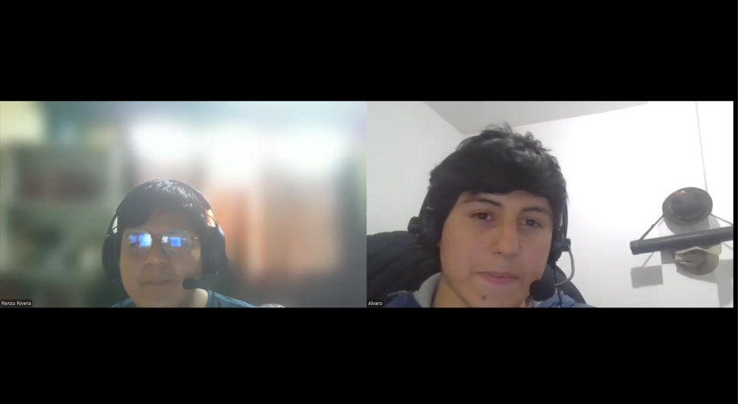
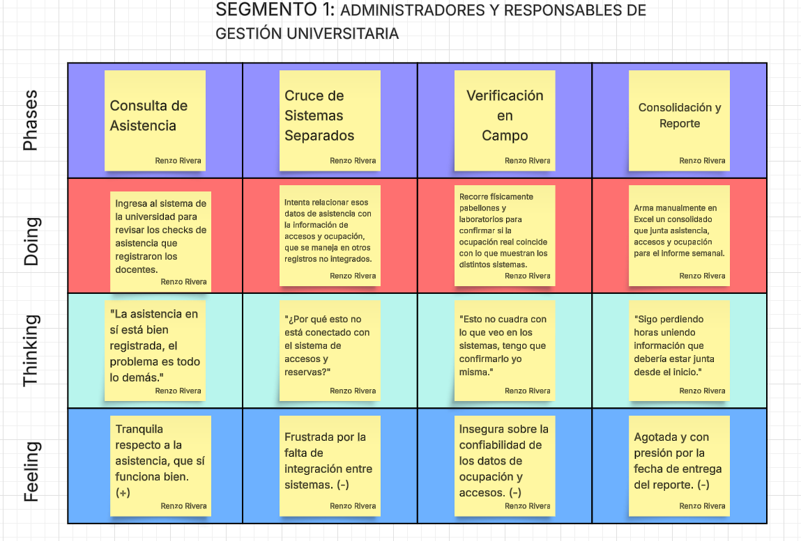
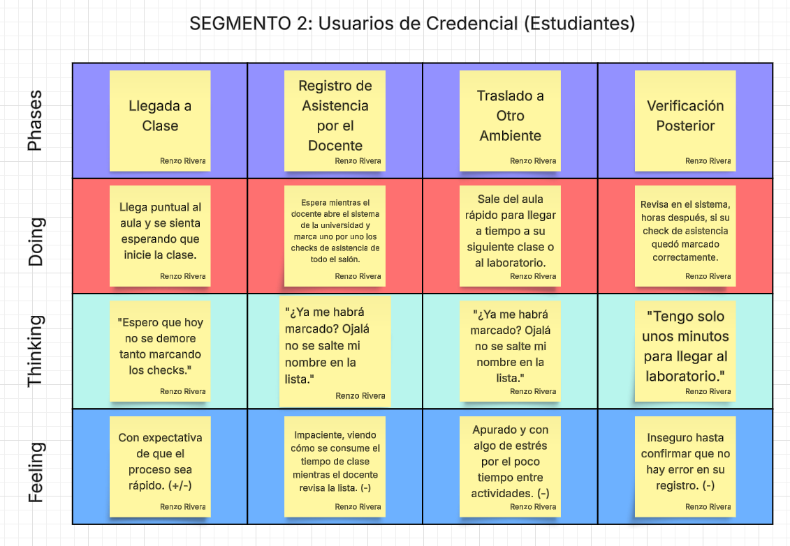
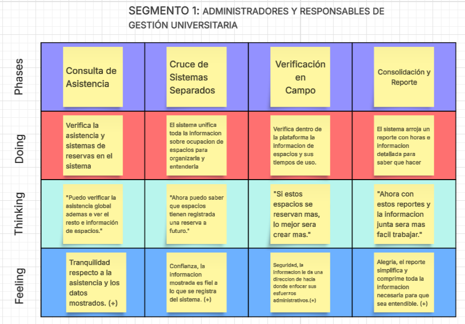
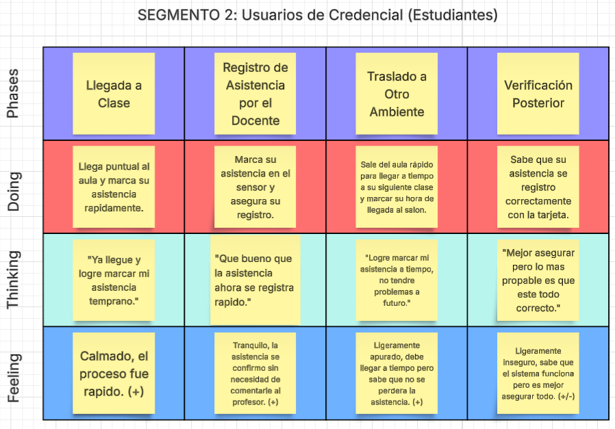

  

Universidad Peruana de Ciencias Aplicadas

Carrera de Ingeniería de Software

**1ASI0728**

**Arquitecturas De Software Emergentes**

NRC

**9056**

**Informe del Avance**

Docente: 

**Valdivia Verde, Enrique Alejandro**

Equipo:

**PafiSolutions**

Proyecto: 

**TarjePafi**

 

Integrantes

<table style="border-collapse: collapse; border: none; margin-left: auto; margin-right: auto;">
  <thead>
    <tr>
      <th style="border: none; padding: 6px; text-align: center;">Código</th>
      <th style="border: none; padding: 6px; text-align: center;">Apellidos y Nombres</th>
    </tr>
  </thead>
  <tbody>
    <tr>
      <td style="border: none; padding: 4px; font-weight: bold;">u202312966</td>
      <td style="border: none; padding: 4px;">Gonzales Alvarado, Javier Sebastián</td>
    </tr>
    <tr>
      <td style="border: none; padding: 4px; font-weight: bold;">u20231d974</td>
      <td style="border: none; padding: 4px;">Rivera Ratachi, Renzo Sebastian</td>
    </tr>
    <tr>
      <td style="border: none; padding: 4px; font-weight: bold;"> U202313403</td>
      <td style="border: none; padding: 4px;"> Via Luna, Bruce</td>
    </tr>
    <tr>
      <td style="border: none; padding: 4px; font-weight: bold;"></td>
      <td style="border: none; padding: 4px;"></td>
    </tr>
    <tr>
      <td style="border: none; padding: 4px; font-weight: bold;"></td>
      <td style="border: none; padding: 4px;"></td>
    </tr>
    <tr>
      <td style="border: none; padding: 4px; font-weight: bold;"></td>
      <td style="border: none; padding: 4px;"></td>
    </tr>
    <tr>
      <td style="border: none; padding: 4px; font-weight: bold;"></td>
      <td style="border: none; padding: 4px;"></td>
    </tr>
  </tbody>
</table>

 
  
**Fecha de publicación:** Septiembre del 2026

**Período 202620**

# Registro de Versiones

| **Versión** | **Fecha** | **Autor(es)** | **Descripción de modificación** |
|-------------|------------|----------------|---------------------------------|
| 0.1 |  |    |  |

# Project Report Collaboration Insights

# Tabla de Contenidos

- [Capítulo I: Introducción](#capítulo-1-introducción)
  - [1.1. Startup Profile](#11-startup-profile)
    - [1.1.1. Descripción de la Startup](#111-descripción-de-la-startup)
    - [1.1.2. Perfiles de integrantes del equipo](#112-perfiles-de-integrantes-del-equipo)
  - [1.2. Solution Profile](#12-solution-profile)
    - [1.2.1. Antecedentes y problemática](#121-antecedentes-y-problemática)
    - [1.2.2. Lean UX Process](#122-lean-ux-process)
      - [1.2.2.1. Lean UX Problem Statements](#1221-lean-ux-problem-statements)
      - [1.2.2.2. Lean UX Assumptions](#1222-lean-ux-assumptions)
      - [1.2.2.3. Lean UX Hypothesis Statements](#1223-lean-ux-hypothesis-statements)
      - [1.2.2.4. Lean UX Canvas](#1224-lean-ux-canvas)
  - [1.3. Segmentos objetivo](#13-segmentos-objetivo)

- [Capítulo II: Requirements Elicitation & Analysis](#capítulo-ii-requirements-elicitation--analysis)
  - [2.1. Competidores](#21-competidores)
    - [2.1.1. Análisis competitivo](#211-análisis-competitivo)
    - [2.1.2. Estrategias y tácticas frente a competidores](#212-estrategias-y-tácticas-frente-a-competidores)
  - [2.2. Entrevistas](#22-entrevistas)
    - [2.2.1. Diseño de entrevistas](#221-diseño-de-entrevistas)
    - [2.2.2. Registro de entrevistas](#222-registro-de-entrevistas)
    - [2.2.3. Análisis de entrevistas](#223-análisis-de-entrevistas)
  - [2.3. Needfinding](#23-needfinding)
    - [2.3.1. User Personas](#231-user-personas)
    - [2.3.2. User Task Matrix](#232-user-task-matrix)
    - [2.3.3. Empathy Mapping](#233-empathy-mapping)
    - [2.3.4. As-is Scenario Mapping](#233-as-is-scenario-mapping)
  - [2.4. Ubiquitous Language](#24-ubiquitous-language)

- [Capítulo III: Requirements Specification](#capítulo-iii-requirements-specification)
  - [3.1. To-Be Scenario Mapping](#31-to-be-scenario-mapping)
  - [3.2. User Stories](#32-user-stories)
  - [3.3. Impact Mapping](#33-impact-mapping)
  - [3.4. Product Backlog](#34-product-backlog)

- [Capítulo IV: Strategic-Level Software Design](#capítulo-iv-strategic-level-domain-driven-design)
  - [4.1. Strategic-Level Attribute-Driven Design](#41-strategic-level-domain-driven-design)
    - [4.1.1. Design Purpose](#411-design-purpose)
    - [4.1.2. Attribute-Driven Design Inputs](#412-attribute-driven-design-inputs)
      - [4.1.2.1. Primary Functionality](#4121-primary-functionality)
      - [4.1.2.2. Quality attribute Scenario](#4122-quality-attribute-scenario)
      - [4.1.2.3. Constraints](#4123-constraints)
    - [4.1.3. Architectural Drivers Backlog](#413-architectural-drivers-backlog)
    - [4.1.4. Architectural Design Decisions](#414-architectural-design-decisions)
    - [4.1.5. Quality Attribute Scenario Refinements](#415-quality-attribute-scenario-refinements)
  - [4.2. Strategic-Level Domain-Driven Design](#41-strategic-level-domain-driven-design)
    - [4.2.1. EventStorming](#421-eventstorming)
    - [4.2.2. Candidate Context Discovery](#422-candidate-context-discovery)
    - [4.2.3. Domain Message Flows Modeling](#423-domain-message-flows-modeling)
    - [4.2.4. Bounded Context Canvases](#424-bounded-context-canvases)
    - [4.2.5. Context Mapping](#425-context-mapping)
  - [4.3. Software Architecture](#43-software-architecture)
    - [4.3.1. Software Architecture System Landscape Diagram](#431-software-architecture-system-landscape-diagram)
    - [4.3.2. Software Architecture Context Level Diagrams](#432-software-architecture-context-level-diagrams)
    - [4.3.3. Software Architecture Container Level Diagrams](#433-software-architecture-container-level-diagrams)
    - [4.3.4. Software Architecture Deployment Diagrams](#434-software-architecture-deployment-diagrams)

- [Conclusiones](#conclusiones)
  - [Conclusiones y recomendaciones](#conclusiones-y-recomendaciones)

- [Bibliografía](#bibliografía)

- [Anexos](#anexos)

# Student Outcome

El curso contribuye al cumplimiento del Student Outcome ABET:

**ABET – EAC - Student Outcome 3**

Criterio: : Capacidad de comunicarse efectivamente con un rango de audiencias.

<table>
    <thead>
        <tr>
            <th>Criterio específico</th>
            <th>Acciones realizadas</th>
            <th>Conclusiones</th>
        </tr>
    </thead>
    <tbody>
        <tr>
            <td>Comunica oralmente sus ideas y/o resultados con objetividad a público de diferentes especialidades y niveles jerárquicos, en el marco del desarrollo de un proyecto en ingeniería.</td>
            <td>
            </td>
            <td>
            </td>
        </tr>
        <tr>
            <td>Comunica en forma escrita ideas y/o resultados con objetividad a público de diferentes especialidades y niveles jerárquicos, en el marco del desarrollo de un proyecto en ingeniería.
</td>
            <td>
            </td>
            <td>
            </td>
        </tr>
    </tbody>
</table>

# Capítulo 1: Introducción

## 1.1. Startup Profile

### 1.1.1. Descripción de la startup

En un contexto donde las universidades buscan optimizar la gestión de sus espacios, accesos y actividades académicas mediante tecnologías digitales, aún existen procesos que dependen de registros manuales, sistemas aislados o mecanismos poco eficientes para controlar la asistencia, el ingreso a determinadas áreas y la ocupación de ambientes. PAFI Solutions surge como una startup tecnológica enfocada en desarrollar soluciones para entornos universitarios inteligentes, integrando tecnologías IoT y NFC con el propósito de mejorar la gestión y supervisión de las actividades que ocurren dentro de un campus.

Nuestro principal producto, TarjePAFI, consiste en un ecosistema de credenciales físicas NFC conectadas con lectores inteligentes ubicados estratégicamente en diferentes puntos de la universidad. Mediante estas credenciales, estudiantes, docentes y personal administrativo pueden identificarse e interactuar con distintos servicios del campus. Cada interacción genera información que es enviada y centralizada en una plataforma digital, permitiendo gestionar procesos como la asistencia a clases, el control de accesos, la reserva y ocupación de espacios, la asistencia del personal y el monitoreo de afluencia.

La solución incorpora tecnologías IoT para conectar los lectores NFC con los servicios centrales del sistema, permitiendo recopilar y procesar información de manera continua. A través de una plataforma web con dashboards analíticos, el personal autorizado puede consultar indicadores relacionados con asistencia, ocupación de ambientes, accesos y flujo de personas, facilitando una mejor toma de decisiones y proporcionando una visión integral de las actividades dentro del campus.

Nuestra propuesta está dirigida principalmente a instituciones de educación superior que buscan modernizar la gestión de sus instalaciones y servicios, así como a los estudiantes, docentes y personal administrativo que interactúan diariamente con el campus. Para las universidades, TarjePAFI permite centralizar información que normalmente se encuentra distribuida entre diferentes procesos, mejorar el control de sus recursos y obtener información útil para la toma de decisiones. Para los usuarios del campus, busca brindar una experiencia más ágil y sencilla mediante el uso de una única credencial física para interactuar con distintos servicios universitarios.

- **Misión:**
Desarrollar soluciones tecnológicas basadas en IoT y NFC que permitan a las instituciones educativas optimizar la gestión de sus campus, integrando procesos de identificación, asistencia, acceso, ocupación de espacios y monitoreo mediante información centralizada y disponible para la toma de decisiones.

- **Visión:**
Convertir a PAFI Solutions en una empresa referente en soluciones de Smart Campus, impulsando la transformación digital de las instituciones educativas mediante tecnologías conectadas que permitan crear entornos universitarios más inteligentes, eficientes y accesibles.

- **Valores:**
Promovemos la innovación tecnológica como medio para mejorar la experiencia universitaria, la eficiencia en la gestión de recursos y la confiabilidad de la información. Asimismo, valoramos la seguridad, la accesibilidad y la integración tecnológica como principios fundamentales para desarrollar soluciones que respondan a las necesidades de estudiantes, docentes, personal administrativo e instituciones educativas.

### 1.1.2. Perfiles de integrantes del equipo

|  Nombres y Apellidos |    Código   | Descripción | Foto | 
|----------------------|-------------|-------------|------|
| Javier Sebastian Gonzales Alvarado | u20231296 | Mi nombre es Javier Gonzales, soy estudiante de Ingeniería de Software de séptimo ciclo. Tengo conocimientos en diversos lenguajes de programación como C++, Python y JavaScript, entre otros. Además, he desarrollado proyectos de software utilizando distintos frameworks como Angular y Vue. Me considero una persona responsable, empática y analítica. Mi objetivo personal es desarrollar soluciones tecnológicas que contribuyan a mejorar la calidad de vida de las personas y aportar a la construcción de un mundo más innovador y conectado. ||
| Renzo Sebastian Rivera Ratachi | u20231d974 | Soy Renzo Sebastian Rivera Ratachi y soy estudiante de la carrera de Ingeniería de Software. Actualmente estoy cursando el 7mo ciclo de mi carrera y tengo conocimientos intermedios de JavaScript y C++. Me considero una persona responsable y puntual.  ||
| Bruce Via Luna | U202313403 | Soy Bruce Via Luna, estudiante de la carrera de ingeniería de Software en la UPC. Actualmente cuento con conocimientos en C#, C++ e interés en la gestión de información de bases de datos. Me considero una persona altamente responsable y dedicada a los proyectos con los que me comprometo.  ||

## 1.2. Solution Profile

### 1.2.1. Antecedentes y problemática

- WHAT (Qué)

¿Cuál es el problema?

Las universidades necesitan gestionar asistencia, accesos y uso de espacios, pero cuando estos procesos están separados es difícil obtener información integrada sobre lo que ocurre en el campus. Estudios sobre Smart Campus han demostrado que los datos IoT permiten identificar diferencias entre la planificación y la ocupación real de aulas, ayudando a mejorar el uso de los espacios universitarios (Sutjarittham et al., 2019).

- WHEN (Cuándo)

¿Cuándo sucede el problema?

El problema ocurre durante la operación diaria de la universidad, especialmente al registrar asistencia, ingresar a determinados ambientes, reservar espacios o controlar la ocupación de aulas. La ocupación real puede variar durante la jornada y no siempre coincide con la planificación, por lo que contar con información en tiempo real resulta importante para gestionar adecuadamente los recursos del campus (Sutjarittham et al., 2019).

- WHERE (Dónde)

¿Dónde surge el problema?

La problemática se presenta dentro de campus universitarios, principalmente en aulas, laboratorios, bibliotecas, oficinas y zonas de acceso. Investigaciones han demostrado que el uso de tecnologías IoT permite obtener información sobre ocupación y utilización de espacios académicos, facilitando una mejor gestión de las instalaciones universitarias (Azizi et al., 2020).

- WHO (Quién)

¿Quiénes son los afectados?

Los principales afectados son los estudiantes, docentes, personal administrativo y responsables de la gestión universitaria, quienes interactúan diariamente con procesos de asistencia, acceso y uso de ambientes. Los sistemas inteligentes basados en RFID, NFC e IoT permiten automatizar estos registros y mejorar el monitoreo de las actividades dentro del campus (Rashid, 2024).

- WHY (Por qué)

¿Por qué ocurre el problema?

El problema ocurre porque la información relacionada con asistencia, accesos y ocupación de espacios puede encontrarse distribuida entre distintos procesos o sistemas. Esto dificulta conocer en tiempo real lo que sucede en el campus y tomar decisiones basadas en datos. El uso de IoT permite centralizar esta información y mejorar la supervisión de las actividades universitarias (Azizi et al., 2020).

- HOW (Cómo)

¿Cómo se utilizará el producto?

TarjePAFI utilizará credenciales físicas NFC y lectores ubicados en distintos puntos del campus. Cuando un usuario acerque su credencial a un lector, el sistema registrará la interacción y enviará la información a una plataforma central, donde se podrán gestionar asistencia, accesos, reservas, ocupación de espacios y afluencia mediante una aplicación web y dashboards analíticos.

- HOW MUCH (Cuánto)

¿Cuánto costará implementar la solución?

Para la primera versión de TarjePAFI, se desarrollará un prototipo académico de bajo costo utilizando tecnologías open-source, servicios cloud gratuitos o académicos y componentes NFC accesibles. La implementación inicial estará limitada a una cantidad reducida de lectores y credenciales, mientras que una implementación real dependerá del número de espacios, usuarios y dispositivos que requiera la institución.

### 1.2.2. Lean UX Process

#### 1.2.2.1. Lean UX Problem Statement

Hemos observado que las instituciones educativas de alta concurrencia, como la sede San Miguel de la UPC, enfrentan dificultades significativas para gestionar eficientemente sus espacios físicos y procesos operativos, en un contexto donde el control de asistencia, las reservas y la seguridad se basan principalmente en métodos manuales, estimaciones o validaciones visuales. Esta problemática se desarrolla en entornos caracterizados por una profunda desconexión entre el uso real de la infraestructura y la gestión digital de sus procesos, lo que genera constantes ineficiencias en la experiencia diaria de la comunidad universitaria. Según Israil y Dhumane (2025), los procesos convencionales de seguimiento manual de asistencia en la educación superior presentan múltiples deficiencias sistémicas que comprometen la eficiencia administrativa, consumen horas valiosas de instrucción y son sumamente vulnerables a fraudes o suplantaciones.

En este escenario, la ausencia de datos exactos, continuos y en tiempo real sobre la ocupación de espacios y los flujos de personas provoca que problemas operativos diarios, como el acaparamiento de cubículos de estudio sin uso real y el ingreso con credenciales móviles fácilmente imitables, pasen inadvertidos. Como consecuencia, la administración universitaria se ve obligada a tomar decisiones logísticas y de seguridad basadas en criterios empíricos o información incompleta, lo que incrementa las fricciones operativas y limita la capacidad de respuesta ante anomalías. Según Prabakaran et al. (2025), los métodos tradicionales de seguridad y gestión manual en los campus a menudo resultan deficientes debido a sus altos costos operativos y su incapacidad para detectar accesos no autorizados o anomalías rápidamente, haciendo urgente la integración de ecosistemas tecnológicos automatizados

Esta situación genera una distribución ineficiente de los recursos operativos (asignando al personal de limpieza y seguridad a rondas rutinarias en lugar de intervenciones estratégicas basadas en el tráfico), una deficiente planificación de eventos y fallas críticas en la seguridad del recinto. Según Das (2025), superar estos obstáculos estructurales requiere dejar de depender de sistemas heredados manuales para transicionar hacia arquitecturas basadas en el Internet de las Cosas (IoT), las cuales son fundamentales para optimizar el uso de los recursos, automatizar controles mediante monitoreo en tiempo real y crear entornos verdaderamente adaptativos y eficientes. En consecuencia, se evidencia una brecha estructural en la gestión operativa del campus, caracterizada por la falta de un ecosistema tecnológico interconectado que unifique la validación física en tiempo real con la administración digital para una toma de decisiones informada.

Variables del Lean UX Problem Statement:

Domain: Gestión operativa de campus universitarios, Internet de las Cosas (IoT) y sistemas automatizados de control de accesos.

Customer Segments: Administración universitaria (Facility Management, Logística y Seguridad), docentes y estudiantes de educación superior.

Pain Points: Pérdida de tiempo de instrucción en registros de asistencia manuales, acaparamiento de espacios de estudio reservados sin ocupación física real, distribución ineficiente del personal operativo por falta de métricas de afluencia, y vulnerabilidad en los accesos por la facilidad de imitar credenciales móviles.

Gap: Inexistencia de un ecosistema tecnológico interconectado que sincronice la validación física en tiempo real (mediante hardware IoT) con la gestión digital académica y administrativa de la institución.

Vision/Strategy: Desarrollar e implementar una plataforma web centralizada que, al integrarse con credenciales NFC y sensores IoT en puntos críticos, automatice el control de asistencia, garantice el uso justo de reservas (regla de 10 minutos) y provea analítica avanzada de aforo para optimizar dinámicamente la operación del campus.

Initial Segment: Comunidad universitaria (alumnos y profesores) y administración operativa de la Universidad Peruana de Ciencias Aplicadas (UPC), sede San Miguel.

#### 1.2.2.2. Lean UX Assumptions

Business Assumptions:

1. La administración universitaria necesita monitorear el aforo en tiempo real, automatizar el registro de asistencia y gestionar eficientemente la ocupación de sus espacios (aulas, cubículos, gimnasio) sin depender de validaciones manuales o estimaciones visuales inexactas.

2. Las necesidades de la institución se resolverán mediante un ecosistema de hardware y software integrado por sensores IoT/NFC instalados en puntos estratégicos, aplicaciones móviles/web para los usuarios, y una plataforma web centralizada con analítica avanzada para la administración.

3. Nuestros clientes iniciales son las administraciones de sedes universitarias de alta concurrencia (como la UPC sede San Miguel) que buscan erradicar fricciones operativas y optimizar la asignación de sus recursos logísticos.

4. El principal valor que nuestros clientes esperan de la solución es la automatización de procesos físicos (como la toma de asistencia y liberación de reservas no utilizadas) y la obtención de datos exactos en tiempo real para la toma de decisiones.

5. El cliente (administración) también puede obtener beneficios adicionales como la mejora en la seguridad del recinto mediante la verificación visual en los accesos, evitando la suplantación de identidad que permiten las actuales credenciales en celulares.

6. Obtendremos nuestra base de clientes inicial mediante la implementación de pilotos escalables en sedes específicas de la universidad, para luego comercializar la solución a otras instituciones educativas mediante demostraciones de casos de éxito y eficiencia operativa.

7. Generaremos ingresos ofreciendo un modelo B2B mixto: suscripción de software (SaaS) por el acceso al panel analítico y sistema de reservas, y un modelo de arrendamiento/mantenimiento de hardware (HaaS) para los sensores y lectoras NFC.

8. Mi principal competencia en el mercado serán los métodos de control manuales, sistemas de códigos QR estáticos, y plataformas de reserva de espacios genéricas que no cuentan con validación física mediante hardware en tiempo real.

9. Nuestro mayor riesgo es que la infraestructura de red (WiFi/Ethernet) de la universidad sufra caídas o latencias altas durante las horas punta (ej. ingresos de las 7:00 am), impidiendo la sincronización en tiempo real de los sensores IoT con la base de datos central.

10. ¿Cuáles son las suposiciones que, si se demuestran falsas, harán que el proyecto fracase?

- Los estudiantes y docentes percibirán el uso de la credencial física NFC como un retroceso frente a las credenciales móviles, generando resistencia en su adopción.

- El hardware instalado en los escritorios de las aulas y cubículos sufrirá vandalismo o desgaste constante, haciendo que los costos de mantenimiento superen el valor operativo percibido.

- Los cuellos de botella en las puertas de ingreso al validar físicamente la tarjeta NFC generarán colas más largas que el sistema anterior.

Business Outcomes:

- Esperamos lograr que el sistema sea adoptado e instalado en al menos el 50% de las aulas y el 100% de los cubículos de la sede piloto durante el primer semestre de despliegue.

- Queremos reducir el tiempo invertido por los docentes en la toma de asistencia a 0 minutos, devolviendo al menos 10 minutos efectivos de clases por sesión.

- Proyectamos disminuir la tasa de "acaparamiento" de espacios (reservas sin uso físico real) en un 80% durante los primeros 3 meses de uso del sistema de liberación automática de 10 minutos.

- Alcanzar una tasa de precisión del 99% en el panel analítico de aforo general respecto a la ocupación física real del campus.

- Que el 90% de los intentos de ingreso con identidades suplantadas o no autorizadas sean bloqueados por el sistema de control de accesos en el primer año.

User Assumptions:

1. ¿Quién es el usuario? Estudiantes que asisten a clases y reservan espacios de estudio; Docentes que imparten sesiones y requieren automatizar la asistencia; Administradores (Facility Managers y Seguridad) encargados de monitorear y optimizar la operatividad del campus.

2. ¿Dónde encajaría nuestro producto en la vida (o trabajo) del usuario?

- Para estudiantes y docentes: En su tránsito diario por el campus (ingresos), en los escritorios de las aulas y en las mesas de los cubículos, utilizando su credencial NFC física interactuando con los sensores IoT.

- Para administradores: En las oficinas de operaciones o seguridad, utilizando el dashboard analítico web para evaluar mapas de calor, picos de afluencia y estado de los recursos físicos.

3. ¿Qué problemas resuelve el producto para el usuario?

- Pérdida de tiempo valioso de enseñanza debido al registro manual o verbal de la asistencia.

- Frustración de los estudiantes al no encontrar cubículos de estudio disponibles a pesar de que físicamente están vacíos.

- Distribución ineficiente del personal de limpieza y seguridad al operar a ciegas sin datos de flujo de personas en tiempo real.

4. ¿En qué contexto utiliza el usuario el producto?

- Docentes y estudiantes lo utilizan en momentos de alto dinamismo y prisa (al entrar a la universidad, al iniciar y terminar una clase, al llegar a un cubículo reservado).

- Los administradores lo usan de forma continua como herramienta central de monitoreo logístico.

5. ¿Qué características son esenciales para el usuario? ¿Y por qué?

- Validación NFC instantánea: Permite fluidez en los ingresos y registros sin generar cuellos de botella.

- Liberación automática de reservas: Asegura que los espacios se utilicen de forma justa, cancelando el turno si no hay validación física en 10 minutos.

- Panel analítico de aforo en tiempo real: Permite a la administración destinar recursos operativos estratégicamente basándose en picos de tráfico reales.

6. ¿Cómo debería verse y comportarse el producto?

- Las aplicaciones web y móviles para alumnos/docentes deben ser rápidas, mostrando el horario de clases, disponibilidad de espacios en vivo y un historial de asistencias de forma limpia y accesible.

- El dashboard web de administración debe consolidar grandes volúmenes de datos mediante gráficos históricos, visualizaciones de aforo en tiempo real y alertas automáticas de seguridad.

User Outcomes:

- Los estudiantes quieren sentir tranquilidad y justicia al saber que su asistencia se registra automáticamente sin interrupciones, y que los espacios de estudio estarán disponibles si alguien no los usa físicamente.

- Los docentes quieren enfocarse exclusivamente en su labor académica, eliminando por completo la carga administrativa del control de asistencia.

- Los administradores universitarios quieren sentir control total sobre el campus, confiando en que los datos del sistema reflejan la realidad para planificar eventos, mantenimiento y seguridad sin depender de estimaciones.

- Los usuarios esperan que la interacción entre la credencial física y el sensor IoT sea menor a un segundo, garantizando una experiencia sin fricciones.

Features Assumptions:

1. Liberación Automática de Espacios (Regla de 10 minutos)

- Suposición: Si el sistema detecta mediante los sensores IoT que un estudiante no ha validado físicamente su credencial en la mesa del cubículo durante los primeros 10 minutos de su reserva web, el espacio se liberará automáticamente en la plataforma, maximizando la utilización de la infraestructura.

- Riesgo: Fallas de red temporales o sensores descalibrados podrían liberar el espacio erróneamente mientras el alumno sí se encuentra físicamente allí, causando conflictos entre estudiantes y pérdida de confianza en el sistema.

2. Persistencia Centralizada mediante RESTful APIs y Cloud

- Suposición: Si todas las interacciones físicas (control de acceso, asistencia y sensores de mesas) se comunican a través de APIs hacia una base de datos centralizada en la nube, garantizamos una fuente única de verdad en tiempo real que alimenta el panel analítico de la administración y las aplicaciones móviles sin latencias.

- Riesgo: La alta concurrencia de peticiones generada por miles de alumnos validando su asistencia simultáneamente al inicio de los bloques horarios (ej. 7:00 am) podría sobrecargar los servicios en la nube si la arquitectura no escala adecuadamente, ralentizando todo el ecosistema.

#### 1.2.2.3. Lean UX Hypothesis

- Hypothesis Statement 1:

Creemos que los docentes adoptarán rápidamente el registro de asistencia mediante NFC en los escritorios, porque automatizará una tarea administrativa repetitiva y les devolverá tiempo efectivo de enseñanza. Lo sabremos cuando al menos el 85% de los docentes de la sede piloto registre la asistencia de sus alumnos exclusivamente mediante este ecosistema durante el primer mes de despliegue.

- Hypothesis Statement 2:

Creemos que los estudiantes valorarán positivamente el sistema de liberación automática de 10 minutos, porque les garantizará un acceso justo a los cubículos y espacios de estudio que antes eran acaparados sin uso físico real. Lo sabremos cuando la tasa de ocupación efectiva de los cubículos aumente en un 40% y se reduzca drásticamente la inasistencia a reservas.

- Hypothesis Statement 3:

Creemos que la administración universitaria utilizará el panel analítico web diariamente, porque la visualización de aforos y mapas de calor en tiempo real es vital para distribuir de manera inteligente al personal de limpieza y seguridad. Lo sabremos cuando más del 70% de las rondas operativas diarias del personal logístico se planifiquen basándose en los picos de afluencia mostrados en el dashboard.

- Hypothesis Statement 4:

Creemos que la comunidad universitaria se adaptará de forma natural y fluida a la validación física en los accesos, porque el tiempo de lectura instantáneo del sensor NFC evitará los temidos cuellos de botella. Lo sabremos cuando el tiempo promedio de ingreso por persona sea inferior a 1.5 segundos incluso en las horas de máxima concurrencia (como el bloque de las 7:00 am).

- Hypothesis Statement 5:

Creemos que el equipo de seguridad confiará plenamente en este ecosistema tecnológico, porque la exigencia de una tarjeta física NFC reduce drásticamente la vulnerabilidad de las credenciales móviles, que son fácilmente imitables mediante capturas de pantalla. Lo sabremos cuando los incidentes detectados por ingresos no autorizados o suplantación de identidad se reduzcan en un 90% durante el primer semestre.

- Hypothesis Statement 6:

Creemos que la arquitectura de software soportará eficazmente la operatividad del campus, porque los servicios en la nube están diseñados para escalar ante la concurrencia masiva de miles de alumnos interactuando con los sensores IoT al mismo tiempo. Lo sabremos cuando el 99% de las lecturas emitidas por el hardware sean recibidas, procesadas por el backend y reflejadas en las aplicaciones con una latencia menor a 1 segundo.

- Hypothesis Statement 7:

Creemos que las autoridades académicas organizarán eventos con mucho mayor impacto, porque el análisis de datos históricos les permitirá ubicar estratégicamente sus actividades en las franjas horarias y zonas de mayor tránsito real. Lo sabremos cuando la participación en eventos de interés y ferias universitarias dentro de las instalaciones se incremente en al menos un 30% respecto al año anterior.

#### 1.2.2.4. Lean UX Canvas

## 1.3. Segmentos Objetivos

### Segmento #1: Administradores y Responsables de Gestión Universitaria

Este segmento está conformado por las personas encargadas de supervisar, analizar y tomar decisiones relacionadas con el funcionamiento del campus universitario. Utilizan la información generada por las credenciales y lectores NFC para monitorear indicadores como asistencia, accesos, ocupación de ambientes y afluencia de personas, permitiéndoles identificar patrones y mejorar la gestión de los recursos institucionales.

+ Aspectos demográficos:

  + Roles / Cargos: Administradores universitarios, coordinadores académicos, responsables de infraestructura, personal de seguridad y responsables de gestión de espacios.
  + Edad: Principalmente adultos en edad laboral.
  + Tipo de organización: Universidades e instituciones de educación superior públicas y privadas.
  + Ubicación: Campus universitarios, principalmente en zonas urbanas.

+ Aspectos psicográficos:

  + Motivaciones: Mejorar la gestión del campus, reducir procesos manuales, optimizar el uso de espacios y disponer de información confiable para la toma de decisiones.
  + Intereses: Transformación digital, analítica de datos, automatización, seguridad, eficiencia operativa y Smart Campus.
  + Valores: Eficiencia, seguridad, organización, confiabilidad de la información y mejora continua.

+ Comportamiento:

  + Consultan reportes, indicadores y dashboards para evaluar el funcionamiento de la institución.
  + Buscan soluciones que permitan centralizar información proveniente de diferentes procesos universitarios.
  + Utilizan los datos históricos y en tiempo real para detectar patrones de asistencia, ocupación y utilización de espacios.

+ Sustento estadístico:

  + La transformación digital está adquiriendo mayor importancia en la educación superior. UNESCO IESALC señala que la digitalización está modificando no solo la enseñanza y el aprendizaje, sino también la manera en que las instituciones gestionan sus operaciones, resaltando la importancia de los datos y la evidencia para la gestión universitaria.

  + El Instituto Nacional de Estadística e Informática mantiene estadísticas diferenciadas sobre matrícula, docentes y otros indicadores de universidades públicas y privadas, evidenciando la magnitud de la información que debe administrarse dentro del sistema universitario peruano.

  + En este contexto, una plataforma como TarjePAFI permite transformar los eventos generados dentro del campus en información consolidada que pueda ser utilizada por los responsables universitarios para apoyar decisiones relacionadas con asistencia, accesos y utilización de infraestructura.

### Segmento #2: Usuarios de la Credencial TarjePAFI

Este segmento está compuesto por las personas que interactúan directamente con los lectores NFC mediante una credencial TarjePAFI durante sus actividades cotidianas dentro del campus. Debido a que sus necesidades y actividades son diferentes, este segmento se divide en estudiantes, docentes y trabajadores de la universidad.

#### Estudiante:

Son los principales usuarios de la credencial debido a su interacción constante con aulas, laboratorios, bibliotecas y otros espacios universitarios.

+ Aspectos demográficos:

  + Sexo: Masculino y femenino.
  + Edad: Principalmente jóvenes y adultos que cursan estudios universitarios.
  + Ocupación: Estudiantes universitarios.
  + Ubicación: Campus de universidades públicas y privadas.
  
+ Aspectos psicográficos:

  + Motivaciones: Registrar su asistencia de manera rápida, ingresar fácilmente a espacios autorizados y acceder a servicios universitarios.
  + Intereses: Tecnología, rapidez, facilidad de uso y experiencias digitales integradas.
  + Valores: Comodidad, accesibilidad, seguridad y ahorro de tiempo.

+ Comportamiento:

  + Se desplazan constantemente entre diferentes ambientes durante su jornada académica.
  + Interactúan varias veces al día con aulas, laboratorios, bibliotecas y otros servicios del campus.
  + Prefieren mecanismos rápidos que no requieran procesos adicionales para identificarse o registrar su asistencia.

+ Sustento estadístico:

  + El INEI registra anualmente la cantidad de alumnos matriculados tanto en universidades públicas como privadas del Perú, con información disponible hasta 2024, evidenciando que los estudiantes constituyen uno de los grupos más numerosos dentro del ecosistema universitario.

#### Docentes:

Está conformado por los profesores que desarrollan actividades académicas dentro del campus y que pueden utilizar TarjePAFI para registrar su ingreso, asistencia y acceso a ambientes relacionados con sus labores.

+ Aspectos demográficos:

  + Sexo: Masculino y femenino.
  + Edad: Adultos en edad laboral.
  + Ocupación: Docentes universitarios.
  + Ubicación: Universidades públicas y privadas.

+ Aspectos psicográficos:

  + Motivaciones: Simplificar el registro de asistencia y el acceso a los espacios donde realizan actividades académicas.
  + Intereses: Herramientas prácticas, automatización de tareas administrativas y facilidad de uso.
  + Valores: Puntualidad, eficiencia, confiabilidad y simplicidad.

+ Comportamiento:

  + Se movilizan entre aulas, laboratorios, oficinas y otros ambientes según su horario académico.
  + Necesitan mecanismos de identificación y registro que interfieran lo menos posible con sus actividades docentes.

+ Sustento estadístico:

  + El INEI mantiene estadísticas específicas sobre el número de docentes de universidades públicas y privadas del Perú entre 2017 y 2024, lo cual evidencia que este grupo constituye otro actor relevante dentro de las operaciones cotidianas de las instituciones universitarias.

#### Trabajadores de la Universidad:

Este subsegmento comprende al personal que realiza actividades administrativas, de seguridad, limpieza, mantenimiento, cocina y otros servicios necesarios para la operación cotidiana del campus.

+ Aspectos demográficos:

  + Sexo: Masculino y femenino.
  + Edad: Adultos en edad laboral.
  + Ocupación: Personal administrativo, limpieza, mantenimiento, seguridad, cocina y servicios generales.
  + Ubicación: Diferentes áreas e instalaciones de la universidad.

+ Aspectos psicográficos:

  + Motivaciones: Registrar su ingreso y asistencia de manera sencilla y acceder únicamente a los espacios necesarios para realizar su trabajo.
  + Intereses: Sistemas fáciles de utilizar, rapidez y seguridad en el acceso.
  + Valores: Responsabilidad, puntualidad, seguridad y eficiencia.

+ Comportamiento:

  + Ingresan y salen de diferentes áreas del campus según las funciones que desempeñan.
  + Algunos requieren acceso permanente o restringido a determinados espacios.
  + Valoran sistemas que funcionen rápidamente y no dificulten sus labores cotidianas.

+ Sustento estadístico:

  + Las universidades requieren no solamente estudiantes y docentes, sino también personal encargado de los diferentes servicios que permiten su funcionamiento diario. Por ello, este grupo forma parte del ecosistema operativo sobre el cual una solución de identificación y control de accesos como TarjePAFI puede generar información útil para la administración institucional.
  + Las estadísticas oficiales del INEI distinguen recursos humanos y población universitaria dentro de sus indicadores educativos, mostrando que la gestión universitaria involucra múltiples tipos de usuarios y no únicamente a los estudiantes.

# Capítulo 2: Requirements Elicitation & Analysis

## 2.1 Competidores

### 2.1.1. Análisis competitivo

### 2.1.2. Estrategias y tácticas frente a competidores.

## 2.2. Entrevistas.

### 2.2.1. Diseño de entrevistas.

### 2.2.2. Registro de entrevistas.

*Entrevistas a Administrativos*
---
 

<table align="center">
  <tr>
    <th colspan="2" style="text-align:center">Entrevista 1</th>
  </tr>
  <tr>
    <td><strong>Entrevistado</strong></td>
    <td></td>
  </tr>
  <tr>
    <td><strong>Edad</strong></td>
    <td></td>
  </tr>
  <tr>
    <td><strong>Distrito</strong></td>
    <td></td>
  </tr>
  <tr>
    <td><strong>Timing</strong></td>
    <td></td>
  </tr>
  <tr>
    <td><strong>URL</strong></td>
    <td>
      
  ``

  </td>
  </tr>
  <tr>
    <td colspan="2" style="text-align:justify">
      Resumen:  

    </td>
  </tr>
  <tr>
    <td colspan="2"> 
       
    </td>
  </tr>
</table>

*Entrevistas a usuarios de tarjetas*
---

<table align="center">
  <tr>
    <th colspan="2" style="text-align:center">Entrevista 1</th>
  </tr>
  <tr>
    <td><strong>Entrevistado</strong></td>
    <td>Oriana Via</td>
  </tr>
  <tr>
    <td><strong>Edad</strong></td>
    <td>29</td>
  </tr>
  <tr>
    <td><strong>Distrito</strong></td>
    <td>Cercado de Lima</td>
  </tr>
  <tr>
    <td><strong>Timing</strong></td>
    <td>0:56-8:26</td>
  </tr>
  <tr>
    <td><strong>URL</strong></td>
    <td>
      
  `https://youtu.be/RHp96fure88`

  </td>
  </tr>
  <tr>
    <td colspan="2" style="text-align:justify">
      Resumen:  
      Oriana, instructora en la universidad Cayetano Heredia, reside en el distrito de Cercado de Lima, habla sobre cómo la implementación si bien no sería 100% útil en su área, igual describe cómo la existencia de las tarjetas aceleraría los procesos de registro de asistencia y seguridad de su universidad tanto para la asistencia como el acceso a espacios de trabajos reservados.
    </td>
  </tr>
  <tr>
    <td colspan="2"> 
       
    </td>
  </tr>
</table>

<table align="center">
  <tr>
    <th colspan="2" style="text-align:center">Entrevista 2</th>
  </tr>
  <tr>
    <td><strong>Entrevistado</strong></td>
    <td>Alvaro Abanto</td>
  </tr>
  <tr>
    <td><strong>Edad</strong></td>
    <td>21</td>
  </tr>
  <tr>
    <td><strong>Distrito</strong></td>
    <td>Los Olivos</td>
  </tr>
  <tr>
    <td><strong>Timing</strong></td>
    <td>0:58-7:11</td>
  </tr>
  <tr>
    <td><strong>URL</strong></td>
    <td> 

   `https://youtu.be/b_XeFh_mzvQ` 
  
  </td>
  </tr>
  <tr>
    <td colspan="2" style="text-align:justify">
      Resumen:  
      Alvaro, estudiante de la carrera de Ciencias de la Computación, reside en el distrito de Los Olivos, menciona que ciertos protocolos de asistencia o ingreso en su campus universitario suelen ser lentos o a veces frustrantes. La solución propuesta le parece interesante ya que es más sencillo transportar una tarjeta física que no depende de internet pero añade que el sistema propuesto debe ser rapido y preciso para preferirlo sobre el sistema actual.
    </td>
  </tr>
  <tr>
    <td colspan="2"> 
       
    </td>
  </tr>
</table>

### 2.2.3. Análisis de entrevistas.

## 2.3. Needfinding.

En esta sección, se presenta el análisis detallado de las necesidades, dolores y comportamientos de nuestros segmentos objetivo.

### 2.3.1. User Personas

#### Segmento 1: Administradores y Responsables de Gestión Universitaria

<td align="center"></td>

#### Segmento 2: Usuarios de Credencial

<td align="center"></td>

### 2.3.2. User Task Matrix

Para la sección del User Task Matrix, se analiza cómo Jair y Andrea gestionan sus responsabilidades actuales, lo que nos permitirá identificar dónde nuestra solución puede aportar el mayor valor.

<table>
  <thead>
    <tr>
      <th rowspan="2">Tareas</th>
      <th colspan="2">María Fernanda (Administradora)</th>
      <th colspan="2">Bruno (Estudiante)</th>
    </tr>
    <tr>
      <th>Frecuencia</th>
      <th>Importancia</th>
      <th>Frecuencia</th>
      <th>Importancia</th>
    </tr>
  </thead>
  <tbody>
    <tr>
      <td>Esperar a que el docente pase asistencia en la plataforma web al inicio de clase</td>
      <td>N/A</td>
      <td>N/A</td>
      <td>Alta</td>
      <td>Crítica</td>
    </tr>
    <tr>
      <td>Ingresar a laboratorios o biblioteca mostrando carné o registrando datos manualmente</td>
      <td>N/A</td>
      <td>N/A</td>
      <td>Alta</td>
      <td>Alta</td>
    </tr>
    <tr>
      <td>Consolidar manualmente reportes de asistencia (exportados por cada docente) y de accesos</td>
      <td>Alta</td>
      <td>Alta</td>
      <td>N/A</td>
      <td>N/A</td>
    </tr>
    <tr>
      <td>Verificar autorización de acceso a zonas restringidas de forma manual (lista impresa o consulta a seguridad)</td>
      <td>Media</td>
      <td>Alta</td>
      <td>N/A</td>
      <td>N/A</td>
    </tr>
    <tr>
      <td>Atender reclamos de docentes/estudiantes por errores en el registro de asistencia</td>
      <td>Media</td>
      <td>Crítica</td>
      <td>N/A</td>
      <td>N/A</td>
    </tr>
    <tr>
      <td>Reportar a Dirección Académica sobre uso de infraestructura</td>
      <td>Baja</td>
      <td>Alta</td>
      <td>N/A</td>
      <td>N/A</td>
    </tr>
    <tr>
      <td>Reservar un ambiente o laboratorio por correo o solicitud presencial</td>
      <td>N/A</td>
      <td>N/A</td>
      <td>Baja</td>
      <td>Media</td>
    </tr>
    <tr>
      <td>Perder minutos de clase mientras el docente pasa asistencia uno por uno</td>
      <td>N/A</td>
      <td>N/A</td>
      <td>Alta</td>
      <td>Media</td>
    </tr>
  </tbody>
</table>

### 2.3.3. Empathy Mapping

 A continuación, se presentan los Empathy Maps para los dos segmentos objetivo.

#### Segmento 1: Administradores y Responsables de Gestión Universitaria

<td align="center"></td>

#### Segmento 2: Usuarios de Credencial

<td align="center"></td>

### 2.3.4. As-is Scenario Mapping.

En esta sección se presenta un análisis detallado de la situación actual (AS-IS) para los diferentes segmentos.

Se puede visualizar con más detalle en el siguiente enlace:
 https://lucid.app/lucidchart/1a5b371c-5aa4-4aef-bd8f-27a9c5132f0d/edit?viewport_loc=-8631%2C-1540%2C4493%2C2127%2C0_0&invitationId=inv_df4c245c-0fcc-4a3e-8dce-f9a24864599f

#### Segmento 1: Administradores y Responsables de Gestión Universitaria

<td align="center"></td>

#### Segmento 2: Usuarios de credencial

<td align="center"></td>

## 2.4. Ubiquitous Language.

# Capítulo 3: Requirements Specification

## 3.1. To-Be Scenario Mapping.

En esta sección se presenta un análisis detallado de la situación actual (TO-BE) para los diferentes segmentos.

Se puede visualizar con más detalle en el siguiente enlace:
 https://lucid.app/lucidchart/248d5465-d381-4cde-87f1-66bdedbebb72/edit?viewport_loc=-6954%2C-757%2C1795%2C1049%2C0_0&invitationId=inv_8bc3eada-8980-4183-a77e-ef736ec53050

<td align="center"></td>

#### Segmento 2: Usuarios de credencial

<td align="center"></td>

## 3.2. User Stories.

En esta sección detallaremos la existencia, escenarios y diferentes User Stories que usaremos a lo largo del proyecto, para mejor orden se iniciará con la creación de 
Épicas para poder agrupar a todas las Users Stories en categorías para su posterior cumplimiento

|Epic ID | Titulo | Descripción|
|--------|--------|------------|
|EP01    | Landing Page | Como usuario de TarjePafi quiero navegar por una Landing Page con una experiencia de usuario fluida y ágil, para verificar y experimentar sus funcionalidades y el acceso a la información útil del producto.
|EP02    |Gestión de usuarios|Como usuario de TarjePafi, quiero una división entre los diferentes usuarios que utilicen el servicio de TarjePafi para separar las funcionalidades y accesos a estas.
|EP03    |Registro de Asistencia| Como usuario de TarjePafi, quiero registrar correctamente la asistencia de alumnos mediante los sensores para acelerar los procesos de asistencia.|
|EP04    |Gestión de Espacios y Servicios|Como usuario estudiante de TarjePafi, quiero activar mis reservas con la tarjeta para evitar usar otros medios que atrasen el proceso.|
|EP05    |Administración y Control| Como usuario administrativo de TarjePafi, quiero tener control administrativo para acceder y controlar las funcionalidades diseñadas de las tarjetas.|
|EP06    |Diseño y Usabilidad| Como usuario de TarjePafi, quiero ver un trabajo de diseño tanto fisico y digital para que sea agradable usar el producto.|

Una vez concluidas las épicas, ahora podemos proceder a encapsular las múltiples historias de usuario que poseemos para definir los requerimientos de nuestra aplicación y saber cómo desarrollarla correctamente

| Epic / Story ID | Titulo | Descripción | Criterios de Aceptación | Epic ID | 
|-----------------|--------|-------------|-------------------------|--------------------------|
| **US01** | Registro de Asistencia Estudiantil | Como estudiante, quiero poder pasar mi tarjeta por un lector al entrar al salón de clases, para que mi asistencia sea registrada automáticamente. | **Scenario:** Registro de asistencia en clase. Dado que el estudiante pasa su tarjeta por el lector, y la clase ha comenzado, cuando la tarjeta es leída, entonces su asistencia se registra automáticamente. | **EP03** |
| **US02** | Confirmación de Asistencia | Como estudiante, quiero que el lector muestre un mensaje de "Asistencia tomada" en la pantalla, para que sepa que mi asistencia ha sido registrada. | **Scenario:** Mensaje de confirmación. Dado que el estudiante pasa su tarjeta, y la asistencia ha sido registrada, cuando el lector procesa la tarjeta, entonces se muestra el mensaje "Asistencia tomada". | **EP03** |
| **US03** | Reserva de Espacios de Estudio | Como estudiante, quiero usar mi tarjeta para acceder a mis reservas para usarlas | **Scenario:** Activación de una reserva. Dado que el estudiante quiere activar la reserva de un espacio, y tiene su tarjeta, cuando pasa la tarjeta por el lector en el área de reserva, entonces se activará la reserva. | **EP04** |
| **US04** | Visualización de reportes | Como personal administrativo, quiero que la página muestre reportes administrativos con la información recolectada para administrar y tener datos útiles. | **Scenario:** Ver el reporte. Dado que el administrador ingresa a la página, y está registrado, cuando ingrese a la sección de "Ver Reporte", entonces verá un reporte que use las horas recolectadas y de sugerencias. | **EP05** |
| **US05** | Diseño Atractivo de la Tarjeta | Como estudiante, quiero que la tarjeta tenga un diseño atractivo y fácil de identificar, para que me sienta orgulloso de usarla. | **Scenario:** Diseño de tarjeta. Dado que un estudiante recibe su tarjeta, y la observa, cuando la tarjeta es presentada, entonces tiene un diseño atractivo y fácil de identificar. | **EP06** |
| **US06** | Acceso Multicentro con la Tarjeta | Como estudiante, quiero que la tarjeta funcione en múltiples puntos de acceso, como bibliotecas y laboratorios, para facilitar mi acceso a los recursos. | **Scenario:** Acceso a múltiples áreas. Dado que el estudiante usa la tarjeta en diferentes puntos, y está autorizado para acceder, cuando pasa la tarjeta por el lector, entonces se le permite el acceso. | **EP04** |
| **US07** | Participación en Eventos Universitarios | Como estudiante, quiero que la tarjeta me permita acceder a eventos universitarios, para participar en actividades extracurriculares. | **Scenario:** Acceso a eventos. Dado que hay un evento universitario, y el estudiante tiene su tarjeta, cuando pasa la tarjeta por el lector en la entrada, entonces se permite su entrada al evento. | **EP04** |
| **US08** | Identificación Estudiantil | Como estudiante, quiero que la tarjeta funcione como una forma de identificación, para ser reconocido fácilmente por el personal académico. | **Scenario:** Identificación al personal. Dado que el estudiante presenta su tarjeta, y es abordado por el personal, cuando la tarjeta es leída, entonces su identidad es verificada. | **EP02** |
| **US09** | Durabilidad de la Tarjeta | Como estudiante, quiero que la tarjeta esté diseñada para ser resistente al desgaste, para que pueda usarla durante todo el año académico sin problemas. | **Scenario:** Uso prolongado. Dado que el estudiante utiliza su tarjeta frecuentemente, y la tarjeta es de buena calidad, cuando transcurre un año académico, entonces la tarjeta se encuentra en buen estado. | **EP06** |
| **US10** | Baja de Tarjeta para Estudiantes Retirados | Como administrador, quiero poder dar de baja una tarjeta de un estudiante que se ha retirado de la universidad, para asegurar que ya no tenga acceso a los servicios. | **Scenario:** Baja de tarjeta. Dado que un estudiante se ha retirado, y el administrador lo registra, cuando se da de baja la tarjeta, entonces el acceso a los servicios se cancela. | **EP05** |
| **US11** | Vinculación a Base de Datos | Como administrador, quiero que la tarjeta esté vinculada a la base de datos de estudiantes, para poder gestionar fácilmente su estado. | **Scenario:** Gestión de tarjetas. Dado que la tarjeta está vinculada a un estudiante, y se actualiza la base de datos, cuando se registra un cambio, entonces la información de la tarjeta se actualiza automáticamente. | **EP05** |
| **US12** | Control de Acceso en Áreas Restringidas | Como administrador, quiero que la tarjeta proporcione un mensaje en el lector cuando un estudiante accede a un área restringida, para garantizar que solo los autorizados ingresen. | **Scenario:** Control de acceso. Dado que un estudiante intenta acceder a un área restringida, y su tarjeta es leída, cuando no tiene permiso, entonces se muestra un mensaje de "Acceso denegado". | **EP05** |
| **US13** | Reactivación de Tarjetas | Como administrador, quiero tener la opción de reactivar una tarjeta si un estudiante vuelve a inscribirse, para facilitar su regreso. | **Scenario:** Reactivación de tarjeta. Dado que un estudiante se reincorpora, y la tarjeta fue desactivada, cuando el administrador la reactiva, entonces el estudiante puede usarla nuevamente. | **EP05** |
| **US14** | Personalización de Permisos de Acceso | Como administrador, quiero poder personalizar los permisos de acceso de cada tarjeta según el rol, para mantener un control adecuado. | **Scenario:** Permisos de acceso. Dado que el administrador personaliza los permisos, y los asigna a una tarjeta, cuando la tarjeta es leída, entonces se verifica el acceso según los permisos. | **EP05** |
| **US15** | Desactivación Automática de Tarjetas | Como administrador, quiero que las tarjetas se desactiven automáticamente si un estudiante no completa su matrícula a tiempo, para mantener la seguridad. | **Scenario:** Desactivación automática. Dado que un estudiante no completa su matrícula, y la fecha límite ha pasado, cuando el sistema verifica la matrícula, entonces la tarjeta se desactiva automáticamente. | **EP05** |
| **US16** | Registro de Asistencia Docente | Como profesor, quiero que la tarjeta registre automáticamente la asistencia de los estudiantes al pasarla por el lector, para ahorrar tiempo en el proceso de toma de asistencia. | **Scenario:** Registro de asistencia docente. Dado que el profesor pasa su tarjeta al inicio de clase, y los estudiantes están presentes, cuando la tarjeta es leída, entonces se registra automáticamente la asistencia. | **EP03** |
| **US17** | Registro de Horas de Trabajo | Como trabajador, quiero que al finalizar la jornada, al pasar de nuevo mi tarjeta por el lector, se registre mi salida, para tener un registro completo de mis horas trabajadas. | **Scenario:** Registro de horas trabajadas. Dado que el trabajador pasa su tarjeta al finalizar su jornada laboral, y el lector está activo, cuando la tarjeta es leída, entonces se registra la hora de salida. | **EP03** |
| **US18** | Confirmación de Registro de Asistencia | Como profesor, quiero que el sistema muestre un mensaje que confirme que mi asistencia ha sido registrada, para tener la seguridad de que el proceso se ha completado. | **Scenario:** Confirmación de asistencia. Dado que el profesor pasa su tarjeta, y la asistencia ha sido registrada, cuando el lector procesa la tarjeta, entonces se muestra un mensaje de confirmación. | **EP03** |
| **US19** | Visualización de Horas Acumuladas en espacios| Como administraor, quiero ver que tantas horas se usan diferentes espacios, para poder revisar y gestionar mejor los recursos. | **Scenario:** Revisión de horas. Dado que se pasan las tarjetas, y el lector tiene acceso a datos acumulados, cuando la tarjeta es leída, entonces se muestran las horas y personas en ese espacio. | **EP03** |
| **US20** | Historial de Asistencia Docente | Como profesor, quiero que se registre la hora y fecha exacta en que escaneo mi tarjeta, para tener un historial preciso de mi asistencia. | **Scenario:** Registro de asistencia docente. Dado que el profesor escanea su tarjeta, y se registra la hora y fecha, cuando se consulta el historial, entonces se muestra el registro de asistencia. | **EP03** |
| **US21** | Registro de Asistencia en Reuniones | Como profesor, quiero que mi tarjeta me permita marcar mi asistencia a reuniones o capacitaciones, para llevar un control integral de mi tiempo. | **Scenario:** Registro en reuniones. Dado que el profesor asiste a una reunión, y pasa su tarjeta al inicio, cuando la tarjeta es leída, entonces se registra su asistencia a la reunión. | **EP03** |
| **US22** | Registro de Llegada a Clases | Como profesor, quiero que, al pasar mi tarjeta por el lector al inicio de la clase, se registre automáticamente mi llegada, para llevar un control de mis horas de trabajo. | **Scenario:** Registro de llegada. Dado que el profesor pasa su tarjeta al inicio de la clase, y el lector está activo, cuando la tarjeta es leída, entonces se registra la hora de llegada. | **EP03** |
| **US23** | Registro de Duración de Clases | Como profesor, quiero que, al pasar la tarjeta por el lector, se registre automáticamente la duración de la clase, para tener un control más preciso sobre el tiempo de enseñanza. | **Scenario:** Duración de la clase. Dado que el profesor pasa su tarjeta al inicio y al final, y el lector registra ambas, cuando se procesa la información, entonces se calcula la duración de la clase. | **EP03** |
| **US24** | Control de Entrada y Salida | Como profesor, quiero que la tarjeta muestre una foto cuando un estudiante registra su asistencia en la clase, para llevar un registro claro de su presencia. | **Scenario:** Foto para la entrada. Dado que un estudiante pasa su tarjeta al entrar, y el lector está activo, cuando se lee la tarjeta, entonces se muestra una foto. | **EP03** |
| **US25** | Registro de Curso y Materia | Como profesor, quiero que, al escanear mi tarjeta, se registre automáticamente el nombre del curso y la materia que imparto, para llevar un control más detallado. | **Scenario:** Registro de curso. Dado que el profesor escanea su tarjeta, y está vinculado a un curso específico, cuando se procesa la lectura, entonces se registra automáticamente el curso y la materia. | **EP03** |
| **US26** | Visualización de Funcionalidades | Como visitante de la web, quiero ver una sección clara con las funcionalidades principales de TarjePafi en la Landing Page, para entender rápidamente qué ofrece el producto antes de adquirirlo. | **Scenario:** Exploración de características. Dado que el visitante entra a la Landing Page, cuando navega hacia la sección de beneficios, entonces puede leer un resumen claro de las funciones del sistema. | **EP01** |
| **US27** | Acceso a Contacto y Soporte | Como usuario interesado, quiero tener un botón de contacto visible en la Landing Page, para poder enviar mis dudas al equipo de TarjePafi de manera rápida. | **Scenario:** Envío de consultas. Dado que el usuario tiene dudas sobre el servicio, cuando hace clic en el botón de contacto, entonces se despliega un formulario o enlace directo para comunicarse con el equipo. | **EP01** |

## 3.3. Impact Mapping.

## 3.4. Product Backlog.

# Capítulo 4: Strategic-Level Software Design

## 4.1. Strategic-Level Attribute-Driven Design

### 4.1.1. Design Purpose

El propósito del diseño arquitectónico de TarjePafi es construir una solución tecnológica robusta y extensible que permita a las universidades digitalizar y automatizar los procesos de registro de asistencia, control de accesos y gestión de reservas de espacios mediante credenciales físicas NFC y lectores IoT, reduciendo la dependencia de procesos manuales como el pase de lista docente y los métodos tradicionales de control de acceso. La solución se apoya en una arquitectura basada en Domain-Driven Design con bounded contexts claramente delimitados, desarrollada sobre un backend en Java 25 con Spring Boot, al cual se integra una capa de comunicación asíncrona mediante RabbitMQ como message bus para el procesamiento de eventos de lectura NFC.

Esta elección arquitectónica responde a la necesidad de sostener un sistema donde múltiples puntos de lectura distribuidos por el campus como ingresos principales, aulas, cubículos de estudio y puntos de personal operativo generan eventos de manera simultánea, especialmente en momentos de alta concurrencia como el inicio de clases. La organización en bounded contexts independientes permite incorporar y evolucionar cada funcionalidad sin modificar la lógica de negocio de las demás, garantizando mantenibilidad y escalabilidad progresiva del sistema.

Desde el lado del estudiante y el docente, la interacción con el sistema se limita al uso de la tarjeta física NFC sobre los lectores ESP32 con módulo MFRC522, sin requerir intervención manual adicional: cada lectura registra automáticamente la asistencia, activa una reserva o valida un acceso. Desde el lado del personal administrativo, la plataforma web en Angular centraliza la gestión de tarjetas, la configuración de permisos de acceso y la visualización de reportes con la información recolectada por los lectores. Ambos entornos consumen la misma API REST y base de datos PostgreSQL, asegurando coherencia de información entre todos los actores del sistema.

El componente IoT introduce una arquitectura de comunicación basada en un message bus mediante RabbitMQ, permitiendo que los lectores NFC publiquen los eventos de lectura de manera desacoplada, tolerante a fallos y escalable hacia el backend. En lugar de depender de una comunicación directa y síncrona entre cada lector y la API, los dispositivos publican sus lecturas en una cola de mensajería, desde donde el backend las consume, valida y persiste. Esta decisión mejora la disponibilidad del sistema ante caídas temporales del backend, absorbe los picos de carga generados por la concurrencia de lecturas al inicio de clases, y permite escalar horizontalmente el procesamiento agregando nuevas instancias consumidoras sin modificar el firmware de los lectores.

Este diseño busca garantizar atributos clave como disponibilidad ante alta concurrencia, tiempo de respuesta adecuado para el registro de asistencia en tiempo real, mantenibilidad por módulos y escalabilidad funcional a medida que se incorporen nuevos puntos de lectura.

### 4.1.2. Attribute-Driven Design Inputs

#### 4.1.2.1. Primary Functionality

Estas historias fueron seleccionadas porque representan los requisitos con mayor impacto en la arquitectura del sistema.

| Epic / Story ID | Título | Descripción | Criterios de Aceptación | Epic ID |
|-----------------|--------|-------------|-------------------------|---------|
| **US01** | Registro de Asistencia Estudiantil | Como estudiante, quiero poder pasar mi tarjeta por un lector al entrar al salón de clases, para que mi asistencia sea registrada automáticamente. | **Scenario:** Registro de asistencia en clase. Dado que el estudiante pasa su tarjeta por el lector, y la clase ha comenzado, cuando la tarjeta es leída, entonces su asistencia se registra automáticamente. | **EP03** |
| **US02** | Confirmación de Asistencia | Como estudiante, quiero que el lector muestre un mensaje de "Asistencia tomada" en la pantalla, para que sepa que mi asistencia ha sido registrada. | **Scenario:** Mensaje de confirmación. Dado que el estudiante pasa su tarjeta, y la asistencia ha sido registrada, cuando el lector procesa la tarjeta, entonces se muestra el mensaje "Asistencia tomada". | **EP03** |
| **US16** | Registro de Asistencia Docente | Como profesor, quiero que la tarjeta registre automáticamente la asistencia de los estudiantes al pasarla por el lector, para ahorrar tiempo en el proceso de toma de asistencia. | **Scenario:** Registro de asistencia docente. Dado que el profesor pasa su tarjeta al inicio de clase, y los estudiantes están presentes, cuando la tarjeta es leída, entonces se registra automáticamente la asistencia. | **EP03** |
| **US03** | Reserva de Espacios de Estudio | Como estudiante, quiero usar mi tarjeta para acceder a mis reservas para usarlas | **Scenario:** Activacion e una reserva. Dado que el estudiante quiere activar la reserva de un espacio, y tiene su tarjeta, cuando pasa la tarjeta por el lector en el área de reserva, entonces se activara la reserva. | **EP04** |
| **US08** | Identificación Estudiantil | Como estudiante, quiero que la tarjeta funcione como una forma de identificación, para ser reconocido fácilmente por el personal académico. | **Scenario:** Identificación al personal. Dado que el estudiante presenta su tarjeta, y es abordado por el personal, cuando la tarjeta es leída, entonces su identidad es verificada. | **EP02** |
| **US10** | Baja de Tarjeta para Estudiantes Retirados | Como administrador, quiero poder dar de baja una tarjeta de un estudiante que se ha retirado de la universidad, para asegurar que ya no tenga acceso a los servicios. | **Scenario:** Baja de tarjeta. Dado que un estudiante se ha retirado, y el administrador lo registra, cuando se da de baja la tarjeta, entonces el acceso a los servicios se cancela. | **EP05** |
| **US12** | Control de Acceso en Áreas Restringidas | Como administrador, quiero que la tarjeta proporcione un mensaje en el lector cuando un estudiante accede a un área restringida, para garantizar que solo los autorizados ingresen. | **Scenario:** Control de acceso. Dado que un estudiante intenta acceder a un área restringida, y su tarjeta es leída, cuando no tiene permiso, entonces se muestra un mensaje de "Acceso denegado". | **EP05** |
| **US04** | Visualización de reportes | Como personal administrativo, quiero que la página muestre reportes administrativos con la información recolectada para administrar y tener datos útiles. | **Scenario:** Ver el reporte. Dado que el administrador ingresa a la página, y está registrado, cuando ingrese a la sección de "Ver Reporte", entonces verá un reporte que use las horas recolectadas y de sugerencias. | **EP05** |

#### 4.1.2.2. Quality attribute Scenarios

| ID | Atributo | Fuente | Estímulo | Artefacto | Entorno | Respuesta | Medida |
|----|----------|--------|----------|-----------|---------|-----------|--------|
| QAS01 | Rendimiento | Estudiante/Docente | Lectura de tarjeta NFC en un lector | API de asistencia, RabbitMQ | Operación normal | El evento se publica en la cola y se procesa hasta persistir el registro de asistencia | ≤ 1 segundo desde la lectura hasta la confirmación |
| QAS02 | Rendimiento | Lectores NFC (ESP32) | Envío concurrente de eventos de lectura al inicio de clases | Cola RabbitMQ, backend consumer | Alta carga, hora pico | El sistema encola y procesa los eventos sin bloquear ni perder mensajes | Soporte ≥ 200 lecturas/minuto sin degradar el tiempo de respuesta |
| QAS03 | Rendimiento | Personal administrativo | Solicitud de reporte de asistencia/aforo | API, base de datos | Operación normal | Retorna reporte consolidado | ≤ 2 segundos de respuesta |
| QAS04 | Confiabilidad | Backend | Caída temporal del servicio backend | RabbitMQ | Falla interna | Los eventos de lectura NFC quedan retenidos en la cola sin pérdida | 0% de eventos perdidos ante caída ≤ 5 minutos |
| QAS05 | Confiabilidad | Lector NFC defectuoso | Envío de un evento con formato inválido o tarjeta no registrada | Consumer de eventos | Operación normal | El sistema rechaza y descarta el evento sin afectar el procesamiento de los demás | 100% de eventos inválidos detectados y rechazados |
| QAS06 | Confiabilidad | Backend | Procesamiento repetido o reintento de un mismo evento de lectura | Consumer, base de datos | Operación normal | Se evita el registro duplicado de asistencia o acceso | 0 duplicados por evento de lectura |
| QAS07 | Disponibilidad | Lectores NFC (ESP32) | Envío continuo de eventos durante horario académico | API Backend, RabbitMQ | Operación 24/7 | El sistema permanece accesible para recibir y encolar eventos | Disponibilidad ≥ 99% |
| QAS08 | Disponibilidad | Personal administrativo | Consulta al dashboard web | API Backend | Operación normal | El sistema responde o muestra estado degradado controlado | Disponibilidad ≥ 99%, fallback ≤ 2 segundos |
| QAS09 | Seguridad | Usuario no autenticado | Intento de acceso al módulo administrativo | API Backend | Operación normal | Bloqueo y redirección al login | 100% de endpoints protegidos |
| QAS10 | Seguridad | Tarjeta dada de baja | Intento de lectura con una tarjeta desactivada | API de asistencia/accesos | Operación normal | Se deniega el registro de asistencia o acceso | 100% de tarjetas dadas de baja bloqueadas en el primer intento |
| QAS11 | Escalabilidad | Crecimiento del campus | Aumento de puntos de lectura NFC instalados | RabbitMQ, backend consumer | Alta carga | El sistema escala horizontalmente agregando instancias consumidoras | Soporte ≥ 500 lectores concurrentes |
| QAS12 | Escalabilidad | Usuarios concurrentes | Uso simultáneo del dashboard administrativo | Backend | Periodo pico de uso | Mantiene el rendimiento sin degradación | Usuarios concurrentes ≥ 100 |

#### 4.1.2.3. Constraints

### 4.1.3. Architectural Drivers Backlog

### 4.1.4. Architectural Design Decisions

### 4.1.5. Quality Attribute Scenario Refinements

## 4.2. Strategic-Level Domain-Driven Design

### 4.2.1. EventStorming

### 4.2.2. Candidate Context Discovery

### 4.2.3. Domain Message Flows Modeling

### 4.2.4. Bounded Context Canvases

### 4.2.5. Context Mapping

## 4.3. Software Architecture

### 4.3.1. Software Architecture System Landscape Diagram

### 4.3.2. Software Architecture Context Level Diagrams

### 4.3.3. Software Architecture Container Level Diagrams

### 4.3.4. Software Architecture Deployment Diagrams
