<p align="center">
  
</p>

<div align="center">

Universidad Peruana de Ciencias Aplicadas

Carrera de Ingeniería de Software

**1ASI0728**

**Arquitecturas De Software Emergentes**

NRC

**9056**


**Informe del Avance**


Docente: 

**Valdivia Verde, Enrique Alejandro**

Equipo:

**PafiSolutions**

Proyecto: 

**TarjePafi**

<br>

Integrantes

<table style="border-collapse: collapse; border: none; margin-left: auto; margin-right: auto;">
  <thead>
    <tr>
      <th style="border: none; padding: 6px; text-align: center;">Código</th>
      <th style="border: none; padding: 6px; text-align: center;">Apellidos y Nombres</th>
    </tr>
  </thead>
  <tbody>
    <tr>
      <td style="border: none; padding: 4px; font-weight: bold;">u202312966</td>
      <td style="border: none; padding: 4px;">Gonzales Alvarado, Javier Sebastián</td>
    </tr>
    <tr>
      <td style="border: none; padding: 4px; font-weight: bold;">u20231d974</td>
      <td style="border: none; padding: 4px;">Rivera Ratachi, Renzo Sebastian</td>
    </tr>
    <tr>
      <td style="border: none; padding: 4px; font-weight: bold;"> U202313403</td>
      <td style="border: none; padding: 4px;"> Via Luna, Bruce</td>
    </tr>
    <tr>
      <td style="border: none; padding: 4px; font-weight: bold;">U20231a500</td>
      <td style="border: none; padding: 4px;">Palomino Fiestas, Erick Leonardo</td>
    </tr>
    <tr>
      <td style="border: none; padding: 4px; font-weight: bold;">U20211a620</td>
      <td style="border: none; padding: 4px;">Velarde Luyo, Piero Alberto</td>
    </tr>
    <tr>
      <td style="border: none; padding: 4px; font-weight: bold;"></td>
      <td style="border: none; padding: 4px;"></td>
    </tr>
    <tr>
      <td style="border: none; padding: 4px; font-weight: bold;"></td>
      <td style="border: none; padding: 4px;"></td>
    </tr>
  </tbody>
</table>

<br>
  
**Fecha de publicación:** Septiembre del 2026

**Período 202620**

</div>
<div style="break-after: page;"></div>

# Registro de Versiones


| **Versión** | **Fecha** | **Autor(es)** | **Descripción de modificación** |
|-------------|-----------|---------------|---------------------------------|
| 0.1 | 01/09/2026 | Gonzales Alvarado, Javier Sebastian | Creación inicial del documento e incorporación del Capítulo I: Startup Profile, descripción de la startup, antecedentes y problemática de la solución. |
| 0.2 | 03/09/2026 | Palomino Fiestas, Erick Leonardo | Incorporación del Solution Profile, Lean UX Process, Lean UX Problem Statements, Lean UX Assumptions, Lean UX Hypothesis Statements y Lean UX Canvas. |
| 0.3 | 05/09/2026 | Velarde Luyo, Piero Alberto | Incorporación del Capítulo II: análisis de competidores, análisis competitivo, estrategias y tácticas frente a competidores y diseño de entrevistas. |
| 0.4 | 07/09/2026 | Rivera Ratachi, Renzo Sebastián | Incorporación del Needfinding mediante User Personas, User Task Matrix, Empathy Mapping y As-is Scenario Mapping. |
| 0.5 | 09/09/2026 | Via Luna, Bruce | Incorporación del Capítulo III: To-Be Scenario Mapping, User Stories e Impact Mapping. |
| 0.6 | 11/09/2026 | Palomino Fiestas, Erick Leonardo | Incorporación del Product Backlog y desarrollo del Strategic-Level Attribute-Driven Design, incluyendo Design Purpose, Quality Attribute Scenarios y Constraints. |
| 0.7 | 13/09/2026 | Via Luna, Bruce | Incorporación del Architectural Drivers Backlog, Architectural Design Decisions y Quality Attribute Scenario Refinements. |
| 0.8 | 15/09/2026 | Gonzales Alvarado, Javier Sebastian | Desarrollo del Strategic-Level Domain-Driven Design mediante EventStorming, Candidate Context Discovery y Bounded Context Canvases. |
| 0.9 | 17/09/2026 | Rivera Ratachi, Renzo Sebastián | Incorporación del Domain Message Flows Modeling y revisión de los artefactos relacionados con el diseño estratégico del dominio. |
| 1.0 | 19/09/2026 | Velarde Luyo, Piero Alberto | Incorporación del Context Mapping y diagramas de Software Architecture. Revisión, integración y consolidación final del documento correspondiente a la TB1. |

<div style="break-after: page;"></div>

# Project Report Collaboration Insights

+ TB1:

<p align="center">
  
</p>

<p align="center">
  
</p>


<div style="break-after: page;"></div>

# Tabla de Contenidos

- [Capítulo I: Introducción](#capítulo-1-introducción)
  - [1.1. Startup Profile](#11-startup-profile)
    - [1.1.1. Descripción de la Startup](#111-descripción-de-la-startup)
    - [1.1.2. Perfiles de integrantes del equipo](#112-perfiles-de-integrantes-del-equipo)
  - [1.2. Solution Profile](#12-solution-profile)
    - [1.2.1. Antecedentes y problemática](#121-antecedentes-y-problemática)
    - [1.2.2. Lean UX Process](#122-lean-ux-process)
      - [1.2.2.1. Lean UX Problem Statements](#1221-lean-ux-problem-statements)
      - [1.2.2.2. Lean UX Assumptions](#1222-lean-ux-assumptions)
      - [1.2.2.3. Lean UX Hypothesis Statements](#1223-lean-ux-hypothesis-statements)
      - [1.2.2.4. Lean UX Canvas](#1224-lean-ux-canvas)
  - [1.3. Segmentos objetivo](#13-segmentos-objetivo)

- [Capítulo II: Requirements Elicitation & Analysis](#capítulo-ii-requirements-elicitation--analysis)
  - [2.1. Competidores](#21-competidores)
    - [2.1.1. Análisis competitivo](#211-análisis-competitivo)
    - [2.1.2. Estrategias y tácticas frente a competidores](#212-estrategias-y-tácticas-frente-a-competidores)
  - [2.2. Entrevistas](#22-entrevistas)
    - [2.2.1. Diseño de entrevistas](#221-diseño-de-entrevistas)
    - [2.2.2. Registro de entrevistas](#222-registro-de-entrevistas)
    - [2.2.3. Análisis de entrevistas](#223-análisis-de-entrevistas)
  - [2.3. Needfinding](#23-needfinding)
    - [2.3.1. User Personas](#231-user-personas)
    - [2.3.2. User Task Matrix](#232-user-task-matrix)
    - [2.3.3. Empathy Mapping](#233-empathy-mapping)
    - [2.3.4. As-is Scenario Mapping](#233-as-is-scenario-mapping)
  - [2.4. Ubiquitous Language](#24-ubiquitous-language)

- [Capítulo III: Requirements Specification](#capítulo-iii-requirements-specification)
  - [3.1. To-Be Scenario Mapping](#31-to-be-scenario-mapping)
  - [3.2. User Stories](#32-user-stories)
  - [3.3. Impact Mapping](#33-impact-mapping)
  - [3.4. Product Backlog](#34-product-backlog)

- [Capítulo IV: Strategic-Level Software Design](#capítulo-iv-strategic-level-domain-driven-design)
  - [4.1. Strategic-Level Attribute-Driven Design](#41-strategic-level-domain-driven-design)
    - [4.1.1. Design Purpose](#411-design-purpose)
    - [4.1.2. Attribute-Driven Design Inputs](#412-attribute-driven-design-inputs)
      - [4.1.2.1. Primary Functionality](#4121-primary-functionality)
      - [4.1.2.2. Quality attribute Scenario](#4122-quality-attribute-scenario)
      - [4.1.2.3. Constraints](#4123-constraints)
    - [4.1.3. Architectural Drivers Backlog](#413-architectural-drivers-backlog)
    - [4.1.4. Architectural Design Decisions](#414-architectural-design-decisions)
    - [4.1.5. Quality Attribute Scenario Refinements](#415-quality-attribute-scenario-refinements)
  - [4.2. Strategic-Level Domain-Driven Design](#41-strategic-level-domain-driven-design)
    - [4.2.1. EventStorming](#421-eventstorming)
    - [4.2.2. Candidate Context Discovery](#422-candidate-context-discovery)
    - [4.2.3. Domain Message Flows Modeling](#423-domain-message-flows-modeling)
    - [4.2.4. Bounded Context Canvases](#424-bounded-context-canvases)
    - [4.2.5. Context Mapping](#425-context-mapping)
  - [4.3. Software Architecture](#43-software-architecture)
    - [4.3.1. Software Architecture System Landscape Diagram](#431-software-architecture-system-landscape-diagram)
    - [4.3.2. Software Architecture Context Level Diagrams](#432-software-architecture-context-level-diagrams)
    - [4.3.3. Software Architecture Container Level Diagrams](#433-software-architecture-container-level-diagrams)
    - [4.3.4. Software Architecture Deployment Diagrams](#434-software-architecture-deployment-diagrams)

- [Capítulo V: Tactical-Level Software Design](#capítulo-v-tactical-level-software-design)
  - [5.1. Bounded Context: IAM Context](#51-bounded-context-iam-context)
    - [5.1.1. Domain Layer](#511-domain-layer)
    - [5.1.2. Interface Layer](#512-interface-layer)
    - [5.1.3. Application Layer](#513-application-layer)
    - [5.1.4. Infrastructure Layer](#514-infrastructure-layer)
    - [5.1.6. Bounded Context Software Architecture Component Level Diagrams](#516-bounded-context-software-architecture-component-level-diagrams)
    - [5.1.7. Bounded Context Software Architecture Code Level Diagrams](#517-bounded-context-software-architecture-code-level-diagrams)
      - [5.1.7.1. Bounded Context Domain Layer Class Diagrams](#5171-bounded-context-domain-layer-class-diagrams)
      - [5.1.7.2. Bounded Context Database Design Diagram](#5172-bounded-context-database-design-diagram)

  - [5.2. Bounded Context: Academic Attendance Context](#52-bounded-context-academic-attendance-context)
    - [5.2.1. Domain Layer](#521-domain-layer)
    - [5.2.2. Interface Layer](#522-interface-layer)
    - [5.2.3. Application Layer](#523-application-layer)
    - [5.2.4. Infrastructure Layer](#524-infrastructure-layer)
    - [5.2.6. Bounded Context Software Architecture Component Level Diagrams](#526-bounded-context-software-architecture-component-level-diagrams)
    - [5.2.7. Bounded Context Software Architecture Code Level Diagrams](#527-bounded-context-software-architecture-code-level-diagrams)
      - [5.2.7.1. Bounded Context Domain Layer Class Diagrams](#5271-bounded-context-domain-layer-class-diagrams)
      - [5.2.7.2. Bounded Context Database Design Diagram](#5272-bounded-context-database-design-diagram)

  - [5.3. Bounded Context: Space and Facility Context](#53-bounded-context-space-and-facility-context)
    - [5.3.1. Domain Layer](#531-domain-layer)
    - [5.3.2. Interface Layer](#532-interface-layer)
    - [5.3.3. Application Layer](#533-application-layer)
    - [5.3.4. Infrastructure Layer](#534-infrastructure-layer)
    - [5.3.6. Bounded Context Software Architecture Component Level Diagrams](#536-bounded-context-software-architecture-component-level-diagrams)
    - [5.3.7. Bounded Context Software Architecture Code Level Diagrams](#537-bounded-context-software-architecture-code-level-diagrams)
      - [5.3.7.1. Bounded Context Domain Layer Class Diagrams](#5371-bounded-context-domain-layer-class-diagrams)
      - [5.3.7.2. Bounded Context Database Design Diagram](#5372-bounded-context-database-design-diagram)

  - [5.4. Bounded Context: IoT Monitoring Context](#54-bounded-context-iot-monitoring-context)
    - [5.4.1. Domain Layer](#541-domain-layer)
    - [5.4.2. Interface Layer](#542-interface-layer)
    - [5.4.3. Application Layer](#543-application-layer)
    - [5.4.4. Infrastructure Layer](#544-infrastructure-layer)
    - [5.4.6. Bounded Context Software Architecture Component Level Diagrams](#546-bounded-context-software-architecture-component-level-diagrams)
    - [5.4.7. Bounded Context Software Architecture Code Level Diagrams](#547-bounded-context-software-architecture-code-level-diagrams)
      - [5.4.7.1. Bounded Context Domain Layer Class Diagrams](#5471-bounded-context-domain-layer-class-diagrams)
      - [5.4.7.2. Bounded Context Database Design Diagram](#5472-bounded-context-database-design-diagram)

  - [5.5. Bounded Context: Data Management Context](#55-bounded-context-data-management-context)
    - [5.5.1. Domain Layer](#551-domain-layer)
    - [5.5.2. Interface Layer](#552-interface-layer)
    - [5.5.3. Application Layer](#553-application-layer)
    - [5.5.4. Infrastructure Layer](#554-infrastructure-layer)
    - [5.5.6. Bounded Context Software Architecture Component Level Diagrams](#556-bounded-context-software-architecture-component-level-diagrams)
    - [5.5.7. Bounded Context Software Architecture Code Level Diagrams](#557-bounded-context-software-architecture-code-level-diagrams)
      - [5.5.7.1. Bounded Context Domain Layer Class Diagrams](#5571-bounded-context-domain-layer-class-diagrams)
      - [5.5.7.2. Bounded Context Database Design Diagram](#5572-bounded-context-database-design-diagram)

- [Capítulo VI: Solution UX Design](#capítulo-vi-solution-ux-design)
  - [6.1. Style Guidelines](#61-style-guidelines)
    - [6.1.1. General Style Guidelines](#611-general-style-guidelines)
    - [6.1.2. Web, Mobile & Devices Style Guidelines](#612-web-mobile--devices-style-guidelines)
  - [6.2. Information Architecture](#62-information-architecture)
    - [6.2.2. Labeling Systems](#622-labeling-systems)
    - [6.2.3. Searching Systems](#623-searching-systems)
    - [6.2.4. SEO Tags and Meta Tags](#624-seo-tags-and-meta-tags)
    - [6.2.5. Navigation Systems](#625-navigation-systems)
  - [6.3. Landing Page UI Design](#63-landing-page-ui-design)
    - [6.3.1. Landing Page Wireframe](#631-landing-page-wireframe)
    - [6.3.2. Landing Page Mock-up](#632-landing-page-mock-up)
  - [6.4. Applications UX/UI Design](#64-applications-uxui-design)
    - [6.4.1. Applications Wireframes](#641-applications-wireframes)
    - [6.4.2. Applications Wireflow Diagrams](#642-applications-wireflow-diagrams)

- [Conclusiones](#conclusiones)
  - [Conclusiones y recomendaciones](#conclusiones-y-recomendaciones)

- [Bibliografía](#bibliografía)

- [Anexos](#anexos)
<div style="break-after: page;"></div>


# Student Outcome

El curso contribuye al cumplimiento del Student Outcome ABET:

**ABET – EAC - Student Outcome 3**

Criterio: : Capacidad de comunicarse efectivamente con un rango de audiencias.

<div align="center">

| Criterio específico | Acciones realizadas | Conclusiones |
|---|---|---|
| **Comunica oralmente sus ideas y/o resultados con objetividad a público de diferentes especialidades y niveles jerárquicos, en el marco del desarrollo de un proyecto en ingeniería.** | **Gonzales Alvarado, Javier Sebastian – TB1:** Expuso y explicó la propuesta de arquitectura del sistema, comunicando la organización de los Bounded Contexts y sus relaciones mediante el Context Mapping y System Landscape Diagram.<br><br>**Via Luna, Bruce – TB1:** Expuso la definición de los Bounded Contexts y explicó la interacción entre ellos mediante el Domain Message Flow Diagram.<br><br>**Palomino Fiestas, Erick Leonardo – TB1:** Expuso las principales decisiones de diseño arquitectónico y explicó su relación con los Architectural Drivers identificados para la solución.<br><br>**Velarde Luyo, Piero Alberto – TB1:** Expuso el análisis de los competidores y explicó las estrategias y tácticas planteadas para diferenciar la solución frente a otras alternativas del mercado.<br><br>**Rivera Ratachi, Renzo Sebastián – TB1:** Expuso los principales escenarios de calidad identificados para el sistema, explicando su importancia dentro del diseño de la solución. | Durante la TB1, el equipo comunicó oralmente los principales resultados del análisis y diseño de la solución, explicando aspectos de negocio, experiencia de usuario y arquitectura de software mediante conceptos y recursos visuales que facilitaron la comprensión de las decisiones tomadas durante el proyecto. |
| **Comunica en forma escrita ideas y/o resultados con objetividad a público de diferentes especialidades y niveles jerárquicos, en el marco del desarrollo de un proyecto en ingeniería.** | **Gonzales Alvarado, Javier Sebastian – TB1:** Documentó los antecedentes y la problemática del proyecto, describiendo de manera estructurada la situación que da origen a la solución propuesta.<br><br>**Via Luna, Bruce – TB1:** Documentó las User Stories del producto, expresando las necesidades funcionales de los usuarios de manera estructurada y comprensible.<br><br>**Palomino Fiestas, Erick Leonardo – TB1:** Documentó el Lean UX Process, organizando los supuestos y elementos necesarios para definir y validar la propuesta de solución.<br><br>**Velarde Luyo, Piero Alberto – TB1:** Documentó la descripción y análisis de los competidores, presentando de manera objetiva sus principales características y su relación con la propuesta del proyecto.<br><br>**Rivera Ratachi, Renzo Sebastián – TB1:** Documentó las User Personas y el Empathy Mapping, estructurando las características, necesidades y comportamientos de los usuarios considerados en la solución. | Durante la TB1, el equipo logró comunicar por escrito los resultados obtenidos en las diferentes actividades del proyecto, utilizando artefactos de negocio, UX y arquitectura que permitieron organizar la información de forma clara, objetiva y coherente para diferentes tipos de lectores. |

</div>
<div style="break-after: page;"></div>

# Capítulo 1: Introducción

## 1.1. Startup Profile

### 1.1.1. Descripción de la startup

En un contexto donde las universidades buscan optimizar la gestión de sus espacios, accesos y actividades académicas mediante tecnologías digitales, aún existen procesos que dependen de registros manuales, sistemas aislados o mecanismos poco eficientes para controlar la asistencia, el ingreso a determinadas áreas y la ocupación de ambientes. PAFI Solutions surge como una startup tecnológica enfocada en desarrollar soluciones para entornos universitarios inteligentes, integrando tecnologías IoT y NFC con el propósito de mejorar la gestión y supervisión de las actividades que ocurren dentro de un campus.

Nuestro principal producto, TarjePAFI, consiste en un ecosistema de credenciales físicas NFC conectadas con lectores inteligentes ubicados estratégicamente en diferentes puntos de la universidad. Mediante estas credenciales, estudiantes, docentes y personal administrativo pueden identificarse e interactuar con distintos servicios del campus. Cada interacción genera información que es enviada y centralizada en una plataforma digital, permitiendo gestionar procesos como la asistencia a clases, el control de accesos, la reserva y ocupación de espacios, la asistencia del personal y el monitoreo de afluencia.

La solución incorpora tecnologías IoT para conectar los lectores NFC con los servicios centrales del sistema, permitiendo recopilar y procesar información de manera continua. A través de una plataforma web con dashboards analíticos, el personal autorizado puede consultar indicadores relacionados con asistencia, ocupación de ambientes, accesos y flujo de personas, facilitando una mejor toma de decisiones y proporcionando una visión integral de las actividades dentro del campus.

Nuestra propuesta está dirigida principalmente a instituciones de educación superior que buscan modernizar la gestión de sus instalaciones y servicios, así como a los estudiantes, docentes y personal administrativo que interactúan diariamente con el campus. Para las universidades, TarjePAFI permite centralizar información que normalmente se encuentra distribuida entre diferentes procesos, mejorar el control de sus recursos y obtener información útil para la toma de decisiones. Para los usuarios del campus, busca brindar una experiencia más ágil y sencilla mediante el uso de una única credencial física para interactuar con distintos servicios universitarios.

- **Misión:**
Desarrollar soluciones tecnológicas basadas en IoT y NFC que permitan a las instituciones educativas optimizar la gestión de sus campus, integrando procesos de identificación, asistencia, acceso, ocupación de espacios y monitoreo mediante información centralizada y disponible para la toma de decisiones.

- **Visión:**
Convertir a PAFI Solutions en una empresa referente en soluciones de Smart Campus, impulsando la transformación digital de las instituciones educativas mediante tecnologías conectadas que permitan crear entornos universitarios más inteligentes, eficientes y accesibles.

- **Valores:**
Promovemos la innovación tecnológica como medio para mejorar la experiencia universitaria, la eficiencia en la gestión de recursos y la confiabilidad de la información. Asimismo, valoramos la seguridad, la accesibilidad y la integración tecnológica como principios fundamentales para desarrollar soluciones que respondan a las necesidades de estudiantes, docentes, personal administrativo e instituciones educativas.

### 1.1.2. Perfiles de integrantes del equipo


|  Nombres y Apellidos |    Código   | Descripción | Foto | 
|----------------------|-------------|-------------|------|
| Javier Sebastian Gonzales Alvarado | u20231296 | Mi nombre es Javier Gonzales, soy estudiante de Ingeniería de Software de séptimo ciclo. Tengo conocimientos en diversos lenguajes de programación como C++, Python y JavaScript, entre otros. Además, he desarrollado proyectos de software utilizando distintos frameworks como Angular y Vue. Me considero una persona responsable, empática y analítica. Mi objetivo personal es desarrollar soluciones tecnológicas que contribuyan a mejorar la calidad de vida de las personas y aportar a la construcción de un mundo más innovador y conectado. ||
| Renzo Sebastian Rivera Ratachi | u20231d974 | Soy Renzo Sebastian Rivera Ratachi y soy estudiante de la carrera de Ingeniería de Software. Actualmente estoy cursando el 7mo ciclo de mi carrera y tengo conocimientos intermedios de JavaScript y C++. Me considero una persona responsable y puntual.  ||
| Bruce Via Luna | U202313403 | Soy Bruce Via Luna, estudiante de la carrera de ingeniería de Software en la UPC. Actualmente cuento con conocimientos en C#, C++ e interés en la gestión de información de bases de datos. Me considero una persona altamente responsable y dedicada a los proyectos con los que me comprometo.  ||
| Erick Leonardo Palomino Fiestas| U20231a500 | Hola, soy Erick Leonardo Palomino Fiestas, un estudiante entusiasta de séptimo ciclo en Ingeniería de Software. Mi conjunto de habilidades técnicas incluye C++, HTML, CSS, .NET, Python, fundamentos de JavaScript y experiencia con bases de datos SQL y MongoDB. Me considero una persona responsable, con sólidas habilidades de comunicación para trabajar en equipo y una perspectiva optimista. También tengo un nivel básico de inglés.  ||
| Piero Alberto Velarde Luyo | u20211a620 | Soy Piero, estudio la carrera de ingeniería de software en la Universidad Peruana de Ciencias Aplicadas cursando actualmente el octavo. Escogí esta carrera por mi facilidad en el uso de las computadoras. Asímismo, por mi interés en el funcionamiento de las anteriores mencionadas y todo respecto a la programación y las tecnologías emergentes. |[](https://postimg.cc/Y4pC5r5v) |

## 1.2. Solution Profile

### 1.2.1. Antecedentes y problemática

- WHAT (Qué)

¿Cuál es el problema?

Las universidades necesitan gestionar asistencia, accesos y uso de espacios, pero cuando estos procesos están separados es difícil obtener información integrada sobre lo que ocurre en el campus. Estudios sobre Smart Campus han demostrado que los datos IoT permiten identificar diferencias entre la planificación y la ocupación real de aulas, ayudando a mejorar el uso de los espacios universitarios (Sutjarittham et al., 2019).

- WHEN (Cuándo)

¿Cuándo sucede el problema?

El problema ocurre durante la operación diaria de la universidad, especialmente al registrar asistencia, ingresar a determinados ambientes, reservar espacios o controlar la ocupación de aulas. La ocupación real puede variar durante la jornada y no siempre coincide con la planificación, por lo que contar con información en tiempo real resulta importante para gestionar adecuadamente los recursos del campus (Sutjarittham et al., 2019).

- WHERE (Dónde)

¿Dónde surge el problema?

La problemática se presenta dentro de campus universitarios, principalmente en aulas, laboratorios, bibliotecas, oficinas y zonas de acceso. Investigaciones han demostrado que el uso de tecnologías IoT permite obtener información sobre ocupación y utilización de espacios académicos, facilitando una mejor gestión de las instalaciones universitarias (Azizi et al., 2020).

- WHO (Quién)

¿Quiénes son los afectados?

Los principales afectados son los estudiantes, docentes, personal administrativo y responsables de la gestión universitaria, quienes interactúan diariamente con procesos de asistencia, acceso y uso de ambientes. Los sistemas inteligentes basados en RFID, NFC e IoT permiten automatizar estos registros y mejorar el monitoreo de las actividades dentro del campus (Rashid, 2024).

- WHY (Por qué)

¿Por qué ocurre el problema?

El problema ocurre porque la información relacionada con asistencia, accesos y ocupación de espacios puede encontrarse distribuida entre distintos procesos o sistemas. Esto dificulta conocer en tiempo real lo que sucede en el campus y tomar decisiones basadas en datos. El uso de IoT permite centralizar esta información y mejorar la supervisión de las actividades universitarias (Azizi et al., 2020).

- HOW (Cómo)

¿Cómo se utilizará el producto?

TarjePAFI utilizará credenciales físicas NFC y lectores ubicados en distintos puntos del campus. Cuando un usuario acerque su credencial a un lector, el sistema registrará la interacción y enviará la información a una plataforma central, donde se podrán gestionar asistencia, accesos, reservas, ocupación de espacios y afluencia mediante una aplicación web y dashboards analíticos.

- HOW MUCH (Cuánto)

¿Cuánto costará implementar la solución?

Para la primera versión de TarjePAFI, se desarrollará un prototipo académico de bajo costo utilizando tecnologías open-source, servicios cloud gratuitos o académicos y componentes NFC accesibles. La implementación inicial estará limitada a una cantidad reducida de lectores y credenciales, mientras que una implementación real dependerá del número de espacios, usuarios y dispositivos que requiera la institución.

### 1.2.2. Lean UX Process

#### 1.2.2.1. Lean UX Problem Statement

Hemos observado que las instituciones educativas de alta concurrencia, como la sede San Miguel de la UPC, enfrentan dificultades significativas para gestionar eficientemente sus espacios físicos y procesos operativos, en un contexto donde el control de asistencia, las reservas y la seguridad se basan principalmente en métodos manuales, estimaciones o validaciones visuales. Esta problemática se desarrolla en entornos caracterizados por una profunda desconexión entre el uso real de la infraestructura y la gestión digital de sus procesos, lo que genera constantes ineficiencias en la experiencia diaria de la comunidad universitaria. Según Israil y Dhumane (2025), los procesos convencionales de seguimiento manual de asistencia en la educación superior presentan múltiples deficiencias sistémicas que comprometen la eficiencia administrativa, consumen horas valiosas de instrucción y son sumamente vulnerables a fraudes o suplantaciones.

En este escenario, la ausencia de datos exactos, continuos y en tiempo real sobre la ocupación de espacios y los flujos de personas provoca que problemas operativos diarios, como el acaparamiento de cubículos de estudio sin uso real y el ingreso con credenciales móviles fácilmente imitables, pasen inadvertidos. Como consecuencia, la administración universitaria se ve obligada a tomar decisiones logísticas y de seguridad basadas en criterios empíricos o información incompleta, lo que incrementa las fricciones operativas y limita la capacidad de respuesta ante anomalías. Según Prabakaran et al. (2025), los métodos tradicionales de seguridad y gestión manual en los campus a menudo resultan deficientes debido a sus altos costos operativos y su incapacidad para detectar accesos no autorizados o anomalías rápidamente, haciendo urgente la integración de ecosistemas tecnológicos automatizados

Esta situación genera una distribución ineficiente de los recursos operativos (asignando al personal de limpieza y seguridad a rondas rutinarias en lugar de intervenciones estratégicas basadas en el tráfico), una deficiente planificación de eventos y fallas críticas en la seguridad del recinto. Según Das (2025), superar estos obstáculos estructurales requiere dejar de depender de sistemas heredados manuales para transicionar hacia arquitecturas basadas en el Internet de las Cosas (IoT), las cuales son fundamentales para optimizar el uso de los recursos, automatizar controles mediante monitoreo en tiempo real y crear entornos verdaderamente adaptativos y eficientes. En consecuencia, se evidencia una brecha estructural en la gestión operativa del campus, caracterizada por la falta de un ecosistema tecnológico interconectado que unifique la validación física en tiempo real con la administración digital para una toma de decisiones informada.

Variables del Lean UX Problem Statement:

Domain: Gestión operativa de campus universitarios, Internet de las Cosas (IoT) y sistemas automatizados de control de accesos.

Customer Segments: Administración universitaria (Facility Management, Logística y Seguridad), docentes y estudiantes de educación superior.

Pain Points: Pérdida de tiempo de instrucción en registros de asistencia manuales, acaparamiento de espacios de estudio reservados sin ocupación física real, distribución ineficiente del personal operativo por falta de métricas de afluencia, y vulnerabilidad en los accesos por la facilidad de imitar credenciales móviles.

Gap: Inexistencia de un ecosistema tecnológico interconectado que sincronice la validación física en tiempo real (mediante hardware IoT) con la gestión digital académica y administrativa de la institución.

Vision/Strategy: Desarrollar e implementar una plataforma web centralizada que, al integrarse con credenciales NFC y sensores IoT en puntos críticos, automatice el control de asistencia, garantice el uso justo de reservas (regla de 10 minutos) y provea analítica avanzada de aforo para optimizar dinámicamente la operación del campus.

Initial Segment: Comunidad universitaria (alumnos y profesores) y administración operativa de la Universidad Peruana de Ciencias Aplicadas (UPC), sede San Miguel.

#### 1.2.2.2. Lean UX Assumptions

Business Assumptions:

1. La administración universitaria necesita monitorear el aforo en tiempo real, automatizar el registro de asistencia y gestionar eficientemente la ocupación de sus espacios (aulas, cubículos, gimnasio) sin depender de validaciones manuales o estimaciones visuales inexactas.

2. Las necesidades de la institución se resolverán mediante un ecosistema de hardware y software integrado por sensores IoT/NFC instalados en puntos estratégicos y una plataforma web centralizada con analítica avanzada para la administración.

3. Nuestros clientes iniciales son las administraciones de sedes universitarias de alta concurrencia (como la UPC sede San Miguel) que buscan erradicar fricciones operativas y optimizar la asignación de sus recursos logísticos.

4. El principal valor que nuestros clientes esperan de la solución es la automatización de procesos físicos (como la toma de asistencia y liberación de reservas no utilizadas) y la obtención de datos exactos en tiempo real para la toma de decisiones.

5. El cliente (administración) también puede obtener beneficios adicionales como la mejora en la seguridad del recinto mediante la verificación visual en los accesos, evitando la suplantación de identidad que permiten las actuales credenciales en celulares.

6. Obtendremos nuestra base de clientes inicial mediante la implementación de pilotos escalables en sedes específicas de la universidad, para luego comercializar la solución a otras instituciones educativas mediante demostraciones de casos de éxito y eficiencia operativa.

7. Generaremos ingresos ofreciendo un modelo B2B mixto: suscripción de software (SaaS) por el acceso al panel analítico y sistema de reservas, y un modelo de arrendamiento/mantenimiento de hardware (HaaS) para los sensores y lectoras NFC.

8. Mi principal competencia en el mercado serán los métodos de control manuales, sistemas de códigos QR estáticos, y plataformas de reserva de espacios genéricas que no cuentan con validación física mediante hardware en tiempo real.

9. Nuestro mayor riesgo es que la infraestructura de red (WiFi/Ethernet) de la universidad sufra caídas o latencias altas durante las horas punta (ej. ingresos de las 7:00 am), impidiendo la sincronización en tiempo real de los sensores IoT con la base de datos central.

10. ¿Cuáles son las suposiciones que, si se demuestran falsas, harán que el proyecto fracase?

- Los estudiantes y docentes percibirán el uso de la credencial física NFC como un retroceso frente a las credenciales móviles, generando resistencia en su adopción.

- El hardware instalado en los escritorios de las aulas y cubículos sufrirá vandalismo o desgaste constante, haciendo que los costos de mantenimiento superen el valor operativo percibido.

- Los cuellos de botella en las puertas de ingreso al validar físicamente la tarjeta NFC generarán colas más largas que el sistema anterior.

Business Outcomes:

- Esperamos lograr que el sistema sea adoptado e instalado en al menos el 50% de las aulas y el 100% de los cubículos de la sede piloto durante el primer semestre de despliegue.

- Queremos reducir el tiempo invertido por los docentes en la toma de asistencia a 0 minutos, devolviendo al menos 10 minutos efectivos de clases por sesión.

- Proyectamos disminuir la tasa de "acaparamiento" de espacios (reservas sin uso físico real) en un 80% durante los primeros 3 meses de uso del sistema de liberación automática de 10 minutos.

- Alcanzar una tasa de precisión del 99% en el panel analítico de aforo general respecto a la ocupación física real del campus.

- Que el 90% de los intentos de ingreso con identidades suplantadas o no autorizadas sean bloqueados por el sistema de control de accesos en el primer año.

User Assumptions:

1. ¿Quién es el usuario? Estudiantes que asisten a clases y reservan espacios de estudio; Docentes que imparten sesiones y requieren automatizar la asistencia; Administradores (Facility Managers y Seguridad) encargados de monitorear y optimizar la operatividad del campus.

2. ¿Dónde encajaría nuestro producto en la vida (o trabajo) del usuario?

- Para estudiantes y docentes: En su tránsito diario por el campus (ingresos), en los escritorios de las aulas y en las mesas de los cubículos, utilizando su credencial NFC física interactuando con los sensores IoT.

- Para administradores: En las oficinas de operaciones o seguridad, utilizando el dashboard analítico web para evaluar mapas de calor, picos de afluencia y estado de los recursos físicos.

3. ¿Qué problemas resuelve el producto para el usuario?

- Pérdida de tiempo valioso de enseñanza debido al registro manual o verbal de la asistencia.

- Frustración de los estudiantes al no encontrar cubículos de estudio disponibles a pesar de que físicamente están vacíos.

- Distribución ineficiente del personal de limpieza y seguridad al operar a ciegas sin datos de flujo de personas en tiempo real.

4. ¿En qué contexto utiliza el usuario el producto?

- Docentes y estudiantes lo utilizan en momentos de alto dinamismo y prisa (al entrar a la universidad, al iniciar y terminar una clase, al llegar a un cubículo reservado).

- Los administradores lo usan de forma continua como herramienta central de monitoreo logístico.

5. ¿Qué características son esenciales para el usuario? ¿Y por qué?

- Validación NFC instantánea: Permite fluidez en los ingresos y registros sin generar cuellos de botella.

- Liberación automática de reservas: Asegura que los espacios se utilicen de forma justa, cancelando el turno si no hay validación física en 10 minutos.

- Panel analítico de aforo en tiempo real: Permite a la administración destinar recursos operativos estratégicamente basándose en picos de tráfico reales.

6. ¿Cómo debería verse y comportarse el producto?

- El dashboard web de administración debe consolidar grandes volúmenes de datos mediante gráficos históricos, visualizaciones de aforo en tiempo real y alertas automáticas de seguridad.

User Outcomes:

- Los estudiantes quieren sentir tranquilidad y justicia al saber que su asistencia se registra automáticamente sin interrupciones, y que los espacios de estudio estarán disponibles si alguien no los usa físicamente.

- Los docentes quieren enfocarse exclusivamente en su labor académica, eliminando por completo la carga administrativa del control de asistencia.

- Los administradores universitarios quieren sentir control total sobre el campus, confiando en que los datos del sistema reflejan la realidad para planificar eventos, mantenimiento y seguridad sin depender de estimaciones.

- Los usuarios esperan que la interacción entre la credencial física y el sensor IoT sea menor a un segundo, garantizando una experiencia sin fricciones.

Features Assumptions:

1. Liberación Automática de Espacios (Regla de 10 minutos)

- Suposición: Si el sistema detecta mediante los sensores IoT que un estudiante no ha validado físicamente su credencial en la mesa del cubículo durante los primeros 10 minutos de su reserva web, el espacio se liberará automáticamente en la plataforma, maximizando la utilización de la infraestructura.

- Riesgo: Fallas de red temporales o sensores descalibrados podrían liberar el espacio erróneamente mientras el alumno sí se encuentra físicamente allí, causando conflictos entre estudiantes y pérdida de confianza en el sistema.

2. Persistencia Centralizada mediante RESTful APIs y Cloud

- Suposición: Si todas las interacciones físicas (control de acceso, asistencia y sensores de mesas) se comunican a través de APIs hacia una base de datos centralizada en la nube, garantizamos una fuente única de verdad en tiempo real que alimenta el panel analítico de la administración sin latencias.

- Riesgo: La alta concurrencia de peticiones generada por miles de alumnos validando su asistencia simultáneamente al inicio de los bloques horarios (ej. 7:00 am) podría sobrecargar los servicios en la nube si la arquitectura no escala adecuadamente, ralentizando todo el ecosistema.

#### 1.2.2.3. Lean UX Hypothesis

- Hypothesis Statement 1:

Creemos que los docentes adoptarán rápidamente el registro de asistencia mediante NFC en los escritorios, porque automatizará una tarea administrativa repetitiva y les devolverá tiempo efectivo de enseñanza. Lo sabremos cuando al menos el 85% de los docentes de la sede piloto registre la asistencia de sus alumnos exclusivamente mediante este ecosistema durante el primer mes de despliegue.

- Hypothesis Statement 2:

Creemos que los estudiantes valorarán positivamente el sistema de liberación automática de 10 minutos, porque les garantizará un acceso justo a los cubículos y espacios de estudio que antes eran acaparados sin uso físico real. Lo sabremos cuando la tasa de ocupación efectiva de los cubículos aumente en un 40% y se reduzca drásticamente la inasistencia a reservas.

- Hypothesis Statement 3:

Creemos que la administración universitaria utilizará el panel analítico web diariamente, porque la visualización de aforos y mapas de calor en tiempo real es vital para distribuir de manera inteligente al personal de limpieza y seguridad. Lo sabremos cuando más del 70% de las rondas operativas diarias del personal logístico se planifiquen basándose en los picos de afluencia mostrados en el dashboard.

- Hypothesis Statement 4:

Creemos que la comunidad universitaria se adaptará de forma natural y fluida a la validación física en los accesos, porque el tiempo de lectura instantáneo del sensor NFC evitará los temidos cuellos de botella. Lo sabremos cuando el tiempo promedio de ingreso por persona sea inferior a 1.5 segundos incluso en las horas de máxima concurrencia (como el bloque de las 7:00 am).

- Hypothesis Statement 5:

Creemos que el equipo de seguridad confiará plenamente en este ecosistema tecnológico, porque la exigencia de una tarjeta física NFC reduce drásticamente la vulnerabilidad de las credenciales móviles, que son fácilmente imitables mediante capturas de pantalla. Lo sabremos cuando los incidentes detectados por ingresos no autorizados o suplantación de identidad se reduzcan en un 90% durante el primer semestre.

- Hypothesis Statement 6:

Creemos que la arquitectura de software soportará eficazmente la operatividad del campus, porque los servicios en la nube están diseñados para escalar ante la concurrencia masiva de miles de alumnos interactuando con los sensores IoT al mismo tiempo. Lo sabremos cuando el 99% de las lecturas emitidas por el hardware sean recibidas, procesadas por el backend y reflejadas en las aplicaciones con una latencia menor a 1 segundo.

- Hypothesis Statement 7:

Creemos que las autoridades académicas organizarán eventos con mucho mayor impacto, porque el análisis de datos históricos les permitirá ubicar estratégicamente sus actividades en las franjas horarias y zonas de mayor tránsito real. Lo sabremos cuando la participación en eventos de interés y ferias universitarias dentro de las instalaciones se incremente en al menos un 30% respecto al año anterior.

#### 1.2.2.4. Lean UX Canvas

A continuación, se presenta el Lean UX Canvas de TarjePAFI, estructurado a partir del problema observado en la sede San Miguel de la UPC.

<br>

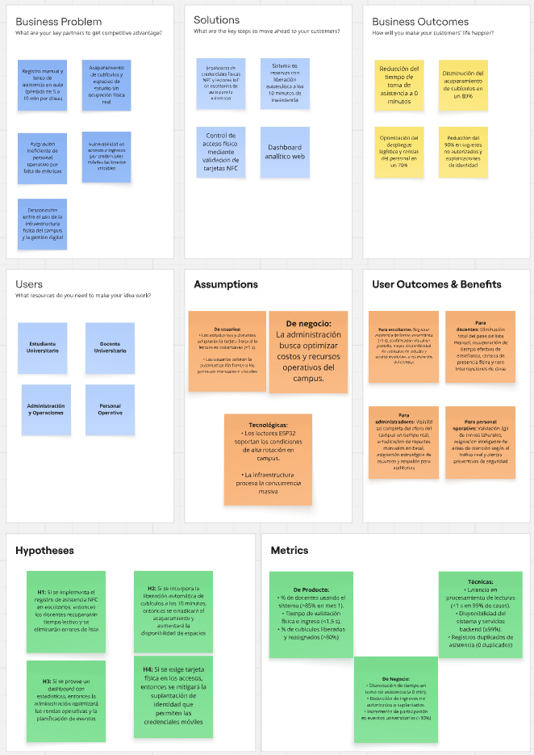<br>

Link del Canva: `https://miro.com/app/board/uXjVHno9MJk=/?share_link_id=58266810328`


## 1.3. Segmentos Objetivos

### Segmento #1: Administradores y Responsables de Gestión Universitaria

Este segmento está conformado por las personas encargadas de supervisar, analizar y tomar decisiones relacionadas con el funcionamiento del campus universitario. Utilizan la información generada por las credenciales y lectores NFC para monitorear indicadores como asistencia, accesos, ocupación de ambientes y afluencia de personas, permitiéndoles identificar patrones y mejorar la gestión de los recursos institucionales.

+ Aspectos demográficos:

  + Roles / Cargos: Administradores universitarios, coordinadores académicos, responsables de infraestructura, personal de seguridad y responsables de gestión de espacios.
  + Edad: Principalmente adultos en edad laboral.
  + Tipo de organización: Universidades e instituciones de educación superior públicas y privadas.
  + Ubicación: Campus universitarios, principalmente en zonas urbanas.

+ Aspectos psicográficos:

  + Motivaciones: Mejorar la gestión del campus, reducir procesos manuales, optimizar el uso de espacios y disponer de información confiable para la toma de decisiones.
  + Intereses: Transformación digital, analítica de datos, automatización, seguridad, eficiencia operativa y Smart Campus.
  + Valores: Eficiencia, seguridad, organización, confiabilidad de la información y mejora continua.

+ Comportamiento:

  + Consultan reportes, indicadores y dashboards para evaluar el funcionamiento de la institución.
  + Buscan soluciones que permitan centralizar información proveniente de diferentes procesos universitarios.
  + Utilizan los datos históricos y en tiempo real para detectar patrones de asistencia, ocupación y utilización de espacios.

+ Sustento estadístico:

  + La transformación digital está adquiriendo mayor importancia en la educación superior. UNESCO IESALC señala que la digitalización está modificando no solo la enseñanza y el aprendizaje, sino también la manera en que las instituciones gestionan sus operaciones, resaltando la importancia de los datos y la evidencia para la gestión universitaria.

  + El Instituto Nacional de Estadística e Informática mantiene estadísticas diferenciadas sobre matrícula, docentes y otros indicadores de universidades públicas y privadas, evidenciando la magnitud de la información que debe administrarse dentro del sistema universitario peruano.

  + En este contexto, una plataforma como TarjePAFI permite transformar los eventos generados dentro del campus en información consolidada que pueda ser utilizada por los responsables universitarios para apoyar decisiones relacionadas con asistencia, accesos y utilización de infraestructura.


### Segmento #2: Usuarios de la Credencial TarjePAFI

Este segmento está compuesto por las personas que interactúan directamente con los lectores NFC mediante una credencial TarjePAFI durante sus actividades cotidianas dentro del campus. Debido a que sus necesidades y actividades son diferentes, este segmento se divide en estudiantes, docentes y trabajadores de la universidad.

#### Estudiante:

Son los principales usuarios de la credencial debido a su interacción constante con aulas, laboratorios, bibliotecas y otros espacios universitarios.

+ Aspectos demográficos:

  + Sexo: Masculino y femenino.
  + Edad: Principalmente jóvenes y adultos que cursan estudios universitarios.
  + Ocupación: Estudiantes universitarios.
  + Ubicación: Campus de universidades públicas y privadas.
  
+ Aspectos psicográficos:

  + Motivaciones: Registrar su asistencia de manera rápida, ingresar fácilmente a espacios autorizados y acceder a servicios universitarios.
  + Intereses: Tecnología, rapidez, facilidad de uso y experiencias digitales integradas.
  + Valores: Comodidad, accesibilidad, seguridad y ahorro de tiempo.

+ Comportamiento:

  + Se desplazan constantemente entre diferentes ambientes durante su jornada académica.
  + Interactúan varias veces al día con aulas, laboratorios, bibliotecas y otros servicios del campus.
  + Prefieren mecanismos rápidos que no requieran procesos adicionales para identificarse o registrar su asistencia.

+ Sustento estadístico:

  + El INEI registra anualmente la cantidad de alumnos matriculados tanto en universidades públicas como privadas del Perú, con información disponible hasta 2024, evidenciando que los estudiantes constituyen uno de los grupos más numerosos dentro del ecosistema universitario.


#### Docentes:

Está conformado por los profesores que desarrollan actividades académicas dentro del campus y que pueden utilizar TarjePAFI para registrar su ingreso, asistencia y acceso a ambientes relacionados con sus labores.

+ Aspectos demográficos:

  + Sexo: Masculino y femenino.
  + Edad: Adultos en edad laboral.
  + Ocupación: Docentes universitarios.
  + Ubicación: Universidades públicas y privadas.

+ Aspectos psicográficos:

  + Motivaciones: Simplificar el registro de asistencia y el acceso a los espacios donde realizan actividades académicas.
  + Intereses: Herramientas prácticas, automatización de tareas administrativas y facilidad de uso.
  + Valores: Puntualidad, eficiencia, confiabilidad y simplicidad.

+ Comportamiento:

  + Se movilizan entre aulas, laboratorios, oficinas y otros ambientes según su horario académico.
  + Necesitan mecanismos de identificación y registro que interfieran lo menos posible con sus actividades docentes.

+ Sustento estadístico:

  + El INEI mantiene estadísticas específicas sobre el número de docentes de universidades públicas y privadas del Perú entre 2017 y 2024, lo cual evidencia que este grupo constituye otro actor relevante dentro de las operaciones cotidianas de las instituciones universitarias.


#### Trabajadores de la Universidad:

Este subsegmento comprende al personal que realiza actividades administrativas, de seguridad, limpieza, mantenimiento, cocina y otros servicios necesarios para la operación cotidiana del campus.

+ Aspectos demográficos:

  + Sexo: Masculino y femenino.
  + Edad: Adultos en edad laboral.
  + Ocupación: Personal administrativo, limpieza, mantenimiento, seguridad, cocina y servicios generales.
  + Ubicación: Diferentes áreas e instalaciones de la universidad.

+ Aspectos psicográficos:

  + Motivaciones: Registrar su ingreso y asistencia de manera sencilla y acceder únicamente a los espacios necesarios para realizar su trabajo.
  + Intereses: Sistemas fáciles de utilizar, rapidez y seguridad en el acceso.
  + Valores: Responsabilidad, puntualidad, seguridad y eficiencia.

+ Comportamiento:

  + Ingresan y salen de diferentes áreas del campus según las funciones que desempeñan.
  + Algunos requieren acceso permanente o restringido a determinados espacios.
  + Valoran sistemas que funcionen rápidamente y no dificulten sus labores cotidianas.

+ Sustento estadístico:

  + Las universidades requieren no solamente estudiantes y docentes, sino también personal encargado de los diferentes servicios que permiten su funcionamiento diario. Por ello, este grupo forma parte del ecosistema operativo sobre el cual una solución de identificación y control de accesos como TarjePAFI puede generar información útil para la administración institucional.
  + Las estadísticas oficiales del INEI distinguen recursos humanos y población universitaria dentro de sus indicadores educativos, mostrando que la gestión universitaria involucra múltiples tipos de usuarios y no únicamente a los estudiantes.

# Capítulo 2: Requirements Elicitation & Analysis

## 2.1 Competidores

Algunos de los competidores a los que TarjePafi podría enfrentarse son:

- **SEAtS Software:** Plataforma de gestión de asistencia y analítica de compromiso estudiantil utilizada por universidades de Reino Unido, Irlanda y Oceanía. Captura la asistencia mediante app móvil, balizas Bluetooth, biometría o lectores de credencial instalados en el aula, y ofrece reportes, alertas tempranas y métricas de utilización de espacios.
- **AccuClass (Engineerica Systems):** Plataforma de registro de asistencia en aula que permite al docente pasar lista desde su dispositivo, registrar alumnos por proximidad, generar códigos QR de clase o leer el carné mediante cámara o lector de banda magnética, con sincronización en la nube y reportes en línea.
- **Student Check-in:** Solución de registro de asistencia basada en códigos QR y dispositivos móviles, diseñada para agilizar el check-in del estudiante y reducir tiempos de espera al inicio de la sesión.
- **Blackboard (Anthology):** Sistema de gestión del aprendizaje ampliamente adoptado que incluye un módulo de seguimiento de asistencia dentro de un ecosistema mayor de gestión de cursos, evaluaciones y comunicación.

### 2.1.1. Análisis competitivo

| Competitive Analysis Landscape | |
|---|---|
| **¿Por qué llevar a cabo este análisis?** | Este análisis se lleva a cabo para investigar, analizar y comparar el comportamiento de los competidores directos e indirectos en el mercado de gestión automatizada de asistencia y control de accesos universitarios, con el fin de identificar el posicionamiento de TarjePafi, las brechas que dejan las soluciones actuales y las ventajas diferenciales sobre las que debe construirse nuestra propuesta de valor. |

| | | **TarjePafi** | **SEAtS Software** | **AccuClass** | **Blackboard** |
|---|---|---|---|---|---|
| | **Logo** | **[Logo TarjePafi]** | [](https://postimg.cc/YGmMpQP4) | [](https://postimg.cc/DSB25vss) | [](https://postimg.cc/GHP38Jp0) |
| **Perfil** | **Overview** | Solución integral basada en IoT diseñada para campus universitarios de alta concurrencia. Utiliza credenciales NFC y lectores instalados en accesos, escritorios de aulas y mesas de cubículos para validar físicamente la presencia de alumnos, docentes y personal. La información se sincroniza en tiempo real mediante APIs REST hacia una plataforma web centralizada que ofrece registro automático de asistencia, liberación automática de reservas y analítica de aforo. | Plataforma cloud de gestión de asistencia y *student success* para educación superior. Captura la participación mediante app móvil, balizas Bluetooth BLE, lectores de credencial estudiantil o biometría, y la convierte en tableros, alertas tempranas y reportes de retención, cumplimiento normativo y utilización de espacios. | Plataforma de registro de asistencia en aula desarrollada por Engineerica Systems. Permite al docente pasar lista desde su dispositivo, registrar alumnos por proximidad, mostrar un código QR de clase o leer el carné mediante cámara o lector de banda magnética, sincronizando los datos con un portal en la nube. Forma parte de una suite mayor junto a AccuCampus y Accudemia. | Sistema de gestión del aprendizaje (LMS) ampliamente adoptado que integra gestión de cursos, evaluaciones, comunicación y un módulo de seguimiento de asistencia. Su fortaleza está en consolidar la vida académica digital del estudiante en una sola plataforma institucional. |
| | **Ventaja competitiva ¿Qué valor ofrece a los clientes?** | Garantiza que el dato registrado corresponda a una presencia física real y no a una declaración, eliminando la suplantación mediante credenciales móviles y devolviendo tiempo lectivo al docente. Además, convierte cada validación en información operativa que permite a la administración distribuir personal, planificar eventos y asegurar el uso justo de los espacios de estudio. | Ofrece una visión unificada del compromiso académico del estudiante y permite intervenir tempranamente ante riesgos de deserción, además de sustentar auditorías de cumplimiento ante entidades regulatorias y migratorias. | Simplifica la toma de asistencia sin requerir infraestructura fija en el aula, permitiendo al docente elegir entre varios métodos de registro según el contexto y acceder a reportes en línea desde cualquier lugar. | Concentra la asistencia, las calificaciones y los materiales del curso en un único expediente académico, evitando integraciones adicionales y aprovechando una plataforma que la institución ya conoce y opera. |
| **Perfil de Marketing** | **Mercado objetivo** | Sedes universitarias de alta concurrencia en Perú y la región que buscan automatizar el control de asistencia, reforzar la seguridad de sus accesos y optimizar el uso de su infraestructura física. | Universidades y colleges de Reino Unido, Irlanda, Estados Unidos y Oceanía con exigencias de cumplimiento normativo y programas de retención estudiantil. | Instituciones educativas y docentes individuales que requieren una solución de asistencia ligera, de bajo costo y rápida implementación. | Instituciones educativas de todos los niveles, desde colegios hasta universidades, junto con administradores académicos, personal de TI, docentes y estudiantes. |
| | **Estrategias de Marketing** | Pilotos demostrativos en sedes específicas.<br>Alianzas directas con universidades.<br>Difusión de casos de éxito y métricas de eficiencia operativa.<br>Presencia en ferias de innovación educativa. | Marketing de contenidos sobre retención y cumplimiento.<br>Presencia en marketplaces institucionales como Microsoft Education.<br>Webinars y casos de éxito con universidades cliente. | Prueba gratuita de 30 días.<br>Distribución de la app móvil en tiendas oficiales.<br>Documentación y base de conocimiento pública.<br>Venta cruzada dentro de su suite de productos. | Marketing de contenidos y estudios de caso en su blog.<br>Participación en ferias educativas y conferencias.<br>Aprovechamiento de su reconocimiento de marca y base instalada. |
| **Perfil de producto** | **Productos y Servicios** | Credenciales NFC físicas.<br>Lectores IoT para accesos, aulas y cubículos.<br>Módulo liberación automática de reservas a los 10 minutos de tardanza<br>Dashboard administrativo con aforo en tiempo real, mapas de calor y alertas de seguridad. | Gestión de asistencia presencial y en línea.<br>Analítica de aprendizaje y alertas tempranas.<br>Gestión de casos y seguimiento de intervenciones.<br>Reportes de cumplimiento y utilización de espacios.<br>App móvil e integración con lectores y balizas existentes. | Registro de asistencia por pase de lista, proximidad, QR, cámara o banda magnética.<br>Portal en la nube para importación de cursos y horarios.<br>Reportes de asistencia en línea.<br>Encuestas en vivo y notificaciones al alumnado. | Gestión de cursos y contenidos.<br>Evaluaciones y calificaciones.<br>Módulo de asistencia vinculado al libro de notas.<br>Herramientas de comunicación e integraciones de terceros. |
| | **Precios y Costos** | Modelo B2B mixto: suscripción SaaS por el acceso al panel analítico y al sistema de reservas, más arrendamiento y mantenimiento del hardware (HaaS) por lector instalado, con tarifas escalables según el tamaño de la sede. | Licenciamiento institucional anual sin precios publicados; se cotiza por sede según número de estudiantes y módulos contratados, con paquete de implementación incluido. | Suscripción a un portal en la nube con prueba gratuita de 30 días; la aplicación móvil se distribuye sin costo, pero requiere cuenta activa en el portal para operar. | Contrato de licencia anual cuyo costo depende del paquete de módulos contratado por la institución; sin precios públicos y generalmente elevado para instituciones pequeñas. |
| | **Canales de distribución** | Plataforma web administrativa.<br>Hardware instalado en el campus (lectores NFC y credenciales). | Plataforma web.<br>App móvil iOS y Android.<br>Marketplaces institucionales y APIs de integración. | Portal web en la nube.<br>App móvil para dispositivos Apple.<br>Accesorios de lectura acoplables al dispositivo. | Plataforma web.<br>Aplicación móvil.<br>Integraciones y APIs con sistemas académicos. |
| **Análisis FODA** | **Fortalezas** | Validación física real mediante NFC, difícil de suplantar.<br>Registro de asistencia de cero fricción para el docente.<br>Datos de aforo en tiempo real para decisiones logísticas.<br>Liberación automática de espacios que combate el acaparamiento. | Plataforma madura con clientes universitarios consolidados.<br>Múltiples métodos de captura de asistencia.<br>Analítica predictiva y alertas tempranas.<br>Integración con lectores y balizas ya instalados. | Implementación rápida y sin infraestructura fija.<br>Variedad de métodos de registro.<br>Bajo costo de entrada.<br>Respaldo de un proveedor con amplia trayectoria en el rubro. | Marca reconocida y ampliamente adoptada.<br>Ecosistema académico completo más allá de la asistencia.<br>Soporte robusto y base instalada consolidada.<br>Asistencia vinculada directamente al expediente del alumno. |
| | **Debilidades** | Requiere inversión inicial en hardware IoT.<br>Producto nuevo, sin validación en múltiples instituciones.<br>Dependencia de la estabilidad de la red del campus.<br>Exposición del hardware a vandalismo y desgaste. | Enfoque orientado al cumplimiento normativo de visado, poco relevante en el contexto peruano.<br>No provee el ecosistema de hardware, depende de la infraestructura existente.<br>No gestiona reservas de espacios con liberación automática.<br>Sin presencia comercial en Latinoamérica. | Depende del dispositivo del docente como punto de captura.<br>Métodos de validación vulnerables a suplantación.<br>Sin control de aforo ni gestión de espacios físicos.<br>Alcance limitado al aula. | Registro de asistencia manual y declarativo.<br>Sin validación física ni control de accesos.<br>Percibido como complejo por usuarios nuevos.<br>Costos elevados para instituciones pequeñas. |
| | **Oportunidades** | Expansión a otras sedes y universidades de la región.<br>Integración con el LMS y el sistema académico institucional.<br>Desarrollo de analítica predictiva de afluencia.<br>Alianzas con proveedores de servicios dentro del campus. | Expansión hacia mercados emergentes.<br>Incorporación de validación física propia.<br>Crecimiento de la demanda de analítica de utilización de espacios. | Incorporación de tecnologías de validación más robustas como NFC.<br>Expansión hacia control de accesos y aforo.<br>Aprovechamiento de su suite para ofrecer soluciones integrales. | Integración con soluciones IoT de terceros.<br>Crecimiento sostenido de la digitalización educativa.<br>Incorporación de analítica avanzada a su módulo de asistencia. |
| | **Amenazas** | Competidores establecidos con mayor respaldo y base instalada.<br>Resistencia de los usuarios a volver a una credencial física.<br>Rechazo o demora en la aprobación por parte de la institución.<br>Réplica del modelo por competidores con más recursos. | Aparición de soluciones IoT más completas e integradas.<br>Cambios en la normativa que sustenta parte de su propuesta de valor.<br>Recortes presupuestales en el sector educativo. | Competencia de plataformas con validación física robusta.<br>Percepción de baja confiabilidad de sus métodos de registro.<br>Integración de la asistencia dentro de los LMS dominantes. | Competencia de soluciones especializadas en asistencia.<br>Migración de instituciones hacia LMS alternativos.<br>Cambios en las necesidades institucionales hacia la validación física. |

### 2.1.2. Estrategias y tácticas frente a competidores.

**Estrategia de Diferenciación por Validación Física Verificable**

Mientras que Blackboard registra la asistencia de forma manual y declarativa, y AccuClass la captura mediante métodos vulnerables a suplantación como códigos QR, proximidad o banda magnética, TarjePafi se posicionará como la única solución que certifica presencia física real. El eje de la diferenciación no será la comodidad del registro, sino la confiabilidad del dato: nuestro competidor no compite por registrar más rápido, sino por registrar lo que efectivamente ocurrió.

**Tácticas:**

- Comunicar la propuesta bajo el concepto de "dato verificable frente a dato declarado", contrastando explícitamente en cada demostración la facilidad con que se replica un código QR o una credencial móvil frente a la imposibilidad de clonar una tarjeta NFC sin acceso físico a ella.
- Documentar métricas de precisión durante el piloto (porcentaje de coincidencia entre registros del sistema y conteo físico real) para sustentar el argumento con evidencia y no con promesas.
- Posicionar la validación física no solo como control de asistencia, sino como refuerzo de seguridad del recinto, ampliando el valor percibido hacia el área de seguridad y no únicamente hacia la académica.

**Estrategia de Integración en Lugar de Sustitución**

Blackboard no es un rival al que haya que desplazar, sino un incumbente ya pagado e instalado en la universidad. Intentar reemplazarlo activaría resistencia institucional y costos de migración innecesarios. TarjePafi se posicionará como la capa física que alimenta al sistema académico existente, resolviendo por anticipado la objeción más probable de la administración: por qué invertir en hardware si el LMS ya contempla un módulo de asistencia.

**Tácticas:**

- Desarrollar APIs REST de sincronización con el LMS y el sistema académico institucional, de modo que la asistencia validada por NFC se refleje automáticamente en el expediente del alumno sin doble registro.
- Presentar la solución ante la administración como complemento y no como reemplazo, enfatizando que el LMS conserva la gestión académica mientras TarjePafi aporta la capa de verificación física que aquel no puede cubrir.
- Ofrecer exportación de reportes en formatos compatibles con las herramientas que el personal administrativo ya utiliza, reduciendo la curva de aprendizaje y la resistencia al cambio.

**Estrategia de Adaptación al Contexto Local y Entrada Escalonada**

SEAtS es el competidor más capaz en términos funcionales, pero su propuesta gira en torno al cumplimiento normativo de visados y auditorías propias del contexto anglosajón, y carece de presencia comercial en Latinoamérica. TarjePafi aprovechará esa brecha construyendo una solución diseñada para las necesidades operativas reales del campus peruano, con acompañamiento local y un modelo de adopción que reduzca la barrera de entrada del hardware.

**Tácticas:**

- Implementar un programa piloto acotado en la sede San Miguel, priorizando los puntos de mayor impacto visible (accesos principales y cubículos de estudio) para demostrar resultados antes de exigir una inversión a escala completa.
- Ofrecer el hardware bajo modelo de arrendamiento y mantenimiento (HaaS), trasladando la inversión de capital a un gasto operativo predecible y eliminando el riesgo financiero inicial para la institución.
- Brindar soporte técnico en zona horaria local y en español, un diferencial concreto frente a proveedores internacionales sin operación en la región.
- Adecuar las reglas de negocio a la normativa y a las políticas académicas peruanas, en lugar de imponer flujos diseñados para otros marcos regulatorios.

**Estrategia de Ampliación del Alcance hacia la Analítica Operativa**

Todos los competidores analizados limitan su valor al ámbito académico: reportan quién asistió a clase. Ninguno convierte esa información en inteligencia para la operación del campus. TarjePafi ampliará deliberadamente el alcance de la propuesta más allá de la asistencia, apuntando a un comprador distinto dentro de la misma institución: el área de logística, facility management y seguridad.

**Tácticas:**

- Desarrollar un dashboard con aforo en tiempo real, mapas de calor y análisis histórico de picos de afluencia, orientado a la planificación de rondas de limpieza, seguridad y mantenimiento.
- Incorporar la liberación automática de reservas a los diez minutos como funcionalidad insignia, atacando un problema cotidiano que ninguna plataforma de asistencia resuelve y que los estudiantes perciben de inmediato.
- Comercializar la analítica de afluencia como insumo para la planificación de eventos y ferias universitarias, abriendo un caso de uso adicional ante las autoridades académicas.

**Estrategia de Adopción sin Fricción**

La principal amenaza interna de TarjePafi es que la comunidad universitaria perciba la credencial física como un retroceso frente a la credencial móvil, o que la validación en los accesos genere colas en horas punta. Anticiparse a esa resistencia es tan importante como diferenciarse de los competidores, porque una adopción fallida invalida cualquier ventaja técnica.

**Tácticas:**

- Garantizar tiempos de lectura inferiores a un segundo y validar el rendimiento del sistema en los bloques horarios de máxima concurrencia antes del despliegue general.
- Realizar pruebas de usabilidad con estudiantes, docentes y personal administrativo durante el piloto, iterando el diseño de la interacción física antes de escalar la instalación.
- Diseñar los lectores y su montaje priorizando la resistencia al desgaste y al vandalismo, e incluir el reemplazo dentro del contrato de mantenimiento para que el costo no recaiga sobre la institución.
- Mantener un canal de reporte de incidencias visible en cada punto de validación, de modo que las fallas se resuelvan antes de erosionar la confianza en el sistema.

## 2.2. Entrevistas.

### 2.2.1. Diseño de entrevistas.

**Objetivo de las entrevistas**

Las entrevistas buscan validar los supuestos planteados en el Lean UX Process de TarjePafi, comprendiendo cómo se registra hoy la asistencia y el acceso a los espacios del campus, qué fricciones genera el proceso actual y qué información necesitan realmente quienes toman decisiones operativas. Se definieron dos segmentos con necesidades y niveles de acceso claramente distintos, esto son, los portadores de la credencial, que interactúan diariamente con el hardware, y el personal administrativo, único con acceso a la plataforma de reportes.


**Introducción (común a ambos segmentos)**

Entrevistador: Buenos días/tardes/noches. En esta ocasión realizaremos una entrevista para conocer a los posibles usuarios de una solución que automatiza el registro de asistencia y accesos en el campus universitario mediante credenciales inteligentes.

Entrevistador: Antes de comenzar, quisiera comentarle que no existen respuestas correctas o incorrectas. Nos interesa conocer su experiencia real con los procesos actuales, incluyendo aquello que no funciona bien. La entrevista será grabada únicamente con fines académicos y su información será tratada de manera confidencial. ¿Nos autoriza a grabar la sesión?

Entrevistado: [Entrevistado responde]

Entrevistador: Para el registro de la entrevista, por favor indique sus nombres, apellidos, edad, distrito y ocupación o cargo dentro de la universidad.

Entrevistado: [Entrevistado responde]

Entrevistador: Listo, comenzaremos con las siguientes preguntas:


**Segmento #1: Portadores de credencial (estudiantes, docentes y personal del campus)**

**Preguntas generales:**

1. ¿Podría describirme cómo es un día habitual suyo dentro del campus, desde que ingresa hasta que se retira?
2. ¿De qué manera se registra actualmente su ingreso al campus y su asistencia a clases o a su jornada? ¿Quién realiza ese registro?
3. ¿Cuánto tiempo estima que toma ese proceso y con qué frecuencia le genera demoras o incomodidades?
4. ¿Ha tenido alguna situación en la que su asistencia o su ingreso quedara mal registrado? ¿Qué ocurrió y cómo se resolvió?
5. ¿Qué credencial utiliza hoy para identificarse dentro de la universidad y qué tan confiable le parece ese método?
6. ¿Con qué frecuencia utiliza los espacios de estudio del campus, como cubículos o salas grupales, y cómo hace para conseguirlos?
7. ¿Le ha tocado encontrar espacios reservados pero físicamente vacíos, o no conseguir uno pese a que había lugares libres? ¿Cómo lo manejó?
8. Si el registro de su asistencia se realizara automáticamente al acercar una tarjeta a un lector, ¿qué ventajas y qué inconvenientes le encontraría?
9. ¿Qué tendría que cumplir ese sistema para que usted lo prefiera sobre el método que utiliza actualmente?

**Preguntas complementarias:**

1. ¿Qué opina sobre llevar consigo una tarjeta física en lugar de usar su celular como credencial?
2. ¿Cuánto tiempo consideraría aceptable esperar en una cola de ingreso durante las horas de mayor concurrencia?
3. ¿Qué información sobre su propia asistencia o sobre la disponibilidad de espacios le gustaría poder consultar por su cuenta?
4. *(Solo para docentes)* ¿Cuántos minutos de clase dedica habitualmente a tomar asistencia y qué haría con ese tiempo si lo recuperara?


**Segmento #2: Personal administrativo con acceso a la plataforma de reportes**

**Preguntas generales:**

1. ¿Cuál es su cargo y qué decisiones operativas sobre el campus dependen de usted o de su área?
2. ¿Cómo obtiene actualmente la información sobre asistencia, ingresos o uso de los espacios del campus?
3. ¿Con qué frecuencia recibe esa información y qué tan confiable la considera para tomar decisiones?
4. ¿Qué herramientas o sistemas utiliza hoy para consolidar y revisar estos datos, y qué limitaciones ha encontrado en ellos?
5. ¿Podría contarme sobre alguna decisión que haya tenido que tomar sin contar con la información suficiente? ¿Qué consecuencias tuvo?
6. ¿Cómo se distribuye actualmente al personal de limpieza, seguridad o mantenimiento a lo largo del día, y en qué criterios se basa esa asignación?
7. Si contara con una plataforma que muestre en tiempo real el aforo y el flujo de personas por zona, ¿qué decisiones tomaría de forma distinta?
8. ¿Qué indicadores o reportes considera indispensables para que una herramienta de este tipo le resulte útil en su trabajo diario?
9. ¿Qué criterios evalúa su institución antes de aprobar la implementación de una nueva tecnología en el campus?

**Preguntas complementarias:**

1. ¿Prefiere revisar la información de forma continua durante el día o recibir reportes consolidados en momentos específicos?
2. ¿Qué tipo de alertas automáticas le resultarían realmente útiles y cuáles considera que terminaría ignorando?
3. ¿Qué preocupaciones tendría respecto al manejo y la privacidad de los datos de asistencia y desplazamiento de la comunidad universitaria?
4. ¿Qué obstáculos anticipa para que una solución basada en hardware instalado en el campus sea aprobada e implementada en su institución?


**Cierre (común a ambos segmentos)**

Entrevistador: Eso sería todo, muchas gracias por participar.

Entrevistador: ¿Desea agregar algún comentario adicional o algo que considere que no le preguntamos?

Entrevistado: [Entrevistado responde]

Entrevistador: Perfecto, agradezco mucho su tiempo y sus respuestas. Hasta luego.

### 2.2.2. Registro de entrevistas.

*Entrevistas a Administrativos*
---
<br>

<table align="center">
  <tr>
    <th colspan="2" style="text-align:center">Entrevista 1</th>
  </tr>
  <tr>
    <td><strong>Entrevistado 1</strong></td>
    <td>Juan Antonio Flores Moroco</td>
  </tr>
  <tr>
    <td><strong>Edad</strong></td>
    <td>46</td>
  </tr>
  <tr>
    <td><strong>Distrito</strong></td>
    <td>Pueblo Libre</td>
  </tr>
  <tr>
    <td><strong>Timing</strong></td>
    <td>0:40-26:17 </td>
  </tr>
  <tr>
    <td><strong>URL</strong></td>
    <td>
      
  `https://youtu.be/w5s9bBvT1uQ?si=c8qPuEriqGDu5CTF`

  </td>
  </tr>
  <tr>
    <td colspan="2" style="text-align:justify">
      Resumen: <br>
      Juan Antonio Flores Moroco, PTC (Profesor a tiempo completo) de la carrera de ingenieria de software, sistemas y ciencias de la computacion de la UPC, reside en el distrito de Pueblo Libre, habla y describe la idea de que la implementacion de tarjetas llegaria a ser posible gracias a las nuevas funcionalidades agregadas ademas de sugerir ideas y funciones adicionales para asegurar la aceptacion de dicho proceso
    </td>
  </tr>
  <tr>
    <td colspan="2"><br>
      <br>
    </td>
  </tr>
</table>

<br>

<table align="center">
  <tr>
    <th colspan="2" style="text-align:center">Entrevista 2</th>
  </tr>
  <tr>
    <td><strong>Entrevistado</strong></td>
    <td>Carlos Pingus</td>
  </tr>
  <tr>
    <td><strong>Edad</strong></td>
    <td>24</td>
  </tr>
  <tr>
    <td><strong>Distrito</strong></td>
    <td>San Martin de Porres</td>
  </tr>
  <tr>
    <td><strong>Timing</strong></td>
    <td>0:00-6:11</td>
  </tr>
  <tr>
    <td><strong>URL</strong></td>
    <td>
      
  `https://upcedupe-my.sharepoint.com/:v:/g/personal/u20211a620_upc_edu_pe/IQB3X-klGNvYQKWSUi8pbM6aAbGwQSF23y78sSF4I3IVGyc?nav=eyJyZWZlcnJhbEluZm8iOnsicmVmZXJyYWxBcHAiOiJPbmVEcml2ZUZvckJ1c2luZXNzIiwicmVmZXJyYWxBcHBQbGF0Zm9ybSI6IldlYiIsInJlZmVycmFsTW9kZSI6InZpZXciLCJyZWZlcnJhbFZpZXciOiJNeUZpbGVzTGlua0NvcHkifX0&e=mry34y`

  </td>
  </tr>
  <tr>
    <td colspan="2" style="text-align:justify">
      Resumen: <br>
      Carlos, administrativo encargado de revisar las asistencias, señala la importancia de contar con información confiable y oportuna para supervisar el 
      campus y tomar decisiones operativas. Actualmente, la revisión de estos datos presenta limitaciones debido a la falta de información centralizada y 
      en tiempo real. Considera que una plataforma con indicadores de asistencia, aforo y flujo de personas facilitaría el seguimiento y permitiría tomar decisiones con mayor información.
      La entrevistada, Guadalupe Alvarado, se desempeña como encargada de logística en un instituto de SENCICO. Actualmente, la institución cuenta con un sistema biométrico de control de asistencia dirigido únicamente a los trabajadores, quienes registran su ingreso y salida mediante su huella dactilar.

En términos generales, considera que el sistema funciona adecuadamente para controlar el cumplimiento de la jornada laboral; sin embargo, identifica limitaciones relacionadas con la información y las estadísticas que proporciona, ya que estas resultan insuficientes para apoyar determinadas tareas de gestión y supervisión.

La entrevistada considera de gran utilidad contar con una solución que permita conocer la ubicación actual del personal dentro de las instalaciones. Esta información facilitaría la supervisión del cumplimiento de sus funciones y también podría ser útil ante situaciones de emergencia, como un sismo, al permitir conocer la ubicación o presencia del personal.

Finalmente, señaló que, antes de implementar una nueva solución tecnológica, la institución tendría que evaluar principalmente la relación costo-beneficio, considerando si las mejoras y beneficios obtenidos justifican la inversión necesaria.
    </td>
  </tr>
  <tr>
    <td colspan="2"><br>
      <br>
    </td>
  </tr>
</table>


<table align="center">
  <tr>
    <th colspan="2" style="text-align:center">Entrevista 3</th>
  </tr>
  <tr>
    <td><strong>Entrevistado</strong></td>
    <td>Guadalupe Alvarado Ramos</td>
  </tr>
  <tr>
    <td><strong>Edad</strong></td>
    <td>54</td>
  </tr>
  <tr>
    <td><strong>Distrito</strong></td>
    <td>San Miguel</td>
  </tr>
  <tr>
    <td><strong>Timing</strong></td>
    <td>00:00 - 06:24</td>
  </tr>
  <tr>
    <td><strong>URL</strong></td>
    <td>
      
  `https://youtu.be/fksqMUkJ3oY`

  </td>
  </tr>
  <tr>
    <td colspan="2" style="text-align:justify">
      Resumen: <br>
      La entrevistada, Guadalupe Alvarado, se desempeña como encargada de logística en un instituto de SENCICO. Actualmente, la institución cuenta con un sistema biométrico de control de asistencia dirigido únicamente a los trabajadores, quienes registran su ingreso y salida mediante su huella dactilar.

En términos generales, considera que el sistema funciona adecuadamente para controlar el cumplimiento de la jornada laboral; sin embargo, identifica limitaciones relacionadas con la información y las estadísticas que proporciona, ya que estas resultan insuficientes para apoyar determinadas tareas de gestión y supervisión.

La entrevistada considera de gran utilidad contar con una solución que permita conocer la ubicación actual del personal dentro de las instalaciones. Esta información facilitaría la supervisión del cumplimiento de sus funciones y también podría ser útil ante situaciones de emergencia, como un sismo, al permitir conocer la ubicación o presencia del personal.

Finalmente, señaló que, antes de implementar una nueva solución tecnológica, la institución tendría que evaluar principalmente la relación costo-beneficio, considerando si las mejoras y beneficios obtenidos justifican la inversión necesaria.
    </td>
  </tr>
  <tr>
    <td colspan="2"><br>
      <br>
    </td>
  </tr>
</table>

*Entrevistas a usuarios de tarjetas*
---

<table align="center">
  <tr>
    <th colspan="2" style="text-align:center">Entrevista 1</th>
  </tr>
  <tr>
    <td><strong>Entrevistado</strong></td>
    <td>Oriana Via</td>
  </tr>
  <tr>
    <td><strong>Edad</strong></td>
    <td>29</td>
  </tr>
  <tr>
    <td><strong>Distrito</strong></td>
    <td>Cercado de Lima</td>
  </tr>
  <tr>
    <td><strong>Timing</strong></td>
    <td>0:56-8:26</td>
  </tr>
  <tr>
    <td><strong>URL</strong></td>
    <td>
      
  `https://youtu.be/RHp96fure88`

  </td>
  </tr>
  <tr>
    <td colspan="2" style="text-align:justify">
      Resumen: <br>
      Oriana, instructora en la universidad Cayetano Heredia, reside en el distrito de Cercado de Lima, habla sobre cómo la implementación si bien no sería 100% útil en su área, igual describe cómo la existencia de las tarjetas aceleraría los procesos de registro de asistencia y seguridad de su universidad tanto para la asistencia como el acceso a espacios de trabajos reservados.
    </td>
  </tr>
  <tr>
    <td colspan="2"><br>
      <br>
    </td>
  </tr>
</table>


<table align="center">
  <tr>
    <th colspan="2" style="text-align:center">Entrevista 2</th>
  </tr>
  <tr>
    <td><strong>Entrevistado</strong></td>
    <td>Alvaro Abanto</td>
  </tr>
  <tr>
    <td><strong>Edad</strong></td>
    <td>21</td>
  </tr>
  <tr>
    <td><strong>Distrito</strong></td>
    <td>Los Olivos</td>
  </tr>
  <tr>
    <td><strong>Timing</strong></td>
    <td>0:58-7:11</td>
  </tr>
  <tr>
    <td><strong>URL</strong></td>
    <td> 

   `https://youtu.be/b_XeFh_mzvQ` 
  
  </td>
  </tr>
  <tr>
    <td colspan="2" style="text-align:justify">
      Resumen: <br>
      Alvaro, estudiante de la carrera de Ciencias de la Computación, reside en el distrito de Los Olivos, menciona que ciertos protocolos de asistencia o ingreso en su campus universitario suelen ser lentos o a veces frustrantes. La solución propuesta le parece interesante ya que es más sencillo transportar una tarjeta física que no depende de internet pero añade que el sistema propuesto debe ser rapido y preciso para preferirlo sobre el sistema actual.
    </td>
  </tr>
  <tr>
    <td colspan="2"><br>
      <br>
    </td>
  </tr>
</table>

<table align="center">
  <tr>
    <th colspan="2" style="text-align:center">Entrevista 3</th>
  </tr>
  <tr>
    <td><strong>Entrevistado</strong></td>
    <td>Estefano Solís Campos</td>
  </tr>
  <tr>
    <td><strong>Edad</strong></td>
    <td>21</td>
  </tr>
  <tr>
    <td><strong>Distrito</strong></td>
    <td>Pueblo Libre</td>
  </tr>
  <tr>
    <td><strong>Timing</strong></td>
    <td>0:56-6:49</td>
  </tr>
  <tr>
    <td><strong>URL</strong></td>
    <td>
      
  `https://youtu.be/kY0LlmRpvzc`

  </td>
  </tr>
  <tr>
    <td colspan="2" style="text-align:justify">
      Resumen: <br>
      Estefano Solís Campos, estudiante de 21 años que reside en el distrito de Pueblo Libre, comenta que el proceso actual de ingreso mediante la aplicación móvil suele presentar inconvenientes cuando falla la conexión a internet, la autenticación de la red del campus o la batería del celular, lo que llega a generar demoras en la entrada. La solución planteada mediante una tarjeta inteligente le parece favorable por ser un método más directo y libre de la dependencia de conectividad externa, aunque señala como desventaja el riesgo de extravío u olvido. Para preferir este sistema, precisa que los lectores deben funcionar de manera rápida y al primer intento (con esperas que no superen los 2 o 3 minutos), destacando la conveniencia de mantener el teléfono como respaldo y de integrar consultas en tiempo real sobre el límite de inasistencias y la disponibilidad real de cubículos.
    </td>
  </tr>
  <tr>
    <td colspan="2"><br>
      <br>
    </td>
  </tr>
</table>

<table align="center">
  <tr>
    <th colspan="2" style="text-align:center">Entrevista 4</th>
  </tr>
  <tr>
    <td><strong>Entrevistado</strong></td>
    <td>Anyeli Peña Rojas</td>
  </tr>
  <tr>
    <td><strong>Edad</strong></td>
    <td>22</td>
  </tr>
  <tr>
    <td><strong>Distrito</strong></td>
    <td>Pueblo Libre</td>
  </tr>
  <tr>
    <td><strong>Timing</strong></td>
    <td>0:01-4:23</td>
  </tr>
  <tr>
    <td><strong>URL</strong></td>
    <td>
      
  `https://upcedupe-my.sharepoint.com/:v:/g/personal/u20211a620_upc_edu_pe/IQAn0VgtdoQHQL92PL7WV7S4Ae-44WNeqKU7-cwJkmN_mW4?nav=eyJyZWZlcnJhbEluZm8iOnsicmVmZXJyYWxBcHAiOiJPbmVEcml2ZUZvckJ1c2luZXNzIiwicmVmZXJyYWxBcHBQbGF0Zm9ybSI6IldlYiIsInJlZmVycmFsTW9kZSI6InZpZXciLCJyZWZlcnJhbFZpZXciOiJNeUZpbGVzTGlua0NvcHkifX0&e=2dVoPu`

  </td>
  </tr>
  <tr>
    <td colspan="2" style="text-align:justify">
      Resumen: <br>
      Anyeli, una estudiante de 22 años, señala que el acceso mediante la aplicación móvil suele volverse lento debido a fallas de internet, problemas de autenticación en la red de la universidad o la descarga del teléfono, lo que provoca congestión y filas en las entradas. Aunque considera que una tarjeta inteligente es una solución práctica por no depender de conectividad, advierte el riesgo de olvidarla o perderla. Para adoptar este nuevo sistema, exige que los lectores respondan de forma rápida y eficiente,.
    </td>
  </tr>
  <tr>
    <td colspan="2"><br>
      <br>
    </td>
  </tr>
</table>

### 2.2.3. Análisis de entrevistas.

**Segmento Objetivo 1: Administradores y Responsables de Gestión Universitaria**

**Insights principales:**

- **Información centralizada:** Necesitan consultar información de asistencia, accesos y uso de espacios desde una plataforma unificada.
- **Automatización:** Existe una oportunidad para reducir procesos manuales relacionados con el registro y seguimiento de actividades.
- **Información confiable:** Requieren datos actualizados que faciliten el monitoreo y la toma de decisiones.
- **Visualización de indicadores:** Los reportes y dashboards permiten identificar patrones y evaluar el funcionamiento del campus.

**Necesidades identificadas:**

- Reportes de asistencia y utilización de espacios.
- Información actualizada y centralizada.
- Automatización de procesos administrativos.
- Integración con los sistemas universitarios existentes.

---

**Segmento Objetivo 2: Usuarios de la Credencial TarjePAFI**

**Insights principales:**

- **Rapidez y simplicidad:** Estudiantes, docentes y trabajadores requieren mecanismos de identificación que no interfieran con sus actividades.
- **Uso frecuente:** Los usuarios se desplazan constantemente por diferentes ambientes del campus y pueden interactuar varias veces al día con los lectores.
- **Automatización del registro:** El uso de una credencial NFC permite registrar asistencia y accesos sin procesos manuales adicionales.
- **Facilidad de uso:** La solución debe funcionar de manera rápida y sencilla para los distintos perfiles de usuarios.

**Necesidades identificadas:**

- Registro automático de asistencia.
- Identificación mediante una credencial única.
- Acceso rápido a espacios autorizados.
- Lectores confiables y fáciles de utilizar.
- Seguridad y privacidad de la información.

---

**Patrones comunes entre segmentos**

Ambos segmentos presentan una necesidad de **automatizar y simplificar los procesos universitarios**. Los usuarios requieren un mecanismo rápido y sencillo para identificarse y registrar sus actividades, mientras que los administradores necesitan **información confiable y centralizada** para supervisar el funcionamiento del campus y apoyar la toma de decisiones.

## 2.3. Needfinding.


En esta sección, se presenta el análisis detallado de las necesidades, dolores y comportamientos de nuestros segmentos objetivo.

### 2.3.1. User Personas


#### Segmento 1: Administradores y Responsables de Gestión Universitaria

<td align="center"></td>

<div align = center>


</div>

#### Segmento 2: Usuarios de Credencial (Estudiantes)

<td align="center"></td>


#### Segmento 2: Usuarios de Credencial (Docentes)

<td align="center"></td>

#### Segmento 2: Usuarios de Credencial (Personal Operativo)

<td align="center"></td>


### 2.3.2. User Task Matrix

Para la sección del User Task Matrix, se analiza cómo Jair y Andrea gestionan sus responsabilidades actuales, lo que nos permitirá identificar dónde nuestra solución puede aportar el mayor valor.


<table>
  <thead>
    <tr>
      <th rowspan="2">Tareas</th>
      <th colspan="2">Andrea (Administradora)</th>
      <th colspan="2">Jair (Estudiante)</th>
    </tr>
    <tr>
      <th>Frecuencia</th>
      <th>Importancia</th>
      <th>Frecuencia</th>
      <th>Importancia</th>
    </tr>
  </thead>
  <tbody>
    <tr>
      <td>Esperar a que el docente pase asistencia en la plataforma web al inicio de clase</td>
      <td>N/A</td>
      <td>N/A</td>
      <td>Alta</td>
      <td>Crítica</td>
    </tr>
    <tr>
      <td>Ingresar a laboratorios o biblioteca mostrando carné o registrando datos manualmente</td>
      <td>N/A</td>
      <td>N/A</td>
      <td>Alta</td>
      <td>Alta</td>
    </tr>
    <tr>
      <td>Consolidar manualmente reportes de asistencia (exportados por cada docente) y de accesos</td>
      <td>Alta</td>
      <td>Alta</td>
      <td>N/A</td>
      <td>N/A</td>
    </tr>
    <tr>
      <td>Verificar autorización de acceso a zonas restringidas de forma manual (lista impresa o consulta a seguridad)</td>
      <td>Media</td>
      <td>Alta</td>
      <td>N/A</td>
      <td>N/A</td>
    </tr>
    <tr>
      <td>Atender reclamos de docentes/estudiantes por errores en el registro de asistencia</td>
      <td>Media</td>
      <td>Crítica</td>
      <td>N/A</td>
      <td>N/A</td>
    </tr>
    <tr>
      <td>Reportar a Dirección Académica sobre uso de infraestructura</td>
      <td>Baja</td>
      <td>Alta</td>
      <td>N/A</td>
      <td>N/A</td>
    </tr>
    <tr>
      <td>Reservar un ambiente o laboratorio por correo o solicitud presencial</td>
      <td>N/A</td>
      <td>N/A</td>
      <td>Baja</td>
      <td>Media</td>
    </tr>
    <tr>
      <td>Perder minutos de clase mientras el docente pasa asistencia uno por uno</td>
      <td>N/A</td>
      <td>N/A</td>
      <td>Alta</td>
      <td>Media</td>
    </tr>
  </tbody>
</table>

### 2.3.3. Empathy Mapping


 A continuación, se presentan los Empathy Maps para los dos segmentos objetivo.


#### Segmento 1: Administradores y Responsables de Gestión Universitaria

<td align="center"></td>


</div>

#### Segmento 2: Usuarios de Credencial (Estudiantes)

<td align="center"></td>

#### Segmento 2: Usuarios de Credencial (Docentes)

<td align="center"></td>

#### Segmento 2: Usuarios de Credencial (Personal operativo)

<td align="center"></td>


</div>


### 2.3.4. As-is Scenario Mapping.

En esta sección se presenta un análisis detallado de la situación actual (AS-IS) para los diferentes segmentos.

Se puede visualizar con más detalle en el siguiente enlace:
 https://lucid.app/lucidchart/1a5b371c-5aa4-4aef-bd8f-27a9c5132f0d/edit?viewport_loc=-8631%2C-1540%2C4493%2C2127%2C0_0&invitationId=inv_df4c245c-0fcc-4a3e-8dce-f9a24864599f


#### Segmento 1: Administradores y Responsables de Gestión Universitaria

<td align="center">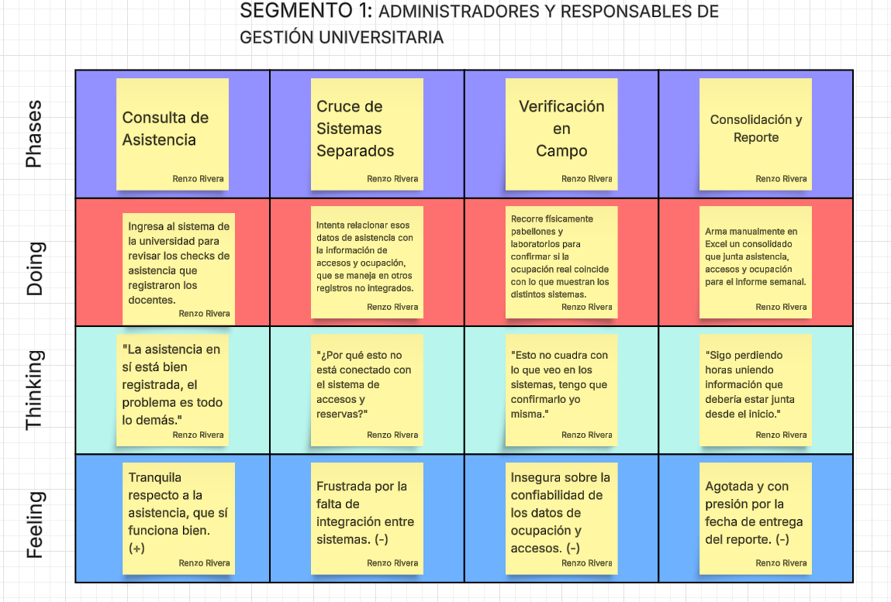</td>

<div align = center>


</div>

#### Segmento 2: Usuarios de credencial

<td align="center">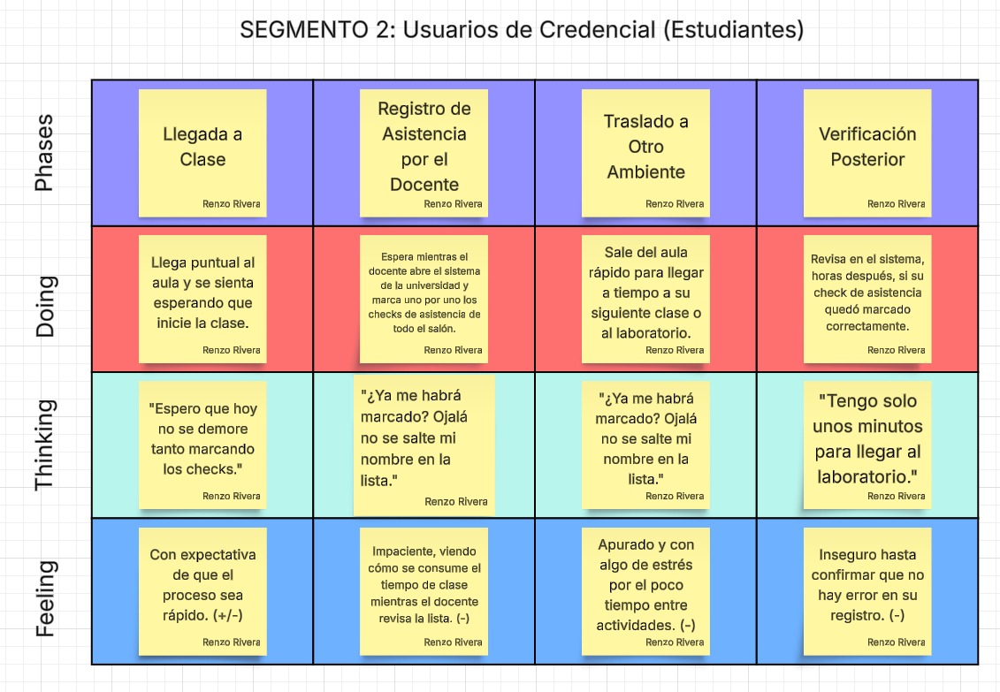</td>

<div align = center>


</div>


## 2.4. Ubiquitous Language.

En esta sección se define el Ubiquitous Language del dominio de TarjePAFI, con el objetivo de establecer un lenguaje común entre todos los miembros del equipo y stakeholders. Este glosario reúne los principales términos relacionados con la identificación de personas, asistencia académica, control de accesos, gestión de espacios y operación dentro de un campus universitario, evitando ambigüedades durante el análisis y desarrollo de la solución.

<div align="center">

<table>
  <thead>
    <tr>
      <th>Term</th>
      <th>Definition</th>
    </tr>
  </thead>
  <tbody>
    <tr>
      <td>Campus User (Usuario del Campus)</td>
      <td>Persona que realiza actividades dentro de la universidad y puede interactuar con los servicios y espacios del campus.</td>
    </tr>
    <tr>
      <td>Student (Estudiante)</td>
      <td>Usuario del campus matriculado en uno o más cursos y que participa en actividades académicas dentro de la universidad.</td>
    </tr>
    <tr>
      <td>Teacher (Docente)</td>
      <td>Usuario responsable de impartir clases y desarrollar actividades académicas dentro de la universidad.</td>
    </tr>
    <tr>
      <td>Staff Member (Trabajador)</td>
      <td>Persona que desempeña funciones administrativas, operativas o de servicios dentro de la universidad, como seguridad, limpieza, mantenimiento o cocina.</td>
    </tr>
    <tr>
      <td>Administrator (Administrador)</td>
      <td>Persona responsable de supervisar información relacionada con asistencia, accesos, ocupación y uso de espacios para apoyar la gestión del campus.</td>
    </tr>
    <tr>
      <td>Campus Credential (Credencial del Campus)</td>
      <td>Credencial física asignada a un usuario que permite identificarlo durante sus interacciones dentro de la universidad.</td>
    </tr>
    <tr>
      <td>Card Holder (Titular de la Credencial)</td>
      <td>Usuario del campus al que se encuentra asignada una credencial vigente.</td>
    </tr>
    <tr>
      <td>Credential Status (Estado de Credencial)</td>
      <td>Condición actual de una credencial, como activa, bloqueada, perdida o desactivada, que determina si puede utilizarse dentro del campus.</td>
    </tr>
    <tr>
      <td>Academic Attendance (Asistencia Académica)</td>
      <td>Registro que confirma la presencia de un estudiante o docente en una actividad académica programada.</td>
    </tr>
    <tr>
      <td>Attendance Record (Registro de Asistencia)</td>
      <td>Evidencia individual de que un usuario registró su asistencia a una sesión académica determinada.</td>
    </tr>
    <tr>
      <td>Class Session (Sesión de Clase)</td>
      <td>Actividad académica programada para un curso en una fecha, horario y espacio determinados.</td>
    </tr>
    <tr>
      <td>Attendance Window (Ventana de Asistencia)</td>
      <td>Periodo de tiempo definido durante el cual un usuario puede registrar válidamente su asistencia a una sesión de clase.</td>
    </tr>
    <tr>
      <td>Enrollment (Matrícula)</td>
      <td>Relación formal que vincula a un estudiante con un curso durante un periodo académico determinado.</td>
    </tr>
    <tr>
      <td>Campus Space (Espacio del Campus)</td>
      <td>Área física perteneciente a la universidad que puede ser utilizada para actividades académicas, administrativas u operativas.</td>
    </tr>
    <tr>
      <td>Facility (Instalación)</td>
      <td>Recurso físico gestionado por la universidad, como aulas, laboratorios, bibliotecas, salas de estudio u oficinas.</td>
    </tr>
    <tr>
      <td>Space Reservation (Reserva de Espacio)</td>
      <td>Asignación de un espacio universitario a un usuario o actividad durante un periodo de tiempo determinado.</td>
    </tr>
    <tr>
      <td>Reservation Time Slot (Franja de Reserva)</td>
      <td>Intervalo de tiempo durante el cual una reserva de espacio se encuentra vigente.</td>
    </tr>
    <tr>
      <td>Occupancy (Ocupación)</td>
      <td>Cantidad de personas que se encuentran utilizando un espacio determinado en un momento específico.</td>
    </tr>
    <tr>
      <td>Capacity (Capacidad)</td>
      <td>Número máximo de personas que pueden utilizar un espacio de acuerdo con las condiciones establecidas por la universidad.</td>
    </tr>
    <tr>
      <td>Access Permission (Permiso de Acceso)</td>
      <td>Autorización otorgada a un usuario para ingresar o utilizar un determinado espacio del campus.</td>
    </tr>
    <tr>
      <td>Restricted Area (Área Restringida)</td>
      <td>Espacio cuyo ingreso está limitado únicamente a usuarios que cuentan con la autorización correspondiente.</td>
    </tr>
    <tr>
      <td>Access Record (Registro de Acceso)</td>
      <td>Evidencia del ingreso o intento de ingreso de un usuario a un espacio determinado del campus.</td>
    </tr>
    <tr>
      <td>Work Attendance (Asistencia Laboral)</td>
      <td>Registro de presencia de un trabajador durante la jornada en la que debe cumplir sus funciones dentro de la universidad.</td>
    </tr>
    <tr>
      <td>Work Shift (Jornada Laboral)</td>
      <td>Periodo establecido durante el cual un trabajador debe desarrollar sus actividades dentro de la universidad.</td>
    </tr>
    <tr>
      <td>Campus Foot Traffic (Afluencia del Campus)</td>
      <td>Flujo y cantidad de personas que transitan por determinadas zonas del campus durante un periodo de tiempo.</td>
    </tr>
    <tr>
      <td>Check-in (Marcación)</td>
      <td>Acción mediante la cual un usuario registra su presencia para una actividad, espacio o jornada determinada.</td>
    </tr>
  </tbody>
</table>

</div>

# Capítulo 3: Requirements Specification

## 3.1. To-Be Scenario Mapping.

En esta sección se presenta un análisis detallado de la situación actual (TO-BE) para los diferentes segmentos.

Se puede visualizar con más detalle en los siguientes enlaces:
https://lucid.app/lucidchart/e783a818-e492-46c5-a564-6fa8156b94c4/edit?viewport_loc=-6948%2C-760%2C1641%2C1152%2C0_0&invitationId=inv_c15e615c-d91a-4f21-8b21-2f41676eda3d

https://lucid.app/lucidchart/5faf305b-e9be-4dc4-ae03-fc4b32774beb/edit?viewport_loc=-6883%2C-709%2C1823%2C1152%2C0_0&invitationId=inv_702058e1-7362-4405-ae1f-4b4cead42fbd

<td align="center">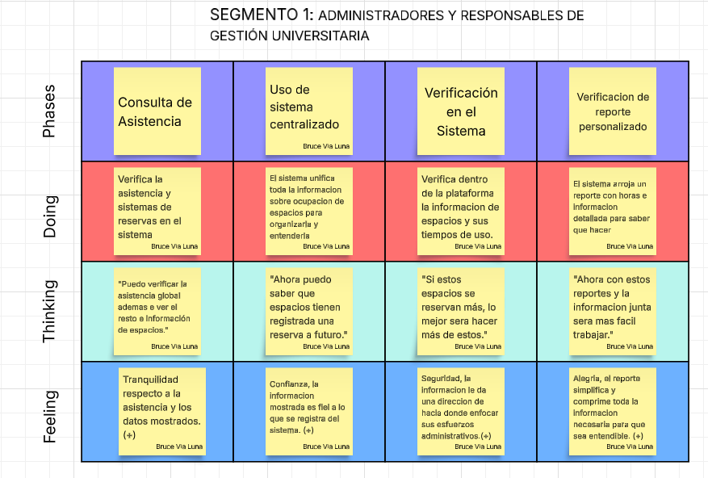</td>

<div align = center>


</div>

#### Segmento 2: Usuarios de credencial

<td align="center">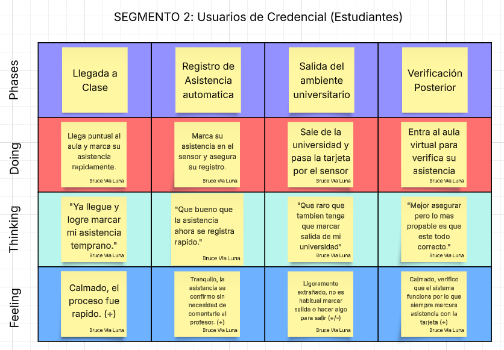</td>

<div align = center>
</div>

<td align="center">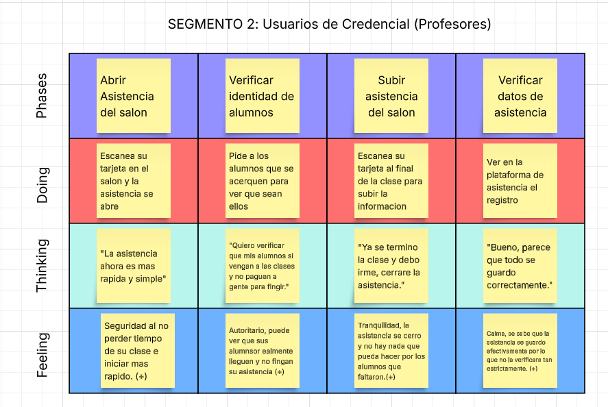</td>

<div align = center>
</div>

<td align="center">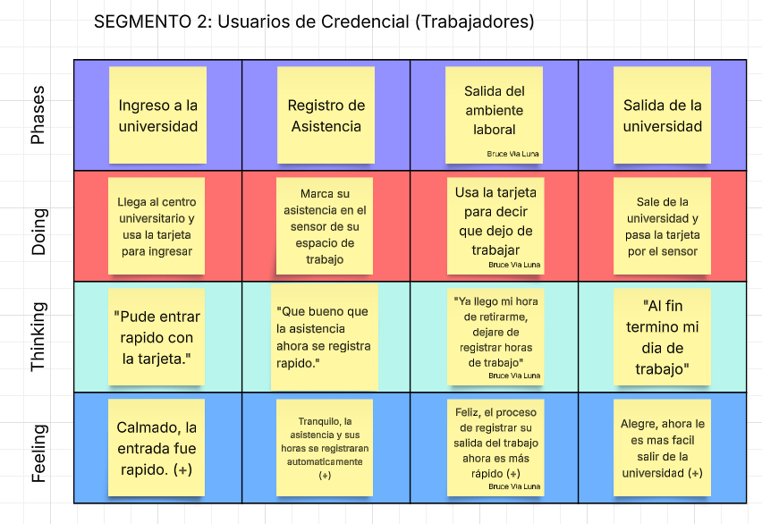</td>


## 3.2. User Stories.

En esta sección detallaremos la existencia, escenarios y diferentes User Stories que usaremos a lo largo del proyecto, para mejor orden se iniciará con la creación de 
Épicas para poder agrupar a todas las Users Stories en categorías para su posterior cumplimiento

|Epic ID | Titulo | Descripción|
|--------|--------|------------|
|EP01    | Landing Page | Como usuario de TarjePafi quiero navegar por una Landing Page con una experiencia de usuario fluida y ágil, para verificar y experimentar sus funcionalidades y el acceso a la información útil del producto.
|EP02    |Gestión de usuarios|Como usuario de TarjePafi, quiero una división entre los diferentes usuarios que utilicen el servicio de TarjePafi para separar las funcionalidades y accesos a estas.
|EP03    |Registro de Asistencia| Como usuario de TarjePafi, quiero registrar correctamente la asistencia de alumnos mediante los sensores para acelerar los procesos de asistencia.|
|EP04    |Gestión de Espacios y Servicios|Como usuario estudiante de TarjePafi, quiero activar mis reservas con la tarjeta para evitar usar otros medios que atrasen el proceso.|
|EP05    |Administración y Control| Como usuario administrativo de TarjePafi, quiero tener control administrativo para acceder y controlar las funcionalidades diseñadas de las tarjetas.|


Una vez concluidas las épicas, ahora podemos proceder a encapsular las múltiples historias de usuario que poseemos para definir los requerimientos de nuestra aplicación y saber cómo desarrollarla correctamente

| User Story ID | Título | Descripción | Criterios de aceptación | Relacionado con (Epic ID) |
| :--- | :--- | :--- | :--- | :--- |
| **US01** | Registro de Asistencia Estudiantil | Como estudiante, quiero poder pasar mi tarjeta por un lector al entrar al salón de clases, para que mi asistencia sea registrada automáticamente. | **Scenario:** Registro de asistencia en clase.<br>Dado que el estudiante pasa su tarjeta por el lector, y la clase ha comenzado, cuando la tarjeta es leída, entonces su asistencia se registra automáticamente. <br> **Scenario:** Tarjeta no registrada. Dado que el estudiante pasa una tarjeta no registrada, cuando el lector la procesa, entonces se muestra un mensaje de error y no se registra la asistencia. <br> **Scenario:** Asistencia duplicada. Dado que el estudiante ya registró su asistencia, cuando vuelve a pasar la tarjeta, entonces el sistema evita duplicar el registro.|**EP03**|
| **US02** | Confirmación de Asistencia | Como estudiante, quiero que el lector muestre un mensaje de "Asistencia tomada" en la pantalla, para que sepa que mi asistencia ha sido registrada.| **Scenario:** Mensaje de confirmación.<br>Dado que el estudiante pasa su tarjeta, y la asistencia ha sido registrada, cuando el lector procesa la tarjeta, entonces se muestra el mensaje "Asistencia tomada". | **EP03** |
| **US03** | Reserva de Espacios de Estudio | Como estudiante, quiero poder usar mi tarjeta para reservar espacios de estudio en la universidad, de modo que pueda planificar mejor mi tiempo. | **Scenario:** Reserva de un espacio.<br>Dado que el estudiante quiere reservar un espacio, y tiene su tarjeta, cuando pasa la tarjeta por el lector en el área de reserva, entonces se confirma la reserva en la pantalla. **Scenario:** Espacio no disponible.<br>Dado que el estudiante intenta reservar un espacio ocupado, cuando pasa su tarjeta, entonces se muestra un mensaje indicando que el espacio no está disponible. | **EP04** |
| **US04** | Visualización del Horario de Clase | Como estudiante, quiero que la tarjeta me muestre el horario de la clase en la pantalla del lector al pasarla, para confirmar la información antes de entrar. | **Scenario:** Confirmación del horario.<br>Dado que el estudiante pasa su tarjeta, y está registrado para una clase, cuando la tarjeta es leída, entonces el horario de la clase se muestra en el lector. | **EP04** |
| **US05** | Uso en dispositivos moviles | Como visitante, quiero un diseño de la Landing Page funcional en dispositivos moviles, para visitar la pagina desde mi celular. | **Scenario:** Visualizacion en celulares.<br>Dado que el visitante ingresa desde un dispositivo móvil, cuando navega por la Landing Page, entonces el contenido se adapta correctamente al tamaño de la pantalla. | **EP01** |
| **US06** | Acceso Multicentro con la Tarjeta | Como estudiante, quiero que la tarjeta funcione en múltiples puntos de acceso, como bibliotecas y laboratorios, para facilitar mi acceso a los recursos. | **Scenario:** Acceso a múltiples áreas.<br>Dado que el estudiante usa la tarjeta en diferentes puntos, y está autorizado para acceder, cuando pasa la tarjeta por el lector, entonces se le permite el acceso.**Scenario:** Acceso no autorizado.<br> Dado que el estudiante no tiene permisos, cuando pasa su tarjeta, entonces se deniega el acceso. | **EP04** |
| **US07** | Participación en Eventos Universitarios | Como estudiante, quiero que la tarjeta me permita acceder a eventos universitarios, para participar en actividades extracurriculares. | **Scenario:** Acceso a eventos.<br>Dado que hay un evento universitario, y el estudiante tiene su tarjeta, cuando pasa la tarjeta por el lector en la entrada, entonces se permite su entrada al evento. | **EP04** |
| **US08** | Identificación Estudiantil | Como estudiante, quiero que la tarjeta funcione como una forma de identificación, para ser reconocido fácilmente por el personal académico. | **Scenario:** Identificación al personal.<br>Dado que el estudiante presenta su tarjeta, y es abordado por el personal, cuando la tarjeta es leída, entonces su identidad es verificada. | **EP02** |
| **US09** | Sección de Preguntas Frecuentes (FAQ) | Como visitante, quiero consultar una sección de Preguntas Frecuentes en la Landing Page, para resolver dudas comunes sobre el funcionamiento y los costos de TarjePAFI de manera inmediata. | **Scenario:** Resolución de dudas autónoma.<br>Dado que el visitante tiene dudas sobre la implementación, cuando hace clic en una pregunta de la sección FAQ, entonces se despliega la respuesta correspondiente de forma clara y concisa. | **EP01** |
| **US10** | Baja de Tarjeta para Estudiantes Retirados | Como administrador, quiero poder dar de baja una tarjeta de un estudiante que se ha retirado de la universidad, para asegurar que ya no tenga acceso a los servicios. | **Scenario:** Baja de tarjeta.<br>Dado que un estudiante se ha retirado, y el administrador lo registra, cuando se da de baja la tarjeta, entonces el acceso a los servicios se cancela.<br>**Scenario:** Tarjeta desactivada.<br>Dado que el administrador da de baja una tarjeta, cuando el estudiante intenta utilizarla, entonces el sistema rechaza el acceso.<br>**Scenario:** Confirmación de baja.<br>Dado que el administrador confirma la operación, cuando se procesa la baja, entonces el estado de la tarjeta cambia a "Desactivada". | **EP05** |
| **US11** | Vinculación a Base de Datos | Como administrador, quiero que la tarjeta esté vinculada a la base de datos de estudiantes, para poder gestionar fácilmente su estado. | **Scenario:** Gestión de tarjetas.<br>Dado que la tarjeta está vinculada a un estudiante, y se actualiza la base de datos, cuando se registra un cambio, entonces la información de la tarjeta se actualiza automáticamente.<br> **Scenario:** Estudiante no encontrado.<br> Dado que la tarjeta no está vinculada a un estudiante, cuando se intenta actualizar la información, entonces el sistema muestra un mensaje de error.| **EP05** |
| **US12** | Control de Acceso en Áreas Restringidas | Como administrador, quiero que la tarjeta proporcione un mensaje en el lector cuando un estudiante accede a un área restringida, para garantizar que solo los autorizados ingresen. | **Scenario:** Control de acceso.<br>Dado que un estudiante intenta acceder a un área restringida, y su tarjeta es leída, cuando no tiene permiso, entonces se muestra un mensaje de "Acceso denegado".<br>**Scenario:** Acceso autorizado.<br> Dado que el estudiante tiene permiso para ingresar, cuando pasa su tarjeta, entonces se muestra el mensaje "Acceso concedido". | **EP05** |
| **US13** | Reactivación de Tarjetas | Como administrador, quiero tener la opción de reactivar una tarjeta si un estudiante vuelve a inscribirse, para facilitar su regreso. | **Scenario:** Reactivación de tarjeta.<br>Dado que un estudiante se reincorpora, y la tarjeta fue desactivada, cuando el administrador la reactiva, entonces el estudiante puede usarla nuevamente. | **EP05** |
| **US14** | Personalización de Permisos de Acceso | Como administrador, quiero poder personalizar los permisos de acceso de cada tarjeta según el rol, para mantener un control adecuado. | **Scenario:** Permisos de acceso.<br>Dado que el administrador personaliza los permisos, y los asigna a una tarjeta, cuando la tarjeta es leída, entonces se verifica el acceso según los permisos.<br>**Scenario:** Permiso actualizado.<br> Dado que el administrador modifica los permisos de una tarjeta, cuando guarda los cambios, entonces los nuevos permisos se aplican.<br>**Scenario:** Usuario sin permiso.<br>Dado que el usuario no tiene autorización para un área, cuando intenta ingresar, entonces el sistema rechaza el acceso. | **EP05** |
| **US15** | Desactivación Automática de Tarjetas | Como administrador, quiero que las tarjetas se desactiven automáticamente si un estudiante no completa su matrícula a tiempo, para mantener la seguridad. | **Scenario:** Desactivación automática.<br>Dado que un estudiante no completa su matrícula, y la fecha límite ha pasado, cuando el sistema verifica la matrícula, entonces la tarjeta se desactiva automáticamente.<br>**Scenario:** Matrícula completada.<br>Dado que el estudiante completa su matrícula antes de la fecha límite, cuando el sistema verifica su estado, entonces la tarjeta permanece activa. | **EP05** |
| **US16** | Registro de Asistencia Docente | Como profesor, quiero que la tarjeta guarde automáticamente la asistencia de los estudiantes que pasaron su tarjeta previamente cuando pase mi tarjeta por el lector, para ahorrar tiempo en el proceso de toma de asistencia. | **Scenario:** Registro de asistencia docente.<br>Dado que el profesor pasa su tarjeta al inicio de clase, y los estudiantes están presentes, cuando la tarjeta es leída, entonces se registra automáticamente la asistencia.<br>**Scenario:** Sin estudiantes registrados.<br> Dado que ningún estudiante pasó su tarjeta, cuando el profesor inicia la sesión, entonces el sistema informa que no existen asistencias registradas. | **EP03** |
| **US17** | Registro de Horas de Trabajo | Como profesor, quiero que al finalizar la clase, al pasar de nuevo mi tarjeta por el lector, se registre mi salida, para tener un registro completo de mis horas trabajadas. | **Scenario:** Registro de horas trabajadas.<br>Dado que el profesor pasa su tarjeta al finalizar la clase, y el lector está activo, cuando la tarjeta es leída, entonces se registra la hora de salida.<br>**Scenario:** Registro de salida.<br> Dado que el profesor registró su entrada, cuando pasa nuevamente su tarjeta al finalizar la clase, entonces se registra la hora de salida.<br>**Scenario:** Sin registro de entrada.<br> Dado que el profesor no registró su entrada, cuando intenta registrar su salida, entonces el sistema muestra un mensaje de error. | **EP03** |
| **US18** | Confirmación de Registro de Asistencia | Como profesor, quiero que el sistema muestre un mensaje que confirme que mi asistencia ha sido registrada, para tener la seguridad de que el proceso se ha completado. | **Scenario:** Confirmación de asistencia.<br>Dado que el profesor pasa su tarjeta, y la asistencia ha sido registrada, cuando el lector procesa la tarjeta, entonces se muestra un mensaje de confirmación. | **EP03** |
| **US19** | Consulta de Horas Trabajadas | Como trabajador, quiero que el lector muestre mis horas acumuladas de trabajo al final de cada semana, para poder revisar y gestionar mejor mi tiempo. | **Scenario:** Revisión de horas.<br>Dado que el trabajador pasa su tarjeta, y el lector tiene acceso a datos acumulados, cuando la tarjeta sea leída, entonces se muestran las horas acumuladas de trabajo.<br>**Scenario:** Consulta sin registros.<br>Dado que el trabajador no tiene horas registradas, cuando consulta su resumen semanal, entonces el sistema indica que no existen registros. | **EP03** |
| **US20** | Historial de Asistencia Docente | Como profesor, quiero que se registre la hora y fecha exacta en que escaneo mi tarjeta, para tener un historial preciso de mi asistencia. | **Scenario:** Registro de asistencia docente.<br>Dado que el profesor escanea su tarjeta, y se registra la hora y fecha, cuando se consulta el historial, entonces se muestra el registro de asistencia.<br>**Scenario:** Historial vacío.<br> Dado que no existen registros, cuando el profesor consulta su historial, entonces se muestra un mensaje indicando que no hay información disponible. | **EP03** |
| **US21** | Registro de Asistencia en Reuniones | Como profesor, quiero que mi tarjeta me permita marcar mi asistencia a reuniones o capacitaciones, para llevar un control integral de mi tiempo. | **Scenario:** Registro en reuniones.<br>Dado que el profesor asiste a una reunión, y pasa su tarjeta al inicio, cuando la tarjeta es leída, entonces se registra su asistencia a la reunión. | **EP03** |
| **US22** | Registro de Llegada a Clases | Como profesor, quiero que, al pasar mi tarjeta por el lector al inicio de la clase, se registre automáticamente mi llegada, para llevar un control de mis horas de trabajo. | **Scenario:** Registro de llegada.<br>Dado que el profesor pasa su tarjeta al inicio de la clase, y el lector está activo, cuando la tarjeta es leída, entonces se registra la hora de llegada.<br>**Scenario:** Fuera del horario.<br>Dado que no existe una clase programada, cuando el profesor pasa su tarjeta, entonces el sistema muestra un mensaje informativo. | **EP03** |
| **US23** | Registro de Duración de Clases | Como profesor, quiero que, al pasar la tarjeta por el lector, se registre automáticamente la duración de la clase, para tener un control más preciso sobre el tiempo de enseñanza. | **Scenario:** Duración de la clase.<br>Dado que el profesor pasa su tarjeta al inicio y al final, y el lector registra ambas, cuando se procesa la información, entonces se calcula la duración de la clase. | **EP03** |
| **US24** | Cierre de turno | Como trabajador, quiero que la tarjeta sirva como herramienta de registro e salida del trabajo, para llevar un registro exacto de mis horas trabajadas | **Scenario:** Mensajes de salida.<br>Dado que un trabajador pasa su tarjeta al salir de su espacio de trabajo, y el lector está activo, cuando se lea la tarjeta, entonces contaran las horas desde que paso la tarjeta en su entrada hasta ese momento.<br>**Scenario:** Salida duplicada.<br>Dado que el trabajador ya registró su salida, cuando vuelve a pasar su tarjeta, entonces el sistema evita duplicar el registro. | **EP03** |
| **US25** | Registro de Curso y Materia | Como profesor, quiero que, al escanear mi tarjeta, se registre automáticamente el nombre del curso y la materia que imparto, para llevar un control más detallado. | **Scenario:** Registro de curso.<br>Dado que el profesor escanea su tarjeta, y está vinculado a un curso específico, cuando se procesa la lectura, entonces se registra automáticamente el curso y la materia.<br>**Scenario:** Sin curso asignado.<br>Dado que el profesor no tiene un curso asignado, cuando escanea su tarjeta, entonces el sistema muestra un mensaje informativo. | **EP03** |
| **US26** | Visualización de Funcionalidades | Como visitante de la web, quiero ver una sección clara con las funcionalidades principales de TarjePAFI en la Landing Page, para entender rápidamente qué ofrece el producto antes de adquirirlo. | **Scenario:** Exploración de características.<br>Dado que el visitante entra a la Landing Page, cuando navega hacia la sección de beneficios, entonces puede leer un resumen claro de las funciones del sistema. | **EP01** |
| **US27** | Acceso a Contacto y Soporte | Como visitante, quiero tener un botón de contacto visible en la Landing Page, para poder enviar mis dudas al equipo de TarjePAFI de manera rápida. | **Scenario:** Envío de consultas.<br>Dado que el usuario tiene dudas sobre el servicio, cuando hace clic en el botón de contacto, entonces se despliega un formulario o enlace directo para comunicarse con el equipo. | **EP01** |
| **US28** | Liberacion de Reserva | Como administrador, quiero que los espacios reservados se liberen luego de 10 minutos, para que sean usados por un estudiante usuario que quiera reservar el espacio | **Scenario:** Espacio liberao.<br>Dado que el estudiante no llegue a tiempo a su reserva, cuando pasen 10 minutos desde su inicio, entonces el sistema liberar automaticamente el espacio resevrado. | **EP04** |

## 3.3. Impact Mapping.

<br>

<br>


## 3.4. Product Backlog.

| # Orden | User Story Id | Título | Descripción | Story Points (1/2/3/5/8) |
| :---: | :--- | :--- | :--- | :---: |
| **1** | **US26** | Visualización de Funcionalidades | Como visitante de la web, quiero ver una sección clara con las funcionalidades principales de TarjePafi en la Landing Page, para entender rápidamente qué ofrece el producto antes de adquirirlo. | 2 |
| **2** | **US27** | Acceso a Contacto y Soporte | Como usuario interesado, quiero tener un botón de contacto visible en la Landing Page, para poder enviar mis dudas al equipo de TarjePafi de manera rápida. | 2 |
| **3** | **US01** | Registro de Asistencia Estudiantil | Como estudiante, quiero poder pasar mi tarjeta por un lector al entrar al salón de clases, para que mi asistencia sea registrada automáticamente. | 5 |
| **4** | **US02** | Confirmación de Asistencia | Como estudiante, quiero que el lector muestre un mensaje de "Asistencia tomada" en la pantalla, para que sepa que mi asistencia ha sido registrada. | 2 |
| **5** | **US16** | Registro de Asistencia Docente | Como profesor, quiero que la tarjeta registre automáticamente la asistencia de los estudiantes al pasarla por el lector, para ahorrar tiempo en el proceso de toma de asistencia. | 5 |
| **6** | **US18** | Confirmación de Registro de Asistencia Docente | Como profesor, quiero que el sistema muestre un mensaje que confirme que mi asistencia ha sido registrada, para tener la seguridad de que el proceso se ha completado. | 2 |
| **7** | **US22** | Registro de Llegada a Clases | Como profesor, quiero que, al pasar mi tarjeta por el lector al inicio de la clase, se registre automáticamente mi llegada, para llevar un control de mis horas de trabajo. | 3 |
| **8** | **US25** | Registro de Curso y Materia | Como profesor, quiero que, al escanear mi tarjeta, se registre automáticamente el nombre del curso y la materia que imparto, para llevar un control más detallado. | 3 |
| **9** | **US03** | Reserva y Activación de Espacios de Estudio | Como estudiante, quiero usar mi tarjeta para acceder a mis reservas para usarlas y confirmar mi presencia física en el cubículo. | 5 |
| **10** | **US06** | Acceso Multicentro con la Tarjeta | Como estudiante, quiero que la tarjeta funcione en múltiples puntos de acceso, como bibliotecas y laboratorios, para facilitar mi acceso a los recursos. | 3 |
| **11** | **US19** | Visualización de Horas Acumuladas en Espacios | Como administrador, quiero ver qué tantas horas se usan diferentes espacios, para poder revisar y gestionar mejor los recursos. | 3 |
| **12** | **US23** | Registro de Duración de Clases | Como profesor, quiero que, al pasar la tarjeta por el lector al inicio y fin, se registre automáticamente la duración de la clase, para tener un control más preciso sobre el tiempo de enseñanza. | 3 |
| **13** | **US20** | Historial de Asistencia Docente | Como profesor, quiero que se registre la hora y fecha exacta en que escaneo mi tarjeta, para tener un historial preciso de mi asistencia. | 3 |
| **14** | **US17** | Registro de Horas de Trabajo del Personal | Como trabajador, quiero que al finalizar la jornada, al pasar de nuevo mi tarjeta por el lector, se registre mi salida, para tener un registro completo de mis horas trabajadas. | 3 |
| **15** | **US21** | Registro de Asistencia en Reuniones | Como profesor, quiero que mi tarjeta me permita marcar mi asistencia a reuniones o capacitaciones, para llevar un control integral de mi tiempo. | 2 |
| **16** | **US24** | Control Visual de Entrada y Salida | Como profesor, quiero que la plataforma muestre una foto cuando un estudiante registra su asistencia en la clase, para llevar un registro claro de su presencia. | 3 |
| **17** | **US07** | Participación en Eventos Universitarios | Como estudiante, quiero que la tarjeta me permita acceder a eventos universitarios, para participar en actividades extracurriculares. | 3 |
| **18** | **US08** | Identificación Estudiantil | Como estudiante, quiero que la tarjeta funcione como una forma de identificación, para ser reconocido fácilmente por el personal académico. | 2 |
| **19** | **US04** | Visualización de Reportes Administrativos | Como personal administrativo, quiero que la página muestre reportes administrativos con la información recolectada para administrar y tener datos útiles de afluencia. | 5 |
| **20** | **US11** | Vinculación a Base de Datos | Como administrador, quiero que la tarjeta esté vinculada a la base de datos de estudiantes, para poder gestionar fácilmente su estado. | 3 |
| **21** | **US14** | Personalización de Permisos de Acceso | Como administrador, quiero poder personalizar los permisos de acceso de cada tarjeta según el rol, para mantener un control adecuado de ambientes. | 3 |
| **22** | **US12** | Control de Acceso en Áreas Restringidas | Como administrador, quiero que la tarjeta proporcione un mensaje en el lector cuando un estudiante accede a un área restringida, para garantizar que solo los autorizados ingresen. | 3 |
| **23** | **US10** | Baja de Tarjeta para Estudiantes Retirados | Como administrador, quiero poder dar de baja una tarjeta de un estudiante que se ha retirado de la universidad, para asegurar que ya no tenga acceso a los servicios. | 2 |
| **24** | **US13** | Reactivación de Tarjetas | Como administrador, quiero tener la opción de reactivar una tarjeta si un estudiante vuelve a inscribirse, para facilitar su regreso. | 2 |
| **25** | **US15** | Desactivación Automática de Tarjetas | Como administrador, quiero que las tarjetas se desactiven automáticamente si un estudiante no completa su matrícula a tiempo, para mantener la seguridad. | 5 |
| **26** | **US05** | Diseño Atractivo de la Tarjeta | Como estudiante, quiero que la tarjeta tenga un diseño atractivo y fácil de identificar, para que me sienta orgulloso de usarla. | 1 |
| **27** | **US09** | Durabilidad y Calidad Física de la Tarjeta | Como estudiante, quiero que la tarjeta esté diseñada para ser resistente al desgaste, para que pueda usarla durante todo el año académico sin problemas. | 1 |

<br>

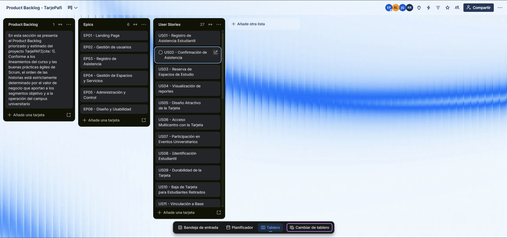<br>


Link de trello: `https://trello.com/invite/b/6aaee560244f819349d961ca/ATTIbfb18f52e094ba23c88678615654fa56358E136D/product-backlog-tarjepafi`

# Capítulo 4: Strategic-Level Software Design

## 4.1. Strategic-Level Attribute-Driven Design

### 4.1.1. Design Purpose

El propósito del diseño arquitectónico de TarjePafi es construir una solución tecnológica robusta y extensible que permita a las universidades digitalizar y automatizar los procesos de registro de asistencia, control de accesos y gestión de reservas de espacios mediante credenciales físicas NFC y lectores IoT, reduciendo la dependencia de procesos manuales como el pase de lista docente y los métodos tradicionales de control de acceso. La solución se apoya en una arquitectura basada en Domain-Driven Design con bounded contexts claramente delimitados, desarrollada sobre un backend en Java 25 con Spring Boot, al cual se integra una capa de comunicación asíncrona mediante RabbitMQ como message bus para el procesamiento de eventos de lectura NFC.

Esta elección arquitectónica responde a la necesidad de sostener un sistema donde múltiples puntos de lectura distribuidos por el campus como ingresos principales, aulas, cubículos de estudio y puntos de personal operativo generan eventos de manera simultánea, especialmente en momentos de alta concurrencia como el inicio de clases. La organización en bounded contexts independientes permite incorporar y evolucionar cada funcionalidad sin modificar la lógica de negocio de las demás, garantizando mantenibilidad y escalabilidad progresiva del sistema.

Desde el lado del estudiante y el docente, la interacción con el sistema se limita al uso de la tarjeta física NFC sobre los lectores ESP32 con módulo MFRC522, sin requerir intervención manual adicional: cada lectura registra automáticamente la asistencia, activa una reserva o valida un acceso. Desde el lado del personal administrativo, la plataforma web en Angular centraliza la gestión de tarjetas, la configuración de permisos de acceso y la visualización de reportes con la información recolectada por los lectores. Ambos entornos consumen la misma API REST y base de datos PostgreSQL, asegurando coherencia de información entre todos los actores del sistema.

El componente IoT introduce una arquitectura de comunicación basada en un message bus mediante RabbitMQ, permitiendo que los lectores NFC publiquen los eventos de lectura de manera desacoplada, tolerante a fallos y escalable hacia el backend. En lugar de depender de una comunicación directa y síncrona entre cada lector y la API, los dispositivos publican sus lecturas en una cola de mensajería, desde donde el backend las consume, valida y persiste. Esta decisión mejora la disponibilidad del sistema ante caídas temporales del backend, absorbe los picos de carga generados por la concurrencia de lecturas al inicio de clases, y permite escalar horizontalmente el procesamiento agregando nuevas instancias consumidoras sin modificar el firmware de los lectores.

Este diseño busca garantizar atributos clave como disponibilidad ante alta concurrencia, tiempo de respuesta adecuado para el registro de asistencia en tiempo real, mantenibilidad por módulos y escalabilidad funcional a medida que se incorporen nuevos puntos de lectura.

### 4.1.2. Attribute-Driven Design Inputs

#### 4.1.2.1. Primary Functionality

Estas historias fueron seleccionadas porque representan los requisitos con mayor impacto en la arquitectura del sistema.


| Epic / Story ID | Título | Descripción | Criterios de Aceptación | Epic ID |
|-----------------|--------|-------------|-------------------------|---------|
| **US01** | Registro de Asistencia Estudiantil | Como estudiante, quiero poder pasar mi tarjeta por un lector al entrar al salón de clases, para que mi asistencia sea registrada automáticamente. | **Scenario:** Registro de asistencia en clase.<br>Dado que el estudiante pasa su tarjeta por el lector, y la clase ha comenzado, cuando la tarjeta es leída, entonces su asistencia se registra automáticamente. | **EP03** |
| **US02** | Confirmación de Asistencia | Como estudiante, quiero que el lector muestre un mensaje de "Asistencia tomada" en la pantalla, para que sepa que mi asistencia ha sido registrada. | **Scenario:** Mensaje de confirmación.<br>Dado que el estudiante pasa su tarjeta, y la asistencia ha sido registrada, cuando el lector procesa la tarjeta, entonces se muestra el mensaje "Asistencia tomada". | **EP03** |
| **US16** | Registro de Asistencia Docente | Como profesor, quiero que la tarjeta registre automáticamente la asistencia de los estudiantes al pasarla por el lector, para ahorrar tiempo en el proceso de toma de asistencia. | **Scenario:** Registro de asistencia docente.<br>Dado que el profesor pasa su tarjeta al inicio de clase, y los estudiantes están presentes, cuando la tarjeta es leída, entonces se registra automáticamente la asistencia. | **EP03** |
| **US03** | Reserva de Espacios de Estudio | Como estudiante, quiero usar mi tarjeta para acceder a mis reservas para usarlas | **Scenario:** Activacion e una reserva.<br>Dado que el estudiante quiere activar la reserva de un espacio, y tiene su tarjeta, cuando pasa la tarjeta por el lector en el área de reserva, entonces se activara la reserva. | **EP04** |
| **US08** | Identificación Estudiantil | Como estudiante, quiero que la tarjeta funcione como una forma de identificación, para ser reconocido fácilmente por el personal académico. | **Scenario:** Identificación al personal.<br>Dado que el estudiante presenta su tarjeta, y es abordado por el personal, cuando la tarjeta es leída, entonces su identidad es verificada. | **EP02** |
| **US10** | Baja de Tarjeta para Estudiantes Retirados | Como administrador, quiero poder dar de baja una tarjeta de un estudiante que se ha retirado de la universidad, para asegurar que ya no tenga acceso a los servicios. | **Scenario:** Baja de tarjeta.<br>Dado que un estudiante se ha retirado, y el administrador lo registra, cuando se da de baja la tarjeta, entonces el acceso a los servicios se cancela. | **EP05** |
| **US12** | Control de Acceso en Áreas Restringidas | Como administrador, quiero que la tarjeta proporcione un mensaje en el lector cuando un estudiante accede a un área restringida, para garantizar que solo los autorizados ingresen. | **Scenario:** Control de acceso.<br>Dado que un estudiante intenta acceder a un área restringida, y su tarjeta es leída, cuando no tiene permiso, entonces se muestra un mensaje de "Acceso denegado". | **EP05** |
| **US04** | Visualización de reportes | Como personal administrativo, quiero que la página muestre reportes administrativos con la información recolectada para administrar y tener datos útiles. | **Scenario:** Ver el reporte.<br>Dado que el administrador ingresa a la página, y está registrado, cuando ingrese a la sección de "Ver Reporte", entonces verá un reporte que use las horas recolectadas y de sugerencias. | **EP05** |

#### 4.1.2.2. Quality attribute Scenarios


| ID | Atributo | Fuente | Estímulo | Artefacto | Entorno | Respuesta | Medida |
|----|----------|--------|----------|-----------|---------|-----------|--------|
| QAS01 | Rendimiento | Estudiante/Docente | Lectura de tarjeta NFC en un lector | API de asistencia, RabbitMQ | Operación normal | El evento se publica en la cola y se procesa hasta persistir el registro de asistencia | ≤ 1 segundo desde la lectura hasta la confirmación |
| QAS02 | Rendimiento | Lectores NFC (ESP32) | Envío concurrente de eventos de lectura al inicio de clases | Cola RabbitMQ, backend consumer | Alta carga, hora pico | El sistema encola y procesa los eventos sin bloquear ni perder mensajes | Soporte ≥ 200 lecturas/minuto sin degradar el tiempo de respuesta |
| QAS03 | Rendimiento | Personal administrativo | Solicitud de reporte de asistencia/aforo | API, base de datos | Operación normal | Retorna reporte consolidado | ≤ 2 segundos de respuesta |
| QAS04 | Confiabilidad | Backend | Caída temporal del servicio backend | RabbitMQ | Falla interna | Los eventos de lectura NFC quedan retenidos en la cola sin pérdida | 0% de eventos perdidos ante caída ≤ 5 minutos |
| QAS05 | Confiabilidad | Lector NFC defectuoso | Envío de un evento con formato inválido o tarjeta no registrada | Consumer de eventos | Operación normal | El sistema rechaza y descarta el evento sin afectar el procesamiento de los demás | 100% de eventos inválidos detectados y rechazados |
| QAS06 | Confiabilidad | Backend | Procesamiento repetido o reintento de un mismo evento de lectura | Consumer, base de datos | Operación normal | Se evita el registro duplicado de asistencia o acceso | 0 duplicados por evento de lectura |
| QAS07 | Disponibilidad | Lectores NFC (ESP32) | Envío continuo de eventos durante horario académico | API Backend, RabbitMQ | Operación 24/7 | El sistema permanece accesible para recibir y encolar eventos | Disponibilidad ≥ 99% |
| QAS08 | Disponibilidad | Personal administrativo | Consulta al dashboard web | API Backend | Operación normal | El sistema responde o muestra estado degradado controlado | Disponibilidad ≥ 99%, fallback ≤ 2 segundos |
| QAS09 | Seguridad | Usuario no autenticado | Intento de acceso al módulo administrativo | API Backend | Operación normal | Bloqueo y redirección al login | 100% de endpoints protegidos |
| QAS10 | Seguridad | Tarjeta dada de baja | Intento de lectura con una tarjeta desactivada | API de asistencia/accesos | Operación normal | Se deniega el registro de asistencia o acceso | 100% de tarjetas dadas de baja bloqueadas en el primer intento |
| QAS11 | Escalabilidad | Crecimiento del campus | Aumento de puntos de lectura NFC instalados | RabbitMQ, backend consumer | Alta carga | El sistema escala horizontalmente agregando instancias consumidoras | Soporte ≥ 500 lectores concurrentes |
| QAS12 | Escalabilidad | Usuarios concurrentes | Uso simultáneo del dashboard administrativo | Backend | Periodo pico de uso | Mantiene el rendimiento sin degradación | Usuarios concurrentes ≥ 100 |

#### 4.1.2.3. Constraints

Las restricciones del sistema representan directrices técnicas, organizacionales, normativas y de negocio de carácter no negociable impuestas por el entorno operativo universitario y los requerimientos arquitectónicos del proyecto. Para TarjePAFI, estas limitaciones delimitan el alcance tecnológico de la solución: establecen la exclusividad de una plataforma web responsive desarrollada sobre Angular, el despliegue centralizado en Microsoft Azure, la persistencia transaccional en PostgreSQL, el desacoplamiento asíncrono de lecturas IoT vía RabbitMQ, la integración de servicios de correo para la gestión de espacios y el cumplimiento estricto del marco legal peruano de protección de datos personales.

| Technical Story ID | Título | Descripción | Criterios de Aceptación | Relacionado con (Epic ID) |
| :--- | :--- | :--- | :--- | :--- |
| **TS-CON01** | Restricción de Backend y Despliegue Cloud | Como desarrollador, debo implementar la arquitectura de servicios backend en Java con el framework Spring Boot y desplegarla en Microsoft Azure para cumplir con la infraestructura cloud establecida. | **Escenario:** Validación del servicio backend en Microsoft Azure.<br>**Dado que** los módulos de la aplicación están construidos en Java con Spring Boot,<br>**Cuando** se efectúa el despliegue hacia Azure App Services,<br>**Entonces** los endpoints de la API quedan operativos bajo HTTPS respondiendo con códigos de estado HTTP estándar. | **EP05** |
| **TS-CON02** | Restricción de Frontend Web y Backend| Como desarrollador, debo desarrollar la aplicación web administrativa en Angular y Spring Boot, asegurando su correcto funcionamiento y comunicación. | **Escenario:** Correcto funcionamiento.<br>**Dado que** la plataforma web está construida sobre Angular y Spring Boot,<br>**Cuando** el usuario administrativo accede a la aplicación desde su navegador,<br>**Entonces** la interfaz se debe funcionar correctamente sin errores. | **EP05** |
| **TS-CON03** | Restricción de Landing Page, Accesibilidad e i18n | Como desarrollador, debo implementar la Landing Page del producto utilizando HTML5, CSS3 y JavaScript, soportando internacionalización y pautas de accesibilidad. | **Escenario:** Soporte multiidioma y accesibilidad.<br>**Dado que** un visitante ingresa al Landing Page,<br>**Cuando** consulta el sitio web institucional,<br>**Entonces** el contenido se presenta en inglés (`en_US`) por defecto con alternancia a español latinoamericano (`es_419`)| **EP01** |
| **TS-CON04** | Restricción de Persistencia en Base de Datos Relacional | Como desarrollador, debo utilizar PostgreSQL alojado en Microsoft Azure como motor de base de datos relacional para garantizar la integridad transaccional de los datos | **Escenario:** Consistencia en operaciones transaccionales.<br>**Dado que** se registran marcas de asistencia académica y validaciones de cubículos,<br>**Cuando** se ejecutan las transacciones de persistencia en la base de datos PostgreSQL,<br>**Entonces** la base de datos asegura la integridad de los registros. | **EP05** |
| **TS-CON05** | Restricción de Autenticación y Cifrado | Como desarrollador, debo implementar autenticación basada en tokens JWT para correos administrativos | **Escenario:** Autenticación administrativa con JWT.<br>**Dado que** un usuario administrativo envía sus credenciales institucionales válidas,<br>**Cuando** el servidor procesa la autenticación,<br>**Entonces** retorna un token JWT. | **EP02** |
| **TS-CON06** | Restricción de Tolerancia a Fallos en Hardware IoT | Como desarrollador de hardware, debo implementar un buffer de almacenamiento local en los lectores ESP32 para retener lecturas NFC ante cortes de red. | **Escenario:** Lectura offline por pérdida de conectividad.<br>**Dado que** un lector ESP32 detecta una tarjeta NFC y no tiene conexión de red con el servidor,<br>**Cuando** se realiza la lectura física en el aula o cubículo,<br>**Entonces** el dispositivo almacena la lectura en su memoria local temporal y la envía automáticamente en cuanto la red se restablece. | **EP03** |
| **TS-CON07** | Restricción de Notificación Externa por Cancelación | Como desarrollador, debo integrar un servicio externo de correo electrónico para notificar automáticamente la liberación de espacios de estudio no ocupados. | **Escenario:** Cancelación automática a los 10 minutos.<br>**Dado que** un estudiante reservó un cubículo y transcurren 10 minutos sin registrar su tarjeta en la mesa,<br>**Cuando** el job del sistema cancela la reserva y libera el espacio,<br>**Entonces** se despacha un correo electrónico de notificación al estudiante mediante la API del servicio de mensajería externo. | **EP04** |
| **TS-CON08** | Restricción de Cumplimiento Legal y Privacidad | Como desarrollador, debo asegurar que la recolección y tratamiento de marcas de identidad cumpla con la Ley N° 29733 (Ley de Protección de Datos Personales del Perú). | **Escenario:** Protección de datos personales de la comunidad universitaria.<br>**Dado que** el sistema procesa datos de asistencia, accesos e identidad de estudiantes y docentes,<br>**Cuando** la información es almacenada y consultada,<br>**Entonces** se restringe el acceso a personal no autorizado y se prohíbe la exposición de datos sensibles sin consentimiento explícito. | **EP02** |
| **TS-CON09** | Restricción de Desacoplamiento con Broker de Mensajería | Como desarrollador, debo utilizar RabbitMQ como message broker para desacoplar el procesamiento de lecturas masivas entre los dispositivos IoT y el backend. | **Escenario:** Procesamiento asíncrono de lecturas concurrentes.<br>**Dado que** múltiples lectores NFC transmiten eventos de lectura de forma simultánea,<br>**Cuando** los mensajes llegan al broker RabbitMQ,<br>**Entonces** los eventos quedan encolados para su consumo controlado por los servicios backend sin saturar la base de datos. | **EP03** |

### 4.1.3. Architectural Drivers Backlog

El Architectural Drivers Backlog de TarjePAFI es el resultado de un proceso iterativo de análisis arquitectónico fundamentado en la metodología del Quality Attribute Workshop (QAW). Durante esta reunión, el equipo de trabajo expuso las metas estratégicas de digitalización del campus universitario, la erradicación de cuellos de botella en la toma de asistencia y la eliminación del acaparamiento en las áreas de estudio. Paralelamente, se analizaron las implicancias técnicas asociadas a la absorción de picos de carga en el inicio de clases, la tolerancia a fallos ante caídas de conectividad y la persistencia confiable de datos sobre Microsoft Azure.

A través de sesiones de lluvia de ideas y matrices de priorización participativa, el equipo consolidó los tres pilares del diseño arquitectónico: los Functional Drivers, los Quality Attribute Drivers y los Constraints técnicos y regulatorios impuestos por el entorno académico y legal. La priorización se estableció cruzando la importancia para los stakeholders institucionales con el nivel de impacto en la complejidad técnica de la solución, ubicando en la parte superior aquellos requerimientos de alta criticidad funcional y alto desafío de implementación.

| Driver ID | Título de Driver | Descripción | Importancia para Stakeholders | Impacto en Architecture Technical Complexity |
| :--- | :--- | :--- | :--- | :--- |
| **AD01** | Ingesta masiva y procesamiento concurrente de eventos NFC | La arquitectura debe recibir datos masivos de lecturas generadas simultáneamente al inicio de los bloques horarios de clases, procesando al menos 200 lecturas por minuto sin empeorar el servicio ni generar pérdidas de eventos de asistencia o acceso. | High | High |
| **AD02** | Tolerancia a fallos y almacenamiento offline en hardware IoT | Los lectores ESP32 deben contar con un mecanismo de almacenamiento temporal local para retener lecturas NFC ante caídas de la red WiFi del campus, sincronizando automáticamente los datos con el servidor en cuanto la conectividad se restablece. | High | High |
| **AD03** | Gestión y liberación dinámica de espacios de estudio | El sistema debe verificar la presencia física de los estudiantes en las mesas de cubículos y ejecutar un proceso automatizado que libere el espacio si no se registra la credencial dentro de los primeros 10 minutos de la reserva. | High | High |
| **AD04** | Registro y confirmación de asistencia en tiempo casi real | La solución debe registrar la marca de presencia académica y confirmar el estado visual al usuario en un tiempo inferior o igual a 1 segundo desde que la tarjeta hace contacto con el lector físico. | High | High |
| **AD05** | Desacoplamiento asíncrono mediante message broker | La ingesta de datos entre los lectores IoT físicos y los servicios del backend debe realizarse mediante RabbitMQ, garantizando que el flujo de mensajes quede encolado y protegido contra caídas o saturación transaccional de la base de datos. | High | High |
| **AD06** | Alta disponibilidad operativa del ecosistema de campus | Los servicios centrales de control de acceso, asistencia y validación deben mantener una disponibilidad mínima mensual del 99%, asegurando operatividad continua durante toda la jornada académica universitaria. | High | High |
| **AD07** | Escalabilidad horizontal de puntos de lectura | La infraestructura backend y el sistema de colas deben permitir el crecimiento progresivo de nuevos puntos de lectura (aulas, laboratorios, cubículos e ingresos) sin requerir rediseños estructurales ni impactar la latencia. | High | High |
| **AD08** | Control de accesos físicos y bloqueo de credenciales no autorizadas | El sistema debe validar de manera instantánea la legitimidad de cada credencial física en torniquetes y puertas restringidas, denegando el acceso y registrando el evento en el 100% de los intentos con tarjetas dadas de baja. | High | Medium |
| **AD09** | Seguridad, autenticación stateless y protección de endpoints | El acceso a los recursos y APIs de gestión debe estar regulado mediante tokens JWT firmados, asegurando que cada petición verifique permisos administrativos válidos y viaje bajo canales seguros cifrados con TLS. | High | Medium |
| **AD10** | Integridad transaccional y persistencia relacional | El almacenamiento de asistencias, historial de accesos y estado de reservas debe garantizar propiedades ACID y consistencia referencial mediante PostgreSQL sobre Microsoft Azure. | High | Medium |
| **AD11** | Notificación externa automática ante cancelaciones | La solución debe integrarse con un servicio externo de mensajería electrónica para despachar notificaciones inmediatas por correo al estudiante cuando su reserva es cancelada por inasistencia. | High | Medium |
| **AD12** | Centralización analítica y métricas de afluencia del campus | La plataforma debe procesar los eventos de lectura para generar reportes y tableros con métricas históricas de afluencia, apoyando la toma de decisiones sobre asignación de infraestructura y personal operativo. | High | Medium |
| **AD13** | Confiabilidad y prevención de registros duplicados | El backend debe implementar validaciones de idempotencia sobre los eventos de lectura consumidos de la cola, garantizando 0 registros duplicados de asistencia ante reintentos de red o múltiples pasadas de tarjeta. | High | Medium |
| **AD14** | Cumplimiento legal de protección de datos personales | El almacenamiento y tratamiento de marcas de identidad, horarios y ubicación física debe regirse de forma obligatoria por la Ley N° 29733 (Ley de Protección de Datos Personales del Perú) y su reglamento. | High | Medium |
| **AD15** | Despliegue sobre infraestructura Cloud en Microsoft Azure | El backend desarrollado en Spring Boot, el message broker y la base de datos relacional deben estar alojados y orquestados sobre servicios gestionados en Microsoft Azure. | High | Medium |
| **AD16** | Compatibilidad multiplataforma en navegadores modernos | La aplicación web debe ofrecer una visualización y rendimiento homogéneo en los navegadores web modernos de mayor difusión (Google Chrome, Microsoft Edge, Mozilla Firefox y Safari). | Medium | Low |
| **AD17** | Landing Page accesible y con soporte de internacionalización | El portal informativo institucional debe desarrollarse en HTML5, CSS3 y JavaScript vanilla, incorporando soporte de internacionalización y accesibilidad web. | Medium | Low |

Sustento de Priorización del Backlog

**Concurrencia, asincronía y desacoplamiento:** Reciben la máxima prioridad arquitectónica debido a la naturaleza física del campus universitario. En las horas punta de cambio de clase (por ejemplo, a las 7:00 a. m. o 1:00 p. m.), cientos de estudiantes interactúan con los lectores de forma casi simultánea. El uso de RabbitMQ como intermediario y el buffer offline en los ESP32 evitan que caídas temporales de red provoquen pérdidas de datos o cuellos de botella en la base de datos.

**Liberación de espacios y tiempo casi real:** Representan el valor diferencial del negocio frente a los métodos convencionales. La validación inmediata en aula evita la pérdida de minutos lectivos para el docente, mientras que el monitoreo activo con liberación automática a los 10 minutos soluciona directamente el problema recurrente de cubículos reservados pero desocupados.

**Seguridad, legalidad y base relacional:** Garantizan la viabilidad operativa y regulatoria del sistema dentro de la universidad. La implementación de tokens JWT, transacciones ACID en PostgreSQL y la adhesión estricta a la Ley N° 29733 salvaguardan la privacidad de los datos personales de la comunidad estudiantil.

### 4.1.4. Architectural Design Decisions

En esta sección se detalla el proceso sistemático aplicado por el equipo de TarjePAFI para evaluar, descartar y seleccionar las tácticas y patrones arquitectónicos que dan soporte a los requerimientos del sistema. La toma de decisiones siguió las fases del *Quality Attribute Workshop* (QAW), analizando en cada iteración los *Architectural Drivers* priorizados, debatiendo alternativas tecnológicas y contrastando ventajas frente a desventajas técnicas para evitar la sobreingeniería en las etapas iniciales del proyecto.

Para cada decisión arquitectónica clave, se formuló una matriz de evaluación (*Candidate Pattern Evaluation Matrix*) en la que se contrastan tres patrones candidatos representativos, documentando sus respectivos pros y contras hasta justificar el patrón seleccionado.

#### Candidate Pattern Evaluation Matrix

| Driver ID | Título de Driver | Patrón 1 (Elegido) | Patrón 2 | Patrón 3 |
| :--- | :--- | :--- | :--- | :--- |
| **D01** | **Comunicación e Ingesta de Eventos IoT** | **Message Broker Asíncrono (RabbitMQ)**<br><br>**Pro:** Desacopla por completo la captura en hardware del procesamiento backend; absorbe ráfagas masivas de concurrencia al inicio de clases mediante colas de retención y garantiza tolerancia a fallos si la base de datos o el backend sufren saturación temporal.<br><br>**Contra:** Incorpora un componente adicional de infraestructura que requiere configuración, monitoreo y consumo de recursos en la nube. | **Comunicación Síncrona Punto a Punto (REST API Directa)**<br><br>**Pro:** Implementación simple y directa; bajo costo cognitivo para pruebas unitarias y monitoreo inicial mediante herramientas como Postman.<br><br>**Contra:** Alto acoplamiento temporal; si el servicio backend o la base de datos se saturan durante el pico de asistencia, las peticiones HTTP fallan por timeout, bloqueando las lecturas en los lectores físicos ESP32. | **Conexiones Persistentes Bidireccionales (WebSockets)**<br><br>**Pro:** Establece canales de comunicación bidireccionales continuos y de baja latencia entre clientes y servidor.<br><br>**Contra:** Demanda un consumo excesivo de memoria y sockets de red abiertos en los microcontroladores ESP32, requiriendo mecanismos complejos de reconexión ante fluctuaciones de la red WiFi del campus. |
| **D02** | **Gestión de Identidades y Autenticación (IAM)** | **Autenticación con Tokens JWT (Spring Security)**<br><br>**Pro:** La validación criptográfica de identidad y roles administrativos se realiza en memoria sin consultar la base de datos en cada petición HTTP.<br><br>**Contra:** La invalidación inmediata de un token puede hacer más lento el ingreso por la generacion del token y revision de la autenticidad del mismo. | **Servidor de Identidad Completo (OAuth 2.0 / Keycloak)**<br><br>**Pro:** Estándar robusto de la industria; delega la seguridad, ciclo de vida de credenciales y auditoría de accesos a una solución empresarial consolidada.<br><br>**Contra:** Curva de aprendizaje empinada y sobreingeniería operativa para un sistema cuyo alcance de autenticación se restringe a personal administrativo de la universidad. | **Sesiones Tradicionales con Estado en Base de Datos**<br><br>**Pro:** Control centralizado absoluto; revocar o cerrar la sesión de un usuario administrativo es tan directo como eliminar el registro correspondiente en la tabla de sesiones.<br><br>**Contra:** Genera consultas constantes a la base de datos relacional por cada solicitud HTTP, limitando el rendimiento y la concurrencia en horas pico. |
| **D03** | **Persistencia de Dominio y Trazabilidad del Campus** | **Base de Datos Relacional SQL (PostgreSQL en Azure)**<br><br>**Pro:** Garantiza consistencia estricta e integridad transaccional mediante soporte ACID; el uso de restricciones y llaves foráneas previene la duplicación de asistencias y el acaparamiento simultáneo de un mismo cubículo.<br><br>**Contra:** Esquemas de datos estructurados y rígidos que demandan migraciones de base de datos. | **Base de Datos Documental NoSQL (MongoDB / Azure Cosmos DB)**<br><br>**Pro:** Alta flexibilidad de esquemas; ideal para almacenar payloads variables de telemetría de dispositivos IoT y lecturas desestructuradas.<br><br>**Contra:** Dificultad para garantizar transacciones ACID distribuidas entre usuarios, matrículas y reservas de ambientes, aumentando el riesgo de inconsistencia de datos. | **Event Sourcing Puro**<br><br>**Pro:** Mantiene un registro inmutable de todos los eventos ocurridos en el campus (tarjeta leída, acceso concedido, cubículo liberado), permitiendo auditoría temporal perfecta.<br><br>**Contra:** Introduce una elevada complejidad de diseño del backend y es una forma de programar con dificultad elevada.|
| **D04** | **Estrategia de Despliegue e Infraestructura Cloud** | **Contenedores Docker en Plataforma PaaS (Azure App Services)**<br><br>**Pro:** Despliegue automatizado, empaquetado hermético de componentes (Spring Boot, Angular y RabbitMQ) y escalabilidad gestionada por el proveedor sin requerir administración manual de servidores.<br><br>**Contra:** Menor control sobre la infraestructura profunda de red y costos operativos sujetos al tier de servicio configurado. | **Orquestación con Kubernetes (Azure Kubernetes Service - AKS)**<br><br>**Pro:** Máximo control, resiliencia y autoescalado elástico a nivel de contenedores individuales ante variaciones drásticas de demanda.<br><br>**Contra:** Complejidad operativa excesiva para la fase del proyecto; demanda configuración de clústeres, ingress controllers y mantenimiento DevOps especializado. | **Máquina Virtual Única IaaS (Azure Virtual Machine)**<br><br>**Pro:** Entorno sencillo y predecible; aprovisionamiento rápido mediante Docker Compose sobre una única instancia de bajo costo.<br><br>**Contra:** Cualquier saturación o reinicio de la máquina virtual interrumpe la totalidad de los servicios del campus. |

### 4.1.5. Quality Attribute Scenario Refinements

A partir de los resultados obtenidos en el *Quality Attribute Workshop* (QAW) y la priorización del *Architectural Drivers Backlog*, el equipo seleccionó los cuatro escenarios con mayor impacto en el diseño estructural, la resiliencia operativa y la viabilidad del modelo de negocio de TarjePAFI. A continuación, se presenta la especificación detallada de cada escenario refinado, profundizando en los estímulos, entornos, medidas de respuesta cuantificables, interrogantes técnicas y riesgos identificados.

#### Scenario Refinement for Scenario 1: Ingesta masiva y concurrente de lecturas NFC al inicio de clases

| Elemento | Descripción |
| :--- | :--- |
| **Scenario(s)** | Cientos de estudiantes y docentes aproximan simultáneamente sus credenciales físicas NFC a los lectores ubicados en aulas e ingresos al comenzar los bloques horarios principales (e.g., 7:00 a. m.), y el sistema debe recibir, encolar en RabbitMQ y procesar las marcas de asistencia sin degradar el servicio ni perder lecturas. |
| **Business Goals** | Garantizar el registro de asistencia en aula en tiempo casi real, erradicando el pase de lista manual, devolviendo minutos lectivos al docente y evitando congestionamiento en las puertas de acceso. |
| **Relevant Quality Attributes** | Rendimiento (Performance), Escalabilidad (Scalability). |
| **Stimulus** | Ráfaga masiva y simultánea de eventos de lectura de tarjetas NFC generados en múltiples puntos de interacción física del campus. |
| **Stimulus Source** | Lectores IoT (módulos ESP32 con lector MFRC522) desplegados en aulas, laboratorios e ingresos principales. |
| **Environment** | Operación en hora pico bajo condiciones de alta carga de red concurrente en las instalaciones universitarias. |
| **Artifact (if Known)** | Lectores ESP32, Broker de mensajería RabbitMQ, Consumidores asíncronos en Spring Boot y Base de Datos PostgreSQL en Azure. |
| **Response** | Los dispositivos IoT publican de manera no bloqueante los eventos hacia la cola de RabbitMQ; el backend consume los mensajes a un ritmo controlado, valida la matrícula y persiste la asistencia en la base de datos sin generar contención. |
| **Response Measure** | Procesamiento de al menos 200 lecturas por minuto, confirmación visual de lectura en < 1 segundo y 0% de mensajes perdidos o descartados por sobrecarga. |
| **Questions** | ¿Cuántas instancias consumidoras y conexiones concurrentes deben configurarse en Spring Boot para mantener la cola vacía sin sobrepasar el pool de conexiones de PostgreSQL en Azure? |
| **Issues** | La escritura individual fila por fila en la base de datos puede convertirse en un cuello de botella bajo concurrencia extrema, requiriendo el uso de inserciones por lotes (*batch processing*) en el consumidor. |


#### Scenario Refinement for Scenario 2: Tolerancia a fallos y almacenamiento offline en hardware IoT

| Elemento | Descripción |
| :--- | :--- |
| **Scenario(s)** | La red WiFi de un pabellón o área del campus experimenta una interrupción temporal mientras los usuarios continúan interactuando con los lectores físicos; el dispositivo ESP32 retiene las lecturas en su memoria interna y las retransmite automáticamente en ráfaga hacia el backend al restablecerse la conexión. |
| **Business Goals** | Asegurar la continuidad operativa de la toma de asistencia y el control de accesos sin depender estrictamente de una conectividad WiFi ininterrumpida en el campus. |
| **Relevant Quality Attributes** | Confiabilidad (Reliability), Tolerancia a Fallos (Fault Tolerance), Disponibilidad (Availability). |
| **Stimulus** | Pérdida total del enlace de red WiFi o imposibilidad de conexión con el broker de mensajería. |
| **Stimulus Source** | Caída de infraestructura de telecomunicaciones del campus o saturación del punto de acceso inalámbrico. |
| **Environment** | Operación en modo degradado (offline) en entornos de campo dentro de las aulas o cubículos. |
| **Artifact (if Known)** | Firmware del microcontrolador ESP32 (LittleFS/SPIFFS), Cola RabbitMQ y Servicio de Sincronización en Spring Boot. |
| **Response** | El lector detecta la falla del socket de red, conmuta a su buffer local en memoria flash, registra el evento con su identificador y marca de tiempo, provee retroalimentación física inmediata (LED/buzzer) y, tras reconectarse, sincroniza los eventos retenidos hacia RabbitMQ. |
| **Response Measure** | 0% de lecturas perdidas ante caídas de conectividad de hasta 30 minutos (buffer de al menos 500 registros) y sincronización completa en menos de 10 segundos tras la recuperación del enlace. |
| **Questions** | ¿Qué política de mitigación debe adoptar el firmware si el buffer local en memoria flash se llena al 100% antes de recuperar la red inalámbrica? |
| **Issues** | Las lecturas retenidas fuera de línea ingresarán al sistema con desfase; el backend debe utilizar obligatoriamente la marca de tiempo original del evento generada por el lector y no la hora de recepción para preservar la fidelidad histórica. |

#### Scenario Refinement for Scenario 3: Gestión y liberación dinámica de cubículos por inasistencia

| Elemento | Descripción |
| :--- | :--- |
| **Scenario(s)** | Un estudiante reserva un cubículo de estudio mediante la plataforma web, pero no valida su presencia física mediante su credencial NFC en la mesa asignada dentro de los primeros 10 minutos; el sistema cancela la reserva automáticamente, libera el espacio y notifica la cancelación vía correo electrónico. |
| **Business Goals** | Maximizar el aprovechamiento de los recursos físicos del campus, combatiendo el acaparamiento y garantizando un acceso equitativo a las salas de estudio para la comunidad universitaria. |
| **Relevant Quality Attributes** | Disponibilidad (Availability), Mantenibilidad (Maintainability), Integración con Servicios Externos. |
| **Stimulus** | Expiración del temporizador de tolerancia de 10 minutos sin registro de presencia física de la credencial en la mesa del cubículo. |
| **Stimulus Source** | Tarea programada en segundo plano del sistema (*Spring Scheduled Task / Cron Job*). |
| **Environment** | Operación normal continua durante el horario diurno de atención de biblioteca y cubículos. |
| **Artifact (if Known)** | Bounded Context de Reservas de Espacios (Spring Boot), Base de Datos PostgreSQL y API de Correo Electrónico Transaccional. |
| **Response** | El servicio programado identifica las reservas que superaron el tiempo límite sin validación, ejecuta la cancelación lógica en base de datos, actualiza el estado del cubículo a disponible en la interfaz web y envía un evento asíncrono para despachar el correo de aviso al estudiante. |
| **Response Measure** | Actualización y liberación del estado del espacio en la plataforma en < 5 segundos tras cumplirse el límite de tiempo; despacho del correo de notificación con una tasa de éxito > 99%. |
| **Questions** | ¿Con qué periodicidad debe ejecutarse el job programado (e.g., cada 60 segundos) para mantener precisión sin introducir sobrecarga innecesaria de lecturas a la base de datos? |
| **Issues** | La indisponibilidad temporal o lentitud del servicio externo de correo no debe bloquear ni revertir la transacción de liberación física del cubículo en el sistema central. |


#### Scenario Refinement for Scenario 4: Control de accesos y seguridad stateless con JWT

| Elemento | Descripción |
| :--- | :--- |
| **Scenario(s)** | Un usuario no autorizado intenta invocar endpoints administrativos protegidos o un estudiante con credencial dada de baja intenta franquear un punto de acceso; el backend intercepta la solicitud, comprueba los privilegios criptográficos y deniega el acceso registrando la auditoría del intento. |
| **Business Goals** | Proteger la infraestructura física de accesos no permitidos, salvaguardar la confidencialidad de la información y dar estricto cumplimiento a la Ley N° 29733 de Protección de Datos Personales del Perú. |
| **Relevant Quality Attributes** | Seguridad (Security), Integridad (Integrity). |
| **Stimulus** | Petición HTTP a un recurso administrativo sin token JWT válido o lectura de una credencial física clasificada como inactiva/revocada en un torniquete de ingreso. |
| **Stimulus Source** | Cliente externo malicioso, usuario administrativo no autorizado o portador de tarjeta dada de baja. |
| **Environment** | Operación continua en toda la superficie de exposición de la plataforma web y puntos de control físico. |
| **Artifact (if Known)** | Filtro de Seguridad Spring Security, Validador de Tokens JWT, Servicio de Control de Accesos y Base de Datos PostgreSQL. |
| **Response** | El filtro de seguridad intercepta la petición, verifica la firma criptográfica y claims del token en memoria sin tocar la base de datos, o consulta el estado de la credencial en el servicio de accesos, retornando inmediatamente un rechazo (HTTP 401/403 o señal de bloqueo en el lector) y registrando el intento en el log de auditoría. |
| **Response Measure** | 100% de accesos no autenticados bloqueados, 100% de tarjetas dadas de baja rechazadas en el primer intento y tiempo de respuesta en la validación < 500 ms. |
| **Questions** | ¿Cómo implementar una revocación inmediata de privilegios administrativos antes de la expiración natural del token JWT sin comprometer la naturaleza *stateless* del servicio? |
| **Issues** | Mantener listas de revocación en memoria distribuida (e.g., Redis) agregaría una pieza de infraestructura adicional, por lo que se opta por definir tiempos de expiración cortos para minimizar la ventana de vulnerabilidad. |

## 4.2. Strategic-Level Domain-Driven Design

### 4.2.1. EventStorming

Aqui se presentara la distribucion y vinculacion de los bounded context desarrollados para nuestro proyecto:

<br>

Enlace al miro: `https://miro.com/app/board/uXjVHlVuyVw=/?share_link_id=483153268721`

### 4.2.2. Candidate Context Discovery

1. Contexto de IAM Context

<br>

- **Limite**: Se encarga completamente de las gestiones en la aplicacion web, la verificacion de identidad, roles y su autorizacion de acceso al sistema para los administradores, dependiendo de su rol. Gestion la verificacion de cuentas, el inicio de sesion, la autentificacion mediante token JWT y delimitar el acceso a funcionalidades de los otros bounded Contexts.

- **Eventos clave**: RegistrarUsuario, IniciarSesion, ActualizarCredenciales, EliminarCuenta.

- **Justificacion**: Se justifica su existencia como subdominio aislado del resto al solo funcionar para uno de los segmentos objetivos dentro de sus funcionalidades. Extrae la data entregada hacia la cuenta del administrados y la devuelve hacia la pagina web, permitiendo la creacion de reportes y uso de dicha informacion para su uso futuro.

2. Context de Academic Attendance Context .

<br>

- **Limite**: Se encarga de unicamente registrar la asistencia en las aulas para alumnos y profesores gracias a las tarjetas IoT. Gestiona y registra las aulas gracias a las funcionalidades de asistencia y scripts programados en los sensores.

- **Eventos clave**: AbrirAsistencia, RegistrarAsistencia, CerrarAsistencia, GuardarAsistencia.

- **Justificacion**: Su existencia como bounded context se debe a la funcionaliad especifica e indispensable dentro de nuestro producto, encargada de hacer que nuestra tarjeta tenga mayores funcionalidades gracias a la lectura de sus sensores y la programacion de registro de asistencia.

3. Contexto de Space and Facility Context

<br>

- **Limite**: Verifica y se encarga de registrar el uso de espacios y la activacion de reservas, desde ingresar a la universiadad a usar espacios reservados como cubiculos, gimnasios o aulas siempre y cuando se reserven previamente.

- **Eventos clave**: ActivarEntrada, ActivarSalida, ActivarReserva, RechazarReserva, AccesoDenegado, AccesoConcedido, BuscarDatos.

- **Justificacion**: Como uno de los bounded contexts principales se debe gracias a que presenta el acceso a otros bounded context mas aisaldos por tener un aspecto sustancial de la tarjeta como el tener acceso a los espacios universitarios o a la misma universidad.

4. Contexto de IoT Monitoring Context 

<br>

- **Limite**: Encapsula todo lo relacionado a las tarjetas IoT, es decir la entrega de estas, vinculacion de identidad y sobre todo separar sus funcionalidades dependiendo el rol de los diferentes segmentos objetivos.

- **Eventos clave**: AsignarInformacion, DesactivarTarjeta, ModificarInformacion, ActivarTarjeta.

- **Justificacion**: Como el bounded context de entrada al resto de bounded context, se refiere a otro bounded context principal embedido dentro de otros ya que se necesita la tarjeta IoT para la existencia del resto.

5. Contexto de Data Management Context

<br>

- **Limite**: Almacenar, ordenar, mostrar y resumir toda la informacion recolectada de las tarjetas de forma semanal, mensual o semetral para la ser mostrada a los administradores, ademas de retener la informacion recolectada de espacios usados.

- **Eventos clave**: OrdenarInformacion, RegistrarDatos, RealizarReporteSemanal, RealizarReporteMensual, RealizarReporteSemestral, ErrorRegistro.

- **Justificacion**: Siendo necesario para el lado adminsitrativo, su existencia se debe a las funcionalidades de el manejo de informacion recolectada por todos los sensores existentes a lo largo del centro universitario.

### 4.2.3. Domain Message Flows Modeling

Para esta sección nuestro objetivo fue visualizar cómo los bounded contexts colaboran para soportar los casos de uso clave. Se aplicó Domain Storytelling para describir interacciones humanas y técnicas

Enlace al Miro: `https://miro.com/app/board/uXjVHklCdSw=/?share_link_id=475456703400`

<br>


<br>

<br>


### 4.2.4. Bounded Context Canvases

+ **Bounded Context: IAM:**

<p align="center">
  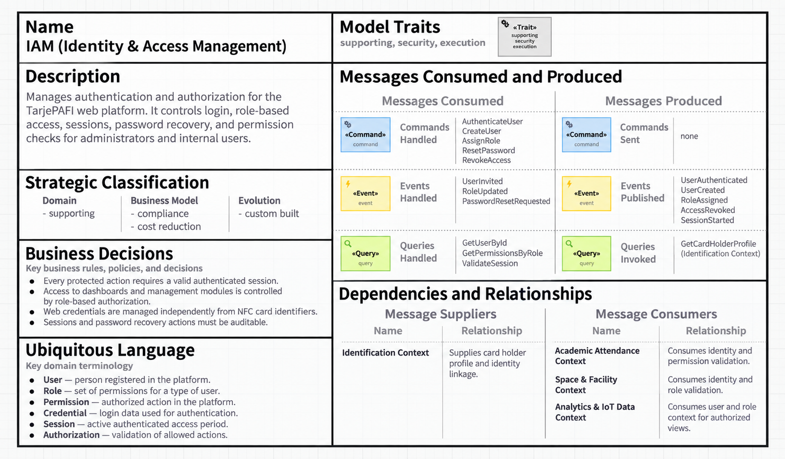
</p>

+ **Bounded Context: Academic Attendance Context:**

<p align="center">
  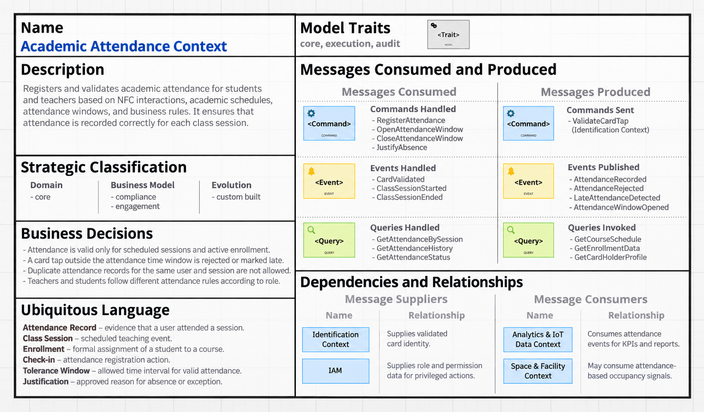
</p>

+ **Bounded Context: Space & Facility Context:**

<p align="center">
  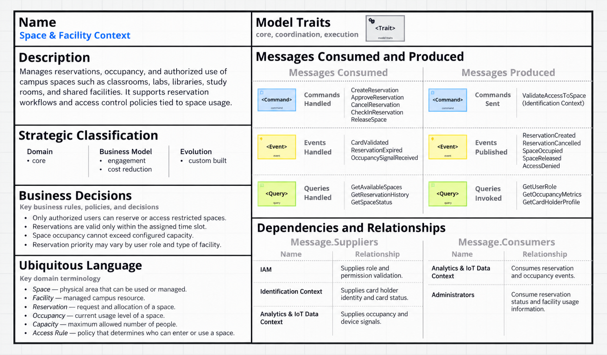
</p>

+ **Bounded Context: Iot Monitoring Context:**

<p align="center">
  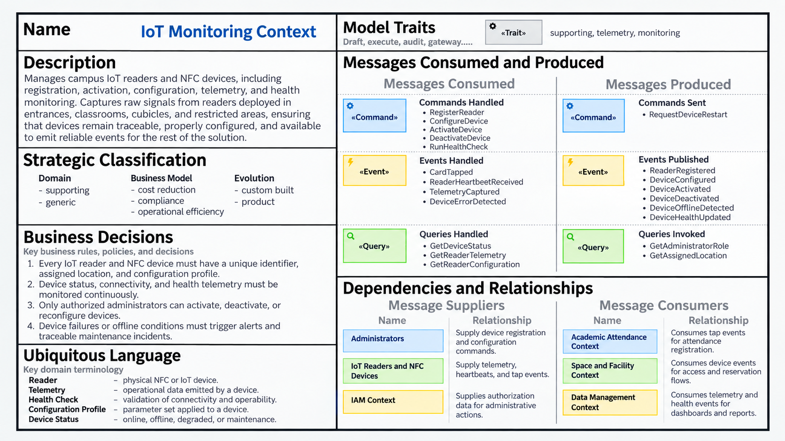
</p>

+ **Bounded Context: Data Management Context:**

<p align="center">
  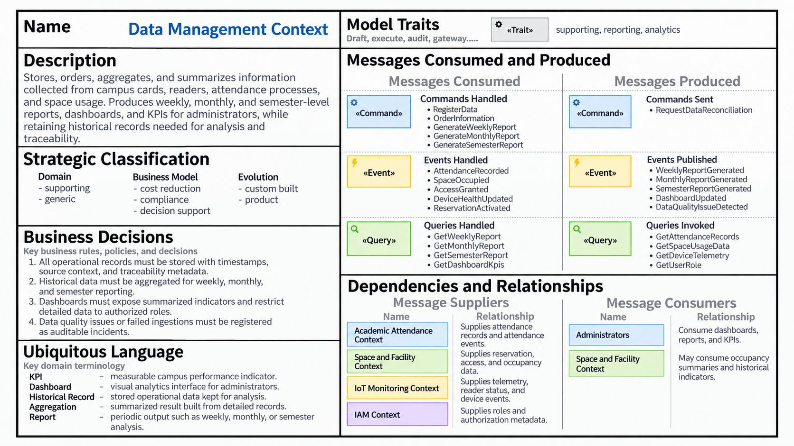
</p>


### 4.2.5. Context Mapping

El proceso de Context Mapping permitió representar las relaciones estructurales y los mecanismos de integración existentes entre los bounded contexts definidos para TarjePAFI. Mientras que los Bounded Context Canvases permiten analizar individualmente las responsabilidades, reglas y dependencias de cada contexto, el Context Map proporciona una visión global de cómo estos colaboran para soportar los procesos de autenticación, monitoreo de dispositivos IoT, registro de asistencia, gestión de espacios y generación de información para la toma de decisiones dentro del Smart Campus.

Para su elaboración, el equipo revisó las responsabilidades definidas previamente para cada bounded context y planteó preguntas de exploración propias de Domain-Driven Design, entre ellas:

+ ¿Qué responsabilidades relacionadas con autenticación y autorización deben permanecer dentro de IAM Context?
+ ¿Debe IoT Monitoring Context limitarse al monitoreo de dispositivos o también participar en la interpretación de las lecturas NFC?
+ ¿Cómo deben Academic Attendance Context y Space and Facility Context recibir los eventos generados por los lectores sin depender directamente del hardware?
+ ¿Es necesario compartir un mismo modelo de usuario entre los bounded contexts o únicamente intercambiar identificadores, roles y eventos?
+ ¿Data Management Context debe contener reglas de negocio de asistencia y reservas o únicamente almacenar, consolidar y analizar la información generada por los demás contextos?
+ ¿Cómo se debe aislar el dominio de TarjePAFI de los protocolos y formatos específicos utilizados por los lectores NFC e IoT?

A partir de este análisis se determinó mantener los cinco bounded contexts definidos. IAM Context se encarga exclusivamente de los procesos de autenticación, autorización, gestión de sesiones, roles y permisos dentro de las aplicaciones. Por otro lado, IoT Monitoring Context concentra las responsabilidades relacionadas con el registro, configuración, estado y monitoreo de los lectores NFC y dispositivos IoT distribuidos dentro del campus.

Academic Attendance Context y Space and Facility Context permanecen separados debido a que poseen reglas de negocio distintas. Academic Attendance Context trabaja con sesiones académicas, horarios, matrículas y registros de asistencia, mientras que Space and Facility Context administra reservas, disponibilidad, capacidad, accesos y ocupación de los espacios universitarios.

Finalmente, Data Management Context se encarga de almacenar, ordenar, consolidar y resumir la información producida por los demás contextos, permitiendo generar reportes, dashboards, indicadores e información histórica para los administradores. De esta manera, las reglas de negocio permanecen dentro de sus respectivos bounded contexts, mientras que Data Management se concentra en la explotación y presentación de la información.

A partir de estas decisiones se identificaron los siguientes patrones de relación entre contextos:

+ Open Host Service (OHS) en IAM Context, que expone servicios estandarizados de autenticación y autorización consumidos por los demás bounded contexts. De esta manera, Academic Attendance Context, Space and Facility Context, IoT Monitoring Context y Data Management Context pueden validar sesiones, roles y permisos sin implementar mecanismos propios de autenticación.

+ Conformist en la relación entre IAM Context e IoT Monitoring Context. IoT Monitoring utiliza los roles y permisos proporcionados por IAM para determinar qué usuarios administrativos pueden registrar, activar, desactivar o modificar la configuración de los dispositivos IoT.

+ Customer/Supplier entre IoT Monitoring Context y Academic Attendance Context. IoT Monitoring actúa como supplier proporcionando eventos generados por las lecturas NFC, como CardTapEvent o ReaderEvent. Academic Attendance utiliza estos eventos para identificar una interacción física y posteriormente aplicar sus propias reglas relacionadas con matrícula, horario y sesión académica.

+ Customer/Supplier entre IoT Monitoring Context y Space and Facility Context. IoT Monitoring proporciona los eventos generados por los lectores instalados en accesos, cubículos y otros ambientes, mientras que Space and Facility utiliza esta información para ejecutar sus reglas relacionadas con reservas, accesos y ocupación de espacios.

+ Event-Driven Consistency entre Academic Attendance Context y Data Management Context. Cuando se generan eventos como AttendanceRecorded o AttendanceRejected, estos son consumidos de manera asíncrona por Data Management para actualizar información histórica, estadísticas y reportes de asistencia sin acoplar directamente ambos modelos de dominio.

+ Event-Driven Consistency entre Space and Facility Context y Data Management Context, mediante eventos como ReservationCreated, SpaceOccupied o SpaceReleased. Estos eventos permiten actualizar métricas de utilización, disponibilidad y ocupación de espacios sin que Space and Facility tenga conocimiento de la lógica interna utilizada para generar los reportes.

+ Event-Driven Consistency entre IoT Monitoring Context y Data Management Context. Eventos como TelemetryCaptured, DeviceHealthUpdated o DeviceOfflineDetected son utilizados para mantener información histórica sobre el funcionamiento de los lectores y generar indicadores relacionados con la disponibilidad y estado de la infraestructura IoT.

+ Anti-Corruption Layer (ACL) en el límite entre los dispositivos físicos NFC/IoT y IoT Monitoring Context. Los lectores pueden utilizar protocolos, identificadores y formatos específicos del fabricante, por lo que una capa de adaptación transforma dichos datos antes de incorporarlos al modelo de dominio de TarjePAFI. De esta manera, cambios en los dispositivos o protocolos de comunicación no afectan directamente las reglas del negocio.

El patrón Shared Kernel también fue considerado para compartir elementos como User, Reader, Space o sus identificadores entre los diferentes bounded contexts. Sin embargo, se decidió no utilizarlo, ya que compartir directamente modelos de dominio incrementaría el acoplamiento entre los contextos. En su lugar, cada bounded context mantiene su propio modelo y comparte únicamente identificadores, contratos, consultas y eventos necesarios para la integración.

El Context Map resultante posiciona a IoT Monitoring Context como el punto de integración entre los dispositivos físicos NFC/IoT y los procesos del dominio que necesitan utilizar sus lecturas. IAM Context actúa como un servicio transversal encargado de autenticación y autorización, mientras que Academic Attendance Context y Space and Facility Context concentran las principales reglas de negocio relacionadas con asistencia y gestión de espacios. Finalmente, Data Management Context funciona como un contexto de soporte que consume los eventos generados por los demás bounded contexts para transformarlos en información histórica, indicadores, reportes y dashboards orientados a la toma de decisiones de los administradores.

<p align="center">
  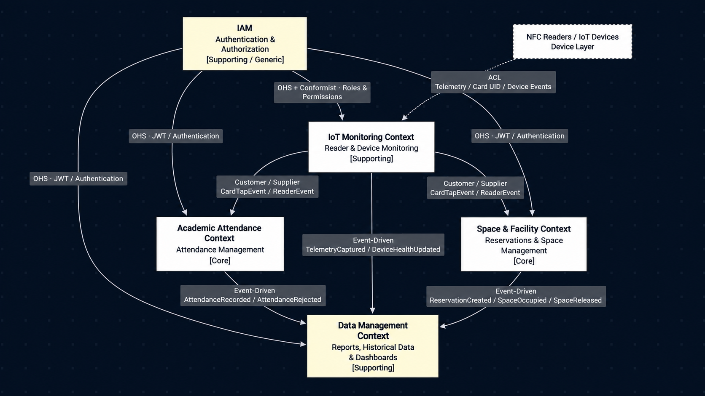
</p>

## 4.3. Software Architecture

### 4.3.1. Software Architecture System Landscape Diagram

Expone el ecosistema completo donde nuestro sistema interactúa con múltiples sistemas externos, identificando dependencias y límites organizacionales.

<p align="center">
  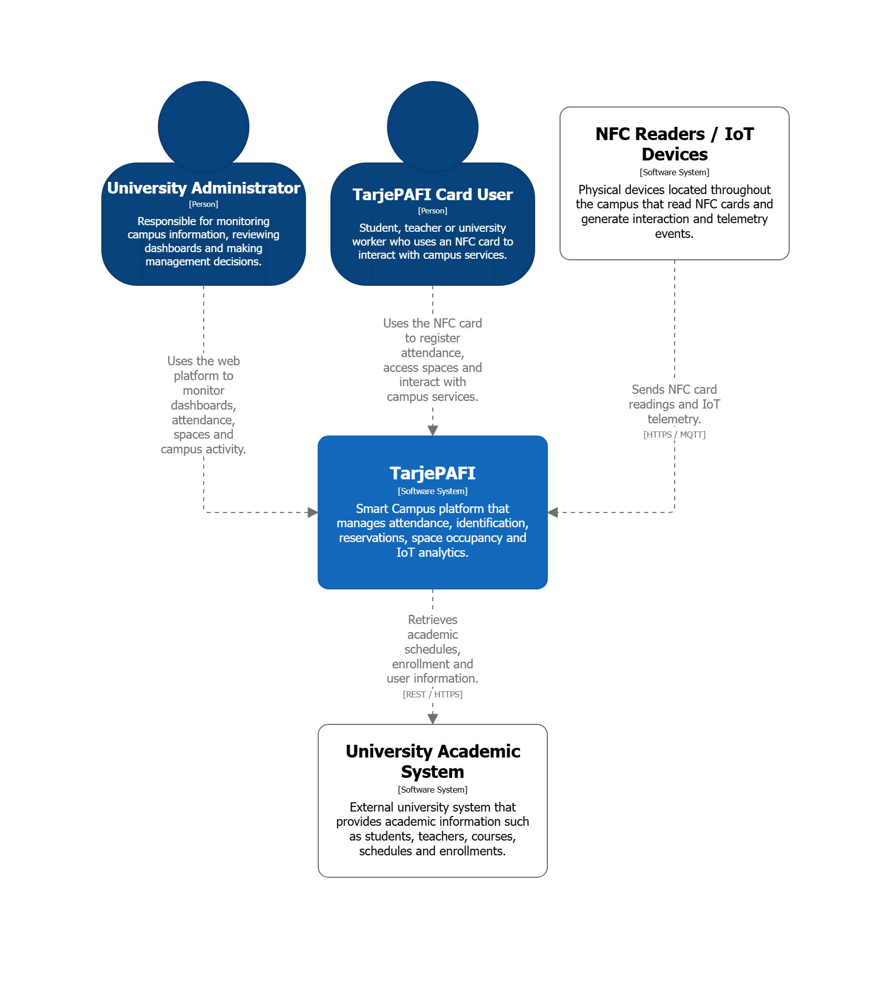
</p>

### 4.3.2. Software Architecture Context Level Diagrams

Este diagrama muestra que el sistema TarjePAFI interactúa directamente con dos tipos de usuarios y dos sistemas externos:

- **Administrativos**, que utilizan la plataforma web para visualizar reportes de asistencia y gestionar la información relacionada con la asistencia, identificación y reserva de espacios universitarios.
- **Usuarios (alumnos y personal)**, que interactúan con el sistema mediante tarjetas NFC para registrar su asistencia. Estos usuarios no interactúan directamente con TarjePAFI, sino que presentan sus tarjetas ante los lectores NFC/IoT.

El sistema también se comunica con dos sistemas externos:

- **Lectores NFC/IoT**, que detectan las tarjetas NFC utilizadas por los usuarios y envían los eventos de lectura a TarjePAFI para el registro de asistencia.
- **Sistema Académico UPC**, que proporciona información académica como datos de alumnos, profesores, personal universitario, horarios y cursos, permitiendo que TarjePAFI utilice esta información para gestionar sus funcionalidades.

<p align="center">
  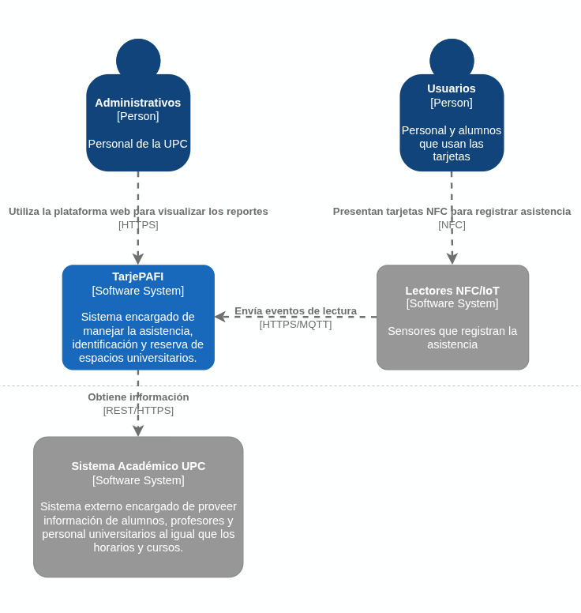
</p>

### 4.3.3. Software Architecture Container Level Diagrams

Este diagrama muestra que el sistema TarjePAFI está compuesto por cinco contenedores principales:

- Una Landing Page, encargada de presentar la plataforma y proporcionar el punto de acceso inicial al sistema.
- Una Web App, desarrollada en Angular, que permite a los usuarios administrativos gestionar las funcionalidades del sistema, como la asistencia, las reservas y la visualización de reportes.
- Un Backend API, desarrollado con Spring Boot, que concentra la lógica de negocio de TarjePAFI, procesa los eventos de asistencia y expone los servicios REST utilizados por la aplicación web.
RabbitMQ, utilizado como message broker para recibir y gestionar de forma asíncrona los eventos generados por los lectores NFC/IoT, permitiendo desacoplar los dispositivos del procesamiento realizado por el backend.
- Una Base de Datos PostgreSQL, encargada de almacenar la información de asistencias, reservas, usuarios y configuraciones del sistema.

Además, el sistema se integra con los Lectores NFC/IoT, que envían los eventos generados por las tarjetas NFC hacia RabbitMQ, y con el Sistema Académico UPC, del cual el Backend API obtiene información académica mediante servicios REST/HTTPS.

<p align="center">
  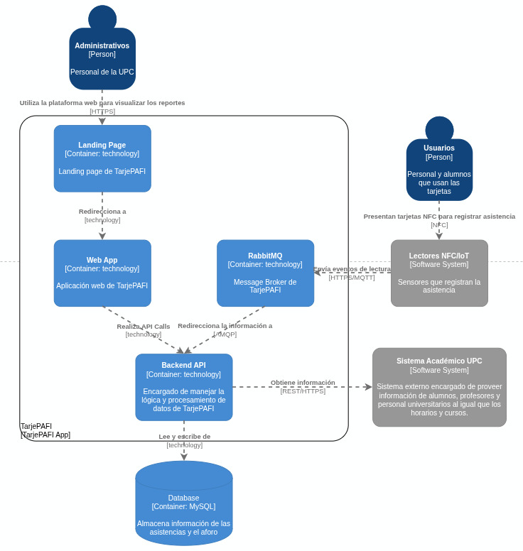
</p>

### 4.3.4. Software Architecture Deployment Diagrams

Este diagrama muestra cómo TarjePAFI se despliega mediante diferentes componentes de software y dispositivos físicos. La plataforma está compuesta por una Landing Page y una aplicación web desarrolladas en Angular, un Backend API desarrollado con Spring Boot, un servidor RabbitMQ encargado de gestionar los eventos de lectura NFC y una base de datos PostgreSQL para almacenar la información del sistema. Los usuarios administrativos acceden a la aplicación web mediante HTTPS, mientras que los lectores NFC/IoT envían los eventos de lectura hacia RabbitMQ mediante HTTPS/MQTT. El Backend procesa estos eventos y se comunica con la base de datos mediante JDBC. Asimismo, el Backend se integra con el Sistema Académico UPC mediante REST/HTTPS para obtener información académica.

<p align="center">
  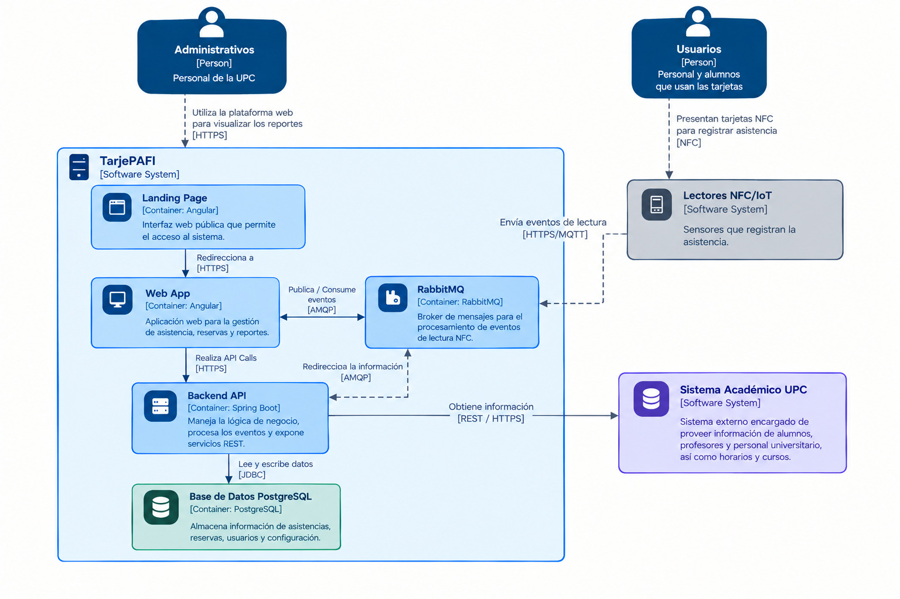
</p>


# Capítulo V: Tactical-Level Software Design

## 5.1. Bounded Context: IAM Context

### 5.1.1. Domain Layer
La Domain Layer representa el núcleo del IAM (Identity and Access Management) Context y contiene las clases responsables de modelar la identidad, credenciales y control de acceso de los administradores del sistema. A diferencia de otros contextos, no contiene lógica de negocio operativa transversal, sino que se centra en la validación de identidad. Esta capa permanece independiente de tecnologías específicas como Entity Framework, JWT o algoritmos criptográficos, concentrándose únicamente en las reglas propias del dominio.
Las principales clases identificadas para esta capa son las siguientes.

**Aggregate Root**

**User**
`User` constituye el Aggregate Root principal del bounded context. Representa a un administrador del sistema y mantiene el estado consistente de sus credenciales, perfil básico y marcas de tiempo de auditoría. Hereda de una clase base `AuditableEntity` para manejar automáticamente `CreatedAt` y `UpdatedAt`.
**Propósito:** gestionar el ciclo de vida de la cuenta de un administrador, asegurando que siempre posea credenciales válidas, un correo con formato correcto y el rol adecuado para operar el sistema.
**Atributos principales:**
- `userId`: identificador único del usuario.
- `email`: dirección de correo electrónico (Value Object).
- `password`: contraseña cifrada (Value Object).
- `role`: rol de acceso (estrictamente administrador).
- `status`: estado actual de la cuenta.
- `createdAt`: fecha y hora de creación de la cuenta.
- `updatedAt`: fecha y hora de la última modificación.
**Métodos principales:**
- `createAdmin()`: Factory Method estático que inicializa la cuenta asegurando la asignación del rol de administrador.
- `updatePassword(EncryptedPassword newPassword)`: actualiza la credencial de acceso.
- `deactivate()`: deshabilita el acceso del usuario al sistema.
- `verifyPassword(EncryptedPassword input)`: compara una credencial entrante con la almacenada.

**Value Objects**

**EmailAddress**
`EmailAddress` representa el correo electrónico del administrador.
Su responsabilidad es validar mediante expresiones regulares en su constructor que la cadena de texto proporcionada posea un formato de correo electrónico válido, evitando que estados inválidos ingresen al dominio.

**EncryptedPassword**
`EncryptedPassword` representa la credencial de acceso del usuario de forma segura.
Su propósito es garantizar que el dominio jamás maneje ni exponga contraseñas en texto plano. Encapsula el hash criptográfico generado.

**Enumerations**

**UserStatus**
Representa el estado operativo de la cuenta:
- `ACTIVE`
- `INACTIVE`
- `SUSPENDED`

**Repository & Outbound Interfaces**

**IUserRepository**
`IUserRepository` define la abstracción utilizada por el dominio para recuperar y persistir las cuentas de usuario.
**Métodos principales:**
- `save(User user)`
- `findById(UserId userId)`
- `findByEmailAsync(EmailAddress email)`
- `existsByEmail(EmailAddress email)`

**ITokenGeneratorService & IHashingService**
Interfaces que definen contratos críticos hacia el exterior (Outbound Services). `IHashingService` abstrae el cifrado de contraseñas, e `ITokenGeneratorService` abstrae la generación de credenciales de acceso (tokens), manteniendo al dominio agnóstico de implementaciones como BCrypt o JWT.

### 5.1.2. Interface Layer
La Interface Layer proporciona los puntos de entrada mediante los cuales los clientes web o móviles interactúan con el IAM Context para autenticarse. Esta capa recibe las solicitudes externas HTTP, extrae los datos y los transforma en commands o queries que son enviados hacia Application Layer.

**AuthController**
`AuthController` expone las operaciones de autenticación. Su superficie es intencionalmente reducida, ya que no existe un proceso de registro público; las cuentas son provisionadas directamente.
**Responsabilidades principales:**
- procesar el inicio de sesión de administradores;
- validar tokens activos;
- consultar el perfil básico autenticado.
**Entre los endpoints considerados se encuentran:**
- `POST /api/v1/auth/sign-in` (Público - `[AllowAnonymous]`)
- `GET /api/v1/auth/me` (Protegido - `[Authorize]`)

**Data Transfer Objects (DTOs)**
Estructuras de datos utilizadas para la comunicación externa.
- **SignInResource:** recibe el correo y la contraseña en texto plano.
- **TokenResource:** devuelve el token generado de forma segura.
- **UserResource:** devuelve la información pública del usuario (omitiendo contraseñas).

**Transform Layer (Assemblers)**
Los *Assemblers* desacoplan el modelo expuesto en la API REST de los objetos internos.
**Entre sus operaciones principales se encuentran:**
- `toSignInCommandFromResource()`
- `toUserResourceFromEntity()`

### 5.1.3. Application Layer
La Application Layer coordina los flujos de autenticación y aprovisionamiento bajo el patrón CQRS. Esta capa orquesta el modelo de dominio con los servicios externos de cifrado y generación de tokens.

**Commands**
Los Commands representan solicitudes que producen un cambio o acción principal.

**CreateAdminCommand**
Solicita el aprovisionamiento de una nueva cuenta administrativa (usado por procesos internos o *seeders*, no expuesto por REST).
**Datos principales:**
- `email`
- `rawPassword`
- `name`
- `status`
- `CreatedAt`
- `UpdatedAt`

**SignInCommand**
Solicita la validación de credenciales para iniciar una sesión en el sistema.
**Datos principales:**
- `email`
- `rawPassword`

**Command Handlers**

**CreateAdminCommandHandler**
Valida que el correo no esté registrado utilizando `IUserRepository`, orquesta la llamada a `IHashingService` para cifrar el `rawPassword`, instancia la entidad mediante `User.createAdmin()` y persiste el objeto.

**SignInCommandHandler**
Recupera el usuario correspondiente mediante su correo electrónico. Si existe, verifica que el `rawPassword` coincida con el hash almacenado. Tras una validación exitosa, solicita a `ITokenGeneratorService` la emisión de las credenciales de sesión.

**Queries**
Las Queries permiten recuperar información sin modificar el estado.

**GetUserProfileQuery**
Solicita la información básica de un usuario autenticado.
**Datos principales:**
- `userId`

**Query Handlers**

**GetUserProfileQueryHandler**
Recupera el `User` solicitado de la base de datos y lo devuelve listo para ser mapeado, facilitando la extracción del perfil sin exponer lógica de dominio.

### 5.1.4. Infrastructure Layer
La Infrastructure Layer contiene las implementaciones concretas necesarias para persistir datos, aplicar criptografía real y manejar la seguridad del entorno HTTP. Implementa las abstracciones de Domain Layer.

**Repository Implementations**

**JpaUserRepository** (o `EntityFrameworkUserRepository`)
Implementa la interfaz `IUserRepository` definida en Domain Layer.
Su responsabilidad es traducir las operaciones del dominio a operaciones de persistencia sobre la base de datos (ej. PostgreSQL o SQL Server). Se apoya en interceptores del ORM para poblar automáticamente los campos de auditoría (`CreatedAt`, `UpdatedAt`) al insertar o actualizar registros.

**Security & Cryptography Infrastructure**

**BcryptHashingService**
Implementa `IHashingService`. Utiliza el algoritmo BCrypt para generar y verificar hashes seguros de las contraseñas, evitando el almacenamiento en texto plano.

**JwtTokenGeneratorService**
Implementa `ITokenGeneratorService`. Implementa la creación de JSON Web Tokens (JWT) firmados algorítmicamente (ej. HS256). Inyecta *claims* esenciales como `sub` (userId), `email` y `role=ADMIN` para permitir una autorización sin estado (*stateless*).

**System Initialization**

**AdminDataSeeder**
Dado que el negocio no permite el registro público de usuarios, este componente de infraestructura se ejecuta durante el despliegue o inicialización del sistema. Se encarga de inyectar directamente en la base de datos las credenciales de los administradores primarios, ejecutando internamente el flujo de creación segura.

**Middleware**

**JwtAuthenticationMiddleware**
Se integra en el pipeline HTTP del servidor web.
**Su responsabilidad consiste en:**
- interceptar las peticiones entrantes;
- extraer el token de la cabecera `Authorization: Bearer`;
- validar criptográficamente la firma del JWT;
- inyectar el contexto de identidad (claims) en la solicitud actual para habilitar atributos como `[Authorize]`.

### 5.1.5. Bounded Context Software Architecture Component Level Diagrams

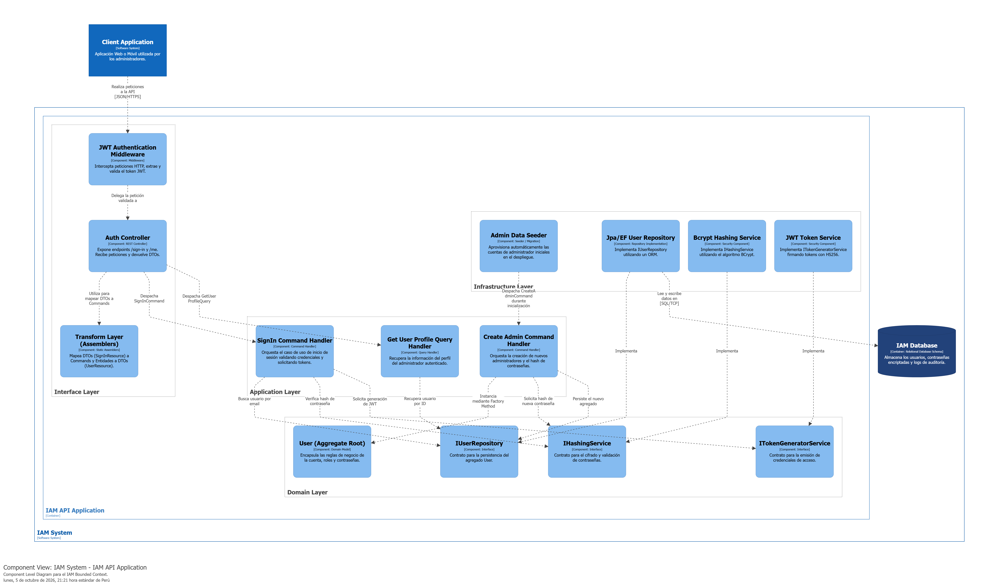<br>

### 5.1.6. Bounded Context Software Architecture Code Level Diagrams

#### 5.1.6.1. Bounded Context Domain Layer Class Diagrams

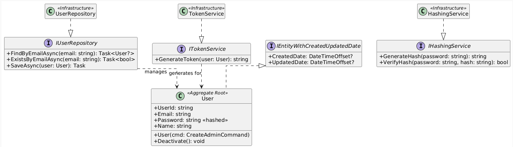<br>

#### 5.1.6.2. Bounded Context Database Design Diagram

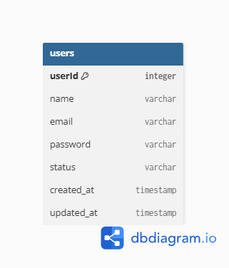<br>


## 5.2. Bounded Context: Academic Attendance Context

El Academic Attendance Context es el bounded context núcleo (*core*) encargado de registrar y validar la asistencia académica de estudiantes y docentes a partir de las interacciones NFC, los horarios académicos, las ventanas de asistencia y las reglas de negocio de la universidad. Su responsabilidad es garantizar que cada asistencia quede registrada una sola vez, con la hora original de la lectura, y que las lecturas fuera de ventana o de usuarios no autorizados sean rechazadas o marcadas como tardías.
 
**Reglas de negocio principales**
 
- La asistencia solo es válida para sesiones programadas y, en el caso de estudiantes, con matrícula activa en el curso.
- Una lectura fuera de la ventana de asistencia se rechaza o se marca como tardía.
- No se permiten registros de asistencia duplicados para el mismo usuario y la misma sesión.
- Docentes y estudiantes siguen reglas distintas según su rol. El primer registro válido del docente abre la ventana de asistencia de la sesión.
**Datos externos simulados**
 
Los horarios, cursos y matrículas pertenecen al Sistema Académico UPC. En esta etapa se simulan mediante datos semilla en PostgreSQL, accedidos a través de un puerto de salida (`AcademicDirectoryPort`) con un adaptador simulado. Cuando exista la integración real, solo se reemplaza el adaptador por uno REST/HTTPS sin modificar el dominio.
 
**Integración con IoT Monitoring Context**
 
Las lecturas NFC no llegan directamente desde los lectores. El IoT Monitoring Context las recibe, las traduce mediante su Anti-Corruption Layer y publica el evento `CardTapEvent` (lector, UID de tarjeta y hora de la lectura). Academic Attendance consume ese evento, resuelve la identidad del titular consultando a Identification Context y evalúa la marcación. De esta forma el dominio de asistencia no conoce el protocolo ni el formato de mensajes de los dispositivos. El `spaceId` de la ubicación del lector (`DeviceLocation`) equivale al aula (`classroomId`) de la sesión de clase.


### 5.2.1. Domain Layer


En esta capa se encapsulan las reglas de negocio de la asistencia: el ciclo de vida de la ventana de asistencia de una sesión de clase y la evaluación de cada marcación (*check-in*) para decidir si queda como presente, tardía o rechazada.
 
**Aggregate: `ClassSession`**
 
Representa una sesión de clase programada y controla su ventana de asistencia. Se crea a partir de los datos académicos (simulados) cuando se recibe el evento `ClassSessionStarted`.
 
| Atributos | Tipo de dato | Visibilidad | Descripción |
|---|---|---|---|
| id | Long | Private | Identificador único de la sesión. |
| externalSessionCode | String | Private | Código de la sesión en el sistema académico. Es único. |
| courseId | CourseId | Private | Curso al que pertenece la sesión. |
| teacherId | CardHolderId | Private | Docente asignado a la sesión. |
| classroomId | ClassroomId | Private | Aula donde se dicta la sesión. Se usa para ubicar la sesión a partir del lector. |
| scheduledStart | Instant | Private | Hora programada de inicio. |
| scheduledEnd | Instant | Private | Hora programada de fin. |
| toleranceWindow | ToleranceWindow | Private | Minutos de tolerancia, contados desde el inicio, para considerar la asistencia a tiempo. |
| windowStatus | WindowStatus | Private | Estado de la ventana: `SCHEDULED`, `OPEN` o `CLOSED`. |
| windowOpenedAt | Instant | Private | Instante de apertura de la ventana. Es nulo si aún no se abrió. |
| windowClosedAt | Instant | Private | Instante de cierre de la ventana. Es nulo si aún no se cerró. |
 
| Métodos | Tipo de retorno | Visibilidad | Descripción |
|---|---|---|---|
| getX() | — | Public | Getters de cada atributo (`getId()`, `getCourseId()`, `getTeacherId()`, `getClassroomId()`, `getWindowStatus()`, etc.). |
| ClassSession(CreateClassSessionCommand) | Constructor | Public | Crea una sesión en estado `SCHEDULED`. |
| openAttendanceWindow(Instant) | void | Public | Abre la ventana y registra `windowOpenedAt`. Lanza excepción si la ventana ya fue cerrada. Es idempotente si ya está abierta. |
| closeAttendanceWindow(Instant) | void | Public | Cierra la ventana y registra `windowClosedAt`. Lanza excepción si nunca se abrió. |
| coversInstant(Instant) | boolean | Public | Indica si un instante cae dentro de `[windowOpenedAt, windowClosedAt]`. Si la ventana sigue abierta, el límite superior es abierto. |
| isWithinTolerance(Instant) | boolean | Public | Indica si un instante es menor o igual a `scheduledStart + tolerancia`. |
 
**Aggregate: `AttendanceRecord`**
 
Representa la evidencia de que un usuario realizó (o intentó realizar) su marcación en una sesión. Los rechazos también se persisten para auditoría.
 
| Atributos | Tipo de dato | Visibilidad | Descripción |
|---|---|---|---|
| id | Long | Private | Identificador único del registro. |
| eventId | ReaderEventId | Private | Identificador único del evento de lectura. Garantiza la idempotencia. |
| classSessionId | ClassSessionId | Private | Sesión a la que corresponde el registro. |
| cardHolderId | CardHolderId | Private | Titular de la tarjeta (estudiante o docente). |
| participantRole | ParticipantRole | Private | Rol del participante: `STUDENT` o `TEACHER`. |
| cardUid | CardUid | Private | UID de la tarjeta NFC utilizada. |
| checkInTime | Instant | Private | Hora original de la lectura, generada por el lector (no la de recepción). |
| receivedAt | Instant | Private | Hora en que el backend procesó el evento. |
| status | AttendanceStatus | Private | `PRESENT`, `LATE`, `REJECTED` o `JUSTIFIED`. |
| rejectionReason | RejectionReason | Private | Motivo del rechazo. Es nulo si el registro no fue rechazado. |
| justification | Justification | Private | Justificación aprobada. Es nula si no aplica. |
 
| Métodos | Tipo de retorno | Visibilidad | Descripción |
|---|---|---|---|
| getX() | — | Public | Getters de cada atributo. |
| AttendanceRecord(RegisterAttendanceCommand, AttendanceDecision) | Constructor | Public | Crea el registro con el estado y motivo resueltos por la política de asistencia. |
| AttendanceRecord(JustifyAbsenceCommand) | Constructor | Public | Crea un registro `JUSTIFIED` para un usuario que no tiene registro en la sesión. |
| justify(Justification) | void | Public | Convierte un registro `REJECTED` en `JUSTIFIED`. Lanza `InvalidJustificationException` si el registro ya es `PRESENT` o `LATE`. |
| isAttended() | boolean | Public | Indica si el registro cuenta como asistencia (`PRESENT` o `LATE`). |
 
**Domain Service: `AttendancePolicy`**
 
Concentra la decisión de negocio sobre una marcación, que no pertenece a un único agregado porque combina sesión, rol y matrícula.
 
| Método | Descripción |
|---|---|
| evaluate(ClassSession, ParticipantRole, CardHolderId, Instant, boolean) | Devuelve un `AttendanceDecision` con el estado y el motivo de rechazo. El booleano indica si el usuario está autorizado (matrícula activa para estudiantes). |
 
Reglas que aplica, en orden:
 
1. **Estudiante sin matrícula activa:** `REJECTED` con `NOT_ENROLLED`.
2. **Docente que no es el asignado a la sesión:** `REJECTED` con `NOT_ASSIGNED_TO_SESSION`.
3. **Estudiante con la ventana aún sin abrir:** `REJECTED` con `WINDOW_NOT_OPEN`.
4. **Marcación posterior al cierre de la ventana:** `REJECTED` con `WINDOW_CLOSED`.
5. **Marcación dentro de la tolerancia:** `PRESENT`.
6. **Marcación posterior a la tolerancia pero dentro de la ventana:** `LATE`.
La evaluación usa la hora original de la lectura (`checkInTime`), por lo que las lecturas retenidas offline en el ESP32 se evalúan con la hora real en que ocurrieron.
 
**Value Objects**
 
| Value Object | Descripción |
|---|---|
| ClassSessionId | Registro que representa el identificador de una sesión. Valida que no sea nulo ni menor o igual a cero. |
| CardHolderId | Registro que representa el identificador del titular de una tarjeta. Valida que no sea nulo ni menor o igual a cero. |
| CourseId | Registro que representa el código de un curso. Valida que no sea nulo ni esté en blanco. |
| ClassroomId | Registro que representa el código de un aula. Valida que no sea nulo ni esté en blanco. |
| CardUid | Registro que representa el UID de una tarjeta NFC. Valida formato hexadecimal y longitud máxima de 32 caracteres. |
| ReaderEventId | Registro que envuelve el `UUID` que identifica una lectura NFC (incluido en el `CardTapEvent` de IoT Monitoring). Sirve como llave de idempotencia. |
| ToleranceWindow | Registro con los minutos de tolerancia. Valida que sea mayor o igual a 0 y menor o igual a 60. |
| Justification | Registro con `reason`, `approvedBy` y `approvedAt`. Valida que el motivo no esté en blanco y no exceda 255 caracteres. |
| AttendanceDecision | Registro con el `AttendanceStatus` resuelto y el `RejectionReason` opcional. |
| ParticipantRole | Enumeración: `STUDENT`, `TEACHER`. |
| WindowStatus | Enumeración: `SCHEDULED`, `OPEN`, `CLOSED`. |
| AttendanceStatus | Enumeración: `PRESENT`, `LATE`, `REJECTED`, `JUSTIFIED`. |
| RejectionReason | Enumeración: `NOT_ENROLLED`, `NOT_ASSIGNED_TO_SESSION`, `WINDOW_NOT_OPEN`, `WINDOW_CLOSED`, `NO_ACTIVE_SESSION`, `CARD_NOT_VALID`. Los dos últimos solo se publican en `AttendanceRejected`; no se persisten porque no hay sesión o titular al cual asociar el registro. |
 
**Domain Events (publicados)**
 
| Evento | Se publica cuando | Datos principales |
|---|---|---|
| AttendanceRecorded | Se registra una asistencia `PRESENT` o `JUSTIFIED`. | recordId, classSessionId, cardHolderId, role, checkInTime. |
| LateAttendanceDetected | Se registra una asistencia `LATE`. | recordId, classSessionId, cardHolderId, checkInTime, minutosDeRetraso. |
| AttendanceRejected | Una marcación es rechazada. | eventId, cardUid, cardHolderId (nulo si la tarjeta no es válida), classSessionId (puede ser nulo), rejectionReason. |
| AttendanceWindowOpened | Se abre la ventana de una sesión. | classSessionId, windowOpenedAt. |
 
**Excepciones de Dominio**
 
| Excepción | Descripción |
|---|---|
| ClassSessionNotFoundException | Se lanza cuando no se encuentra una sesión por su ID o por aula. |
| AttendanceRecordNotFoundException | Se lanza cuando no se encuentra un registro de asistencia. |
| AttendanceWindowStateException | Se lanza ante una transición inválida de la ventana (abrir una ventana cerrada, cerrar una que nunca se abrió). |
| DuplicateAttendanceException | Se lanza cuando ya existe un registro válido para el mismo usuario y sesión, o cuando el `eventId` ya fue procesado. |
| InvalidJustificationException | Se lanza cuando se intenta justificar un registro que ya es asistencia, o con un motivo inválido. |
 
**Interfaz: `ClassSessionCommandService`**
 
| Método | Descripción |
|---|---|
| handle(CreateClassSessionCommand) | Crea una sesión en estado `SCHEDULED` y retorna su ID. |
| handle(OpenAttendanceWindowCommand) | Abre la ventana de asistencia de la sesión. |
| handle(CloseAttendanceWindowCommand) | Cierra la ventana de asistencia de la sesión. |
 
**Interfaz: `AttendanceRecordCommandService`**
 
| Método | Descripción |
|---|---|
| handle(RegisterAttendanceCommand) | Evalúa la marcación, persiste el registro (incluidos los rechazos) y publica el evento correspondiente. Retorna el registro o vacío si el evento ya fue procesado. |
| handle(JustifyAbsenceCommand) | Registra o convierte un registro en `JUSTIFIED`. |
 
**Interfaz: `AttendanceRecordQueryService`**
 
| Método | Descripción |
|---|---|
| handle(GetAttendanceBySessionQuery) | Recupera todos los registros de una sesión. |
| handle(GetAttendanceHistoryQuery) | Recupera el historial de un titular en un rango de fechas. |
| handle(GetAttendanceStatusQuery) | Obtiene el estado de asistencia de un titular en una sesión. |


### 5.2.2. Interface Layer


La capa de interfaz expone controladores REST y consumidores de mensajería. La entrada principal de las marcaciones NFC no es REST sino el consumidor de RabbitMQ, que convierte los eventos en comandos. Los endpoints están protegidos con JWT y los roles se validan contra IAM.
 
**Controlador: `ClassSessionCommandController`**
 
Gestiona el ciclo de vida de la ventana de asistencia.
 
| Método | Ruta | Acceso | Descripción |
|---|---|---|---|
| openAttendanceWindow | POST /api/v1/class-sessions/{sessionId}/attendance-window/open | TEACHER, ADMIN | Abre la ventana de asistencia de una sesión. |
| closeAttendanceWindow | POST /api/v1/class-sessions/{sessionId}/attendance-window/close | TEACHER, ADMIN | Cierra la ventana de asistencia de una sesión. |
 
**Controlador: `AttendanceRecordCommandController`**
 
| Método | Ruta | Acceso | Descripción |
|---|---|---|---|
| registerAttendance | POST /api/v1/attendance-records | ADMIN | Registra una marcación de forma manual. Se usa para pruebas con Postman; el flujo real ingresa por RabbitMQ. |
| justifyAbsence | POST /api/v1/class-sessions/{sessionId}/justifications | TEACHER, ADMIN | Registra una justificación de inasistencia para un titular. |
 
**Controlador: `AttendanceQueryController`**
 
| Método | Ruta | Acceso | Descripción |
|---|---|---|---|
| getAttendanceBySession | GET /api/v1/class-sessions/{sessionId}/attendance | TEACHER, ADMIN | Lista los registros de asistencia de una sesión. |
| getAttendanceHistory | GET /api/v1/card-holders/{cardHolderId}/attendance-history?from=&to= | TEACHER, ADMIN | Devuelve el historial de asistencia de un titular. |
| getAttendanceStatus | GET /api/v1/class-sessions/{sessionId}/card-holders/{cardHolderId}/attendance-status | TEACHER, ADMIN | Devuelve el estado de asistencia de un titular en una sesión. |
 
**Consumidores de mensajería (inbound)**
 
| Consumidor | Cola / Routing key | Descripción |
|---|---|---|
| CardTapEventConsumer | `attendance.card-tap.queue` / `iot.card-tap` | Recibe `CardTapEvent` desde IoT Monitoring, lo traduce a `RegisterAttendanceCommand` y delega al servicio de comandos. |
| ClassSessionLifecycleEventConsumer | `attendance.class-session.queue` / `academic.class-session-started`, `academic.class-session-ended` | `ClassSessionStarted` genera un `CreateClassSessionCommand`. `ClassSessionEnded` genera un `CloseAttendanceWindowCommand`. |
 
**Recursos (DTOs)**
 
| Recurso | Descripción |
|---|---|
| RegisterAttendanceResource | Datos de una marcación manual: eventId, cardUid, classroomId, checkInTime. El titular se resuelve igual que en el flujo por mensajería. |
| JustifyAbsenceResource | Datos de una justificación: cardHolderId, reason. |
| AttendanceRecordResource | Respuesta de un registro: id, classSessionId, cardHolderId, role, status, rejectionReason, checkInTime, justification. |
| AttendanceStatusResource | Respuesta del estado de un titular: cardHolderId, classSessionId, status, checkInTime. |
| ClassSessionResource | Respuesta de una sesión: id, courseId, classroomId, windowStatus, windowOpenedAt, windowClosedAt. |
| CardTapEventResource | Mensaje entrante de IoT Monitoring: eventId, readerId, spaceId, cardUid, tappedAt. |
| ClassSessionEventResource | Mensaje entrante del ciclo de vida de la sesión: externalSessionCode, courseId, teacherId, classroomId, scheduledStart, scheduledEnd. |
 
**Assemblers (Transformadores)**
 
| Assembler | Descripción |
|---|---|
| RegisterAttendanceCommandFromResourceAssembler | Convierte un `RegisterAttendanceResource` en un `RegisterAttendanceCommand`. |
| RegisterAttendanceCommandFromEventAssembler | Convierte un `CardTapEventResource` en un `RegisterAttendanceCommand`. Traduce `spaceId` a `classroomId` y `tappedAt` a `checkInTime`. |
| JustifyAbsenceCommandFromResourceAssembler | Convierte un `JustifyAbsenceResource` y el `sessionId` de la ruta en un `JustifyAbsenceCommand`. |
| CreateClassSessionCommandFromEventAssembler | Convierte un `ClassSessionEventResource` en un `CreateClassSessionCommand`. |
| AttendanceRecordResourceFromEntityAssembler | Convierte la entidad `AttendanceRecord` en un `AttendanceRecordResource`. |
| AttendanceStatusResourceFromEntityAssembler | Convierte un `AttendanceRecord` en un `AttendanceStatusResource`. |
| ClassSessionResourceFromEntityAssembler | Convierte la entidad `ClassSession` en un `ClassSessionResource`. |


### 5.2.3. Application Layer


Los servicios internos orquestan la validación de la sesión y de la matrícula, aplican la política de asistencia, garantizan la idempotencia, coordinan la persistencia y publican los eventos de dominio.
 
**Clase: `ClassSessionCommandServiceImpl`**
 
| Título | ClassSessionCommandServiceImpl |
|---|---|
| Descripción | Implementación del servicio de comandos para crear sesiones y abrir o cerrar la ventana de asistencia. Al abrir una ventana publica `AttendanceWindowOpened`. |
 
| Dependencia | Descripción |
|---|---|
| ClassSessionRepository | Persistencia de sesiones. |
| AttendanceEventPublisher | Puerto de salida para publicar eventos de dominio. |
 
**Clase: `AttendanceRecordCommandServiceImpl`**
 
| Título | AttendanceRecordCommandServiceImpl |
|---|---|
| Descripción | Implementación del servicio de comandos de asistencia. Flujo de `RegisterAttendanceCommand`: (1) descarta el evento si su `eventId` ya fue procesado; (2) resuelve el titular y su rol con `IdentificationContextFacade.validateCardTap(cardUid)`; si la tarjeta no es válida, publica `AttendanceRejected` con `CARD_NOT_VALID` y termina sin persistir; (3) ubica la sesión por aula y hora de lectura; si no hay sesión, publica `AttendanceRejected` con `NO_ACTIVE_SESSION` y termina; (4) obtiene la autorización del titular (matrícula activa para estudiantes); (5) evalúa con `AttendancePolicy`; (6) si es un docente con registro válido y la ventana no está abierta, la abre; (7) persiste el registro; (8) publica el evento correspondiente. |
 
| Dependencia | Descripción |
|---|---|
| AttendanceRecordRepository | Persistencia de registros de asistencia. |
| ClassSessionRepository | Consulta de sesiones. |
| AttendancePolicy | Servicio de dominio con las reglas de asistencia. |
| IdentificationContextFacade | Puerto ACL hacia Identification (`validateCardTap`, `getCardHolderProfile`). |
| AcademicDirectoryPort | Puerto ACL hacia el sistema académico (`getEnrollmentData`, `getCourseSchedule`). |
| AttendanceEventPublisher | Puerto de salida para publicar eventos de dominio. |
 
**Clase: `AttendanceRecordQueryServiceImpl`**
 
| Título | AttendanceRecordQueryServiceImpl |
|---|---|
| Descripción | Implementación del servicio de consultas de asistencia por sesión, historial y estado. |
 
| Dependencia | Descripción |
|---|---|
| AttendanceRecordRepository | Acceso de lectura a los registros. |
 
**Puertos de salida (Anti-Corruption Layer)**
 
| Puerto | Descripción |
|---|---|
| IdentificationContextFacade | Interfaz hacia Identification Context. Evita que el modelo de tarjetas se filtre al dominio de asistencia. |
| AcademicDirectoryPort | Interfaz hacia el sistema académico UPC: `getCourseSchedule(courseId)`, `getEnrollmentData(studentId, courseId)`. |
| AttendanceEventPublisher | Interfaz para publicar `AttendanceRecorded`, `AttendanceRejected`, `LateAttendanceDetected` y `AttendanceWindowOpened`. |


### 5.2.4. Infrastructure Layer


Esta capa implementa la persistencia con JPA y Spring Data JPA, la mensajería con RabbitMQ y los adaptadores hacia otros contextos y sistemas.
 
**Clase: `ClassSessionRepository`**
 
| Título | ClassSessionRepository |
|---|---|
| Descripción | Interfaz de persistencia para sesiones de clase. |
 
| Método | Descripción |
|---|---|
| findById(Long) | Recupera una sesión por su ID. |
| findByExternalSessionCode(String) | Recupera una sesión por su código en el sistema académico. |
| findByClassroomIdAndInstant(ClassroomId, Instant) | Recupera la sesión del aula cuyo rango programado contiene el instante indicado. |
| existsByExternalSessionCode(String) | Verifica si la sesión ya fue creada. |
| save(ClassSession) | Persiste o actualiza la sesión. |
 
**Clase: `AttendanceRecordRepository`**
 
| Título | AttendanceRecordRepository |
|---|---|
| Descripción | Interfaz de persistencia para registros de asistencia. |
 
| Método | Descripción |
|---|---|
| findById(Long) | Recupera un registro por su ID. |
| existsByEventId(ReaderEventId) | Verifica si un evento de lectura ya fue procesado (idempotencia). |
| findByClassSessionId(ClassSessionId) | Recupera los registros de una sesión. |
| findByClassSessionIdAndCardHolderId(ClassSessionId, CardHolderId) | Recupera el registro de un titular en una sesión. |
| findByCardHolderIdAndCheckInTimeBetween(CardHolderId, Instant, Instant) | Recupera el historial de un titular en un rango. |
| save(AttendanceRecord) | Persiste o actualiza el registro. |
 
**Adaptadores y mensajería**
 
| Clase | Descripción |
|---|---|
| RabbitMqAttendanceConfig | Declara el exchange `tarjepafi.events` (topic), las colas de entrada con su *dead-letter queue* y los bindings. |
| RabbitAttendanceEventPublisher | Implementa `AttendanceEventPublisher`; publica los eventos con las routing keys `attendance.recorded`, `attendance.rejected`, `attendance.late-detected` y `attendance.window-opened`. |
| IdentificationContextFacadeImpl | Implementa `IdentificationContextFacade` hacia Identification Context. |
| SimulatedAcademicDirectoryAdapter | Implementa `AcademicDirectoryPort` consultando las tablas `enrollments` y `course_schedule`, cargadas con datos semilla. Se reemplazará por un adaptador REST/HTTPS al Sistema Académico UPC. |
 
**Decisiones de infraestructura**
 
- La idempotencia se garantiza con una restricción `UNIQUE` sobre `event_id`, además de la consulta previa `existsByEventId`.
- La unicidad de asistencia válida por usuario y sesión se garantiza con un índice único parcial que excluye los registros `REJECTED`.
- Los mensajes malformados o que no se pueden procesar tras los reintentos se envían a la *dead-letter queue* sin afectar al resto. Una tarjeta no válida no es un error técnico: se resuelve con `AttendanceRejected` (`CARD_NOT_VALID`).


### 5.2.6. Bounded Context Software Architecture Component Level Diagrams

<p align="center">
  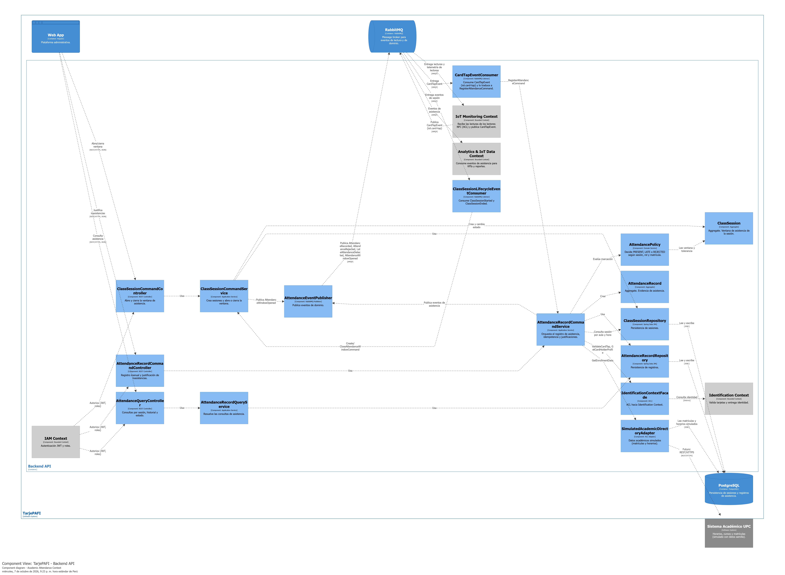
</p>

### 5.2.7. Bounded Context Software Architecture Code Level Diagrams

#### 5.2.7.1. Bounded Context Domain Layer Class Diagrams

<p align="center">
  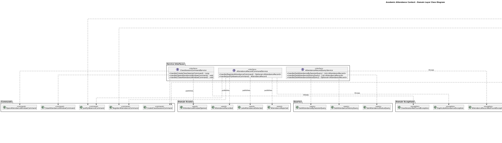
</p>


#### 5.2.7.2. Bounded Context Database Design Diagram

<p align="center">
  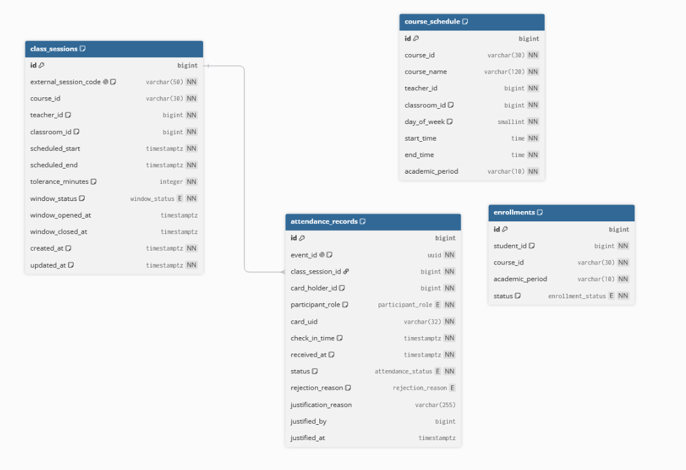
</p>


## 5.3. Bounded Context: Space and Facility Context

El Space and Facility Context es el bounded context núcleo (*core*) encargado de administrar la infraestructura física del campus universitario (aulas, laboratorios, cubículos de estudio, oficinas y torniquetes de acceso), regular la ocupación y aforo en tiempo real, validar los permisos de paso físico y gestionar la activación presencial de reservas de ambientes mediante interacciones NFC y lectores IoT. Su propósito principal es garantizar la seguridad física del recinto, evitar el acaparamiento de espacios de estudio asegurando un uso equitativo y mantener una correspondencia estricta entre la presencia física real y el estado del campus.

En la arquitectura de TarjePAFI, los estudiantes, docentes y trabajadores no acceden a aplicaciones web ni móviles para reservar o consultar disponibilidad. Su interacción con este contexto es estrictamente física, aproximando su credencial física NFC a los lectores ESP32 ubicados en torniquetes de ingreso, puertas restringidas y mesas de cubículos. La única interfaz digital existente es la Web App responsive (Angular), reservada de forma exclusiva para el Personal Administrativo (`ADMIN`) para dar de alta espacios, configurar políticas y supervisar métricas de ocupación en vivo.

**Reglas de negocio principales**

- **Flujo de ingreso y salida general del campus:** Toda persona que ingrese o salga del recinto universitario debe presentar su credencial física en los torniquetes. El sistema valida la vigencia de la tarjeta contra el registro institucional; si es válida, emite `ActivarEntrada` (`AccesoConcedido`) y franquea el paso. Al salir, el lector registra `ActivarSalida`, actualizando dinámicamente el conteo de personas presentes en la institución. Intentos con credenciales dadas de baja o suspendidas son rechazados con `AccesoDenegado`.

- **Flujo de control de zonas restringidas y exclusivas:** Las puertas de ambientes especializados (oficinas docentes, laboratorios de investigación, almacenes o salas de servidores) evalúan el rol institucional (`STUDENT`, `TEACHER`, `STAFF`, `ADMIN`) y los permisos de la credencial. Si un estudiante intenta franquear una puerta exclusiva para trabajadores o docentes, se genera `AccesoDenegado`. Los trabajadores con rol asignado reciben `AccesoConcedido`.

- **Flujo de activación de reservas y regla de oro de los 10 minutos (Anti-acaparamiento):** Las reservas de cubículos y laboratorios son programadas por la administración o provienen de la planificación institucional. Para hacer uso del ambiente, el estudiante titular debe presentarse físicamente y aproximar su tarjeta al lector ESP32 de la mesa del cubículo (`ActivarReserva`). Si la tarjeta coincide con la reserva vigente, se emite `ReservaActivada` y el espacio cambia su estado a ocupado. Si la tarjeta no coincide con la reserva, se detecta espacio incorrecto y se emite `ActivacionFallida` (`RechazarReserva`). Si transcurren los primeros diez (10) minutos de la franja horaria sin que el titular valide su presencia física (`Ausencia del espacio reservado`), el sistema cancela automáticamente la reserva, emite `ReservaPerdida` (`ReservationForfeited`), libera el cubículo para su reaprovechamiento y despacha un correo de notificación al titular.

- **Validación de aforo y capacidad máxima:** Ningún espacio físico puede admitir ingresos que excedan su capacidad declarada (`capacity`).

- **Auditoría inmutable de accesos:** Todo contacto físico de una tarjeta genera un registro inmutable de auditoría (`AccessRecord`), capturando el instante original, lector, espacio, titular, decisión y motivo de rechazo.

**Datos externos simulados**

Los espacios físicos, sus lectores asignados y las reservas programadas se inicializan mediante datos semilla en PostgreSQL. Cuando exista la integración plena con el Sistema de Infraestructura y Horarios de la UPC, solo se requerirá implementar el adaptador REST/HTTPS correspondiente sin alterar el núcleo de dominio.

**Integración con IoT Monitoring Context**

Las lecturas físicas no se reciben de manera directa desde las antenas de los lectores ESP32. El IoT Monitoring Context procesa las tramas de hardware, las normaliza mediante su Anti-Corruption Layer (ACL) y publica el evento desacoplado `CardTapEvent` a través de RabbitMQ. El Space and Facility Context consume este evento, mapea la ubicación del dispositivo (`spaceId`) con el ambiente correspondiente, resuelve la identidad del titular consultando a IAM / Identification Context y aplica la política de acceso o activación.

### 5.3.1. Domain Layer

En esta capa se encapsulan las reglas de negocio de la infraestructura: la gestión de espacios, la activación y pérdida de reservas por inasistencia, y la evaluación de acceso físico según zonificación y aforo.

**Aggregate: `Space`**

Representa un ambiente o punto de control físico del campus (aula, cubículo, laboratorio, torniquete de ingreso) y controla su capacidad, aforo en vivo y estado operativo.

| Atributos | Tipo de dato | Visibilidad | Descripción |
|---|---|---|---|
| id | Long | Private | Identificador único del espacio. |
| spaceCode | SpaceCode | Private | Código institucional del ambiente (ej. "SM-ENT-01", "SM-CUB-204"). Es único. |
| name | String | Private | Nombre descriptivo del ambiente o punto de acceso. |
| spaceType | SpaceType | Private | Tipo: `CAMPUS_ENTRANCE`, `STUDY_CUBICLE`, `CLASSROOM`, `LABORATORY`, `RESTRICTED_OFFICE`. |
| location | SpaceLocation | Private | Ubicación física: campus, pabellón, piso y detalle referencia. |
| capacity | Capacity | Private | Capacidad máxima autorizada de personas. |
| currentOccupancy | OccupancyCount | Private | Conteo de personas presentes en tiempo real. |
| status | SpaceStatus | Private | Estado del espacio: `AVAILABLE`, `OCCUPIED`, `MAINTENANCE`, `RESERVED`. |
| accessPolicy | AccessPolicyType | Private | Política: `OPEN_CAMPUS`, `RESERVATION_REQUIRED`, `RESTRICTED_STAFF_ONLY`. |

| Métodos | Tipo de retorno | Visibilidad | Descripción |
|---|---|---|---|
| getX() | — | Public | Getters de cada atributo (`getId()`, `getSpaceCode()`, `getStatus()`, `getCapacity()`, etc.). |
| Space(CreateSpaceCommand) | Constructor | Public | Inicializa un espacio en estado `AVAILABLE` con ocupación en 0. |
| incrementOccupancy() | void | Public | Incrementa el conteo de personas y conmuta a `OCCUPIED`. Lanza `CapacityExceededException` si excede la capacidad. |
| decrementOccupancy() | void | Public | Reduce el conteo de ocupantes. Si llega a 0, conmuta el estado a `AVAILABLE`. |
| markAsReserved() | void | Public | Establece el espacio en estado `RESERVED`. Lanza `SpaceNotAvailableException` si no está disponible. |
| releaseReservation() | void | Public | Conmuta el estado de `RESERVED` a `AVAILABLE` cuando se cancela o pierde una reserva. |
| setMaintenance(boolean) | void | Public | Establece o retira el estado de mantenimiento (`MAINTENANCE`). |
| canAccommodate(int) | boolean | Public | Valida si un nuevo ingreso no transgrede el límite de capacidad. |

**Aggregate: `SpaceReservation`**

Controla el ciclo de vida de una reserva programada en un ambiente de estudio y gobierna la regla de tolerancia presencial de 10 minutos.

| Atributos | Tipo de dato | Visibilidad | Descripción |
|---|---|---|---|
| id | Long | Private | Identificador único de la reserva. |
| reservationCode | ReservationCode | Private | Código único de la reserva asignada (ej. "RES-2026-10492"). |
| spaceId | SpaceId | Private | Espacio físico reservado (ej. cubículo o laboratorio). |
| cardHolderId | CardHolderId | Private | Titular al que fue asignado el espacio. |
| timeSlot | TimeSlot | Private | Franja horaria que encapsula `startTime` y `endTime`. |
| status | ReservationStatus | Private | Estado: `CONFIRMED`, `CHECKED_IN`, `COMPLETED`, `CANCELLED`, `FORFEITED`. |
| checkInWindowEnd | Instant | Private | Límite máximo para marcación presencial con tarjeta (`startTime + 10 minutos`). |
| checkedInAt | Instant | Private | Instante de lectura física de la tarjeta en la mesa del cubículo. Nulo si no se marcó. |
| createdAt | Instant | Private | Fecha y hora en que se registró la reserva. |

| Métodos | Tipo de retorno | Visibilidad | Descripción |
|---|---|---|---|
| getX() | — | Public | Getters de cada atributo. |
| SpaceReservation(CreateReservationCommand) | Constructor | Public | Crea la reserva en estado `CONFIRMED` y computa `checkInWindowEnd = startTime + 10 min`. |
| checkIn(Instant, CardHolderId) | void | Public | Activa presencialmente la reserva (`ReservaActivada`). Lanza excepción si el titular no coincide o si la ventana expiró. |
| forfeit(Instant) | void | Public | Da por perdida la reserva (`ReservaPerdida`) por vencimiento de los 10 minutos sin tap físico. |
| cancel(Instant) | void | Public | Cancela administrativamente la reserva. |
| isCheckInExpired(Instant) | boolean | Public | Evalúa si el instante actual superó `checkInWindowEnd` sin que exista marcación física. |
| coversInstant(Instant) | boolean | Public | Indica si un instante cae dentro de la franja programada `[startTime, endTime]`. |

**Aggregate: `AccessRecord`**

Representa la evidencia inmutable de que un titular aproximó su credencial a un lector de torniquete, puerta o mesa. Almacena tanto accesos concedidos como denegados para auditoría de seguridad.

| Atributos | Tipo de dato | Visibilidad | Descripción |
|---|---|---|---|
| id | Long | Private | Identificador único del registro de acceso. |
| eventId | ReaderEventId | Private | Identificador único del evento de lectura. Garantiza la idempotencia. |
| spaceId | SpaceId | Private | Espacio físico o punto de control donde ocurrió el tap. |
| cardHolderId | CardHolderId | Private | Titular de la credencial física (resuelto vía IAM). Nulo si la tarjeta no es válida. |
| cardUid | CardUid | Private | UID hexadecimal de la tarjeta NFC física utilizada. |
| attemptedAt | Instant | Private | Hora física original generada por el lector ESP32 (no la de recepción). |
| accessType | AccessType | Private | Tipo de interacción: `CAMPUS_ENTRY`, `CAMPUS_EXIT`, `RESTRICTED_ACCESS`, `CUBICLE_CHECK_IN`. |
| decision | AccessDecision | Private | Decisión tomada por el sistema: `GRANTED` o `DENIED`. |
| denialReason | DenialReason | Private | Motivo del rechazo. Es nulo si el acceso fue concedido. |

| Métodos | Tipo de retorno | Visibilidad | Descripción |
|---|---|---|---|
| getX() | — | Public | Getters de cada atributo. |
| AccessRecord(CreateAccessRecordCommand, AccessDecision, DenialReason) | Constructor | Public | Inicializa el registro persistente de auditoría con la decisión resuelta. |

**Domain Service: `SpaceAccessPolicy`**

Concentra las reglas de negocio de seguridad física y activación presencial, combinando las políticas del ambiente, el rol del titular, el aforo y la existencia de reservas vigentes.

| Método | Descripción |
|---|---|
| evaluateAccess(Space, CardHolderId, ParticipantRole, AccessType, Optional<SpaceReservation>, Instant) | Devuelve un `AccessDecisionResult` con la decisión (`GRANTED` o `DENIED`) y el motivo de rechazo en caso denegado. |

Reglas que aplica, en orden:

1. **Espacio en mantenimiento:** Si el ambiente está en `MAINTENANCE`, `DENIED` con `SPACE_IN_MAINTENANCE`.
2. **Tarjeta no válida o suspendida:** Si el titular no está activo en IAM, `DENIED` con `CARD_INACTIVE`.
3. **Paso por puerta restringida / exclusiva:** Si la política es `RESTRICTED_STAFF_ONLY` y el rol es `STUDENT`, `DENIED` con `UNAUTHORIZED_ROLE`.
4. **Activación de reserva de cubículo (mesa):**
   - Si no existe reserva activa para esa franja horaria: `DENIED` con `NO_ACTIVE_RESERVATION`.
   - Si la reserva pertenece a otro usuario: `DENIED` con `WRONG_RESERVATION_HOLDER` (`Espacio reservado incorrecto`).
   - Si el instante supera los 10 minutos de tolerancia: `DENIED` con `CHECK_IN_WINDOW_EXPIRED` (`Ausencia del espacio reservado`).
5. **Control de capacidad máxima:** Si el espacio está al 100% de aforo y el evento es de entrada, `DENIED` con `CAPACITY_FULL`.
6. **Validación exitosa de torniquete o puerta:** Si cumple todas las condiciones, `GRANTED` con `NONE`.

**Value Objects**

| Value Object | Descripción |
|---|---|
| SpaceId | Registro que envuelve el identificador único del espacio. Valida que no sea nulo ni menor o igual a cero. |
| ReservationId | Registro que representa el identificador único de una reserva. Valida identificador positivo. |
| SpaceCode | Código institucional del espacio (ej. "SM-TOR-01", "SM-CUB-10"). Valida que no esté en blanco. |
| ReservationCode | Código alfanumérico único representativo de una reserva. Valida formato estandarizado. |
| CardHolderId | Registro que representa el identificador del titular de la credencial en el campus. |
| CardUid | Registro con el UID hexadecimal de la tarjeta física. Valida formato y longitud máxima de 32 caracteres. |
| ReaderEventId | Envoltorio del UUID generado por el lector IoT para garantizar idempotencia en la ingesta. |
| TimeSlot | Encapsula el rango temporal `startTime` y `endTime`. Valida que el fin sea posterior al inicio. |
| Capacity | Registro que define la capacidad máxima de personas autorizadas (entero mayor a cero). |
| OccupancyCount | Registro con el conteo de personas presentes en un instante (entero mayor o igual a cero). |
| SpaceLocation | Registro estructurado con `campus`, `building`, `floorNumber` y `referenceDescription`. |
| SpaceType | Enumeración: `CAMPUS_ENTRANCE`, `STUDY_CUBICLE`, `CLASSROOM`, `LABORATORY`, `RESTRICTED_OFFICE`. |
| SpaceStatus | Enumeración: `AVAILABLE`, `OCCUPIED`, `MAINTENANCE`, `RESERVED`. |
| ReservationStatus | Enumeración: `CONFIRMED`, `CHECKED_IN`, `COMPLETED`, `CANCELLED`, `FORFEITED`. |
| AccessPolicyType | Enumeración: `OPEN_CAMPUS`, `RESERVATION_REQUIRED`, `RESTRICTED_STAFF_ONLY`. |
| AccessType | Enumeración: `CAMPUS_ENTRY`, `CAMPUS_EXIT`, `RESTRICTED_ACCESS`, `CUBICLE_CHECK_IN`. |
| AccessDecision | Enumeración: `GRANTED`, `DENIED`. |
| DenialReason | Enumeración: `NONE`, `UNAUTHORIZED_ROLE`, `NO_ACTIVE_RESERVATION`, `WRONG_RESERVATION_HOLDER`, `CHECK_IN_WINDOW_EXPIRED`, `CAPACITY_FULL`, `SPACE_IN_MAINTENANCE`, `CARD_INACTIVE`. |

**Domain Events (publicados)**

| Evento | Se publica cuando | Datos principales |
|---|---|---|
| CampusEntryGranted | Se valida el acceso en torniquetes de entrada (`ActivarEntrada`). | eventId, spaceId, cardHolderId, cardUid, timestamp. |
| CampusExitRecorded | Se registra la salida física del campus (`ActivarSalida`). | eventId, spaceId, cardHolderId, cardUid, timestamp. |
| SpaceAccessDenied | Se bloquea el acceso en una puerta o torniquete (`AccesoDenegado`). | eventId, spaceId, cardHolderId, denialReason, timestamp. |
| ReservationActivated | El titular valida su tarjeta en el cubículo (`ReservaActivada`). | reservationId, spaceId, cardHolderId, checkedInAt. |
| ReservationActivationFailed | Se pasa una tarjeta no autorizada en el cubículo (`ActivacionFallida`). | eventId, spaceId, cardUid, denialReason, timestamp. |
| ReservationForfeited | Se cancela la reserva a los 10 min por inasistencia (`ReservaPerdida`). | reservationId, spaceId, cardHolderId, forfeitedAt. |
| SpaceOccupied | El aforo de un ambiente se incrementa o pasa a ocupado. | spaceId, currentOccupancy, timestamp. |
| SpaceReleased | Un ambiente se desocupa y vuelve a quedar libre. | spaceId, currentOccupancy, timestamp. |

**Excepciones de Dominio**

| Excepción | Descripción |
|---|---|
| SpaceNotFoundException | Se lanza cuando no se encuentra un ambiente por su ID o por su código. |
| ReservationNotFoundException | Se lanza cuando no se encuentra la reserva solicitada. |
| SpaceNotAvailableException | Se lanza al intentar programar o activar un ambiente no disponible o en mantenimiento. |
| ReservationConflictException | Se lanza cuando dos reservas colisionan en la misma franja horaria. |
| CapacityExceededException | Se lanza ante un intento de ingreso que sobrepase la capacidad máxima del ambiente. |
| UnauthorizedSpaceAccessException | Se lanza ante intentos de ingreso a áreas prohibidas o sin credencial válida. |
| DuplicateAccessEventException | Se lanza cuando el `eventId` de la lectura ya fue procesado previamente. |

**Interfaz: `SpaceCommandService`**

| Método | Descripción |
|---|---|
| handle(CreateSpaceCommand) | Crea un nuevo ambiente en el catálogo y retorna su identificador. |
| handle(UpdateSpaceStatusCommand) | Modifica el estado del espacio (disponible, mantenimiento). |

**Interfaz: `SpaceReservationCommandService`**

| Método | Descripción |
|---|---|
| handle(CreateReservationCommand) | Registra administrativamente una reserva programada en el sistema. |
| handle(CancelReservationCommand) | Cancela administrativamente una reserva vigente. |
| handle(ForfeitExpiredReservationsCommand) | Ejecuta el barrido y cancelación de reservas que superaron los 10 min sin tap presencial. |

**Interfaz: `AccessRecordCommandService`**

| Método | Descripción |
|---|---|
| handle(ProcessCardTapAccessCommand) | Procesa la lectura NFC física: evalúa la política, registra la entrada/salida o check-in de cubículo, persiste el `AccessRecord` y publica el evento de dominio. |

**Interfaz: `SpaceQueryService`**

| Método | Descripción |
|---|---|
| handle(GetSpaceByIdQuery) | Obtiene los detalles de un espacio físico por su ID. |
| handle(GetAllSpacesQuery) | Retorna el listado completo de espacios y su estado para la plataforma administrativa. |
| handle(GetSpaceOccupancyQuery) | Consulta el aforo actual y nivel de ocupación en tiempo real. |

**Interfaz: `SpaceReservationQueryService`**

| Método | Descripción |
|---|---|
| handle(GetReservationByIdQuery) | Recupera los datos de una reserva por su identificador. |
| handle(GetActiveReservationsBySpaceQuery) | Obtiene la reserva vigente programada para un ambiente específico. |

### 5.3.2. Interface Layer

La capa de interfaz expone controladores RESTful destinados **exclusivamente al personal administrativo (`ADMIN`)** autenticado mediante tokens JWT emitidos por IAM, y consumidores de RabbitMQ responsables de recibir todas las interacciones físicas de las tarjetas de los usuarios.

**Controlador: `SpaceCommandController`**

Permite a la administración gestionar la infraestructura del campus.

| Método | Ruta | Acceso | Descripción |
|---|---|---|---|
| createSpace | POST /api/v1/admin/spaces | ADMIN | Registra una nueva instalación física o punto de control. |
| updateSpaceStatus | PATCH /api/v1/admin/spaces/{spaceId}/status | ADMIN | Cambia el estado operativo de un espacio (ej. mantenimiento). |

**Controlador: `SpaceReservationCommandController`**

Permite a la administración cargar y programar reservas en el campus.

| Método | Ruta | Acceso | Descripción |
|---|---|---|---|
| createReservation | POST /api/v1/admin/spaces/{spaceId}/reservations | ADMIN | Registra una reserva programada para un titular. |
| cancelReservation | POST /api/v1/admin/reservations/{reservationId}/cancel | ADMIN | Cancela administrativamente una reserva programada. |

**Controlador: `SpaceQueryController`**

Expone consultas para los tableros administrativos de supervisión.

| Método | Ruta | Acceso | Descripción |
|---|---|---|---|
| getAllSpaces | GET /api/v1/admin/spaces | ADMIN | Lista la totalidad de espacios físicos y puntos de control. |
| getSpaceById | GET /api/v1/admin/spaces/{spaceId} | ADMIN | Devuelve el detalle y especificaciones de un espacio. |
| getSpaceOccupancy | GET /api/v1/admin/spaces/{spaceId}/occupancy | ADMIN | Retorna el aforo en tiempo real y el porcentaje de ocupación. |

**Controlador: `SpaceReservationQueryController`**

| Método | Ruta | Acceso | Descripción |
|---|---|---|---|
| getReservationById | GET /api/v1/admin/reservations/{reservationId} | ADMIN | Devuelve la información detallada de una reserva. |
| getActiveReservations | GET /api/v1/admin/reservations/active | ADMIN | Lista las reservas actualmente en curso en el campus. |

**Consumidores de mensajería (inbound)**

Es el canal de entrada por el cual los estudiantes, docentes y trabajadores interactúan con este contexto.

| Consumidor | Cola / Routing key | Descripción |
|---|---|---|
| SpaceCardTapEventConsumer | `space.card-tap.queue` / `iot.card-tap` | Recibe `CardTapEvent` desde IoT Monitoring. Identifica la naturaleza del punto de lectura (`spaceType`) y lo traduce en un `ProcessCardTapAccessCommand` para que la capa de aplicación evalúe la entrada, salida, acceso a zona restringida o check-in presencial en cubículo. |

**Recursos (DTOs)**

| Recurso | Descripción |
|---|---|
| CreateSpaceResource | Datos de alta de ambiente: spaceCode, name, spaceType, campus, building, floorNumber, capacity, accessPolicy. |
| CreateReservationResource | Datos de registro de reserva: reservationCode, cardHolderId, startTime, endTime. |
| SpaceResource | Respuesta de espacio: id, spaceCode, name, spaceType, location, capacity, currentOccupancy, status, accessPolicy. |
| SpaceReservationResource | Respuesta de reserva: id, reservationCode, spaceId, cardHolderId, startTime, endTime, status, checkInWindowEnd, checkedInAt. |
| SpaceOccupancyResource | Respuesta de aforo: spaceId, spaceCode, capacity, currentOccupancy, status, isFull. |
| CardTapEventResource | Mensaje entrante de hardware: eventId, readerId, spaceId, cardUid, tappedAt. |

**Assemblers (Transformadores)**

| Assembler | Descripción |
|---|---|
| CreateSpaceCommandFromResourceAssembler | Convierte un `CreateSpaceResource` en un `CreateSpaceCommand`. |
| CreateReservationCommandFromResourceAssembler | Convierte un `CreateReservationResource` en un `CreateReservationCommand`. |
| ProcessCardTapAccessCommandFromEventAssembler | Convierte un `CardTapEventResource` entrante de RabbitMQ en un `ProcessCardTapAccessCommand`. |
| SpaceResourceFromEntityAssembler | Convierte la entidad de agregado `Space` en un `SpaceResource`. |
| SpaceReservationResourceFromEntityAssembler | Convierte la entidad `SpaceReservation` en un `SpaceReservationResource`. |
| SpaceOccupancyResourceFromEntityAssembler | Convierte el estado de un `Space` en un `SpaceOccupancyResource`. |

### 5.3.3. Application Layer

Los servicios internos orquestan la validación de identidades, aplican la política de accesos, garantizan la idempotencia de las lecturas físicas, coordinan la persistencia en PostgreSQL y publican los eventos de dominio hacia RabbitMQ.

**Clase: `AccessRecordCommandServiceImpl`**

| Título | AccessRecordCommandServiceImpl |
|---|---|
| Descripción | Implementación del servicio de comandos para procesar los taps físicos. Flujo de `ProcessCardTapAccessCommand`: (1) verifica idempotencia con `eventId` en `AccessRecordRepository`; si ya fue procesado, descarta la lectura; (2) consulta `IdentificationContextFacade.validateCardTap(cardUid)` para resolver la titularidad, rol institucional (`STUDENT`, `TEACHER`, `STAFF`) y vigencia de la tarjeta; (3) recupera la entidad `Space` asociada al lector; (4) si el espacio es un cubículo (`STUDY_CUBICLE`), recupera la reserva activa programada; (5) evalúa la marcación mediante `SpaceAccessPolicy`; (6) si es denegado, persiste el `AccessRecord` con `DENIED` y motivo, y publica `SpaceAccessDenied` o `ReservationActivationFailed`; (7) si es concedido: en torniquete de ingreso incrementa el aforo del campus y publica `CampusEntryGranted` (`ActivarEntrada`); en torniquete de salida reduce el aforo y publica `CampusExitRecorded` (`ActivarSalida`); en puerta restringida franquea el paso y publica `AccessGranted`; en cubículo ejecuta `reservation.checkIn()`, cambia el espacio a `OCCUPIED` y publica `ReservationActivated` (`ReservaActivada`); (8) persiste el `AccessRecord` para auditoría. |

| Dependencia | Descripción |
|---|---|
| AccessRecordRepository | Persistencia de registros de acceso y validación de idempotencia. |
| SpaceRepository | Persistencia y modificación de estado y aforo de los espacios físicos. |
| SpaceReservationRepository | Consulta y actualización de estado de reservas. |
| SpaceAccessPolicy | Servicio de dominio con las reglas de acceso y check-in. |
| IdentificationContextFacade | Puerto de salida (ACL) hacia IAM / Identification Context. |
| SpaceEventPublisher | Puerto de salida para publicar eventos de dominio hacia RabbitMQ. |

**Clase: `SpaceReservationCommandServiceImpl`**

| Título | SpaceReservationCommandServiceImpl |
|---|---|
| Descripción | Servicio que orquesta el alta y cancelación administrativa de reservas, así como la ejecución del barrido por inasistencia (Regla de 10 minutos). Para `ForfeitExpiredReservationsCommand`: recupera todas las reservas en estado `CONFIRMED` cuyo `checkInWindowEnd` sea anterior a la hora actual sin marcación física; invoca `reservation.forfeit()`, libera el cubículo (`space.releaseReservation()`), persiste los cambios, publica `ReservationForfeited` (`ReservaPerdida`) y ordena el despacho del correo de aviso vía `NotificationServicePort`. |

| Dependencia | Descripción |
|---|---|
| SpaceReservationRepository | Persistencia transaccional de reservas. |
| SpaceRepository | Actualización de disponibilidad de los cubículos. |
| SpaceEventPublisher | Publicación del evento `ReservationForfeited` hacia RabbitMQ[cite: 48, 59]. |
| NotificationServicePort | Puerto de salida para el envío asíncrono de correos transaccionales. |

**Clase: `SpaceCommandServiceImpl`**

| Título | SpaceCommandServiceImpl |
|---|---|
| Descripción | Implementación para el registro administrativo y actualización de estado operativo de las instalaciones del campus. |

| Dependencia | Descripción |
|---|---|
| SpaceRepository | Persistencia de espacios físicos. |

**Clase: `SpaceQueryServiceImpl` y `SpaceReservationQueryServiceImpl`**

| Título | SpaceQueryServiceImpl / SpaceReservationQueryServiceImpl |
|---|---|
| Descripción | Servicios encargados de responder consultas sobre aforos, disponibilidad e inventario de espacios para la plataforma web administrativa. |

| Dependencia | Descripción |
|---|---|
| SpaceRepository | Acceso de lectura a espacios. |
| SpaceReservationRepository | Acceso de lectura a reservas. |

**Puertos de salida (Anti-Corruption Layer)**

| Puerto | Descripción |
|---|---|
| IdentificationContextFacade | Interfaz hacia Identification / IAM Context para consultar la vigencia de la credencial y el rol del titular sin acoplar el modelo interno de usuarios. |
| SpaceEventPublisher | Interfaz para publicar `CampusEntryGranted`, `CampusExitRecorded`, `SpaceAccessDenied`, `ReservationActivated`, `ReservationForfeited`, `SpaceOccupied` y `SpaceReleased`. |
| NotificationServicePort | Interfaz hacia el servicio de correo transaccional para notificar al estudiante sobre la pérdida del cubículo por inasistencia. |

### 5.3.4. Infrastructure Layer

Esta capa implementa la persistencia mediante Spring Data JPA sobre PostgreSQL, la mensajería asíncrona con RabbitMQ, la tarea programada para la regla de los 10 minutos y los adaptadores de salida.

**Clase: `SpaceRepository`**

| Título | SpaceRepository |
|---|---|
| Descripción | Interfaz de persistencia para espacios físicos e infraestructura. |

| Método | Descripción |
|---|---|
| findById(Long) | Recupera un espacio por su ID. |
| findBySpaceCode(SpaceCode) | Recupera un espacio por su código institucional. |
| findAll() | Retorna la totalidad de ambientes registrados. |
| save(Space) | Persiste o actualiza el espacio en PostgreSQL. |

**Clase: `SpaceReservationRepository`**

| Título | SpaceReservationRepository |
|---|---|
| Descripción | Interfaz de persistencia para reservas de ambientes. |

| Método | Descripción |
|---|---|
| findById(Long) | Recupera una reserva por su ID. |
| findActiveBySpaceAndInstant(SpaceId, Instant) | Localiza la reserva vigente de un espacio en un instante dado. |
| findExpiredPendingReservations(Instant) | Retorna las reservas en estado `CONFIRMED` cuyo `checkInWindowEnd` es menor al instante actual. |
| save(SpaceReservation) | Persiste o actualiza la reserva. |

**Clase: `AccessRecordRepository`**

| Título | AccessRecordRepository |
|---|---|
| Descripción | Interfaz de persistencia para el registro de auditoría de accesos. |

| Método | Descripción |
|---|---|
| findById(Long) | Recupera un registro por su ID. |
| existsByEventId(ReaderEventId) | Verifica si una lectura NFC ya fue procesada (idempotencia). |
| save(AccessRecord) | Persiste el registro inmutable de acceso. |

**Adaptadores, infraestructura y tareas en segundo plano**

| Clase | Descripción |
|---|---|
| RabbitMqSpaceConfig | Declara el exchange `tarjepafi.events` (topic), la cola `space.card-tap.queue`, bindings de enrutamiento con la routing key `iot.card-tap` y la *dead-letter queue* para contingencias. |
| RabbitSpaceEventPublisher | Implementa `SpaceEventPublisher`; publica los eventos hacia RabbitMQ con routing keys específicas (`space.campus-entry.granted`, `space.access.denied`, `space.reservation.activated`, `space.reservation.forfeited`, etc.). |
| IdentificationContextFacadeImpl | Implementa `IdentificationContextFacade` consultando internamente el contrato de IAM / Identification. |
| EmailNotificationAdapter | Implementa `NotificationServicePort` integrando Spring Mail / SendGrid para despachar el correo de aviso cuando un cubículo es liberado por inasistencia. |
| ReservationToleranceScheduler | Tarea programada en segundo plano (`@Scheduled(fixedRate = 60000)`) que se ejecuta cada minuto. Invoca `ForfeitExpiredReservationsCommand`, localiza reservas sin presencia física pasados los 10 minutos, cancela la reserva, libera el cubículo y dispara la alerta. |

**Decisiones de infraestructura**

- **Garantía absoluta de idempotencia:** Se establece una restricción `UNIQUE` sobre la columna `event_id` en la tabla `access_records`, respaldada por la verificación previa `existsByEventId` en el consumidor.
- **Bloqueo optimista (@Version):** Se implementa control de concurrencia optimista en `Space` y `SpaceReservation` para proteger el aforo y evitar colisiones de asignación de espacios ante peticiones concurrentes.
- **Aislamiento en notificaciones:** El envío de correos ante reservas desestimadas se ejecuta de forma asíncrona (`@Async`), garantizando que una indisponibilidad temporal del servidor SMTP no interrumpa la transacción de liberación del espacio en PostgreSQL.

### 5.3.6. Bounded Context Software Architecture Component Level Diagrams

A continuación se presenta la descomposición en componentes del contenedor Backend API para el Space and Facility Context, modelada bajo el estándar C4 Model Component Level en lenguaje Structurizr DSL.

<p align="center">
  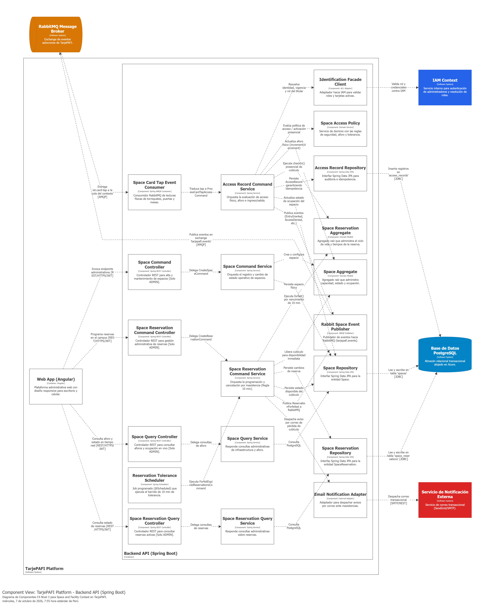
</p>

### 5.3.7. Bounded Context Software Architecture Code Level Diagrams

#### 5.3.7.1. Bounded Context Domain Layer Class Diagrams

A continuación se presenta el diagrama de clases del modelo de dominio del Space and Facility Context, modelado en PlantUML con sus agregados, entidades, value objects, domain services, interfaces de repositorio y relaciones estructuradas con visibilidad y multiplicidad.

<p align="center">
  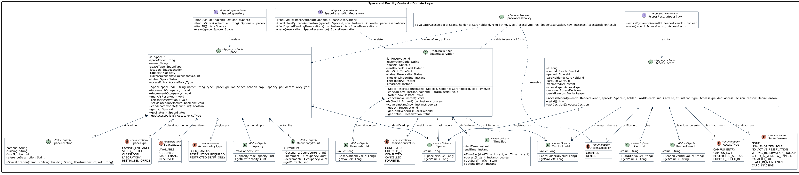
</p>

#### 5.3.7.2. Bounded Context Database Design Diagram

A continuación se presenta el diseño de base de datos relacional para PostgreSQL especificado en sintaxis DBML (dbdiagram.io). Incluye las restricciones de unicidad sobre event_id para garantizar idempotencia, control de concurrencia optimista (version) y los índices necesarios para soportar la regla de tolerancia de 10 minutos.

<p align="center">
  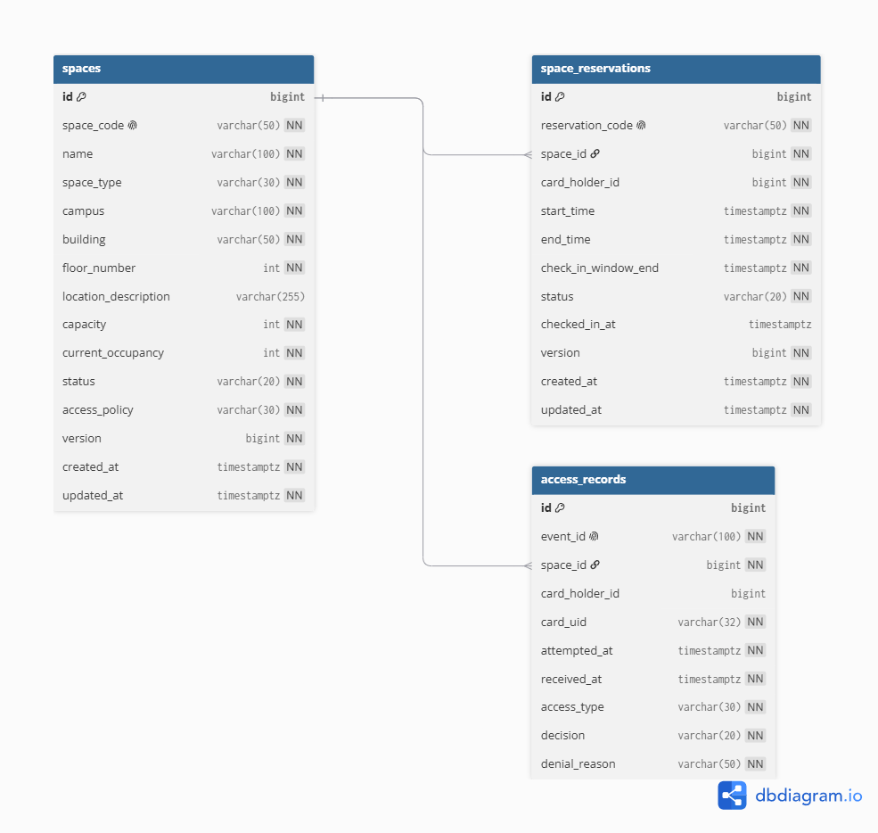
</p>

## 5.4. Bounded Context: IoT Monitoring Context

El **IoT Monitoring Context** concentra las responsabilidades relacionadas con la gestión y supervisión de los lectores NFC y dispositivos IoT distribuidos dentro del campus universitario. Este bounded context permite registrar los dispositivos, asociarlos a una ubicación, configurar sus parámetros de funcionamiento, conocer su estado operativo y procesar la telemetría generada durante su funcionamiento.

Asimismo, funciona como la capa de integración entre los dispositivos físicos y los demás bounded contexts de TarjePAFI. Las lecturas producidas por los lectores NFC son recibidas y transformadas en eventos comprensibles para el dominio, evitando que **Academic Attendance Context** y **Space and Facility Context** dependan directamente de los protocolos o formatos específicos utilizados por el hardware.

Para mantener aislado el dominio de los detalles propios de los dispositivos, se aplica una **Anti-Corruption Layer (ACL)** encargada de adaptar los mensajes recibidos desde los lectores NFC/IoT antes de que sean procesados por la aplicación. De esta forma, cambios futuros en el fabricante, protocolo o estructura de mensajes de los dispositivos no afectan directamente las reglas de negocio del sistema.

Este bounded context mantiene relaciones principalmente con **IAM Context**, para validar los permisos de los administradores que gestionan dispositivos; con **Academic Attendance Context** y **Space and Facility Context**, a los cuales proporciona eventos generados por las lecturas físicas; y con **Data Management Context**, al que publica información de telemetría y estado de los dispositivos para la generación de reportes e indicadores.


### 5.4.1. Domain Layer

La **Domain Layer** representa el núcleo del IoT Monitoring Context y contiene las clases responsables de modelar los lectores IoT, su configuración, estado operativo y reglas asociadas al monitoreo de dispositivos. Esta capa permanece independiente de tecnologías específicas como Spring Boot, PostgreSQL o RabbitMQ, concentrándose únicamente en las reglas propias del dominio.

Las principales clases identificadas para esta capa son las siguientes.

#### Aggregate Root

##### IoTReader

`IoTReader` constituye el **Aggregate Root** principal del bounded context. Representa un lector NFC o dispositivo IoT registrado en TarjePAFI y mantiene el estado consistente de toda la información relacionada con dicho dispositivo.

**Propósito:** gestionar el ciclo de vida de un lector IoT, su configuración, ubicación, estado operativo y las principales acciones permitidas sobre el dispositivo.

**Atributos principales:**

- `readerId`: identificador único del lector.
- `name`: nombre asignado al dispositivo.
- `deviceType`: tipo de dispositivo registrado.
- `location`: ubicación dentro del campus.
- `configurationProfile`: configuración actualmente aplicada.
- `status`: estado operativo actual del lector.
- `registeredAt`: fecha y hora de registro.
- `lastSeenAt`: fecha y hora de la última comunicación recibida.
- `health`: información sobre el estado de funcionamiento del dispositivo.

**Métodos principales:**

- `register()`: registra el dispositivo dentro del sistema.
- `activate()`: cambia el dispositivo a estado activo.
- `deactivate()`: desactiva el lector.
- `configure(ConfigurationProfile profile)`: aplica una nueva configuración.
- `updateLastSeen()`: actualiza la fecha de la última comunicación recibida.
- `updateHealth(DeviceHealth health)`: actualiza el estado de salud del dispositivo.
- `markOffline()`: establece el dispositivo como desconectado.
- `canProcessEvents()`: determina si el dispositivo se encuentra habilitado para generar eventos.

`IoTReader` controla las reglas que garantizan que únicamente dispositivos registrados, correctamente configurados y en estado operativo puedan participar en los procesos del sistema.


#### Entities

##### DeviceTelemetry

`DeviceTelemetry` representa una observación generada por un dispositivo IoT durante su funcionamiento.

**Propósito:** mantener la información operativa enviada periódicamente por los lectores para supervisar su conectividad y comportamiento.

**Atributos principales:**

- `telemetryId`: identificador único de la lectura.
- `readerId`: identificador del dispositivo que produjo la información.
- `capturedAt`: fecha y hora de captura.
- `signalStrength`: intensidad de la señal reportada.
- `uptime`: tiempo de funcionamiento del dispositivo.
- `firmwareVersion`: versión de firmware reportada.
- `status`: estado comunicado por el dispositivo.

**Métodos principales:**

- `isRecent()`: determina si la telemetría corresponde a un periodo reciente.
- `indicatesFailure()`: identifica condiciones que pueden representar una falla.
- `belongsTo(ReaderId readerId)`: valida la relación de la telemetría con un lector determinado.


##### DeviceIncident

`DeviceIncident` representa una anomalía detectada durante el funcionamiento de un lector.

**Propósito:** registrar de forma trazable situaciones como pérdida de conectividad, errores de lectura o funcionamiento degradado.

**Atributos principales:**

- `incidentId`: identificador del incidente.
- `readerId`: lector relacionado con la incidencia.
- `incidentType`: tipo de anomalía detectada.
- `detectedAt`: momento en que fue identificada.
- `description`: descripción del problema.
- `resolvedAt`: fecha de resolución, cuando corresponda.

**Métodos principales:**

- `resolve()`: marca el incidente como solucionado.
- `isResolved()`: indica si la incidencia continúa activa.


#### Value Objects

##### ReaderId

`ReaderId` representa el identificador único e inmutable de un lector IoT dentro de TarjePAFI.

Su responsabilidad es asegurar que todo dispositivo se encuentre correctamente identificado y evitar la utilización de identificadores vacíos o inválidos.


##### DeviceLocation

`DeviceLocation` representa la ubicación física donde se encuentra instalado un lector.

Puede contener información como:

- `campus`
- `building`
- `floor`
- `spaceId`
- `description`

Este Value Object permite conocer el lugar desde el cual se genera una lectura y relacionarla posteriormente con procesos de asistencia, acceso o utilización de espacios.


##### ConfigurationProfile

`ConfigurationProfile` representa el conjunto de parámetros utilizados para configurar un dispositivo.

Puede incluir atributos como:

- `readerMode`
- `communicationInterval`
- `heartbeatInterval`
- `firmwareVersion`

Su propósito es garantizar que una configuración sea tratada como una unidad consistente antes de ser asignada a un lector.


##### DeviceHealth

`DeviceHealth` representa el estado de funcionamiento observado de un dispositivo.

Contiene información necesaria para determinar si el lector se encuentra funcionando normalmente, presenta degradación o requiere mantenimiento.


#### Enumerations

##### DeviceStatus

Representa los posibles estados operativos de un lector:

- `REGISTERED`
- `ACTIVE`
- `INACTIVE`
- `OFFLINE`
- `DEGRADED`
- `MAINTENANCE`

##### IncidentType

Representa los principales tipos de incidencias detectadas:

- `CONNECTIVITY_FAILURE`
- `READ_ERROR`
- `DEVICE_OFFLINE`
- `CONFIGURATION_ERROR`
- `HARDWARE_FAILURE`


#### Repository Interfaces

##### IoTReaderRepository

`IoTReaderRepository` define la abstracción utilizada por el dominio para recuperar y persistir los lectores registrados.

**Métodos principales:**

- `save(IoTReader reader)`
- `findById(ReaderId readerId)`
- `existsById(ReaderId readerId)`
- `findByStatus(DeviceStatus status)`
- `findByLocation(DeviceLocation location)`

La interfaz se define en la Domain Layer, mientras que su implementación concreta se ubica en Infrastructure Layer.


##### DeviceTelemetryRepository

`DeviceTelemetryRepository` define las operaciones necesarias para consultar y almacenar información de telemetría.

**Métodos principales:**

- `save(DeviceTelemetry telemetry)`
- `findLatestByReaderId(ReaderId readerId)`
- `findByReaderId(ReaderId readerId)`
- `findByReaderIdAndPeriod(ReaderId readerId, DateRange period)`


##### DeviceIncidentRepository

`DeviceIncidentRepository` abstrae la persistencia de las incidencias detectadas en los dispositivos.

**Métodos principales:**

- `save(DeviceIncident incident)`
- `findActiveByReaderId(ReaderId readerId)`
- `findByReaderId(ReaderId readerId)`


#### Domain Services

##### DeviceMonitoringDomainService

`DeviceMonitoringDomainService` concentra reglas que involucran información de monitoreo y que no pertenecen de manera natural a una única Entity.

Sus principales responsabilidades son:

- `evaluateDeviceHealth()`: evaluar el estado operativo de un dispositivo a partir de su última comunicación y telemetría.
- `determineConnectivity()`: determinar si un lector continúa conectado.
- `detectAbnormalCondition()`: detectar condiciones anómalas.
- `shouldGenerateIncident()`: determinar si una anomalía requiere generar una incidencia.

Este servicio permite mantener las reglas de monitoreo independientes de los mecanismos técnicos utilizados para obtener la información.


### 5.4.2. Interface Layer

La **Interface Layer** proporciona los puntos de entrada mediante los cuales otros actores, sistemas y dispositivos pueden interactuar con IoT Monitoring Context. En esta capa se encuentran tanto los controladores REST utilizados por la aplicación administrativa como los consumidores responsables de recibir mensajes provenientes de la infraestructura IoT.

Esta capa recibe las solicitudes externas y las transforma en commands o queries que son enviados hacia Application Layer, evitando exponer directamente los objetos internos del dominio.


#### IoTMonitoringController

`IoTMonitoringController` expone las operaciones utilizadas por los administradores para consultar y gestionar los dispositivos registrados.

**Responsabilidades principales:**

- registrar nuevos lectores IoT;
- consultar el estado de un lector;
- activar o desactivar dispositivos;
- modificar la configuración de un lector;
- consultar telemetría reciente;
- consultar el historial de funcionamiento.

Entre los endpoints considerados se encuentran:

- `POST /api/v1/iot/readers`
- `GET /api/v1/iot/readers/{readerId}`
- `PATCH /api/v1/iot/readers/{readerId}/configuration`
- `POST /api/v1/iot/readers/{readerId}/activate`
- `POST /api/v1/iot/readers/{readerId}/deactivate`
- `GET /api/v1/iot/readers/{readerId}/telemetry`
- `GET /api/v1/iot/readers/{readerId}/health`


#### DeviceEventConsumer

`DeviceEventConsumer` recibe los mensajes provenientes de los lectores NFC e IoT mediante el mecanismo de mensajería definido por la solución.

Su responsabilidad consiste en recibir eventos como:

- lecturas de tarjetas NFC;
- heartbeats de los lectores;
- información de telemetría;
- notificaciones de error.

Antes de que estos mensajes ingresen a la lógica de aplicación, son transformados a un formato interno mediante la Anti-Corruption Layer correspondiente.


#### DevicePayloadAdapter

`DevicePayloadAdapter` funciona como parte de la **Anti-Corruption Layer (ACL)** entre los dispositivos físicos y el modelo interno de TarjePAFI.

Su función consiste en convertir los mensajes específicos enviados por los dispositivos a commands y objetos que puedan ser entendidos por Application Layer.

Entre sus operaciones principales se encuentran:

- `toCardTapCommand()`
- `toTelemetryCommand()`
- `toHeartbeatCommand()`
- `toDeviceErrorCommand()`

De esta manera, la aplicación evita depender directamente del protocolo o estructura de mensajes implementada por los lectores.


### 5.4.3. Application Layer

La **Application Layer** coordina los casos de uso del IoT Monitoring Context. Esta capa no contiene las reglas centrales del dominio, sino que organiza la interacción entre los objetos de Domain Layer, repositorios y servicios de infraestructura necesarios para completar cada operación.

Para ello se utilizan Commands, Command Handlers, Queries, Query Handlers y Event Handlers.


#### Commands

Los Commands representan solicitudes que producen un cambio en el estado del bounded context.

##### RegisterReaderCommand

Solicita registrar un nuevo dispositivo dentro del sistema.

**Datos principales:**

- `readerId`
- `name`
- `deviceType`
- `location`
- `configurationProfile`


##### ConfigureReaderCommand

Solicita modificar la configuración de un lector existente.

**Datos principales:**

- `readerId`
- `configurationProfile`


##### ActivateReaderCommand

Solicita habilitar un dispositivo para comenzar a operar.

**Datos principales:**

- `readerId`


##### DeactivateReaderCommand

Solicita desactivar temporalmente un dispositivo.

**Datos principales:**

- `readerId`


##### ProcessTelemetryCommand

Representa la recepción de información de telemetría enviada por un dispositivo.

**Datos principales:**

- `readerId`
- `capturedAt`
- `signalStrength`
- `uptime`
- `firmwareVersion`
- `status`


##### ProcessCardTapCommand

Representa una interacción producida cuando una credencial NFC es detectada por uno de los lectores.

**Datos principales:**

- `readerId`
- `cardUid`
- `timestamp`


#### Command Handlers

##### RegisterReaderCommandHandler

Valida que el identificador del dispositivo no se encuentre registrado, crea el Aggregate `IoTReader`, aplica su configuración inicial y utiliza `IoTReaderRepository` para persistirlo.

Una vez completado el proceso, puede generar el evento `ReaderRegistered`.


##### ConfigureReaderCommandHandler

Recupera el lector correspondiente, valida la nueva configuración mediante las reglas del dominio y actualiza el `ConfigurationProfile`.

Como resultado puede producir el evento `DeviceConfigured`.


##### ActivateReaderCommandHandler

Recupera el dispositivo solicitado y ejecuta la operación `activate()` sobre el Aggregate.

Al finalizar correctamente publica `DeviceActivated`.


##### DeactivateReaderCommandHandler

Coordina la desactivación controlada del lector y publica el evento `DeviceDeactivated`.


##### ProcessTelemetryCommandHandler

Procesa la información recibida desde un dispositivo, actualiza su última comunicación, almacena la telemetría y utiliza `DeviceMonitoringDomainService` para evaluar su estado.

Cuando se detecta una condición anómala puede generar eventos como:

- `DeviceHealthUpdated`
- `DeviceOfflineDetected`


##### ProcessCardTapCommandHandler

Procesa una lectura física de una tarjeta NFC e identifica el dispositivo que originó la interacción.

Después de validar que el lector se encuentra registrado y operativo, genera un evento `CardTapEvent`, que puede ser consumido posteriormente por **Academic Attendance Context** o **Space and Facility Context**, según el punto del campus donde se produjo la lectura.


#### Queries

Las Queries permiten recuperar información sin modificar el estado del dominio.

Se consideran principalmente:

- `GetReaderByIdQuery`
- `GetDeviceStatusQuery`
- `GetReaderTelemetryQuery`
- `GetReaderConfigurationQuery`
- `GetDeviceHealthQuery`
- `GetActiveIncidentsQuery`


#### Query Handlers

##### GetDeviceStatusQueryHandler

Recupera el lector solicitado y devuelve su estado operativo actual.


##### GetReaderTelemetryQueryHandler

Obtiene la información histórica de telemetría registrada para un dispositivo.


##### GetReaderConfigurationQueryHandler

Devuelve la configuración actualmente asignada al lector.


##### GetDeviceHealthQueryHandler

Obtiene la información necesaria para mostrar el estado de salud del dispositivo y su última comunicación registrada.


##### GetActiveIncidentsQueryHandler

Obtiene las incidencias que permanecen abiertas para un lector específico.


#### Event Handlers

##### DeviceOfflineDetectedEventHandler

Procesa un evento de pérdida de conectividad y registra la incidencia correspondiente para el dispositivo.


##### DeviceHealthUpdatedEventHandler

Gestiona los cambios relevantes producidos en el estado de salud de un lector y coordina su publicación hacia otros bounded contexts interesados.


##### CardTapEventHandler

Coordina la publicación del evento originado por una lectura NFC para permitir que los bounded contexts consumidores utilicen dicha interacción sin conectarse directamente al dispositivo físico.


### 5.4.4. Infrastructure Layer

La **Infrastructure Layer** contiene las implementaciones concretas necesarias para persistir información, interactuar con el sistema de mensajería y comunicarse con componentes externos. De esta manera, implementa las abstracciones definidas en Domain Layer y permite mantener las reglas de negocio independientes de tecnologías específicas.

Para TarjePAFI, esta capa utiliza principalmente **PostgreSQL** para persistencia, **RabbitMQ** para comunicación asíncrona y mecanismos de integración con los lectores NFC/IoT.


#### Repository Implementations

##### JpaIoTReaderRepository

`JpaIoTReaderRepository` implementa la interfaz `IoTReaderRepository` definida en Domain Layer.

Su responsabilidad es traducir las operaciones del dominio a operaciones de persistencia sobre PostgreSQL utilizando Spring Data JPA.

Permite:

- registrar dispositivos;
- recuperar lectores por identificador;
- consultar dispositivos por estado;
- consultar dispositivos instalados en una determinada ubicación;
- actualizar la configuración y estado operativo.


##### JpaDeviceTelemetryRepository

Implementa `DeviceTelemetryRepository` y almacena la información histórica de telemetría recibida desde cada lector.

Permite realizar consultas temporales utilizadas para monitoreo y diagnóstico del dispositivo.


##### JpaDeviceIncidentRepository

Implementa `DeviceIncidentRepository` y permite almacenar y recuperar las incidencias relacionadas con el funcionamiento de los dispositivos.


#### Messaging Infrastructure

##### RabbitMQDeviceEventConsumer

`RabbitMQDeviceEventConsumer` es responsable de consumir desde RabbitMQ los mensajes generados por los lectores o por la capa de integración de dispositivos.

Entre los mensajes que puede recibir se encuentran:

- `CardTapped`
- `ReaderHeartbeatReceived`
- `TelemetryCaptured`
- `DeviceErrorDetected`

El contenido recibido es enviado posteriormente al `DevicePayloadAdapter` antes de ingresar a Application Layer.


##### RabbitMQDomainEventPublisher

`RabbitMQDomainEventPublisher` implementa el mecanismo utilizado por IoT Monitoring Context para publicar eventos hacia otros bounded contexts.

Entre los principales eventos publicados se encuentran:

- `ReaderRegistered`
- `DeviceConfigured`
- `DeviceActivated`
- `DeviceDeactivated`
- `DeviceOfflineDetected`
- `DeviceHealthUpdated`
- `CardTapEvent`

Gracias a este mecanismo, Academic Attendance Context, Space and Facility Context y Data Management Context pueden reaccionar a los eventos producidos sin generar dependencias directas con las clases internas de IoT Monitoring Context.


#### External Integration Services

##### IAMAuthorizationClient

`IAMAuthorizationClient` permite consultar a **IAM Context** cuando una operación administrativa requiere validar los permisos del usuario que intenta gestionar un dispositivo.

Entre sus operaciones se consideran:

- `getAdministratorRole()`
- `validateDeviceManagementPermission()`

La comunicación se realiza utilizando contratos definidos entre ambos bounded contexts.


##### DeviceCommunicationGateway

`DeviceCommunicationGateway` abstrae las operaciones que requieren comunicación hacia los dispositivos físicos.

Puede utilizarse para ejecutar operaciones como:

- `requestRestart()`
- `sendConfiguration()`
- `requestHealthCheck()`

Esta abstracción evita que Application Layer dependa directamente del protocolo utilizado por los dispositivos.


#### Anti-Corruption Layer

##### DeviceProtocolAdapter

`DeviceProtocolAdapter` implementa la transformación entre los mensajes propios de los lectores y los objetos utilizados internamente por TarjePAFI.

Su responsabilidad es aislar al dominio frente a diferencias relacionadas con:

- formato de payload;
- protocolo utilizado;
- estructura de identificadores;
- versión del firmware;
- fabricante del dispositivo.

De esta manera, el bounded context mantiene un modelo consistente independientemente de los cambios que puedan producirse posteriormente en la infraestructura física.

### 5.4.6. Bounded Context Software Architecture Component Level Diagrams

<p align="center">
  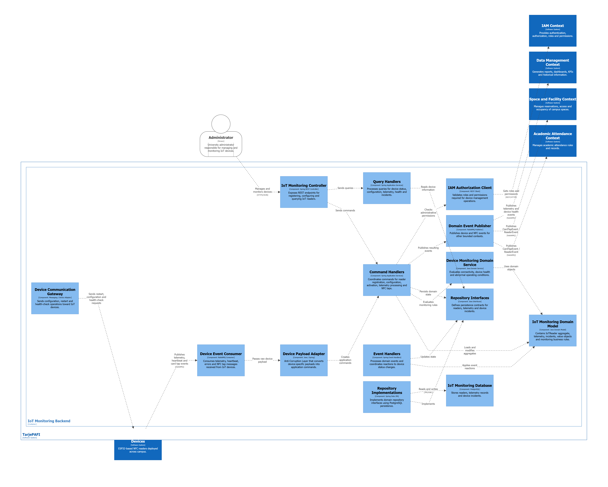
</p>


### 5.4.7. Bounded Context Software Architecture Code Level Diagrams

#### 5.4.7.1. Bounded Context Domain Layer Class Diagrams

<p align="center">
  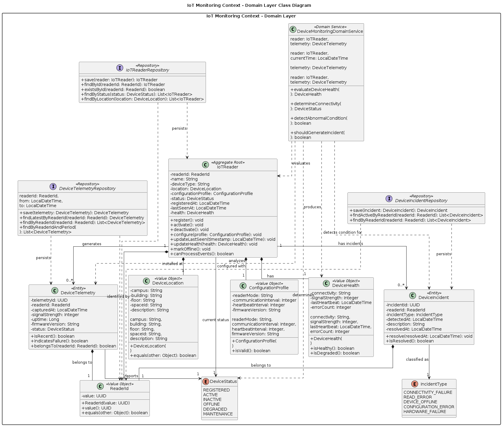
</p>

#### 5.4.7.2. Bounded Context Database Design Diagram

<p align="center">
  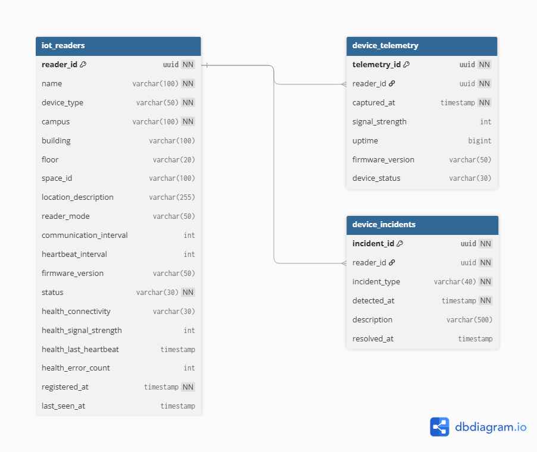
</p>


## 5.5. Bounded Context: Data Management Context

El Data Management Context es el bounded context encargado de centralizar, almacenar, organizar y transformar la información generada a partir de las interacciones con las tarjetas IoT y los lectores distribuidos en el campus universitario. Su propósito principal es convertir los datos operativos generados por los diferentes bounded contexts en información consolidada que pueda ser consultada y analizada por el personal autorizado de la universidad.

Este contexto recibe información relacionada con las lecturas de las tarjetas, los registros de asistencia, los accesos al campus y el uso de los espacios universitarios. A partir de estos datos, mantiene un historial que permite generar reportes y visualizaciones sobre el comportamiento de las actividades realizadas dentro de la universidad.

La información procesada por este contexto se encuentra orientada principalmente al personal administrativo y responsables de la gestión universitaria. Estos usuarios pueden acceder a un dashboard web para consultar información consolidada mediante reportes e indicadores relacionados con asistencia, accesos, ocupación y utilización de los espacios del campus. Los estudiantes, docentes y demás usuarios que utilizan la tarjeta IoT no interactúan directamente con este contexto, ya que su interacción con el sistema se realiza mediante la credencial física y los lectores IoT.

**Responsabilidades principales**

- Almacenar los datos generados por las interacciones de las tarjetas IoT y los lectores distribuidos en el campus.
- Consolidar información proveniente de los diferentes bounded contexts de la solución.
- Ordenar y clasificar los registros almacenados para facilitar su procesamiento y consulta.
- Mantener información histórica sobre asistencia, accesos y utilización de espacios universitarios.
- Generar reportes periódicos sobre la información registrada.
- Proporcionar información consolidada para la visualización mediante el dashboard administrativo.
- Detectar y registrar errores producidos durante el almacenamiento o procesamiento de los datos.

**Reglas de negocio principales**

- Todo dato generado por una interacción válida de una tarjeta IoT debe conservar su información temporal para permitir posteriormente su análisis histórico.
- Los registros provenientes de diferentes procesos deben conservar su contexto de origen para poder distinguir información relacionada con asistencia, accesos y utilización de espacios.
- La información almacenada debe poder organizarse por diferentes periodos de consulta, como semanal, mensual o semestral.
- Los reportes generados deben utilizar información previamente registrada y procesada por el sistema.
- El acceso a los reportes y visualizaciones está restringido al personal autorizado de la universidad.
- Un error durante el registro o procesamiento de información debe ser identificado para evitar que un dato inválido sea utilizado en los reportes.
- El contexto debe conservar la información histórica necesaria para permitir el análisis de tendencias y comportamiento del campus.

**Integración con otros Bounded Contexts**

El Data Management Context actúa como consumidor de la información generada por los bounded contexts operativos de TarjePAFI. En particular, recibe información relacionada con las lecturas de tarjetas provenientes del IoT Monitoring Context y datos derivados de procesos como la asistencia académica y la utilización de espacios.

El IoT Monitoring Context constituye uno de los principales puntos de origen de información, debido a que procesa las interacciones físicas realizadas mediante las tarjetas NFC y los lectores IoT. A partir de estas interacciones se generan eventos que pueden ser utilizados por el Data Management Context para registrar información histórica.

Asimismo, Academic Attendance Context aporta información relacionada con los registros de asistencia, mientras que Space and Facility Context proporciona información asociada al acceso y utilización de los espacios universitarios. De esta manera, el Data Management Context permite centralizar información que originalmente se encuentra distribuida entre diferentes procesos del sistema.

La información consolidada es posteriormente utilizada para generar reportes que pueden ser consultados por el personal administrativo  mediante el dashboard web.

**Acceso administrativo**

El acceso al Data Management Context se realiza mediante la aplicación web administrativa. Este acceso está destinado exclusivamente al personal autorizado de la universidad, debido a que los reportes contienen información consolidada sobre asistencia, accesos, ocupación y utilización de espacios.

Los estudiantes, docentes y trabajadores que utilizan las tarjetas IoT no necesitan acceder directamente al dashboard ni a los mecanismos de gestión de información. Su participación se limita a generar los eventos y registros que posteriormente son procesados por el sistema.

**Generación de reportes**

El contexto permite generar reportes a partir de la información histórica almacenada. Estos reportes pueden organizarse según diferentes periodos, principalmente semanal, mensual y semestral.

Los reportes pueden presentar información relacionada con:

- Registros de asistencia.
- Accesos al campus y a espacios restringidos.
- Utilización de aulas, cubículos y otros ambientes.
- Cantidad y frecuencia de interacciones mediante tarjetas IoT.
- Tendencias de utilización de los espacios.
- Información consolidada para apoyar la toma de decisiones administrativas.

Como parte de la evolución del sistema, los datos consolidados también pueden ser utilizados para generar reportes asistidos mediante mecanismos de análisis, incluyendo el reporte generado por IA representado en el modelo conceptual del bounded context.

### 5.5.1. Domain Layer

La Domain Layer encapsula las reglas de negocio relacionadas con el almacenamiento, auditoría, ordenamiento, consolidación y generación de reportes e indicadores a partir de los eventos procesados por los bounded contexts operativos de TarjePAFI.

Este contexto no decide la validez de las asistencias, accesos o reservas, sino que transforma los eventos resultantes en registros históricos persistentes e inmutables y los consolida en reportes ejecutivos para el dashboard administrativo.

**Aggregate: `DataRecord`**

Representa un registro de información inmutable incorporado al historial de TarjePAFI a partir de un evento originado en un lector IoT o en otro Bounded Context. Mantiene la trazabilidad e idempotencia del evento procesado.

| Atributos | Tipo de dato | Visibilidad | Descripción |
|---|---|---|---|
| id | Long | Private | Identificador único del registro en la base de datos. |
| eventId | EventId | Private | Identificador único del evento original. Garantiza la idempotencia. |
| sourceContext | DataSourceContext | Private | Bounded Context de origen (`IOT_MONITORING`, `ACADEMIC_ATTENDANCE`, `SPACE_AND_FACILITY`). |
| dataType | DataType | Private | Tipo de dato registrado (`CARD_READING`, `ATTENDANCE`, `ACCESS`, `SPACE_USAGE`, `DEVICE_TELEMETRY`). |
| subjectId | SubjectId | Private | Identificador del usuario, ambiente o dispositivo asociado al evento. |
| occurredAt | Instant | Private | Fecha y hora exacta en la que ocurrió el evento original en la fuente. |
| recordedAt | Instant | Private | Fecha y hora en la que fue persistido dentro del Data Management Context. |
| payload | RecordPayload | Private | Datos estructurados en formato JSON que representan el detalle del evento. |
| status | DataRecordStatus | Private | Estado del registro (`REGISTERED`, `PROCESSED`, `ERROR`). |

| Métodos | Tipo de retorno | Visibilidad | Descripción |
|---|---|---|---|
| getX() | — | Public | Getters de cada atributo (`getId()`, `getEventId()`, `getSourceContext()`, `getStatus()`, etc.). |
| DataRecord(RegisterDataCommand) | Constructor | Public | Crea un nuevo registro en estado `REGISTERED` calculando `recordedAt` con el tiempo del servidor. |
| markAsProcessed() | void | Public | Cambia el estado a `PROCESSED` tras ser clasificado e incorporado en las lecturas de reporte. |
| markAsError(String) | void | Public | Transiciona el estado a `ERROR` si falla el procesamiento o parseo de la información. |
| isValid() | boolean | Public | Devuelve `true` si el estado es `REGISTERED` o `PROCESSED`, apto para ser consolidado en reportes. |

---

**Aggregate: `Report`**

Representa un reporte administrativo generado a partir de la consolidación de los datos históricos en un intervalo temporal definido.

| Atributos | Tipo de dato | Visibilidad | Descripción |
|---|---|---|---|
| id | Long | Private | Identificador único del reporte generado. |
| reportType | ReportType | Private | Tipo/frecuencia del reporte (`WEEKLY`, `MONTHLY`, `SEMESTER`). |
| period | ReportPeriod | Private | Rango de fechas (`startDate`, `endDate`) considerado en la consolidación. |
| generatedAt | Instant | Private | Fecha y hora en la que se completó la generación del reporte. |
| status | ReportStatus | Private | Estado de generación (`GENERATING`, `GENERATED`, `ERROR`). |
| totalRecords | Integer | Private | Cantidad total de registros `DataRecord` procesados para el reporte. |
| summary | ReportSummary | Private | Contenido estructurado consolidado y métricas resumidas del reporte. |

| Métodos | Tipo de retorno | Visibilidad | Descripción |
|---|---|---|---|
| getX() | — | Public | Getters de cada atributo (`getId()`, `getReportType()`, `getPeriod()`, `getSummary()`, etc.). |
| Report(GenerateReportCommand) | Constructor | Public | Inicializa la orden de reporte en estado `GENERATING`. |
| completeGeneration(ReportSummary, Integer) | void | Public | Asigna el resumen consolidado, el total de registros e indica que el reporte está `GENERATED`. |
| markAsError() | void | Public | Marca el reporte en estado `ERROR` ante fallas en la agregación de datos. |
| isGenerated() | boolean | Public | Indica si el reporte se encuentra finalizado y disponible para consulta administrativa. |

---

**Domain Service: `DataOrganizationDomainService`**

Concentra las reglas de validación, clasificación y control de duplicidad de los registros recibidos de otros contextos.

| Método | Descripción |
|---|---|
| processIncomingRecord(EventId, DataSourceContext, DataType, SubjectId, Instant, String) | Valida que el registro contenga la información requerida, verifica la no existencia del `eventId` para evitar duplicados y clasifica el payload según el tipo de dato. |

Reglas que aplica, en orden:

1. **Verificación de duplicados (Idempotencia):** Si el `eventId` ya existe en el repositorio, detiene la operación para evitar registros duplicados.
2. **Validación de integridad:** Comprueba que `occurredAt`, `sourceContext` y `subjectId` no sean nulos.
3. **Consistencia de origen:** Verifica que la combinación de `sourceContext` y `dataType` sea coherente (ej. `ACADEMIC_ATTENDANCE` sólo puede emitir `ATTENDANCE`).
4. **Asignación de estado inicial:** Asigna el estado `REGISTERED` y emite el evento `DataRegistered`.

---

**Domain Service: `ReportGenerationDomainService`**

Concentra la lógica de agregación, cálculo de métricas e indicadores estadísticos a partir del conjunto de registros históricos.

| Método | Descripción |
|---|---|
| generateReport(ReportType, ReportPeriod, List<DataRecord>) | Procesa una lista de `DataRecord` válidos comprendidos dentro del `ReportPeriod` y construye el `ReportSummary` correspondiente. |

Reglas que aplica, en orden:

1. **Filtrado de datos válidos:** Excluye registros que se encuentren en estado `ERROR`.
2. **Rango estricto:** Asegura que solo se agreguen registros cuya fecha `occurredAt` caiga exactamente dentro del intervalo de `ReportPeriod`.
3. **Agregación estadística:** Calcula índices de asistencia, aforo por espacios y volumen de lectura de tarjetas IoT.
4. **Consolidación del resumen:** Devuelve un `ReportSummary` inmutable listo para ser asociado al agregado `Report`.

---

**Value Objects**

| Value Object | Descripción |
|---|---|
| DataRecordId | Registro que representa el identificador único de un `DataRecord`. Valida que sea positivo y no nulo. |
| EventId | Registro que envuelve el identificador único del evento original. Valida formato UUID o alfanumérico no vacío. |
| SubjectId | Registro que identifica al usuario, espacio o dispositivo origen del registro. |
| ReportPeriod | Registro que contiene `startDate` y `endDate`. Valida que `startDate` sea anterior o igual a `endDate`. |
| RecordPayload | Registro inmutable que almacena la estructura JSON de los datos del evento. Valida que no supere los límites de almacenamiento. |
| ReportSummary | Registro con la información estadística consolidada (ej. porcentaje de asistencia, concurrencia promedio, horas pico). |
| DataSourceContext | Enumeración: `IOT_MONITORING`, `ACADEMIC_ATTENDANCE`, `SPACE_AND_FACILITY`. |
| DataType | Enumeración: `CARD_READING`, `ATTENDANCE`, `ACCESS`, `SPACE_USAGE`, `DEVICE_TELEMETRY`. |
| DataRecordStatus | Enumeración: `REGISTERED`, `PROCESSED`, `ERROR`. |
| ReportType | Enumeración: `WEEKLY`, `MONTHLY`, `SEMESTER`. |
| ReportStatus | Enumeración: `GENERATING`, `GENERATED`, `ERROR`. |

---

**Domain Events (publicados)**

| Evento | Se publica cuando | Datos principales |
|---|---|---|
| DataRegistered | Se almacena correctamente un nuevo registro histórico. | dataRecordId, eventId, sourceContext, dataType, occurredAt. |
| InformationOrganized | Un conjunto de datos ha sido clasificado y agrupado por periodo. | period, dataType, totalRecords, organizedAt. |
| WeeklyReportGenerated | Se genera con éxito un reporte de periodicidad semanal. | reportId, period, totalRecords, generatedAt. |
| MonthlyReportGenerated | Se genera con éxito un reporte de periodicidad mensual. | reportId, period, totalRecords, generatedAt. |
| SemesterReportGenerated | Se genera con éxito un reporte de periodicidad semestral. | reportId, period, totalRecords, generatedAt. |
| DataRegistrationError | Ocurre un error durante la recepción o parseo de un evento. | eventId, sourceContext, errorReason, occurredAt. |

---

**Excepciones de Dominio**

| Excepción | Descripción |
|---|---|
| DataRecordNotFoundException | Se lanza cuando no se encuentra un registro por su ID o por el evento origen. |
| ReportNotFoundException | Se lanza cuando se intenta consultar un reporte inexistente. |
| DuplicateDataRecordException | Se lanza cuando se intenta registrar un evento cuya clave idempotente `eventId` ya fue procesada. |
| InvalidReportPeriodException | Se lanza cuando la fecha inicial del periodo es posterior a la fecha final. |
| ReportGenerationException | Se lanza ante un fallo en el cálculo analítico o la consolidación de métricas. |

---

**Interfaz: `DataRecordCommandService`**

| Método | Descripción |
|---|---|
| handle(RegisterDataCommand) | Valida el evento entrante, garantiza la idempotencia, persiste el `DataRecord` y publica el evento `DataRegistered`. |
| handle(OrganizeDataCommand) | Clasifica y agrupa los registros almacenados para un periodo determinado. |

---

**Interfaz: `ReportCommandService`**

| Método | Descripción |
|---|---|
| handle(GenerateWeeklyReportCommand) | Coordina la consolidación de datos y la creación de un reporte semanal. |
| handle(GenerateMonthlyReportCommand) | Coordina la consolidación de datos y la creación de un reporte mensual. |
| handle(GenerateSemesterReportCommand) | Coordina la consolidación de datos y la creación de un reporte semestral. |

---

**Interfaz: `DataRecordQueryService`**

| Método | Descripción |
|---|---|
| handle(GetDataRecordByIdQuery) | Obtiene el detalle de un registro específico por su ID. |
| handle(GetDataRecordsByPeriodQuery) | Recupera los registros históricos comprendidos dentro de un rango de fechas. |
| handle(GetDataRecordsByTypeQuery) | Recupera los registros filtrados por tipo de dato o contexto de origen. |

---

**Interfaz: `ReportQueryService`**

| Método | Descripción |
|---|---|
| handle(GetReportByIdQuery) | Obtiene el resumen y detalle de un reporte administrativo generado. |
| handle(ListReportsByPeriodQuery) | Lista los reportes disponibles ordenados por su periodo de consulta. |

### 5.5.2. Interface Layer

La Interface Layer proporciona los puntos de entrada mediante los cuales el personal autorizado de la universidad puede consultar la información consolidada y los reportes generados por el sistema.

Esta capa se encarga de recibir las solicitudes provenientes del dashboard web administrativo y transformarlas en Commands o Queries que serán procesados por la Application Layer. De esta manera, los detalles propios de HTTP, JSON y autenticación no se incorporan directamente en el modelo de dominio.

Asimismo, esta capa contempla consumidores de mensajería para recibir los eventos generados por otros bounded contexts. Estos eventos permiten incorporar al Data Management Context la información relacionada con las lecturas IoT, asistencia académica y utilización de espacios.

El acceso a las funcionalidades administrativas se encuentra restringido al personal autorizado de la universidad. Los estudiantes, docentes y demás usuarios que utilizan las tarjetas IoT no acceden directamente a esta capa, sino que generan información mediante sus interacciones con los lectores físicos.

**DataManagementController**

El `DataManagementController` expone las operaciones REST utilizadas por el dashboard administrativo para consultar los datos registrados y los reportes generados.

| Método | Ruta | Acceso | Descripción |
|---|---|---|---|
| `GET` | `/api/v1/data-records` | `ADMIN` | Obtiene los registros almacenados en Data Management Context. |
| `GET` | `/api/v1/data-records/{dataRecordId}` | `ADMIN` | Obtiene el detalle de un registro específico. |
| `GET` | `/api/v1/data-records/period` | `ADMIN` | Consulta los registros correspondientes a un periodo determinado. |
| `GET` | `/api/v1/data-records/type/{dataType}` | `ADMIN` | Consulta registros según el tipo de información almacenada. |
| `GET` | `/api/v1/reports` | `ADMIN` | Lista los reportes disponibles. |
| `GET` | `/api/v1/reports/{reportId}` | `ADMIN` | Obtiene el detalle de un reporte específico. |
| `GET` | `/api/v1/reports/weekly` | `ADMIN` | Consulta reportes semanales disponibles. |
| `GET` | `/api/v1/reports/monthly` | `ADMIN` | Consulta reportes mensuales disponibles. |
| `GET` | `/api/v1/reports/semester` | `ADMIN` | Consulta reportes semestrales disponibles. |

Las operaciones expuestas por este controlador son principalmente de consulta, ya que el objetivo principal del dashboard es permitir al personal autorizado visualizar la información consolidada y los reportes generados.

**ReportCommandController**

El `ReportCommandController` expone las operaciones necesarias para solicitar la generación de nuevos reportes desde el dashboard administrativo.

| Método | Ruta | Acceso | Descripción |
|---|---|---|---|
| `POST` | `/api/v1/reports/weekly` | `ADMIN` | Solicita la generación de un reporte semanal. |
| `POST` | `/api/v1/reports/monthly` | `ADMIN` | Solicita la generación de un reporte mensual. |
| `POST` | `/api/v1/reports/semester` | `ADMIN` | Solicita la generación de un reporte semestral. |

La solicitud recibida por este controlador no genera directamente el reporte. En su lugar, se transforma en un Command que será procesado posteriormente por la Application Layer.

**Data Transfer Objects (DTOs)**

Los DTOs representan las estructuras utilizadas para transportar información entre el dashboard administrativo y la API. Su objetivo es evitar que las entidades y objetos internos del dominio sean expuestos directamente.

**DataRecordResource**

| Campo | Tipo | Descripción |
|---|---|---|
| `id` | `Long` | Identificador del registro. |
| `eventId` | `String` | Identificador del evento que originó el registro. |
| `sourceContext` | `String` | Contexto que originó la información. |
| `dataType` | `String` | Tipo de información registrada. |
| `subjectId` | `String` | Identificador del usuario, espacio o dispositivo relacionado. |
| `occurredAt` | `String` | Fecha y hora en que ocurrió el evento. |
| `recordedAt` | `String` | Fecha y hora en que fue registrado en Data Management. |
| `status` | `String` | Estado del registro. |

**ReportResource**

| Campo | Tipo | Descripción |
|---|---|---|
| `id` | `Long` | Identificador del reporte. |
| `reportType` | `String` | Tipo de reporte generado. |
| `periodStart` | `String` | Inicio del periodo analizado. |
| `periodEnd` | `String` | Fin del periodo analizado. |
| `generatedAt` | `String` | Fecha y hora de generación. |
| `status` | `String` | Estado del reporte. |
| `totalRecords` | `Integer` | Cantidad de registros utilizados. |
| `summary` | `String` | Resumen de la información consolidada. |

**GenerateReportResource**

Este DTO representa la información recibida cuando un administrador solicita la generación de un reporte.

| Campo | Tipo | Descripción |
|---|---|---|
| `reportType` | `String` | Tipo de reporte solicitado. |
| `periodStart` | `String` | Fecha inicial del periodo. |
| `periodEnd` | `String` | Fecha final del periodo. |

**Transform Layer (Assemblers)**

Los Assemblers permiten desacoplar los objetos utilizados por la API de los objetos internos del dominio y de la Application Layer.

**DataRecordAssembler**

| Método | Descripción |
|---|---|
| `toDataRecordResource(DataRecord)` | Convierte un registro del dominio en un recurso que puede ser enviado al dashboard. |
| `toDataRecordResourceList(List<DataRecord>)` | Convierte una colección de registros en una colección de recursos. |

**ReportAssembler**

| Método | Descripción |
|---|---|
| `toReportResource(Report)` | Convierte un reporte del dominio en un recurso de respuesta. |
| `toReportResourceList(List<Report>)` | Convierte una colección de reportes en recursos para la API. |

**ReportCommandAssembler**

| Método | Descripción |
|---|---|
| `toGenerateWeeklyReportCommand(GenerateReportResource)` | Convierte la solicitud de reporte semanal en un Command. |
| `toGenerateMonthlyReportCommand(GenerateReportResource)` | Convierte la solicitud de reporte mensual en un Command. |
| `toGenerateSemesterReportCommand(GenerateReportResource)` | Convierte la solicitud de reporte semestral en un Command. |

**Consumidores de mensajería**

Además de los controladores REST, Data Management Context recibe información proveniente de otros bounded contexts mediante eventos de dominio publicados en el bus de mensajería.

Esta comunicación permite mantener desacoplados los contextos y evita que Data Management tenga que consultar directamente las clases internas de los demás bounded contexts.

**CardTapEventConsumer**

| Elemento | Descripción |
|---|---|
| Evento | `CardTapEvent` |
| Origen | `IoT Monitoring Context` |
| Cola | `data-management.card-tap.queue` |
| Routing key | `iot.card-tap` |
| Responsabilidad | Recibir información de una lectura realizada por un lector IoT y transformarla en un Command para registrar el dato. |

**AttendanceEventConsumer**

| Elemento | Descripción |
|---|---|
| Evento | Evento de asistencia generado por `Academic Attendance Context` |
| Origen | `Academic Attendance Context` |
| Cola | `data-management.attendance.queue` |
| Responsabilidad | Recibir información relacionada con los registros de asistencia y enviarla a la Application Layer para su almacenamiento. |

**SpaceUsageEventConsumer**

| Elemento | Descripción |
|---|---|
| Evento | Evento relacionado con acceso o utilización de espacios |
| Origen | `Space and Facility Context` |
| Cola | `data-management.space.queue` |
| Responsabilidad | Recibir información sobre accesos y utilización de espacios para incorporarla al historial de datos. |

**Autorización de acceso**

Las operaciones expuestas por la Interface Layer requieren autenticación y autorización previa. La identidad del usuario es validada mediante el `IAM Context`, mientras que la autorización determina si el usuario posee permisos administrativos para acceder a la información.

| Usuario | Acceso al Data Management Context | Funcionalidad |
|---|---|---|
| Administrador | Sí | Consultar registros, visualizar reportes y solicitar generación de reportes. |
| Personal autorizado | Sí, según permisos | Consultar la información administrativa correspondiente. |
| Docente | No directamente | Genera información mediante sus interacciones con las tarjetas IoT. |
| Estudiante | No directamente | Genera información mediante sus interacciones con las tarjetas IoT. |
| Lector IoT | No | Envía eventos que posteriormente son procesados por el sistema. |

De esta manera, la Interface Layer mantiene una separación entre los usuarios que generan información mediante las tarjetas IoT y los usuarios administrativos que consultan dicha información.


### 5.5.3. Application Layer

Los servicios internos orquestan el registro y organización de la información generada
por los demás bounded contexts, garantizan la idempotencia de los eventos recibidos,
coordinan la persistencia de los datos históricos, gestionan la generación de reportes
semanales, mensuales y semestrales y publican los eventos de dominio correspondientes
hacia RabbitMQ.

**\*\*Clase: `DataRecordCommandServiceImpl`\*\***

| Título | DataRecordCommandServiceImpl |
|---|---|
| **Descripción** | Este servicio procesa comandos de otros bounded contexts: `RegisterDataCommand` valida la idempotencia por eventId, persiste y clasifica la información entrante, publicando `DataRegistered` o `DataRegistrationError` según corresponda, mientras que OrganizeDataCommand agrupa los registros del periodo solicitado mediante `DataOrganizationDomainService` y emite `InformationOrganized`. |

| Dependencia | Descripción |
|---|---|
| `DataRecordRepository` | Persistencia de los registros históricos y validación de idempotencia mediante `eventId`. |
| `DataOrganizationDomainService` | Servicio de dominio encargado de validar, clasificar y organizar la información registrada. |
| `DataEventPublisher` | Puerto de salida para publicar los eventos `DataRegistered`, `InformationOrganized` y `DataRegistrationError` hacia RabbitMQ. |

**\*\*Clase: `ReportCommandServiceImpl`\*\***

| Título | ReportCommandServiceImpl |
|---|---|
| **Descripción** | Este servicio coordina la generación de reportes administrativos (`GenerateWeeklyReportCommand`, `GenerateMonthlyReportCommand` y `GenerateSemesterReportCommand`) obteniendo los registros del periodo vía `DataRecordRepository`, consolidándolos con `ReportGenerationDomainService`, y persistiendo el agregado `Report` para finalmente publicar el evento de éxito correspondiente. |

| Dependencia | Descripción |
|---|---|
| `DataRecordRepository` | Consulta los registros históricos que sirven como fuente para la generación de reportes. |
| `ReportRepository` | Persistencia y consulta de los reportes generados. |
| `ReportGenerationDomainService` | Servicio de dominio encargado de consolidar, resumir y calcular la información utilizada por los reportes. |
| `DataEventPublisher` | Puerto de salida para publicar los eventos asociados a la generación de reportes hacia RabbitMQ. |

**\*\*Clase: `DataRecordQueryServiceImpl`\*\***

| Título | DataRecordQueryServiceImpl |
|---|---|
| **Descripción** | Servicio encargado de responder las consultas relacionadas con la información histórica almacenada en Data Management Context. Permite recuperar registros individuales, consultar información por periodo y filtrar los datos según su tipo o contexto de origen para su posterior visualización en el dashboard administrativo. |

| Dependencia | Descripción |
|---|---|
| `DataRecordRepository` | Acceso de lectura a los registros históricos almacenados. |

**\*\*Clase: `ReportQueryServiceImpl`\*\***

| Título | ReportQueryServiceImpl |
|---|---|
| **Descripción** | Servicio encargado de responder las consultas relacionadas con los reportes generados para el personal administrativo. Permite recuperar reportes individuales, listar reportes disponibles y consultar información según su periodicidad semanal, mensual o semestral. |

| Dependencia | Descripción |
|---|---|
| `ReportRepository` | Acceso de lectura a los reportes generados. |

**\*\*Puertos de salida (Anti-Corruption Layer)\*\***

| Puerto | Descripción |
|---|---|
| `DataEventPublisher` | Interfaz utilizada para publicar los eventos de dominio generados por Data Management Context hacia RabbitMQ, incluyendo `DataRegistered`, `InformationOrganized`, `WeeklyReportGenerated`, `MonthlyReportGenerated`, `SemesterReportGenerated` y `DataRegistrationError`. |
| `DataRecordRepository` | Interfaz de persistencia utilizada para almacenar y consultar la información histórica generada por los diferentes bounded contexts, manteniendo además la validación de idempotencia de los eventos recibidos. |
| `ReportRepository` | Interfaz de persistencia utilizada para almacenar y consultar los reportes generados a partir de la información histórica. |

### 5.5.4. Infrastructure Layer

Esta capa implementa la persistencia de datos históricos y reportes administrativos mediante Spring Data JPA sobre PostgreSQL, la mensajería asíncrona mediante RabbitMQ para la ingesta de eventos originados en otros contexts, el motor de agregación de métricas y los adaptadores de salida para exportación y notificaciones.

**Clase: `DataRecordRepository`**

| Título | DataRecordRepository |
|---|---|
| Descripción | Interfaz de persistencia para el registro histórico inmutable de eventos procesados en el campus. |

| Método | Descripción |
|---|---|
| findById(DataRecordId) | Recupera un registro histórico por su identificador único. |
| findByEventId(EventId) | Localiza el registro asociado a un evento original específico. |
| existsByEventId(EventId) | Verifica si un evento ya fue procesado e incorporado para garantizar la idempotencia. |
| findByPeriodAndType(ReportPeriod, DataType) | Recupera la colección de registros válidos dentro de un rango de fechas y tipo de dato para fines analíticos. |
| findBySourceContext(DataSourceContext) | Retorna los registros filtrados por su bounded context de origen. |
| save(DataRecord) | Persiste un nuevo registro o actualiza su estado de procesamiento en PostgreSQL. |

**Clase: `ReportRepository`**

| Título | ReportRepository |
|---|---|
| Descripción | Interfaz de persistencia para las entidades de reporte consolidado e indicadores ejecutivos. |

| Método | Descripción |
|---|---|
| findById(Long) | Recupera un reporte generado por su ID. |
| findByTypeAndPeriod(ReportType, ReportPeriod) | Localiza un reporte existente para un tipo y periodo específico. |
| findLatestByType(ReportType) | Retorna el reporte consolidado generado más reciente según su periodicidad. |
| findAll() | Lista la totalidad de reportes almacenados para la consulta desde la interfaz administrativa. |
| save(Report) | Persiste o actualiza un reporte y su resumen consolidado (`ReportSummary`). |

**Adaptadores, infraestructura y tareas en segundo plano**

| Clase | Descripción |
|---|---|
| RabbitMqDataConfig | Declara las colas de ingesta `data-management.card-tap.queue`, `data-management.attendance.queue` y `data-management.space.queue`, vinculadas al exchange principal `tarjepafi.events` mediante routing keys (`iot.card-tap`, `attendance.*`, `space.*`). Configura además la *dead-letter queue* para eventos con errores de formato. |
| RabbitDataEventPublisher | Implementa `DataEventPublisher`; publica eventos de dominio del contexto hacia RabbitMQ (`data.registered`, `data.organized`, `report.weekly.generated`, `report.monthly.generated`, `report.semester.generated`, `data.error`) para auditoría y consumo externo. |
| PdfReportExporterAdapter | Adaptador de infraestructura que utiliza la librería iText/OpenPDF para transformar el agregado `Report` y su `ReportSummary` en un documento ejecutable en formato PDF listo para su descarga administrativa. |
| ExcelReportExporterAdapter | Adaptador de infraestructura que utiliza Apache POI para exportar hojas de cálculo en formato Excel (`.xlsx`) con el desglose tabular de las métricas consolidadas. |
| HistoricalDataArchiverScheduler | Tarea programada en segundo plano (`@Scheduled(cron = "0 0 2 * * *")`) ejecutada diariamente en horario nocturno. Invoca procesos de limpieza, consolidación de índices y verificación de integridad sobre registros antiguos. |

**Decisiones de infraestructura**

- **Garantía absoluta de idempotencia:** Se impone un índice único y restricción `UNIQUE` sobre la columna `event_id` en la tabla `data_records`. Cada evento recibido vía RabbitMQ es validado mediante `existsByEventId` en el consumidor antes de iniciar su procesamiento, evitando la duplicidad de métricas.
- **Estrategia de indexación compuesta para rendimiento analítico:** Se crean índices compuestos sobre las columnas `(occurred_at, data_type)` y `(source_context, recorded_at)` en PostgreSQL. Esto permite acelerar sustancialmente las consultas agregadas requeridas por los procesos de generación de reportes periódicos sin degradar la base de datos.
- **Resiliencia y desacoplamiento en exportaciones:** La compilación de reportes complejos en PDF/Excel y el envío de alertas de error de procesamiento se ejecutan de forma asíncrona mediante `@Async`, evitando bloquear el hilo de ejecución HTTP de la plataforma web administrativa durante la consulta de tableros.

### 5.5.6. Bounded Context Software Architecture Component Level Diagrams

<p align="center">
  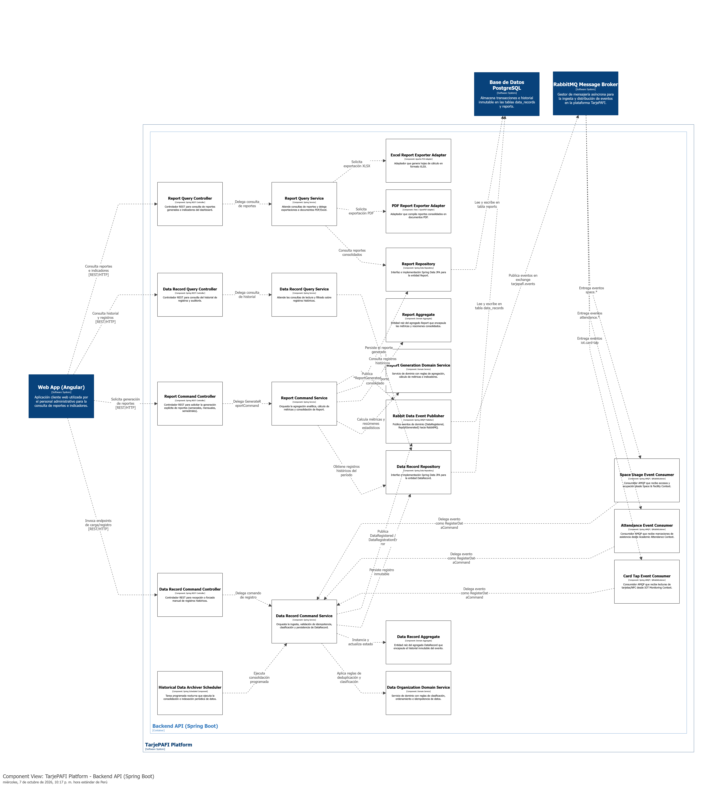
</p>

### 5.5.7. Bounded Context Software Architecture Code Level Diagrams

#### 5.5.7.1. Bounded Context Domain Layer Class Diagrams

<p align="center">
  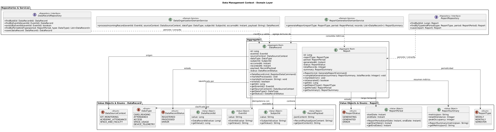
</p>

#### 5.5.7.2. Bounded Context Database Design Diagram

<p align="center">
  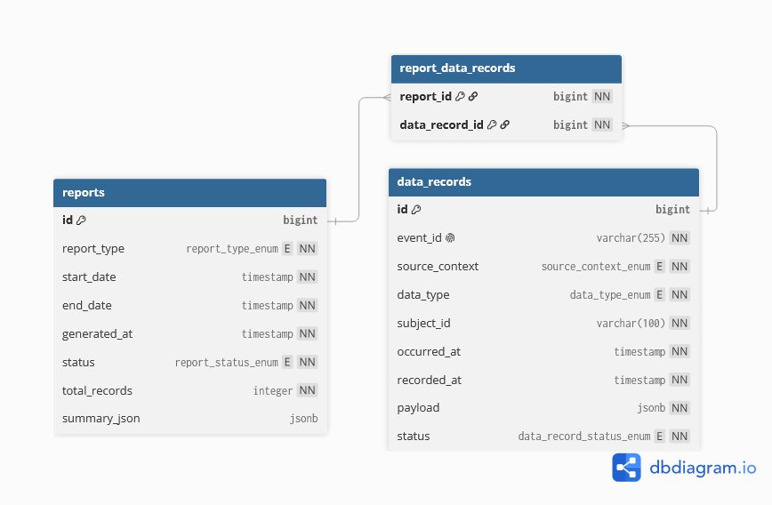
</p>


# Capítulo VI: Solution UX Design

## 6.1. Style Guidelines

### 6.1.1. General Style Guidelines

**Branding:**

La identidad de marca de TarjePAFI combina los conceptos de tecnología conectada, seguridad física e innovación en la gestión universitaria. El nombre sintetiza el núcleo del producto: "Tarje" (credencial física inteligente como llave maestra del campus) y "PAFI" (acrónimo identitario de la startup PafiSolutions).

- **Logotipo e Isotipo:**

  **Símbolo (Isotipo):** Está compuesto por la silueta estilizada de una credencial inteligente en perspectiva isométrica, cruzada por ondas concéntricas y nodos que forman la letra "P", simbolizando la interacción fluida entre el hardware de campo y la nube.   
  
  **Tipotipo (Wordmark):** Se presenta en caja alta y baja con tipografía sans-serif geométrica personalizada, resaltando la palabra "Tarje" en un peso semibold neutro y "PAFI" en un peso bold con el tono azul institucional, transmitiendo dinamismo y solidez tecnológica.  
  
  **Tamaños:** Su tamaño mínimo digital es de 120 × 32 px en interfaces web y 24 × 24 px para la variante de isotipo simplificado.
  
  **Valores de Marca:** Eficiencia operativa, transparencia y fiabilidad de datos, agilidad en la interacción cotidiana y modernización inclusiva de la infraestructura académica.

<p align="center">
  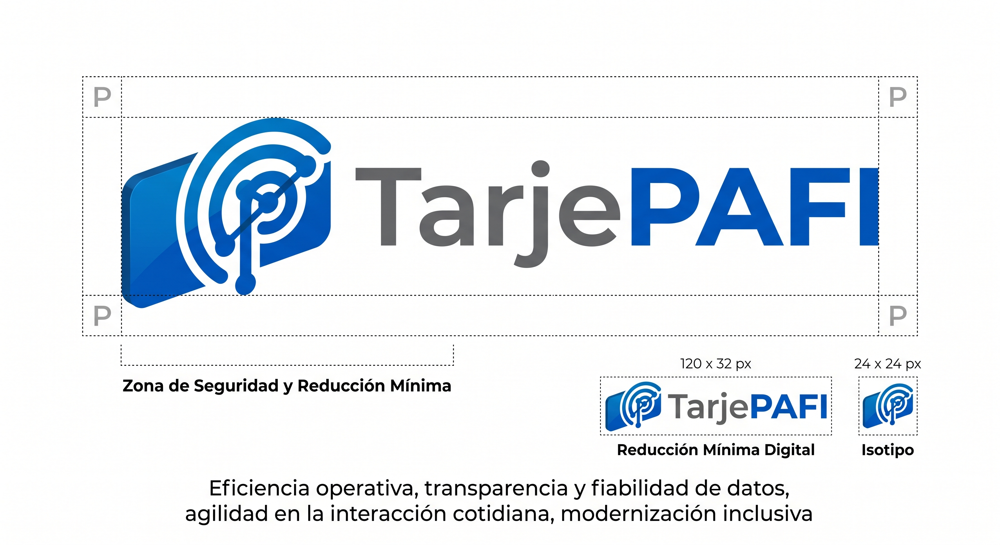
</p>

**Typography:**

- **Tipografía Primaria (Display y Títulos): Plus Jakarta Sans**

Es una fuente geométrica contemporánea con aperturas amplias y alturas de x generosas, lo que proporciona una presencia moderna en títulos, paneles analíticos y tarjetas de métricas sin perder sobriedad corporativa.

- **Tipografía Secundaria (Cuerpo de Texto e Interfaces UI): Inter**

Diseñada específicamente para interfaces digitales computacionales, cuenta con distinción refinada entre caracteres ambiguos, permitiendo una lectura descansada en tablas de datos extensas, listas de asistencia y formularios administrativos.

<p align="center">
  
</p>

| Nivel Jerárquico | Fuente | Peso (Weight) | Tamaño (px / rem) | Uso Principal |
| :--- | :--- | :--- | :--- | :--- |
|Display 1 | Plus Jakarta Sans | Bold |48 px |Hero titles en Landing Page|
|Display 2 | Plus Jakarta Sans | SemiBold |36 px |Títulos de secciones principales|
|Heading 1| Plus Jakarta Sans | SemiBold |28 px |Títulos de vistas y módulos en Web App|
|Heading 2 | Plus Jakarta Sans | Medium |22 px |Subtítulos y cabeceras de tarjetas (Cards)|
|Heading 3 | Inter | SemiBold |18 px |Títulos de modales y diálogos de alerta|
|Body Large | Inter | Regular |16 px |Texto corrido principal y descripciones|
|Body Medium | Inter | Regular |14 px px |Registros de tablas, menús y formularios|
|Body Small| Inter | Medium |12 px |Leyendas, timestamps de lecturas IoT y tooltips |
|Label / Button| Inter | SemiBold |14 px |Botones de acción, badges y chips de estado|

**Colors:**

La paleta cromática de TarjePAFI equilibra la seriedad institucional de una entidad educativa de prestigio con el dinamismo tecnológico del Internet de las Cosas (IoT) y la infraestructura conectada.

<p align="center">
  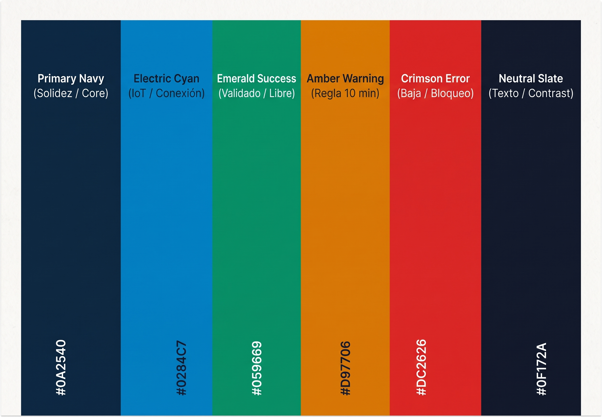
</p>

- **Colores Primarios:**

  **Primary Navy (#0A2540):** Azul institucional profundo. Representa autoridad administrativa, ciberseguridad, persistencia transaccional y solidez del campus. Utilizado en barras de navegación principales, cabeceras del sistema y acentos estructurales.

  **Electric Cyan (#0284C7):** Azul cian tecnológico. Simboliza comunicación inalámbrica, interactividad IoT y flujos continuos de datos en tiempo real. Empleado en botones de acción primaria (CTA), estados activos, vínculos e indicadores de sincronización.

  **Brand Light (#E0F2FE):** Azul de tonalidad suave para estados de hover, resaltado de filas seleccionadas y fondos de contenedores de ayuda.

- **Colores Neutros y Superficies:**

  **Surface Dark / Text Primary (#0F172A):** Pizarra oscura para titulares y textos de máxima jerarquía.

  **Text Muted / Secondary (#475569):** Gris intermedio de alto contraste para descripciones secundarias y metadatos.

  **Border / Divider (#CBD5E1):** Gris perla para delimitación de celdas de tabla, divisores y contornos de tarjetas.

  **Surface Background (#F8FAFC):** Fondo general de la plataforma web y vistas de analítica, reduciendo la fatiga visual.

  **Surface White (#FFFFFF):** Blanco puro para contenedores modulares, campos de formulario y tarjetas elevadas.

- **Colores Semánticos / Funcionales:**

  **Success Green (#059669):** Utilizado para confirmaciones de "Asistencia registrada", "Acceso concedido", cubículo validado presencialmente y lectores IoT en estado Online.
  
  **Warning Amber (#D97706):** Indica estados de advertencia, como la cuenta regresiva de la Regla de Tolerancia de 10 minutos para reservas de estudio no ocupadas o dispositivos en modo de lectura offline retenida en buffer.   
  
  **Error Red (#DC2626):** Señala fallos críticos, eventos denegados, tarjetas dadas de baja/bloqueadas, desocupación forzosa por inasistencia y lectores desconectados (Offline).   
  
  **Info Blue (#2563EB):** Empleado en avisos informativos, resúmenes estadísticos y recordatorios de horario de clase. 

**Spacing**

La disposición espacial responde a una cuadrícula modular basada en múltiplos del número 8, con una subdivisión atómica de 4 px para microespaciados. Teniendo esto en cuenta en TarjePafi se a utilizado un espaciado optimizado para no provocar sobrecarga visual y mejorar la visualización al momento de navegar. Todo el diseño del espaciado esta hecho para que se pueda observar de manera organizada y equilibrado.

**Tono de Comunicación y Lenguaje**

El tono de voz y estilo editorial de TarjePAFI está sustentado en las cuatro dimensiones de tono de voz, calibradas específicamente para un entorno universitario donde interactúan autoridades, docentes y estudiantes:

<p align="center">
  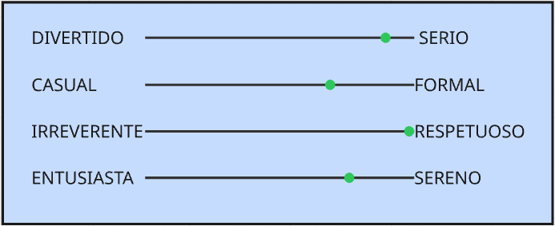
</p>

**Inclinación Serio:** TarjePAFI gestiona eventos de seguridad física, cumplimiento laboral docente, control de accesos a zonas restringidas y registros académicos oficiales. La redacción mantiene una sobriedad ejecutiva y técnica. Se evitan bromas, coloquialismos o jerga juvenil en los productos digitales, asegurando rigor y confiabilidad de auditoría.

**Inclinación Formal:** La comunicación es profesional y concisa, pero desprovista de burocracia verbal innecesaria. Se emplea la segunda persona gramatical neutra ("Consulta tu historial", "Configura los lectores", "Selecciona el ambiente") para mantener cercanía sin perder el orden institucional.

**Inclinación Respetuoso:** Se respeta la investidura de las autoridades universitarias y la privacidad de los estudiantes y colaboradores. Los mensajes de alerta jamás culpabilizan al usuario ante un error.

**Inclinación Sereno:** En situaciones operativas como picos de afluencia o cancelaciones automáticas, la plataforma comunica tranquilidad mediante datos claros, directos y con rutas de acción inmediatas.

### 6.1.2. Web, Mobile & Devices Style Guidelines

**Responsive Web:**

  **Landing Page Institucional:**

  Desarrollada con diseño fluido. Dispone de un encabezado fijo con el logotipo en el extremo superior izquierdo, anclas de navegación directa (Beneficios, Ecosistema IoT, Testimonios y Contacto) y un botón de llamada a la acción destacado ("Acceso Administrativo" o "Contactarnos").

  **Web App Administrativa:**

  **Barra Superior:** Muestra el contexto de sede universitaria (ej. Sede San Miguel), buscador rápido global, selector de idioma (EN/ES), notificaciones críticas y perfil del usuario autenticado con token JWT.

  **Navegación Lateral:** Menú colapsable a la izquierda con enlaces a los módulos centrales correspondientes a los Bounded Contexts:

  - Dashboard General / Aforo en Vivo

  - Control de Asistencia Académica 
    
  - Gestión de Espacios y Cubículos
  
  - Monitoreo de Infraestructura IoT   
  
  - Administración de Credenciales y Tarjetas   
  
  - Reportes Analíticos y Auditoría

**Mobile Web Responsive**

Para el apartado mobile, debe ser responsive la plataforma web para que pueda ser consultado igualmente de manera web, el cual presentara un menu hambuerguesa para los modulos centrales. Presentando un responsive que sea comodo de ver y que tenga la misma navegacion rapida que el visto en la plataforma web.

**Componentes de Interacción y Estados del Sistema**

Para preservar la consistencia entre los artefactos UX y la implementación final del software, se especifican los siguientes estándares de componentes:

**Botones de Acción (Buttons)**

  - Botón Primario: Electric Cyan (#0284C7), texto en blanco puro, esquinas redondeadas de 8 px (border-radius), altura fija de 40 px en web. Para acciones principales (ej. "Iniciar Sesión").

  - Botón Secundario: Borde de 1.5 px en Electric Cyan (#0284C7), fondo transparente, texto en color Electric Cyan (#0284C7). Para acciones secundarias o de exploración (ej. "Descargar Reporte", "Ver Historial", "Filtrar Resultados")

  - Botón Destructivo / Peligro: Crimson Error (#DC2626), texto en blanco. Para operaciones críticas irreversibles (ej. "Dar de Baja Tarjeta", "Desactivar Dispositivo IoT").

<p align="center">
  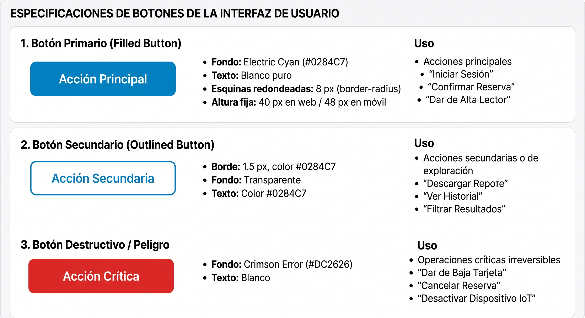
</p>

**Campos de Formulario y Entradas de Datos**

- El contenedor posee una altura de 52 px con un radio de curvatura de 8 px y un contorno neutro (#CBD5E1).

- Etiqueta Flotante: Se mantiene visible en la parte superior del marco al recibir foco o contener datos, evitando que el usuario olvide qué dato se solicita.

- Mensajes de Validación y Error: Los mensajes de advertencia se sitúan a 4 px por debajo del campo en color rojo (#DC2626), acompañados de un icono vectorial explicativo que especifica el formato requerido sin ambigüedades

<p align="center">
  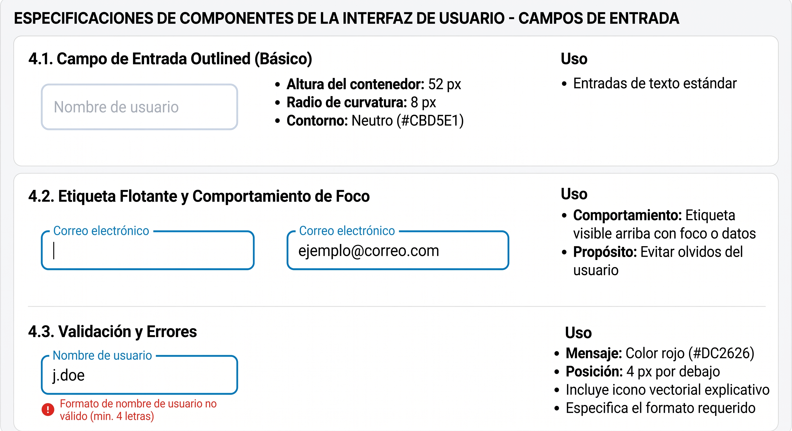
</p>

**Notificaciones, Diálogos y Estados de Carga**

- Modales y Diálogos de Confirmación:

  - Requeridos para acciones de impacto sobre los Bounded Contexts (ej. dar de baja la credencial de un estudiante retirado).

  - Fondo oscurecido con velo semitransparente (Backdrop overlay en 50% de opacidad) que bloquea la interacción de fondo y enfoca la toma de decisiones consciente.

- Notificaciones Toast:

  - Mensajes emergentes no intrusivos que aparecen en la esquina inferior derecha en escritorio.

  - Desaparecen automáticamente tras 4 segundos y cuentan con opción manual de cierre y botón de acción directa (ej. "Cubiculo cancelado por tolerancia de 10 min.").

- Estados de Carga y Skeleton Screens:

  Ante consultas analíticas o sincronizaciones asíncronas con RabbitMQ, se prohíbe el uso de pantallas en blanco. Se emplean pantallas esqueleto animadas con gradiente gris fluctuante (Skeleton Loaders), comunicando la disposición previa de las tablas o gráficos mientras finaliza la llamada a la API.

<p align="center">
  
</p>

<br>

<p align="center">
  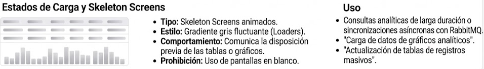
</p>

## 6.2. Information Architecture

La arquitectura de información de TarjePafi se diseñó con el propósito de facilitar la comprensión y navegación tanto en la Landing Page como en la aplicación web. Se prioriza la simplicidad, accesibilidad y consistencia visual, asegurando que usuarios finales encuentren rápidamente lo que necesitan.

### 6.2.2. Labeling Systems

A continuación, se presenta el sistema de etiquetado que permitirá dar a los visitantes de la Landing Page y la Plataforma Web un vistazo claro y organizado de lo que ofrecemos.


**Landing Page**
<br>

La landing page cuenta con 4 headings ubicados en la parte superior:

|Heading|Description|
|-------|-----------|
|Servicios|Sección seleccionada por defecto donde los usuarios observarán los distintos servicios que ofrecemos.|
|Contactos|Sección donde el usuario podrá contactarnos directamente mediante un formulario.|
|FAQ|Sección enfocada en mostrar las preguntas comunes al descubrir el servicio junto a sus respuestas|
|Equipo|Sección donde se mostrara el equipo detras e TarjePafi para mayor transparencia con los clientes.|

**Plataforma Web**
<br>

La landing page cuenta con 3 headings ubicados en la parte superior:

|Heading|Description|
|-------|-----------|
|Inicio|Sección que actuara como dashboard para mantener la informacion general al alcance.|
|Reportes|Sección donde se generaran los reportes con la data transferia.|
|Ajustes|Sección enfocada en modificar aspectos del perfil o las prefrencias de usuario.|


### 6.2.3. Searching Systems

El sistema de búsqueda de TarjePafi se diseñó para evitar que los usuarios se sientan perdidos entre la gran cantidad de información generada (reportes, tablas, graficos, informacion suelta). El objetivo es ofrecer métodos simples y potentes de búsqueda que permitan localizar datos en pocos pasos.

**Opciones de Filtros**
- **Por orden alfabetico:** Busqueda por orden alfabetico en los reportes, tablas o informacion recolectada en sus titulos
- **Por orden cronologico:** Busqueda por fecha cronologica de orden creciente o decreciente
- **Por orden numerico:** Busqueda numerica en los resultados de los analisis 

**Presentacion de Resultados**
- **Reportes:** Reportes ordenados en lista que puede ser filtrada en su propia seccion para guardar una base de datos de estos reportes
- **Datos cuantitativos:** Graficos o tablas que guardan la informacion cualitativa recolectada por la tarjeta en el dashboard de Inicio

### 6.2.4. SEO Tags and Meta Tags


Los SEO Tags y Meta Tags permiten que instituciones educativas y áreas de gestión universitaria encuentren la solución a través de motores de búsqueda. La Landing Page es el principal punto de entrada orgánico y está optimizada para posicionar a TarjePAFI como un ecosistema de credenciales NFC e IoT para la gestión de asistencia, accesos y aforo en campus universitarios.

#### SEO Tags
Title Tag: define el título que se muestra en los resultados de búsqueda.

```
<title>TarjePAFI - Credenciales NFC e IoT para la Gestión Universitaria</title>
```

Meta Description: resume el contenido de la página en unos 155 caracteres.

```
<meta name="description" content="TarjePAFI integra credenciales NFC y lectores IoT para automatizar la asistencia, controlar accesos y monitorear el aforo en universidades, con dashboards en tiempo real." />
```

Header Tags: establecen la jerarquía semántica del contenido.

```
<h1>Asistencia, accesos y aforo en una sola credencial</h1>
<h2>Credenciales NFC y lectores IoT para tu universidad</h2>
<h3>Funcionalidades principales de TarjePAFI</h3>
<h3>Contáctanos y resuelve tus dudas</h3>
```


#### Meta Tags


Los Meta Tags transmiten información técnica a navegadores y motores de búsqueda, y mejoran la accesibilidad, el rendimiento y el SEO técnico de la Landing Page de TarjePAFI.

| Meta Tag | Código | Propósito |
|---|---|---|
| Idioma | `<html lang="es">` | Indica el idioma principal del contenido. |
| Charset | `<meta charset="UTF-8">` | Soporte de tildes y caracteres especiales. |
| Viewport | `<meta name="viewport" content="width=device-width, initial-scale=1.0">` | Diseño adaptable a móvil, tablet y escritorio. |
| Robots | `<meta name="robots" content="index, follow">` | Permite indexar la página y seguir sus enlaces. |
| Canonical | `<link rel="canonical" href="https://tarjepafi.com/">` | Evita contenido duplicado. |
| Author | `<meta name="author" content="PAFI Solutions">` | Identifica al equipo responsable. |
| Keywords | `<meta name="keywords" content="credenciales NFC, asistencia universitaria, control de accesos, aforo, IoT universidades, TarjePAFI, gestión universitaria">` | Términos clave del producto. |
| Theme color | `<meta name="theme-color" content="#000000">` | Color de marca en la barra del navegador móvil. |


### 6.2.5. Navigation Systems

Los sistemas de navegación de TarjePAFI permiten que visitantes y administradores universitarios lleguen rápido a las funcionalidades clave, sin conocimientos técnicos avanzados. En la Landing Page, la navegación guía al visitante hacia las funcionalidades del producto (US26) y hacia el contacto con el equipo (US27).

### Landing Page 

| Elemento de Navegación | Descripción |
|---|---|
| Navbar superior fijo | Logo de TarjePAFI y enlaces a Funcionalidades, Cómo funciona, Segmentos y Contacto. Permanece visible al hacer scroll. |
| Scroll guiado (anclajes) | Desplazamiento suave entre secciones mediante anclas internas (`#funcionalidades`, `#como-funciona`, `#segmentos`, `#contacto`). |
| Botón de contacto (CTA) | Botón destacado en el color de marca, visible en el navbar y en el hero. Al hacer clic abre el formulario de contacto o lleva a la sección `#contacto`. |
| Sección de funcionalidades | Grid de tarjetas con ícono, título y descripción corta de cada función principal, accesible desde el navbar. |
| Navegación jerárquica visual | Los encabezados H1 a H3 guían al visitante desde la propuesta de valor hasta el detalle de cada función. |
| Botón flotante de contacto | Acceso rápido al formulario de consultas desde cualquier punto de la página, sobre todo en móvil. |
| Menú hamburguesa (móvil) | El navbar se colapsa en un ícono de menú que despliega los mismos enlaces en un panel vertical. |
| Retroalimentación visual | Los enlaces del navbar cambian de color al pasar el cursor o al estar activa su sección, y el formulario muestra una confirmación tras el envío. |
| Footer navegable | Enlaces secundarios a contacto, políticas de privacidad y redes sociales oficiales de PAFI Solutions. |

### Aplicación Web 

| Elemento de Navegación | Descripción |
|---|---|
| Menú lateral persistente | Acceso permanente a Dashboard, Asistencia, Accesos, Reservas de espacios, Aforo, Lectores IoT y Reportes. Se mantiene fijo en todas las vistas. |
| Dashboard centralizado | Vista principal con indicadores de asistencia, ocupación por espacio y últimos eventos de acceso. |
| Navegación contextual | Acciones como "Ver detalle de asistencia" o "Exportar reporte" aparecen junto a los datos relevantes, sin navegación adicional. |
| Navegación matricial | Distribución en grid para el panel de estado de lectores IoT y los listados de espacios. |
| Filtros y búsqueda | Filtros por fecha, curso, espacio o estado dentro de cada módulo. |
| Breadcrumbs | Indican la ubicación actual. Ejemplo: Dashboard > Asistencia > Curso > Detalle de sesión. |
| Indicadores visuales de estado | Colores verde, amarillo y rojo para comunicar aforo y estado de los lectores de un vistazo. |

La arquitectura de navegación mantiene una experiencia coherente entre plataformas. La Landing Page prioriza la claridad y la conversión (entender el producto y contactar al equipo), mientras que la plataforma web prioriza la gestión centralizada y la lectura rápida de datos.


## 6.3. Landing Page UI Design

### 6.3.1. Landing Page Wireframe

Vista en Figma: https://www.figma.com/design/W9XxjWGcq2EJTGAfVEb9y9/TarjePAFI---Landing-Page-Wireframes?t=BQT2ghWNgYivk97B-1


#### Landing Page Desktop Wireframes 
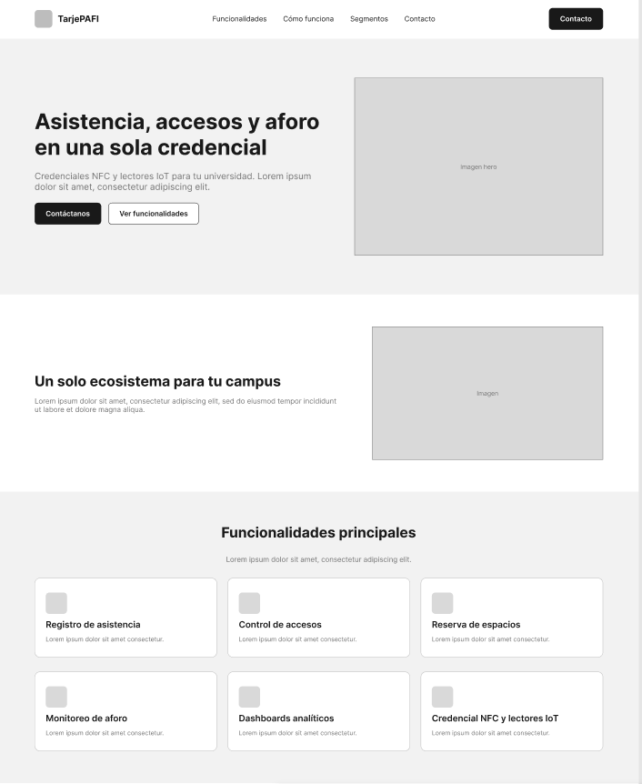<br>


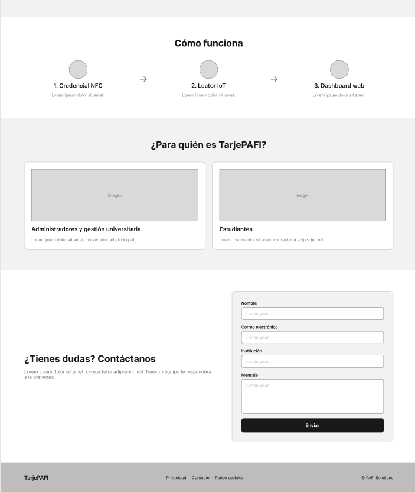<br>


#### Landing Page Mobile Wireframes 
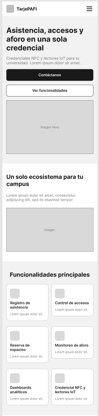<br>


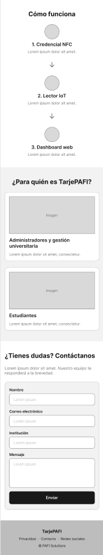<br>


### 6.3.2. Landing Page Mock-up


## 6.4. Applications UX/UI Design

### 6.4.1. Applications Wireframes

<p align="center">
  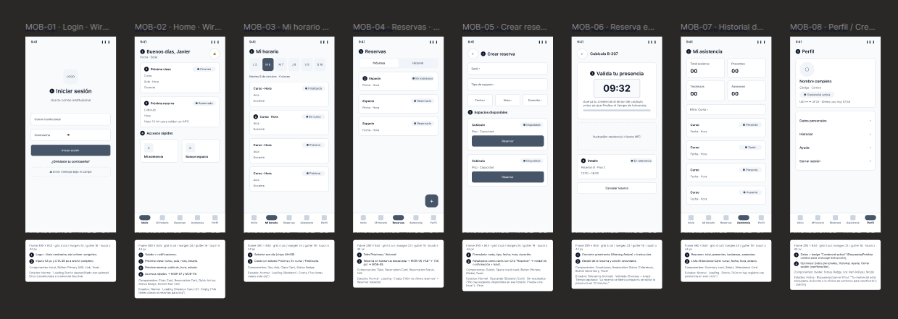
</p>

<p align="center">
  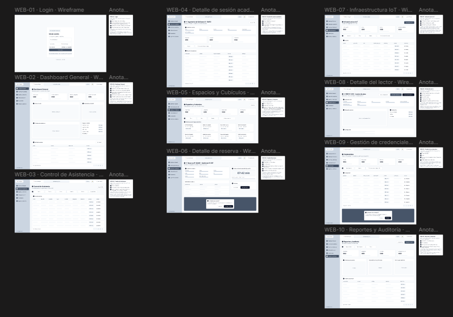
</p>


Link Figma: 'https://www.figma.com/design/O6Xg9ewnVSa8wl5v8hAGNj/TarjePAFI-%E2%80%94-Smart-Campus-Design?node-id=1-5&t=zJgz25TLECxSVttc-1'

### 6.4.2. Applications Wireflow Diagrams

En esta sección se presentan los Wireflows de TarjePAFI para la Web App Administrativa y la Mobile App. Se elaboró un Wireflow por cada User goal identificado, tomando como base los Task Flows consensuados por el equipo y los User Persona de cada aplicación: el administrador universitario para la aplicación web y el estudiante para la aplicación móvil. Los diagramas se construyeron en Figma a partir de los wireframes low-fidelity. Cada flecha indica la interacción que dispara el siguiente paso, que puede ser un clic, un tap, la lectura NFC de la credencial o un evento del sistema. Cuando una interacción modifica una pantalla, se agrega un paso con el wireframe del nuevo estado; así se representan un modal de confirmación, un toast o el cambio de estado de un registro.

+ **WF-01 · Revisar la asistencia de una sesión académica:**

<p align="center">
  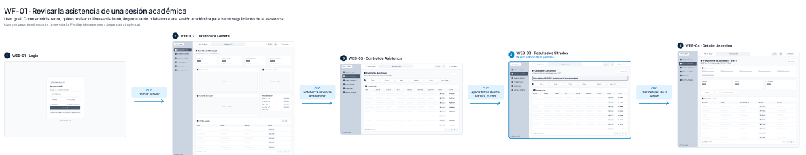
</p>

**User goal:** Como administrador, quiero revisar quiénes asistieron, llegaron tarde o faltaron a una sesión académica para hacer seguimiento de la asistencia.

**Explicación del flujo:** El administrador inicia sesión con su correo institucional en el Login (WEB-01) y accede al Dashboard General (WEB-02), donde ve el resumen operativo de la sede. Desde la sidebar selecciona "Asistencia Académica" y llega a Control de Asistencia (WEB-03), con la lista de sesiones del día. Al aplicar los filtros de fecha, carrera y curso, la misma pantalla cambia de estado y muestra solo los resultados filtrados, lo que se representa en un paso adicional. Por último, con "Ver detalle" abre el Detalle de sesión (WEB-04). Ahí consulta los datos de la clase, los indicadores de presentes, ausentes y tardanzas, y el registro de cada estudiante con su hora y método de marcación (NFC o manual).


+ **WF-02 · Supervisar y cancelar una reserva en tolerancia**

<p align="center">
  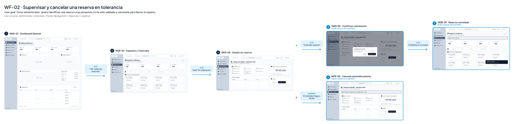
</p>

**User goal:** Como administrador, quiero identificar una reserva cuya presencia no ha sido validada y cancelarla para liberar el espacio.

**Explicación del flujo:** Desde el widget de reservas activas del Dashboard General (WEB-02), el administrador entra a Espacios y Cubículos (WEB-05). Allí identifica por color, icono y texto un cubículo "En tolerancia" y, al seleccionar su card, abre el Detalle de reserva (WEB-06). Esa pantalla muestra el tiempo restante para que el estudiante valide su presencia con la credencial NFC. A partir de aquí el flujo se bifurca:

  + Camino A: el administrador presiona "Cancelar reserva" y la pantalla cambia de estado para mostrar un modal de confirmación destructiva. Al confirmar, vuelve a Espacios y Cubículos (WEB-05) en un nuevo estado: aparece un toast de éxito y el cubículo figura como "Disponible".

  + Camino B: el administrador no interviene y el contador llega a 00:00. El sistema libera la reserva automáticamente por falta de validación en los 10 minutos de tolerancia, y el Detalle de reserva pasa al estado "Liberada automáticamente".


+ **WF-03 · Atender un lector IoT sin comunicación**

<p align="center">
  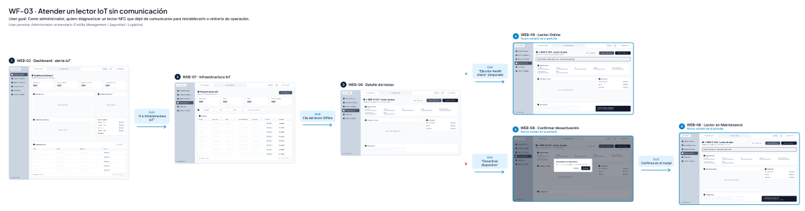
</p>

**User goal:** Como administrador, quiero diagnosticar un lector NFC que dejó de comunicarse para restablecerlo o retirarlo de operación.

**Explicación del flujo:** El Dashboard General (WEB-02) alerta que un lector dejó de reportar. Mediante "Ir a Infraestructura IoT", el administrador abre la vista de Infraestructura IoT (WEB-07) y selecciona la fila del lector en estado Offline. Así llega al Detalle del lector (WEB-08), donde revisa su ubicación, firmware, intensidad de señal, telemetría reciente e incidencias. El flujo se bifurca:

  + Camino A: ejecuta "Ejecutar health check" y el lector responde. La pantalla pasa a un nuevo estado con el lector Online y un toast que confirma la restauración de la telemetría.
  + Camino B: el lector no se recupera y el administrador presiona "Desactivar dispositivo". Se muestra un modal de confirmación destructiva. Al confirmar, la pantalla pasa al estado Maintenance y un toast indica que el cambio quedó registrado en la auditoría.


+ **WF-04 · Bloquear una credencial y verificar la auditoría**

<p align="center">
  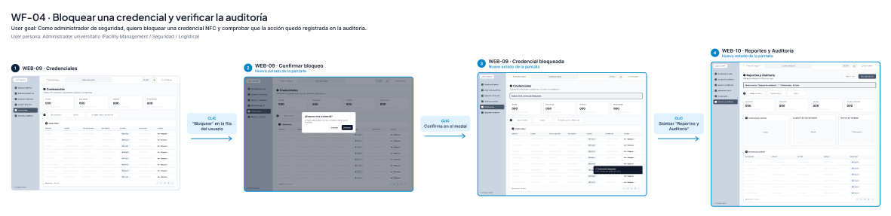
</p>

**User goal:** Como administrador de seguridad, quiero bloquear una credencial NFC y comprobar que la acción quedó registrada en la auditoría.

**Explicación del flujo:** En Gestión de credenciales (WEB-09), el administrador ubica al usuario y presiona "Bloquear" en su fila. La pantalla cambia de estado y muestra un modal que explica la consecuencia: la tarjeta dejará de dar acceso y de registrar asistencia de inmediato. Tras confirmar, la misma vista pasa a un nuevo estado: la credencial figura como "Bloqueada" y un toast confirma la acción. Por último, el administrador entra a Reportes y Auditoría (WEB-10) desde la sidebar. En la tabla de eventos de auditoría verifica el nuevo registro con fecha y hora, usuario, acción, módulo y resultado, lo que garantiza la trazabilidad de la operación.


+ **WF-05 · Reservar un cubículo**

<p align="center">
  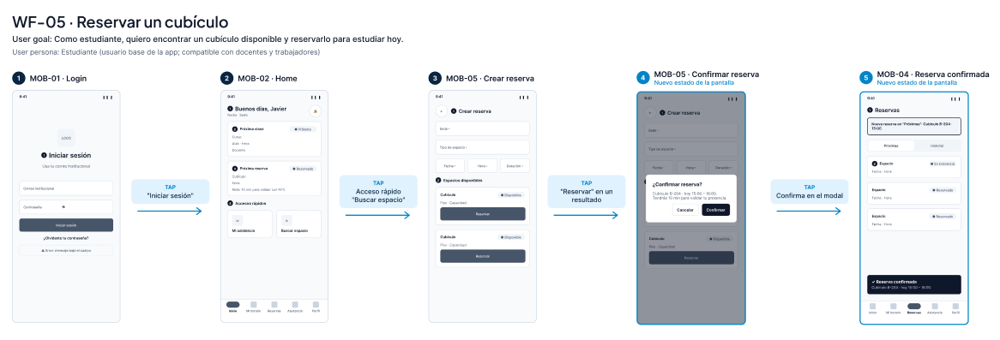
</p>

**User goal:** Como estudiante, quiero encontrar un cubículo disponible y reservarlo para estudiar hoy.

**Explicación del flujo:** El estudiante inicia sesión en la app (MOB-01) y llega al Home (MOB-02), donde ve su próxima clase y su próxima reserva. Con el acceso rápido "Buscar espacio" abre Crear reserva (MOB-05), indica sede, tipo de espacio, fecha, hora y duración, y revisa las cards de espacios disponibles. Al presionar "Reservar", la pantalla cambia de estado y muestra un modal de confirmación con el resumen de la reserva. Ese modal recuerda que tendrá 10 minutos para validar su presencia. Al confirmar, pasa a Reservas (MOB-04) en un nuevo estado: la reserva aparece en la pestaña "Próximas" y un toast confirma la operación.


+ **WF-06 · Validar la presencia en el cubículo reservado**

<p align="center">
  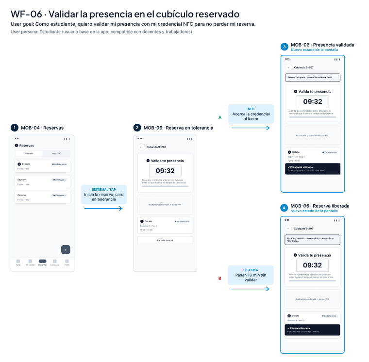
</p>

**User goal:** Como estudiante, quiero validar mi presencia con mi credencial NFC para no perder mi reserva.
User Persona: [Nombre del User Persona] — Estudiante.

**Explicación del flujo:** Al llegar la hora de inicio, la reserva en Reservas (MOB-04) entra en tolerancia y el estudiante abre la pantalla Reserva en tolerancia (MOB-06). Allí ve el mensaje "Valida tu presencia", un contador destacado en ámbar y la instrucción de acercar su credencial al lector del cubículo. El flujo se bifurca:

  + Camino A: el estudiante acerca su credencial y el lector la valida por NFC. La pantalla pasa al estado "Ocupado" y un toast confirma que la presencia fue validada.
  + Camino B: transcurren los 10 minutos sin validación. El sistema libera la reserva y la pantalla pasa al estado "Liberada", con un mensaje que explica lo ocurrido y le indica que puede crear una nueva reserva.


+ **WF-07 · Consultar horario, asistencia y estado de la credencial**

<p align="center">
  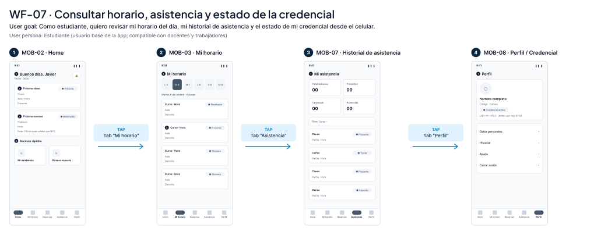
</p>

**User goal:** Como estudiante, quiero revisar mi horario del día, mi historial de asistencia y el estado de mi credencial desde el celular.

**Explicación del flujo:** Desde el Home (MOB-02), el estudiante usa la bottom navigation para moverse entre las secciones de consulta. En Mi horario (MOB-03) selecciona el día y ve sus clases con estado Próxima, En curso o Finalizada. En Historial de asistencia (MOB-07) revisa el resumen de sesiones, presentes, tardanzas y ausencias, y la lista de registros por curso y fecha. Finalmente, en Perfil / Credencial (MOB-08) confirma sus datos y el estado de su credencial NFC, indicado con el badge "Credencial activa". Este flujo es solo de consulta: ninguna interacción modifica el estado de una pantalla, por lo que cada paso corresponde a una pantalla distinta.

# Conclusiones

+ TB1:

  + El análisis realizado permitió confirmar que la problemática de TarjePAFI no se limita únicamente al registro de asistencia, sino que comprende una gestión fragmentada de distintos procesos del campus, como el control de accesos, la ocupación de ambientes, las reservas y el monitoreo de afluencia. En este sentido, la propuesta de centralizar la información generada mediante credenciales NFC y dispositivos IoT responde a la necesidad de contar con información integrada y actualizada para estudiantes, docentes, trabajadores y responsables administrativos.

  + Las entrevistas permitieron validar necesidades diferentes pero complementarias entre los dos segmentos objetivo. Por un lado, los usuarios de la credencial requieren interacciones rápidas, simples y confiables para registrar asistencia y acceder a los espacios del campus; por otro, los responsables administrativos necesitan información centralizada, indicadores y reportes que les permitan supervisar las operaciones y mejorar la toma de decisiones. Esto evidencia que TarjePAFI debe brindar valor tanto en la interacción física del usuario como en el aprovechamiento posterior de los datos generados.

  + El proceso de Requirements Specification permitió transformar las necesidades identificadas en funcionalidades concretas relacionadas con registro automático de asistencia, activación de reservas, identificación de usuarios, control de accesos y generación de reportes administrativos. La priorización realizada en el Product Backlog establece una base para desarrollar progresivamente las funcionalidades de mayor valor y mantener trazabilidad entre las necesidades de los segmentos y la futura implementación del producto.

  + El análisis arquitectónico permitió identificar que la concurrencia de múltiples lectores NFC, la necesidad de operar ante fallas temporales de conectividad y el procesamiento casi en tiempo real tienen un impacto directo sobre la arquitectura de TarjePAFI. Como respuesta, se planteó una arquitectura desacoplada mediante RabbitMQ, backend desarrollado con Spring Boot y persistencia en PostgreSQL, permitiendo que los dispositivos IoT generen eventos sin depender directamente de la disponibilidad inmediata del procesamiento central.

# Bibliografía

+ Azizi, S., Nair, G., Rabiee, R., & Olofsson, T. (2020). Application of Internet of Things in academic buildings for space use efficiency using occupancy and booking data. Building and Environment, 186, 107355. https://doi.org/10.1016/j.buildenv.2020.107355

+ Das, D. K. (2025). Integrating IoT and AI for sustainable energy-efficient smart building: Potential, barriers and strategic pathways. *Sustainability*, *17*(22), Artículo 10313. https://doi.org/10.3390/su172210313

+ Israil, S. I. S., & Dhumane, P. B. (2025). Smart campus solutions: An IoT-based attendance system for universities and schools. *International Journal for Research Trends and Innovation*, *10*(5), b426–b433. https://www.ijrti.org/papers/IJRTI2505148.pdf

+ Rashid, A. M. (2024). Smart campus: A review on smart attendance systems as an efficient approach. Journal of Engineering & Technological Advances, 8(2), 16–24. https://doi.org/10.35934/segi.v8i2.85

+ Sutjarittham, T., Habibi Gharakheili, H., Kanhere, S. S., & Sivaraman, V. (2019). Experiences with IoT and AI in a smart campus for optimizing classroom usage. IEEE Internet of Things Journal, 6(5), 7595–7607. https://doi.org/10.1109/JIOT.2019.2902410

+ Prabakaran, S., Geetha, S., Nivesh Raja, R., Dhanush Balaji, G., Maya Kannan, M., & Sam Brainald, C. (2025). Smart campus surveillance and guidance system using face recognition. *Journal on Innovations in Teaching and Learning*, *4*(4), 22–31. https://doi.org/10.46632/jitl/4/4/4
